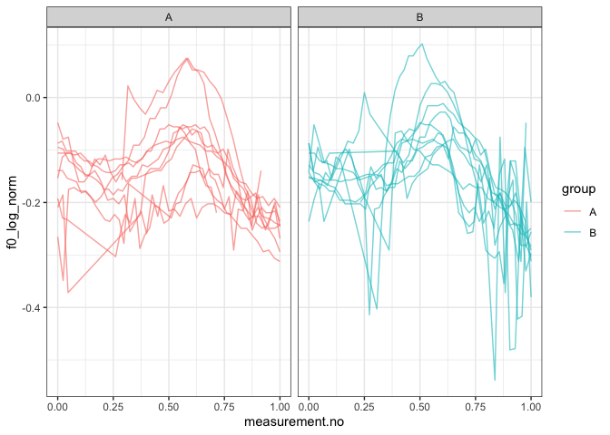

Introduction
------------

This document is a supplement to “Evaluating generalised additive mixed
modelling strategies for dynamic speech analysis,” relating specifically
to the contents of the “real pitch” columns of Table 1 in Section 3.1.2.
It presents code that illustrates (i) how the resampled data were
generated and (ii) the models whose performance is summarised in the
“real pitch” columns of Table 1.

Preliminaries
-------------

The code below loads the relevant libraries.

``` r
library(ggplot2)
```

    ## Warning: package 'ggplot2' was built under R version 3.5.2

``` r
library(mgcv)
```

    ## Warning: package 'mgcv' was built under R version 3.5.2

``` r
library(itsadug)
library(stringr)
```

    ## Warning: package 'stringr' was built under R version 3.5.2

Data generation
---------------

The code in this section can be only be used to process the data for
type I simulations. Note that the paths in this file will only work if
the whole GitHub repository is downloaded and this markdown file is kept
in its folder.

The data for this set of simulations consist of real pitch trajectories
representing contrastive focus in Standard German from a single speaker.
There are no more than 20 contours per speaker. Each contour is randomly
assigned to one of two groups (A and B).

``` r
dat_full <- readRDS("../data/final_data/pitch_contr_27_speakers.rds")

# we sample a single speaker from this data set

dat <- subset(dat_full, speaker == sample(unique(dat_full$speaker), 1))

# we only take what we need
# (< 50 trajectories)

dat <- subset(dat, 
              traj %in% sample(unique(dat$traj), 
                               size=min(length(unique(dat$traj)), 50)
              )
)

# we now add randomly assigned category labels

ids <- unique(dat$traj)
group.Bs <- sample(ids, round(length(ids)/2))
dat$group <- "A"
dat$group[dat$traj %in% group.Bs] <- "B"

# setting up different types of grouping factors
dat$group.factor <- as.factor(dat$group)
dat$group.ordered <- as.ordered(dat$group)
contrasts(dat$group.ordered) <- "contr.treatment"
dat$group.bin <- as.numeric(dat$group.factor) - 1

# ids ought to be factors  
dat$traj <- as.factor(dat$traj)

# dat$start has already been added at data prep stage (for AR.start, i.e. for autoregressive error models)
```

Here is what the data set looks like.

``` r
ggplot(dat, aes(x=measurement.no, y=f0_log_norm, group=traj, col=group)) +
  geom_line(alpha=0.6) +
  facet_grid(~group) +
  theme_bw()
```



Models
------

All the models (and sets of models) from Table 1 are shown below in the
same order as in the table. The numbers in the section headers
correspond to the row numbers.

### NO SMOOTHS: 1. No components

``` r
nocomp <- bam(f0_log_norm ~ group.ordered + 
                   s(measurement.no, bs = "tp", k = 20) + 
                   s(measurement.no, by = group.ordered, bs = "tp", k = 20), 
              data = dat, method = "fREML", discrete = T, nthreads = 1)
summary(nocomp)
```

    ## 
    ## Family: gaussian 
    ## Link function: identity 
    ## 
    ## Formula:
    ## f0_log_norm ~ group.ordered + s(measurement.no, bs = "tp", k = 20) + 
    ##     s(measurement.no, by = group.ordered, bs = "tp", k = 20)
    ## 
    ## Parametric coefficients:
    ##                 Estimate Std. Error t value Pr(>|t|)    
    ## (Intercept)    -0.147670   0.003251 -45.427   <2e-16 ***
    ## group.orderedB  0.006164   0.004584   1.345    0.179    
    ## ---
    ## Signif. codes:  0 '***' 0.001 '**' 0.01 '*' 0.05 '.' 0.1 ' ' 1
    ## 
    ## Approximate significance of smooth terms:
    ##                                    edf Ref.df      F p-value    
    ## s(measurement.no)                7.847  9.699 28.370  <2e-16 ***
    ## s(measurement.no):group.orderedB 2.452  3.057  1.916   0.127    
    ## ---
    ## Signif. codes:  0 '***' 0.001 '**' 0.01 '*' 0.05 '.' 0.1 ' ' 1
    ## 
    ## R-sq.(adj) =  0.415   Deviance explained = 42.3%
    ## fREML = -1009.8  Scale est. = 0.0040304  n = 776

### NO SMOOTHS: 2. Rand intcpt (= Random Intercept)

``` r
rand_intcpt <- bam(f0_log_norm ~ group.ordered + 
                        s(measurement.no, bs = "tp", k = 20) + 
                        s(measurement.no, by = group.ordered, bs = "tp", k = 20) + 
                        s(traj, bs = "re"), 
                    data = dat, method = "fREML", discrete = T, nthreads = 1)
summary(rand_intcpt)
```

    ## 
    ## Family: gaussian 
    ## Link function: identity 
    ## 
    ## Formula:
    ## f0_log_norm ~ group.ordered + s(measurement.no, bs = "tp", k = 20) + 
    ##     s(measurement.no, by = group.ordered, bs = "tp", k = 20) + 
    ##     s(traj, bs = "re")
    ## 
    ## Parametric coefficients:
    ##                 Estimate Std. Error t value Pr(>|t|)    
    ## (Intercept)    -0.146313   0.011398 -12.837   <2e-16 ***
    ## group.orderedB  0.004658   0.016112   0.289    0.773    
    ## ---
    ## Signif. codes:  0 '***' 0.001 '**' 0.01 '*' 0.05 '.' 0.1 ' ' 1
    ## 
    ## Approximate significance of smooth terms:
    ##                                     edf Ref.df      F p-value    
    ## s(measurement.no)                 8.237 10.165 31.850 < 2e-16 ***
    ## s(measurement.no):group.orderedB  3.133  3.908  3.071 0.01561 *  
    ## s(traj)                          16.882 18.000 14.365 0.00214 ** 
    ## ---
    ## Signif. codes:  0 '***' 0.001 '**' 0.01 '*' 0.05 '.' 0.1 ' ' 1
    ## 
    ## R-sq.(adj) =  0.561   Deviance explained = 57.8%
    ## fREML = -1094.1  Scale est. = 0.0030228  n = 776

### NO SMOOTHS: 3. Rand intcpt + slope (= random intercept + slope)

``` r
rand_intcpt_slope <- 
  bam(f0_log_norm ~ group.ordered + 
        s(measurement.no, bs = "tp", k = 20) + 
        s(measurement.no, by = group.ordered, bs = "tp", k = 20) + 
        s(traj, bs = "re") + 
        s(traj, measurement.no, bs = "re"), 
      data = dat, method = "fREML", discrete = T, nthreads = 1) 
summary(rand_intcpt_slope)
```

    ## 
    ## Family: gaussian 
    ## Link function: identity 
    ## 
    ## Formula:
    ## f0_log_norm ~ group.ordered + s(measurement.no, bs = "tp", k = 20) + 
    ##     s(measurement.no, by = group.ordered, bs = "tp", k = 20) + 
    ##     s(traj, bs = "re") + s(traj, measurement.no, bs = "re")
    ## 
    ## Parametric coefficients:
    ##                 Estimate Std. Error t value Pr(>|t|)    
    ## (Intercept)    -0.148284   0.022099  -6.710 3.91e-11 ***
    ## group.orderedB  0.006607   0.031240   0.211    0.833    
    ## ---
    ## Signif. codes:  0 '***' 0.001 '**' 0.01 '*' 0.05 '.' 0.1 ' ' 1
    ## 
    ## Approximate significance of smooth terms:
    ##                                     edf Ref.df       F  p-value    
    ## s(measurement.no)                 8.610 10.608  32.345  < 2e-16 ***
    ## s(measurement.no):group.orderedB  3.077  3.838   2.739   0.0258 *  
    ## s(traj)                          16.611 18.000 986.244  < 2e-16 ***
    ## s(measurement.no,traj)           15.406 20.000 700.544 1.68e-14 ***
    ## ---
    ## Signif. codes:  0 '***' 0.001 '**' 0.01 '*' 0.05 '.' 0.1 ' ' 1
    ## 
    ## R-sq.(adj) =  0.621   Deviance explained = 64.3%
    ## fREML =  -1122  Scale est. = 0.0026089  n = 776

### TP SMOOTHS: 4. Rand smooth, tp, 3 bs

``` r
rand_smooth_tp_3 <- 
  bam(f0_log_norm ~ group.ordered + 
        s(measurement.no, bs = "tp", k = 20) + 
        s(measurement.no, by = group.ordered, bs = "tp", k = 20) + 
        s(measurement.no, traj, bs = "fs", m = 1, xt = "tp", k = 3), 
      data = dat, method = "fREML", discrete = T, nthreads = 1)
```

    ## Warning in gam.side(sm, X, tol = .Machine$double.eps^0.5): model has
    ## repeated 1-d smooths of same variable.

``` r
summary(rand_smooth_tp_3)
```

    ## 
    ## Family: gaussian 
    ## Link function: identity 
    ## 
    ## Formula:
    ## f0_log_norm ~ group.ordered + s(measurement.no, bs = "tp", k = 20) + 
    ##     s(measurement.no, by = group.ordered, bs = "tp", k = 20) + 
    ##     s(measurement.no, traj, bs = "fs", m = 1, xt = "tp", k = 3)
    ## 
    ## Parametric coefficients:
    ##                  Estimate Std. Error t value Pr(>|t|)    
    ## (Intercept)    -0.1481596  0.0113580  -13.04   <2e-16 ***
    ## group.orderedB  0.0001277  0.0131899    0.01    0.992    
    ## ---
    ## Signif. codes:  0 '***' 0.001 '**' 0.01 '*' 0.05 '.' 0.1 ' ' 1
    ## 
    ## Approximate significance of smooth terms:
    ##                                     edf Ref.df      F p-value    
    ## s(measurement.no)                 9.655  11.83 27.288  <2e-16 ***
    ## s(measurement.no):group.orderedB  1.000   1.00  0.009   0.925    
    ## s(measurement.no,traj)           49.617  58.00 16.468  <2e-16 ***
    ## ---
    ## Signif. codes:  0 '***' 0.001 '**' 0.01 '*' 0.05 '.' 0.1 ' ' 1
    ## 
    ## R-sq.(adj) =  0.738   Deviance explained = 75.9%
    ## fREML = -1237.9  Scale est. = 0.0018023  n = 776

### TP SMOOTHS: 5. Rand smooth, tp, 5 bs

``` r
rand_smooth_tp_5 <- 
  bam(f0_log_norm ~ group.ordered + 
        s(measurement.no, bs = "tp", k = 20) + 
        s(measurement.no, by = group.ordered, bs = "tp", k = 20) + 
        s(measurement.no, traj, bs = "fs", m = 1, xt = "tp", k = 5), 
      data = dat, method = "fREML", discrete = T, nthreads = 1)
```

    ## Warning in gam.side(sm, X, tol = .Machine$double.eps^0.5): model has
    ## repeated 1-d smooths of same variable.

``` r
summary(rand_smooth_tp_5)
```

    ## 
    ## Family: gaussian 
    ## Link function: identity 
    ## 
    ## Formula:
    ## f0_log_norm ~ group.ordered + s(measurement.no, bs = "tp", k = 20) + 
    ##     s(measurement.no, by = group.ordered, bs = "tp", k = 20) + 
    ##     s(measurement.no, traj, bs = "fs", m = 1, xt = "tp", k = 5)
    ## 
    ## Parametric coefficients:
    ##                Estimate Std. Error t value Pr(>|t|)    
    ## (Intercept)    -0.14862    0.01157 -12.850   <2e-16 ***
    ## group.orderedB  0.00382    0.01281   0.298    0.766    
    ## ---
    ## Signif. codes:  0 '***' 0.001 '**' 0.01 '*' 0.05 '.' 0.1 ' ' 1
    ## 
    ## Approximate significance of smooth terms:
    ##                                     edf Ref.df      F p-value    
    ## s(measurement.no)                 9.647  11.83  9.927  <2e-16 ***
    ## s(measurement.no):group.orderedB  1.103   1.14  0.222   0.718    
    ## s(measurement.no,traj)           78.284  98.00 13.414  <2e-16 ***
    ## ---
    ## Signif. codes:  0 '***' 0.001 '**' 0.01 '*' 0.05 '.' 0.1 ' ' 1
    ## 
    ## R-sq.(adj) =  0.784   Deviance explained = 80.9%
    ## fREML = -1276.2  Scale est. = 0.0014865  n = 776

### TP SMOOTHS: 6. Rand smooth, tp, 10 bs

``` r
rand_smooth_tp_10 <- 
  bam(f0_log_norm ~ group.ordered + 
        s(measurement.no, bs = "tp", k = 20) + 
        s(measurement.no, by = group.ordered, bs = "tp", k = 20) + 
        s(measurement.no, traj, bs = "fs", m = 1, xt = "tp", k = 10), 
      data = dat, method = "fREML", discrete = T, nthreads = 1)
```

    ## Warning in gam.side(sm, X, tol = .Machine$double.eps^0.5): model has
    ## repeated 1-d smooths of same variable.

``` r
summary(rand_smooth_tp_10)
```

    ## 
    ## Family: gaussian 
    ## Link function: identity 
    ## 
    ## Formula:
    ## f0_log_norm ~ group.ordered + s(measurement.no, bs = "tp", k = 20) + 
    ##     s(measurement.no, by = group.ordered, bs = "tp", k = 20) + 
    ##     s(measurement.no, traj, bs = "fs", m = 1, xt = "tp", k = 10)
    ## 
    ## Parametric coefficients:
    ##                  Estimate Std. Error t value Pr(>|t|)    
    ## (Intercept)    -0.1475690  0.0125801 -11.730   <2e-16 ***
    ## group.orderedB -0.0009296  0.0141032  -0.066    0.947    
    ## ---
    ## Signif. codes:  0 '***' 0.001 '**' 0.01 '*' 0.05 '.' 0.1 ' ' 1
    ## 
    ## Approximate significance of smooth terms:
    ##                                      edf Ref.df      F p-value    
    ## s(measurement.no)                  9.445  11.37 11.036  <2e-16 ***
    ## s(measurement.no):group.orderedB   1.000   1.00  0.103   0.748    
    ## s(measurement.no,traj)           127.590 198.00  8.267  <2e-16 ***
    ## ---
    ## Signif. codes:  0 '***' 0.001 '**' 0.01 '*' 0.05 '.' 0.1 ' ' 1
    ## 
    ## R-sq.(adj) =  0.813   Deviance explained = 84.6%
    ## fREML = -1286.1  Scale est. = 0.0012903  n = 776

### TP SMOOTHS: 7. Rand smooth, tp, 15 bs

``` r
rand_smooth_tp_15 <- 
  bam(f0_log_norm ~ group.ordered + 
        s(measurement.no, bs = "tp", k = 20) + 
        s(measurement.no, by = group.ordered, bs = "tp", k = 20) + 
        s(measurement.no, traj, bs = "fs", m = 1, xt = "tp", k = 15), 
      data = dat, method = "fREML", discrete = T, nthreads = 1)
```

    ## Warning in gam.side(sm, X, tol = .Machine$double.eps^0.5): model has
    ## repeated 1-d smooths of same variable.

``` r
summary(rand_smooth_tp_15)
```

    ## 
    ## Family: gaussian 
    ## Link function: identity 
    ## 
    ## Formula:
    ## f0_log_norm ~ group.ordered + s(measurement.no, bs = "tp", k = 20) + 
    ##     s(measurement.no, by = group.ordered, bs = "tp", k = 20) + 
    ##     s(measurement.no, traj, bs = "fs", m = 1, xt = "tp", k = 15)
    ## 
    ## Parametric coefficients:
    ##                  Estimate Std. Error t value Pr(>|t|)    
    ## (Intercept)    -0.1481434  0.0132071 -11.217   <2e-16 ***
    ## group.orderedB  0.0004932  0.0144977   0.034    0.973    
    ## ---
    ## Signif. codes:  0 '***' 0.001 '**' 0.01 '*' 0.05 '.' 0.1 ' ' 1
    ## 
    ## Approximate significance of smooth terms:
    ##                                      edf  Ref.df      F p-value    
    ## s(measurement.no)                  9.073  10.578 10.663  <2e-16 ***
    ## s(measurement.no):group.orderedB   1.005   1.005  0.059   0.811    
    ## s(measurement.no,traj)           163.693 298.000  6.356  <2e-16 ***
    ## ---
    ## Signif. codes:  0 '***' 0.001 '**' 0.01 '*' 0.05 '.' 0.1 ' ' 1
    ## 
    ## R-sq.(adj) =  0.831   Deviance explained = 86.9%
    ## fREML = -1292.6  Scale est. = 0.0011651  n = 776

### TP SMOOTHS: 8. Rand smooth, tp, 20 bs

``` r
rand_smooth_tp_20 <- 
  bam(f0_log_norm ~ group.ordered + 
        s(measurement.no, bs = "tp", k = 20) + 
        s(measurement.no, by = group.ordered, bs = "tp", k = 20) + 
        s(measurement.no, traj, bs = "fs", m = 1, xt = "tp", k = 20), 
      data = dat, method = "fREML", discrete = T, nthreads = 1)
```

    ## Warning in gam.side(sm, X, tol = .Machine$double.eps^0.5): model has
    ## repeated 1-d smooths of same variable.

``` r
summary(rand_smooth_tp_20)
```

    ## 
    ## Family: gaussian 
    ## Link function: identity 
    ## 
    ## Formula:
    ## f0_log_norm ~ group.ordered + s(measurement.no, bs = "tp", k = 20) + 
    ##     s(measurement.no, by = group.ordered, bs = "tp", k = 20) + 
    ##     s(measurement.no, traj, bs = "fs", m = 1, xt = "tp", k = 20)
    ## 
    ## Parametric coefficients:
    ##                 Estimate Std. Error t value Pr(>|t|)    
    ## (Intercept)    -0.148519   0.013257 -11.203   <2e-16 ***
    ## group.orderedB  0.002249   0.014396   0.156    0.876    
    ## ---
    ## Signif. codes:  0 '***' 0.001 '**' 0.01 '*' 0.05 '.' 0.1 ' ' 1
    ## 
    ## Approximate significance of smooth terms:
    ##                                      edf Ref.df      F p-value    
    ## s(measurement.no)                  9.002  10.34 10.802  <2e-16 ***
    ## s(measurement.no):group.orderedB   1.000   1.00  0.059   0.808    
    ## s(measurement.no,traj)           186.459 398.00  5.092  <2e-16 ***
    ## ---
    ## Signif. codes:  0 '***' 0.001 '**' 0.01 '*' 0.05 '.' 0.1 ' ' 1
    ## 
    ## R-sq.(adj) =  0.839   Deviance explained =   88%
    ## fREML = -1294.4  Scale est. = 0.0011099  n = 776

### TP SMOOTHS: 9. Rand smooth, tp, gam.check

The model fitted in this section uses random smooths where the number of
basis functions (k) is determined using the gam.check() function: after
fitting an initial model with a relatively low value of k, gam.check()
is used to see whether more wiggliness is necessary (essentially,
whether the smooths use up all the degrees of freedom afforded to them).
If gam.check() suggests that more wiggliness is necessary, this
procedure is repeated again using a model with a higher value of k.

Below is a convenience function for extracting the relevant p-value from
the output of gam.check.

``` r
gam.check.p.value <- function (mod, which.line) {
  str.out <- capture.output(gam.check(mod))
  relevant.line <- str.out[grep(which.line, str.out)]
  p.value <- as.numeric(str_match(relevant.line, "([0-9.]*)[ *.]*$")[[2]])
  return(p.value)
}
```

Fitting the models.

``` r
# what k's should be tried?
k_min = 4
k_max = 16
k_step = 3
```

``` r
for (k in seq(k_min,k_max,k_step)) {
  cat("fitting model with  k =", k, "\n")
  
  # fitting model
  
  rand_smooth_tp_gam.check <- 
    bam(f0_log_norm ~ group.ordered + 
          s(measurement.no, bs = "tp", k = 20) + 
          s(measurement.no, by = group.ordered, bs = "tp", k = 20) + 
          s(measurement.no, traj, bs = "fs", m = 1, xt = "tp", k = k), 
        data = dat, method = "fREML", discrete = T, nthreads = 1)
  
  # check whether more complexity is needed using gam.check
  
  if (gam.check.p.value(rand_smooth_tp_gam.check, "traj") >= 0.05 | k == k_max) {
    print(summary(rand_smooth_tp_gam.check))
    break
  }
}
```

    ## fitting model with  k = 4

    ## Warning in gam.side(sm, X, tol = .Machine$double.eps^0.5): model has
    ## repeated 1-d smooths of same variable.

    ## 
    ## Family: gaussian 
    ## Link function: identity 
    ## 
    ## Formula:
    ## f0_log_norm ~ group.ordered + s(measurement.no, bs = "tp", k = 20) + 
    ##     s(measurement.no, by = group.ordered, bs = "tp", k = 20) + 
    ##     s(measurement.no, traj, bs = "fs", m = 1, xt = "tp", k = k)
    ## 
    ## Parametric coefficients:
    ##                 Estimate Std. Error t value Pr(>|t|)    
    ## (Intercept)    -0.146407   0.011727 -12.485   <2e-16 ***
    ## group.orderedB -0.003668   0.014213  -0.258    0.796    
    ## ---
    ## Signif. codes:  0 '***' 0.001 '**' 0.01 '*' 0.05 '.' 0.1 ' ' 1
    ## 
    ## Approximate significance of smooth terms:
    ##                                     edf Ref.df      F p-value    
    ## s(measurement.no)                 9.757  11.95 14.440  <2e-16 ***
    ## s(measurement.no):group.orderedB  1.000   1.00  0.031    0.86    
    ## s(measurement.no,traj)           64.096  78.00 13.823  <2e-16 ***
    ## ---
    ## Signif. codes:  0 '***' 0.001 '**' 0.01 '*' 0.05 '.' 0.1 ' ' 1
    ## 
    ## R-sq.(adj) =  0.756   Deviance explained =   78%
    ## fREML = -1248.9  Scale est. = 0.0016819  n = 776

### CR SMOOTHS: 10. Rand smooth, cr, 3 bs

``` r
rand_smooth_cr_3 <- 
  bam(f0_log_norm ~ group.ordered + 
        s(measurement.no, bs = "tp", k = 20) + 
        s(measurement.no, by = group.ordered, bs = "tp", k = 20) + 
        s(measurement.no, traj, bs = "fs", m = 1, xt = "cr", k = 3), 
      data = dat, method = "fREML", discrete = T, nthreads = 1)
```

    ## Warning in gam.side(sm, X, tol = .Machine$double.eps^0.5): model has
    ## repeated 1-d smooths of same variable.

``` r
summary(rand_smooth_cr_3)
```

    ## 
    ## Family: gaussian 
    ## Link function: identity 
    ## 
    ## Formula:
    ## f0_log_norm ~ group.ordered + s(measurement.no, bs = "tp", k = 20) + 
    ##     s(measurement.no, by = group.ordered, bs = "tp", k = 20) + 
    ##     s(measurement.no, traj, bs = "fs", m = 1, xt = "cr", k = 3)
    ## 
    ## Parametric coefficients:
    ##                 Estimate Std. Error t value Pr(>|t|)    
    ## (Intercept)    -0.150643   0.010825 -13.916   <2e-16 ***
    ## group.orderedB  0.007691   0.014122   0.545    0.586    
    ## ---
    ## Signif. codes:  0 '***' 0.001 '**' 0.01 '*' 0.05 '.' 0.1 ' ' 1
    ## 
    ## Approximate significance of smooth terms:
    ##                                     edf Ref.df      F p-value    
    ## s(measurement.no)                 9.321 11.441 19.094  <2e-16 ***
    ## s(measurement.no):group.orderedB  3.334  4.229  0.855   0.497    
    ## s(measurement.no,traj)           47.639 56.000 15.722  <2e-16 ***
    ## ---
    ## Signif. codes:  0 '***' 0.001 '**' 0.01 '*' 0.05 '.' 0.1 ' ' 1
    ## 
    ## R-sq.(adj) =  0.728   Deviance explained =   75%
    ## fREML = -1232.5  Scale est. = 0.0018722  n = 776

### CR SMOOTHS: 11. Rand smooth, cr, 5 bs

``` r
rand_smooth_cr_5 <- 
  bam(f0_log_norm ~ group.ordered + 
        s(measurement.no, bs = "tp", k = 20) + 
        s(measurement.no, by = group.ordered, bs = "tp", k = 20) + 
        s(measurement.no, traj, bs = "fs", m = 1, xt = "cr", k = 5), 
      data = dat, method = "fREML", discrete = T, nthreads = 1)
```

    ## Warning in gam.side(sm, X, tol = .Machine$double.eps^0.5): model has
    ## repeated 1-d smooths of same variable.

``` r
summary(rand_smooth_cr_5)
```

    ## 
    ## Family: gaussian 
    ## Link function: identity 
    ## 
    ## Formula:
    ## f0_log_norm ~ group.ordered + s(measurement.no, bs = "tp", k = 20) + 
    ##     s(measurement.no, by = group.ordered, bs = "tp", k = 20) + 
    ##     s(measurement.no, traj, bs = "fs", m = 1, xt = "cr", k = 5)
    ## 
    ## Parametric coefficients:
    ##                 Estimate Std. Error t value Pr(>|t|)    
    ## (Intercept)    -0.151686   0.010306 -14.718   <2e-16 ***
    ## group.orderedB  0.008411   0.012511   0.672    0.502    
    ## ---
    ## Signif. codes:  0 '***' 0.001 '**' 0.01 '*' 0.05 '.' 0.1 ' ' 1
    ## 
    ## Approximate significance of smooth terms:
    ##                                    edf Ref.df      F p-value    
    ## s(measurement.no)                 9.79     12 11.649  <2e-16 ***
    ## s(measurement.no):group.orderedB  1.00      1  0.918   0.338    
    ## s(measurement.no,traj)           77.37     96 12.951  <2e-16 ***
    ## ---
    ## Signif. codes:  0 '***' 0.001 '**' 0.01 '*' 0.05 '.' 0.1 ' ' 1
    ## 
    ## R-sq.(adj) =  0.776   Deviance explained = 80.2%
    ## fREML = -1263.9  Scale est. = 0.0015435  n = 776

### CR SMOOTHS: 12. Rand smooth, cr, 10 bs

``` r
rand_smooth_cr_10 <- 
  bam(f0_log_norm ~ group.ordered + 
        s(measurement.no, bs = "tp", k = 20) + 
        s(measurement.no, by = group.ordered, bs = "tp", k = 20) + 
        s(measurement.no, traj, bs = "fs", m = 1, xt = "cr", k = 10), 
      data = dat, method = "fREML", discrete = T, nthreads = 1)
```

    ## Warning in gam.side(sm, X, tol = .Machine$double.eps^0.5): model has
    ## repeated 1-d smooths of same variable.

``` r
summary(rand_smooth_cr_10)
```

    ## 
    ## Family: gaussian 
    ## Link function: identity 
    ## 
    ## Formula:
    ## f0_log_norm ~ group.ordered + s(measurement.no, bs = "tp", k = 20) + 
    ##     s(measurement.no, by = group.ordered, bs = "tp", k = 20) + 
    ##     s(measurement.no, traj, bs = "fs", m = 1, xt = "cr", k = 10)
    ## 
    ## Parametric coefficients:
    ##                 Estimate Std. Error t value Pr(>|t|)    
    ## (Intercept)    -0.151560   0.010702  -14.16   <2e-16 ***
    ## group.orderedB  0.008293   0.014548    0.57    0.569    
    ## ---
    ## Signif. codes:  0 '***' 0.001 '**' 0.01 '*' 0.05 '.' 0.1 ' ' 1
    ## 
    ## Approximate significance of smooth terms:
    ##                                      edf  Ref.df     F p-value    
    ## s(measurement.no)                  9.724  11.890 7.631 2.4e-13 ***
    ## s(measurement.no):group.orderedB   1.001   1.001 0.968   0.325    
    ## s(measurement.no,traj)           101.134 194.000 7.223 < 2e-16 ***
    ## ---
    ## Signif. codes:  0 '***' 0.001 '**' 0.01 '*' 0.05 '.' 0.1 ' ' 1
    ## 
    ## R-sq.(adj) =  0.792   Deviance explained = 82.2%
    ## fREML = -1266.4  Scale est. = 0.0014307  n = 776

### CR SMOOTHS: 13. Rand smooth, cr, 15 bs

``` r
rand_smooth_cr_15 <- 
  bam(f0_log_norm ~ group.ordered + 
        s(measurement.no, bs = "tp", k = 20) + 
        s(measurement.no, by = group.ordered, bs = "tp", k = 20) + 
        s(measurement.no, traj, bs = "fs", m = 1, xt = "cr", k = 15), 
      data = dat, method = "fREML", discrete = T, nthreads = 1)
```

    ## Warning in gam.side(sm, X, tol = .Machine$double.eps^0.5): model has
    ## repeated 1-d smooths of same variable.

``` r
summary(rand_smooth_cr_15)
```

    ## 
    ## Family: gaussian 
    ## Link function: identity 
    ## 
    ## Formula:
    ## f0_log_norm ~ group.ordered + s(measurement.no, bs = "tp", k = 20) + 
    ##     s(measurement.no, by = group.ordered, bs = "tp", k = 20) + 
    ##     s(measurement.no, traj, bs = "fs", m = 1, xt = "cr", k = 15)
    ## 
    ## Parametric coefficients:
    ##                 Estimate Std. Error t value Pr(>|t|)    
    ## (Intercept)    -0.151643   0.010946 -13.854   <2e-16 ***
    ## group.orderedB  0.008662   0.015165   0.571    0.568    
    ## ---
    ## Signif. codes:  0 '***' 0.001 '**' 0.01 '*' 0.05 '.' 0.1 ' ' 1
    ## 
    ## Approximate significance of smooth terms:
    ##                                     edf Ref.df     F p-value    
    ## s(measurement.no)                  9.66  11.77 6.712 2.4e-11 ***
    ## s(measurement.no):group.orderedB   1.00   1.00 0.930   0.335    
    ## s(measurement.no,traj)           108.62 289.00 5.075 < 2e-16 ***
    ## ---
    ## Signif. codes:  0 '***' 0.001 '**' 0.01 '*' 0.05 '.' 0.1 ' ' 1
    ## 
    ## R-sq.(adj) =  0.798   Deviance explained =   83%
    ## fREML = -1267.4  Scale est. = 0.0013888  n = 776

### CR SMOOTHS: 14. Rand smooth, cr, 20 bs

``` r
rand_smooth_cr_20 <- 
  bam(f0_log_norm ~ group.ordered + 
        s(measurement.no, bs = "tp", k = 20) + 
        s(measurement.no, by = group.ordered, bs = "tp", k = 20) + 
        s(measurement.no, traj, bs = "fs", m = 1, xt = "cr", k = 20), 
      data = dat, method = "fREML", discrete = T, nthreads = 1)
```

    ## Warning in gam.side(sm, X, tol = .Machine$double.eps^0.5): model has
    ## repeated 1-d smooths of same variable.

``` r
summary(rand_smooth_cr_20)
```

    ## 
    ## Family: gaussian 
    ## Link function: identity 
    ## 
    ## Formula:
    ## f0_log_norm ~ group.ordered + s(measurement.no, bs = "tp", k = 20) + 
    ##     s(measurement.no, by = group.ordered, bs = "tp", k = 20) + 
    ##     s(measurement.no, traj, bs = "fs", m = 1, xt = "cr", k = 20)
    ## 
    ## Parametric coefficients:
    ##                 Estimate Std. Error t value Pr(>|t|)    
    ## (Intercept)    -0.151656   0.011084 -13.683   <2e-16 ***
    ## group.orderedB  0.008841   0.015496   0.571    0.569    
    ## ---
    ## Signif. codes:  0 '***' 0.001 '**' 0.01 '*' 0.05 '.' 0.1 ' ' 1
    ## 
    ## Approximate significance of smooth terms:
    ##                                      edf Ref.df     F  p-value    
    ## s(measurement.no)                  9.655  11.76 6.718 2.41e-11 ***
    ## s(measurement.no):group.orderedB   1.000   1.00 0.903    0.342    
    ## s(measurement.no,traj)           109.398 381.00 3.848  < 2e-16 ***
    ## ---
    ## Signif. codes:  0 '***' 0.001 '**' 0.01 '*' 0.05 '.' 0.1 ' ' 1
    ## 
    ## R-sq.(adj) =  0.798   Deviance explained =   83%
    ## fREML = -1266.8  Scale est. = 0.0013891  n = 776

### CR SMOOTHS: 15. Rand smooth, cr, gam.check

The model fitted in this section uses random smooths where the number of
basis functions (k) is determined using the gam.check() function: after
fitting an initial model with a relatively low value of k, gam.check()
is used to see whether more wiggliness is necessary (essentially,
whether the smooths use up all the degrees of freedom afforded to them).
If gam.check() suggests that more wiggliness is necessary, this
procedure is repeated again using a model with a higher value of k.

Below is a convenience function for extracting the relevant p-value from
the output of gam.check.

``` r
gam.check.p.value <- function (mod, which.line) {
  str.out <- capture.output(gam.check(mod))
  relevant.line <- str.out[grep(which.line, str.out)]
  p.value <- as.numeric(str_match(relevant.line, "([0-9.]*)[ *.]*$")[[2]])
  return(p.value)
}
```

Fitting the models.

``` r
# what k's should be tried?
k_min = 4
k_max = 16
k_step = 3
```

``` r
for (k in seq(k_min,k_max,k_step)) {
  cat("fitting model with  k =", k, "\n")
  
  # fitting model
  
  rand_smooth_cr_gam.check <- 
    bam(f0_log_norm ~ group.ordered + 
          s(measurement.no, bs = "tp", k = 20) + 
          s(measurement.no, by = group.ordered, bs = "tp", k = 20) + 
          s(measurement.no, traj, bs = "fs", m = 1, xt = "cr", k = k), 
        data = dat, method = "fREML", discrete = T, nthreads = 1)
  
  # check whether more complexity is needed using gam.check
  
  if (gam.check.p.value(rand_smooth_cr_gam.check, "traj") >= 0.05 | k == k_max) {
    print(summary(rand_smooth_cr_gam.check))
    break
  }
}
```

    ## fitting model with  k = 4

    ## Warning in gam.side(sm, X, tol = .Machine$double.eps^0.5): model has
    ## repeated 1-d smooths of same variable.

    ## 
    ## Family: gaussian 
    ## Link function: identity 
    ## 
    ## Formula:
    ## f0_log_norm ~ group.ordered + s(measurement.no, bs = "tp", k = 20) + 
    ##     s(measurement.no, by = group.ordered, bs = "tp", k = 20) + 
    ##     s(measurement.no, traj, bs = "fs", m = 1, xt = "cr", k = k)
    ## 
    ## Parametric coefficients:
    ##                 Estimate Std. Error t value Pr(>|t|)    
    ## (Intercept)    -0.151608   0.009857 -15.381   <2e-16 ***
    ## group.orderedB  0.008816   0.013425   0.657    0.512    
    ## ---
    ## Signif. codes:  0 '***' 0.001 '**' 0.01 '*' 0.05 '.' 0.1 ' ' 1
    ## 
    ## Approximate significance of smooth terms:
    ##                                     edf Ref.df      F p-value    
    ## s(measurement.no)                 9.348 11.472 13.394  <2e-16 ***
    ## s(measurement.no):group.orderedB  3.690  4.646  0.954    0.44    
    ## s(measurement.no,traj)           60.485 76.000 12.780  <2e-16 ***
    ## ---
    ## Signif. codes:  0 '***' 0.001 '**' 0.01 '*' 0.05 '.' 0.1 ' ' 1
    ## 
    ## R-sq.(adj) =  0.743   Deviance explained = 76.8%
    ## fREML = -1240.4  Scale est. = 0.0017711  n = 776

### 16. AR1

First fitting model without AR component in order to estimate rho. This
is equivalent to the nocomp model above.

``` r
nocomp <- bam(f0_log_norm ~ group.ordered + 
                      s(measurement.no, bs = "tp", k = 20) + 
                      s(measurement.no, by = group.ordered, bs = "tp", k = 20), 
                    data = dat, method = "fREML", discrete = T, nthreads = 1)
```

Extracting rho.

``` r
rho <- start_value_rho(nocomp)
cat("rho =", rho, "\n")
```

    ## rho = 0.6662887

Fitting model with AR1

``` r
AR1 <- bam(f0_log_norm ~ group.ordered + 
             s(measurement.no, bs = "tp", k = 20) + 
             s(measurement.no, by = group.ordered, bs = "tp", k = 20), 
           data = dat, 
           AR.start = dat$start, rho = rho, 
           method = "fREML", discrete = T, nthreads = 1)
summary(AR1)
```

    ## 
    ## Family: gaussian 
    ## Link function: identity 
    ## 
    ## Formula:
    ## f0_log_norm ~ group.ordered + s(measurement.no, bs = "tp", k = 20) + 
    ##     s(measurement.no, by = group.ordered, bs = "tp", k = 20)
    ## 
    ## Parametric coefficients:
    ##                 Estimate Std. Error t value Pr(>|t|)    
    ## (Intercept)    -0.146917   0.006855 -21.432   <2e-16 ***
    ## group.orderedB  0.005304   0.009559   0.555    0.579    
    ## ---
    ## Signif. codes:  0 '***' 0.001 '**' 0.01 '*' 0.05 '.' 0.1 ' ' 1
    ## 
    ## Approximate significance of smooth terms:
    ##                                    edf Ref.df      F p-value    
    ## s(measurement.no)                7.438   9.64 13.115  <2e-16 ***
    ## s(measurement.no):group.orderedB 1.000   1.00  0.879   0.349    
    ## ---
    ## Signif. codes:  0 '***' 0.001 '**' 0.01 '*' 0.05 '.' 0.1 ' ' 1
    ## 
    ## R-sq.(adj) =  0.406   Deviance explained = 41.3%
    ## fREML = -1250.2  Scale est. = 0.0039025  n = 776
