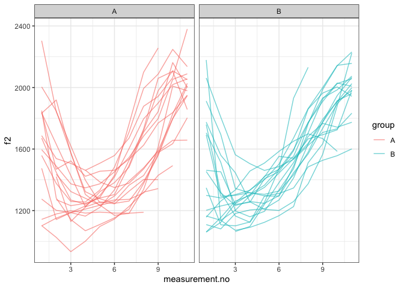

Introduction
------------

This document is a supplement to “Evaluating generalised additive mixed
modelling strategies for dynamic speech analysis,” relating specifically
to the contents of the “real formants” columns of Table 1 in Section
3.1.2. It presents code that illustrates (i) how the resampled data were
generated and (ii) the models whose performance is summarised in the
“real formants” columns of Table 1.

Preliminaries
-------------

The code below loads the relevant libraries.

``` r
library(ggplot2)
```

    ## Warning: package 'ggplot2' was built under R version 3.5.2

``` r
library(mgcv)
```

    ## Warning: package 'mgcv' was built under R version 3.5.2

``` r
library(itsadug)
library(stringr)
```

    ## Warning: package 'stringr' was built under R version 3.5.2

Data generation
---------------

The code in this section can be only be used to process the data for
type I simulations. Note that the paths in this file will only work if
the whole GitHub repository is downloaded and this markdown file is kept
in its folder.

The data for this set of simulations consist of real f2 trajectories
representing the vowel /aI/ in New Zealand English sampled from a single
speaker. No more than 50 contours are sampled from the speaker. Each
contour is randomly assigned to one of two groups (A and B).

``` r
dat_full <- readRDS("../data/final_data/price_vd_30_speakers.rds")

# we sample a single speaker from this data set

dat <- subset(dat_full, speaker == sample(unique(dat_full$speaker), 1))

# we only take what we need
# (< 50 trajectories)

dat <- subset(dat, 
              traj %in% sample(unique(dat$traj), 
                               size=min(length(unique(dat$traj)), 50)
              )
)

# we now add randomly assigned category labels

ids <- unique(dat$traj)
group.Bs <- sample(ids, round(length(ids)/2))
dat$group <- "A"
dat$group[dat$traj %in% group.Bs] <- "B"

# setting up different types of grouping factors
dat$group.factor <- as.factor(dat$group)
dat$group.ordered <- as.ordered(dat$group)
contrasts(dat$group.ordered) <- "contr.treatment"
dat$group.bin <- as.numeric(dat$group.factor) - 1

# ids ought to be factors  
dat$traj <- as.factor(dat$traj)
```

Here is what the data set looks like.

``` r
ggplot(dat, aes(x=measurement.no, y=f2, group=traj, col=group)) +
  geom_line(alpha=0.6) +
  facet_grid(~group) +
  theme_bw()
```



Models
------

All the models (and sets of models) from Table 1 are shown below in the
same order as in the table. The numbers in the section headers
correspond to the row numbers.

### NO SMOOTHS: 1. No components

``` r
nocomp <- bam(f2 ~ group.ordered + 
                   s(measurement.no, bs = "tp", k = 10) + 
                   s(measurement.no, by = group.ordered, bs = "tp", k = 10), 
              data = dat, method = "fREML", discrete = T, nthreads = 1)
summary(nocomp)
```

    ## 
    ## Family: gaussian 
    ## Link function: identity 
    ## 
    ## Formula:
    ## f2 ~ group.ordered + s(measurement.no, bs = "tp", k = 10) + s(measurement.no, 
    ##     by = group.ordered, bs = "tp", k = 10)
    ## 
    ## Parametric coefficients:
    ##                Estimate Std. Error t value Pr(>|t|)    
    ## (Intercept)     1528.84      14.22  107.49   <2e-16 ***
    ## group.orderedB     7.78      19.97    0.39    0.697    
    ## ---
    ## Signif. codes:  0 '***' 0.001 '**' 0.01 '*' 0.05 '.' 0.1 ' ' 1
    ## 
    ## Approximate significance of smooth terms:
    ##                                    edf Ref.df      F p-value    
    ## s(measurement.no)                5.262  6.388 47.543  <2e-16 ***
    ## s(measurement.no):group.orderedB 2.289  2.848  2.863  0.0322 *  
    ## ---
    ## Signif. codes:  0 '***' 0.001 '**' 0.01 '*' 0.05 '.' 0.1 ' ' 1
    ## 
    ## R-sq.(adj) =  0.612   Deviance explained = 62.1%
    ## fREML = 2517.4  Scale est. = 37517     n = 378

### NO SMOOTHS: 2. Rand intcpt (= Random Intercept)

``` r
rand_intcpt <- bam(f2 ~ group.ordered + 
                        s(measurement.no, bs = "tp", k = 10) + 
                        s(measurement.no, by = group.ordered, bs = "tp", k = 10) + 
                        s(traj, bs = "re"), 
                    data = dat, method = "fREML", discrete = T, nthreads = 1)
summary(rand_intcpt)
```

    ## 
    ## Family: gaussian 
    ## Link function: identity 
    ## 
    ## Formula:
    ## f2 ~ group.ordered + s(measurement.no, bs = "tp", k = 10) + s(measurement.no, 
    ##     by = group.ordered, bs = "tp", k = 10) + s(traj, bs = "re")
    ## 
    ## Parametric coefficients:
    ##                Estimate Std. Error t value Pr(>|t|)    
    ## (Intercept)     1477.95      25.71  57.485   <2e-16 ***
    ## group.orderedB    23.06      36.50   0.632    0.528    
    ## ---
    ## Signif. codes:  0 '***' 0.001 '**' 0.01 '*' 0.05 '.' 0.1 ' ' 1
    ## 
    ## Approximate significance of smooth terms:
    ##                                     edf Ref.df      F  p-value    
    ## s(measurement.no)                 5.564  6.714 55.379  < 2e-16 ***
    ## s(measurement.no):group.orderedB  2.318  2.883  4.484  0.00615 ** 
    ## s(traj)                          26.824 35.000  3.713 4.81e-07 ***
    ## ---
    ## Signif. codes:  0 '***' 0.001 '**' 0.01 '*' 0.05 '.' 0.1 ' ' 1
    ## 
    ## R-sq.(adj) =  0.703   Deviance explained = 73.1%
    ## fREML = 2493.8  Scale est. = 28704     n = 378

### NO SMOOTHS: 3. Rand intcpt + slope (= random intercept + slope)

``` r
rand_intcpt_slope <- 
  bam(f2 ~ group.ordered + 
        s(measurement.no, bs = "tp", k = 10) + 
        s(measurement.no, by = group.ordered, bs = "tp", k = 10) + 
        s(traj, bs = "re") + 
        s(traj, measurement.no, bs = "re"), 
      data = dat, method = "fREML", discrete = T, nthreads = 1) 
summary(rand_intcpt_slope)
```

    ## 
    ## Family: gaussian 
    ## Link function: identity 
    ## 
    ## Formula:
    ## f2 ~ group.ordered + s(measurement.no, bs = "tp", k = 10) + s(measurement.no, 
    ##     by = group.ordered, bs = "tp", k = 10) + s(traj, bs = "re") + 
    ##     s(traj, measurement.no, bs = "re")
    ## 
    ## Parametric coefficients:
    ##                Estimate Std. Error t value Pr(>|t|)    
    ## (Intercept)     1478.16      68.14  21.694   <2e-16 ***
    ## group.orderedB    24.78      97.60   0.254      0.8    
    ## ---
    ## Signif. codes:  0 '***' 0.001 '**' 0.01 '*' 0.05 '.' 0.1 ' ' 1
    ## 
    ## Approximate significance of smooth terms:
    ##                                     edf Ref.df       F p-value    
    ## s(measurement.no)                 6.173  7.333  51.558  <2e-16 ***
    ## s(measurement.no):group.orderedB  2.530  3.147   3.198  0.0217 *  
    ## s(traj)                          30.385 37.000 688.869  <2e-16 ***
    ## s(measurement.no,traj)           30.892 35.000 685.648  <2e-16 ***
    ## ---
    ## Signif. codes:  0 '***' 0.001 '**' 0.01 '*' 0.05 '.' 0.1 ' ' 1
    ## 
    ## R-sq.(adj) =  0.843   Deviance explained = 87.3%
    ## fREML = 2448.9  Scale est. = 15174     n = 378

### TP SMOOTHS: 4. Rand smooth, tp, 3 bs

``` r
rand_smooth_tp_3 <- 
  bam(f2 ~ group.ordered + 
        s(measurement.no, bs = "tp", k = 10) + 
        s(measurement.no, by = group.ordered, bs = "tp", k = 10) + 
        s(measurement.no, traj, bs = "fs", m = 1, xt = "tp", k = 3), 
      data = dat, method = "fREML", discrete = T, nthreads = 1)
```

    ## Warning in gam.side(sm, X, tol = .Machine$double.eps^0.5): model has
    ## repeated 1-d smooths of same variable.

``` r
summary(rand_smooth_tp_3)
```

    ## 
    ## Family: gaussian 
    ## Link function: identity 
    ## 
    ## Formula:
    ## f2 ~ group.ordered + s(measurement.no, bs = "tp", k = 10) + s(measurement.no, 
    ##     by = group.ordered, bs = "tp", k = 10) + s(measurement.no, 
    ##     traj, bs = "fs", m = 1, xt = "tp", k = 3)
    ## 
    ## Parametric coefficients:
    ##                Estimate Std. Error t value Pr(>|t|)    
    ## (Intercept)     1510.87      49.60  30.462   <2e-16 ***
    ## group.orderedB   -34.44      65.72  -0.524    0.601    
    ## ---
    ## Signif. codes:  0 '***' 0.001 '**' 0.01 '*' 0.05 '.' 0.1 ' ' 1
    ## 
    ## Approximate significance of smooth terms:
    ##                                     edf  Ref.df      F p-value    
    ## s(measurement.no)                 6.894   7.993 30.996  <2e-16 ***
    ## s(measurement.no):group.orderedB  1.000   1.000  2.213   0.138    
    ## s(measurement.no,traj)           97.508 109.000 28.275  <2e-16 ***
    ## ---
    ## Signif. codes:  0 '***' 0.001 '**' 0.01 '*' 0.05 '.' 0.1 ' ' 1
    ## 
    ## R-sq.(adj) =  0.924   Deviance explained = 94.5%
    ## fREML = 2380.2  Scale est. = 7393.6    n = 378

### TP SMOOTHS: 5. Rand smooth, tp, 5 bs

``` r
rand_smooth_tp_5 <- 
  bam(f2 ~ group.ordered + 
        s(measurement.no, bs = "tp", k = 10) + 
        s(measurement.no, by = group.ordered, bs = "tp", k = 10) + 
        s(measurement.no, traj, bs = "fs", m = 1, xt = "tp", k = 5), 
      data = dat, method = "fREML", discrete = T, nthreads = 1)
```

    ## Warning in gam.side(sm, X, tol = .Machine$double.eps^0.5): model has
    ## repeated 1-d smooths of same variable.

``` r
summary(rand_smooth_tp_5)
```

    ## 
    ## Family: gaussian 
    ## Link function: identity 
    ## 
    ## Formula:
    ## f2 ~ group.ordered + s(measurement.no, bs = "tp", k = 10) + s(measurement.no, 
    ##     by = group.ordered, bs = "tp", k = 10) + s(measurement.no, 
    ##     traj, bs = "fs", m = 1, xt = "tp", k = 5)
    ## 
    ## Parametric coefficients:
    ##                Estimate Std. Error t value Pr(>|t|)    
    ## (Intercept)     1503.89      47.12  31.916   <2e-16 ***
    ## group.orderedB   -25.65      64.33  -0.399    0.691    
    ## ---
    ## Signif. codes:  0 '***' 0.001 '**' 0.01 '*' 0.05 '.' 0.1 ' ' 1
    ## 
    ## Approximate significance of smooth terms:
    ##                                      edf  Ref.df      F p-value    
    ## s(measurement.no)                  7.310   8.238 24.792  <2e-16 ***
    ## s(measurement.no):group.orderedB   1.609   1.778  0.908   0.294    
    ## s(measurement.no,traj)           151.506 183.000 15.701  <2e-16 ***
    ## ---
    ## Signif. codes:  0 '***' 0.001 '**' 0.01 '*' 0.05 '.' 0.1 ' ' 1
    ## 
    ## R-sq.(adj) =  0.956   Deviance explained = 97.5%
    ## fREML =   2351  Scale est. = 4264.9    n = 378

### TP SMOOTHS: 6. Rand smooth, tp, 10 bs

``` r
rand_smooth_tp_10 <- 
  bam(f2 ~ group.ordered + 
        s(measurement.no, bs = "tp", k = 10) + 
        s(measurement.no, by = group.ordered, bs = "tp", k = 10) + 
        s(measurement.no, traj, bs = "fs", m = 1, xt = "tp", k = 10), 
      data = dat, method = "fREML", discrete = T, nthreads = 1)
```

    ## Warning in gam.side(sm, X, tol = .Machine$double.eps^0.5): model has
    ## repeated 1-d smooths of same variable.

``` r
summary(rand_smooth_tp_10)
```

    ## 
    ## Family: gaussian 
    ## Link function: identity 
    ## 
    ## Formula:
    ## f2 ~ group.ordered + s(measurement.no, bs = "tp", k = 10) + s(measurement.no, 
    ##     by = group.ordered, bs = "tp", k = 10) + s(measurement.no, 
    ##     traj, bs = "fs", m = 1, xt = "tp", k = 10)
    ## 
    ## Parametric coefficients:
    ##                Estimate Std. Error t value Pr(>|t|)    
    ## (Intercept)    1495.278     50.287  29.735   <2e-16 ***
    ## group.orderedB   -6.165     70.050  -0.088     0.93    
    ## ---
    ## Signif. codes:  0 '***' 0.001 '**' 0.01 '*' 0.05 '.' 0.1 ' ' 1
    ## 
    ## Approximate significance of smooth terms:
    ##                                      edf  Ref.df      F p-value    
    ## s(measurement.no)                  7.132   7.326 28.467  <2e-16 ***
    ## s(measurement.no):group.orderedB   1.986   2.029  1.935   0.148    
    ## s(measurement.no,traj)           302.844 353.000 39.813  <2e-16 ***
    ## ---
    ## Signif. codes:  0 '***' 0.001 '**' 0.01 '*' 0.05 '.' 0.1 ' ' 1
    ## 
    ## R-sq.(adj) =   0.99   Deviance explained = 99.8%
    ## fREML = 2341.4  Scale est. = 958.87    n = 378

### TP SMOOTHS: 7. Rand smooth, tp, 15 bs

This model was not fitted to these data.

### TP SMOOTHS: 8. Rand smooth, tp, 20 bs

This model was not fitted to these data.

### TP SMOOTHS: 9. Rand smooth, tp, gam.check

The model fitted in this section uses random smooths where the number of
basis functions (k) is determined using the gam.check() function: after
fitting an initial model with a relatively low value of k, gam.check()
is used to see whether more wiggliness is necessary (essentially,
whether the smooths use up all the degrees of freedom afforded to them).
If gam.check() suggests that more wiggliness is necessary, this
procedure is repeated again using a model with a higher value of k.

Below is a convenience function for extracting the relevant p-value from
the output of gam.check.

``` r
gam.check.p.value <- function (mod, which.line) {
  str.out <- capture.output(gam.check(mod))
  relevant.line <- str.out[grep(which.line, str.out)]
  p.value <- as.numeric(str_match(relevant.line, "([0-9.]*)[ *.]*$")[[2]])
  return(p.value)
}
```

Fitting the models.

``` r
# what k's should be tried?
k_min = 4
k_max = 10
k_step = 2
```

``` r
for (k in seq(k_min,k_max,k_step)) {
  cat("fitting model with  k =", k, "\n")
  
  # fitting model
  
  rand_smooth_tp_gam.check <- 
    bam(f2 ~ group.ordered + 
          s(measurement.no, bs = "tp", k = 10) + 
          s(measurement.no, by = group.ordered, bs = "tp", k = 10) + 
          s(measurement.no, traj, bs = "fs", m = 1, xt = "tp", k = k), 
        data = dat, method = "fREML", discrete = T, nthreads = 1)
  
  # check whether more complexity is needed using gam.check
  
  if (gam.check.p.value(rand_smooth_tp_gam.check, "traj") >= 0.05 | k == k_max) {
    print(summary(rand_smooth_tp_gam.check))
    break
  }
}
```

    ## fitting model with  k = 4

    ## Warning in gam.side(sm, X, tol = .Machine$double.eps^0.5): model has
    ## repeated 1-d smooths of same variable.

    ## fitting model with  k = 6

    ## Warning in gam.side(sm, X, tol = .Machine$double.eps^0.5): model has
    ## repeated 1-d smooths of same variable.

    ## 
    ## Family: gaussian 
    ## Link function: identity 
    ## 
    ## Formula:
    ## f2 ~ group.ordered + s(measurement.no, bs = "tp", k = 10) + s(measurement.no, 
    ##     by = group.ordered, bs = "tp", k = 10) + s(measurement.no, 
    ##     traj, bs = "fs", m = 1, xt = "tp", k = k)
    ## 
    ## Parametric coefficients:
    ##                Estimate Std. Error t value Pr(>|t|)    
    ## (Intercept)     1504.75      47.48  31.691   <2e-16 ***
    ## group.orderedB   -25.79      65.29  -0.395    0.693    
    ## ---
    ## Signif. codes:  0 '***' 0.001 '**' 0.01 '*' 0.05 '.' 0.1 ' ' 1
    ## 
    ## Approximate significance of smooth terms:
    ##                                      edf  Ref.df      F p-value    
    ## s(measurement.no)                  7.414   8.225 23.048  <2e-16 ***
    ## s(measurement.no):group.orderedB   1.806   1.979  1.422   0.213    
    ## s(measurement.no,traj)           179.524 220.000 17.713  <2e-16 ***
    ## ---
    ## Signif. codes:  0 '***' 0.001 '**' 0.01 '*' 0.05 '.' 0.1 ' ' 1
    ## 
    ## R-sq.(adj) =  0.966   Deviance explained = 98.3%
    ## fREML =   2343  Scale est. = 3241.7    n = 378

### CR SMOOTHS: 10. Rand smooth, cr, 3 bs

``` r
rand_smooth_cr_3 <- 
  bam(f2 ~ group.ordered + 
        s(measurement.no, bs = "tp", k = 10) + 
        s(measurement.no, by = group.ordered, bs = "tp", k = 10) + 
        s(measurement.no, traj, bs = "fs", m = 1, xt = "cr", k = 3), 
      data = dat, method = "fREML", discrete = T, nthreads = 1)
```

    ## Warning in gam.side(sm, X, tol = .Machine$double.eps^0.5): model has
    ## repeated 1-d smooths of same variable.

``` r
summary(rand_smooth_cr_3)
```

    ## 
    ## Family: gaussian 
    ## Link function: identity 
    ## 
    ## Formula:
    ## f2 ~ group.ordered + s(measurement.no, bs = "tp", k = 10) + s(measurement.no, 
    ##     by = group.ordered, bs = "tp", k = 10) + s(measurement.no, 
    ##     traj, bs = "fs", m = 1, xt = "cr", k = 3)
    ## 
    ## Parametric coefficients:
    ##                Estimate Std. Error t value Pr(>|t|)    
    ## (Intercept)    1497.473     42.114  35.557   <2e-16 ***
    ## group.orderedB   -8.054     57.267  -0.141    0.888    
    ## ---
    ## Signif. codes:  0 '***' 0.001 '**' 0.01 '*' 0.05 '.' 0.1 ' ' 1
    ## 
    ## Approximate significance of smooth terms:
    ##                                     edf  Ref.df      F p-value    
    ## s(measurement.no)                 7.028   8.106 31.875  <2e-16 ***
    ## s(measurement.no):group.orderedB  1.000   1.000  2.945  0.0873 .  
    ## s(measurement.no,traj)           99.099 107.000 23.013  <2e-16 ***
    ## ---
    ## Signif. codes:  0 '***' 0.001 '**' 0.01 '*' 0.05 '.' 0.1 ' ' 1
    ## 
    ## R-sq.(adj) =   0.93   Deviance explained =   95%
    ## fREML = 2367.4  Scale est. = 6753.6    n = 378

### CR SMOOTHS: 11. Rand smooth, cr, 5 bs

``` r
rand_smooth_cr_5 <- 
  bam(f2 ~ group.ordered + 
        s(measurement.no, bs = "tp", k = 10) + 
        s(measurement.no, by = group.ordered, bs = "tp", k = 10) + 
        s(measurement.no, traj, bs = "fs", m = 1, xt = "cr", k = 5), 
      data = dat, method = "fREML", discrete = T, nthreads = 1)
```

    ## Warning in gam.side(sm, X, tol = .Machine$double.eps^0.5): model has
    ## repeated 1-d smooths of same variable.

``` r
summary(rand_smooth_cr_5)
```

    ## 
    ## Family: gaussian 
    ## Link function: identity 
    ## 
    ## Formula:
    ## f2 ~ group.ordered + s(measurement.no, bs = "tp", k = 10) + s(measurement.no, 
    ##     by = group.ordered, bs = "tp", k = 10) + s(measurement.no, 
    ##     traj, bs = "fs", m = 1, xt = "cr", k = 5)
    ## 
    ## Parametric coefficients:
    ##                Estimate Std. Error t value Pr(>|t|)    
    ## (Intercept)    1488.217     32.909  45.222   <2e-16 ***
    ## group.orderedB    5.345     44.931   0.119    0.905    
    ## ---
    ## Signif. codes:  0 '***' 0.001 '**' 0.01 '*' 0.05 '.' 0.1 ' ' 1
    ## 
    ## Approximate significance of smooth terms:
    ##                                      edf  Ref.df      F p-value    
    ## s(measurement.no)                  7.574   8.457 16.875  <2e-16 ***
    ## s(measurement.no):group.orderedB   1.000   1.000  2.547   0.112    
    ## s(measurement.no,traj)           147.327 181.000 19.776  <2e-16 ***
    ## ---
    ## Signif. codes:  0 '***' 0.001 '**' 0.01 '*' 0.05 '.' 0.1 ' ' 1
    ## 
    ## R-sq.(adj) =  0.963   Deviance explained = 97.9%
    ## fREML = 2321.3  Scale est. = 3557.1    n = 378

### CR SMOOTHS: 12. Rand smooth, cr, 10 bs

``` r
rand_smooth_cr_10 <- 
  bam(f2 ~ group.ordered + 
        s(measurement.no, bs = "tp", k = 10) + 
        s(measurement.no, by = group.ordered, bs = "tp", k = 10) + 
        s(measurement.no, traj, bs = "fs", m = 1, xt = "cr", k = 10), 
      data = dat, method = "fREML", discrete = T, nthreads = 1)
```

    ## Warning in gam.side(sm, X, tol = .Machine$double.eps^0.5): model has
    ## repeated 1-d smooths of same variable.

``` r
summary(rand_smooth_cr_10)
```

    ## 
    ## Family: gaussian 
    ## Link function: identity 
    ## 
    ## Formula:
    ## f2 ~ group.ordered + s(measurement.no, bs = "tp", k = 10) + s(measurement.no, 
    ##     by = group.ordered, bs = "tp", k = 10) + s(measurement.no, 
    ##     traj, bs = "fs", m = 1, xt = "cr", k = 10)
    ## 
    ## Parametric coefficients:
    ##                Estimate Std. Error t value Pr(>|t|)    
    ## (Intercept)     1483.11      30.01  49.418   <2e-16 ***
    ## group.orderedB    13.07      41.51   0.315    0.753    
    ## ---
    ## Signif. codes:  0 '***' 0.001 '**' 0.01 '*' 0.05 '.' 0.1 ' ' 1
    ## 
    ## Approximate significance of smooth terms:
    ##                                      edf  Ref.df      F  p-value    
    ## s(measurement.no)                  7.834   8.387 12.374 5.48e-15 ***
    ## s(measurement.no):group.orderedB   1.000   1.000  2.584     0.11    
    ## s(measurement.no,traj)           216.853 352.000 22.934  < 2e-16 ***
    ## ---
    ## Signif. codes:  0 '***' 0.001 '**' 0.01 '*' 0.05 '.' 0.1 ' ' 1
    ## 
    ## R-sq.(adj) =  0.983   Deviance explained = 99.3%
    ## fREML = 2304.1  Scale est. = 1663.3    n = 378

### CR SMOOTHS: 13. Rand smooth, cr, 15 bs

This model was not fitted to these data.

### CR SMOOTHS: 14. Rand smooth, cr, 20 bs

This model was not fitted to these data.

### CR SMOOTHS: 15. Rand smooth, cr, gam.check

The model fitted in this section uses random smooths where the number of
basis functions (k) is determined using the gam.check() function: after
fitting an initial model with a relatively low value of k, gam.check()
is used to see whether more wiggliness is necessary (essentially,
whether the smooths use up all the degrees of freedom afforded to them).
If gam.check() suggests that more wiggliness is necessary, this
procedure is repeated again using a model with a higher value of k.

Below is a convenience function for extracting the relevant p-value from
the output of gam.check.

``` r
gam.check.p.value <- function (mod, which.line) {
  str.out <- capture.output(gam.check(mod))
  relevant.line <- str.out[grep(which.line, str.out)]
  p.value <- as.numeric(str_match(relevant.line, "([0-9.]*)[ *.]*$")[[2]])
  return(p.value)
}
```

Fitting the models.

``` r
# what k's should be tried?
k_min = 4
k_max = 10
k_step = 2
```

``` r
for (k in seq(k_min,k_max,k_step)) {
  cat("fitting model with  k =", k, "\n")
  
  # fitting model
  
  rand_smooth_cr_gam.check <- 
    bam(f2 ~ group.ordered + 
          s(measurement.no, bs = "tp", k = 10) + 
          s(measurement.no, by = group.ordered, bs = "tp", k = 10) + 
          s(measurement.no, traj, bs = "fs", m = 1, xt = "cr", k = k), 
        data = dat, method = "fREML", discrete = T, nthreads = 1)
  
  # check whether more complexity is needed using gam.check
  
  if (gam.check.p.value(rand_smooth_cr_gam.check, "traj") >= 0.05 | k == k_max) {
    print(summary(rand_smooth_cr_gam.check))
    break
  }
}
```

    ## fitting model with  k = 4

    ## Warning in gam.side(sm, X, tol = .Machine$double.eps^0.5): model has
    ## repeated 1-d smooths of same variable.

    ## 
    ## Family: gaussian 
    ## Link function: identity 
    ## 
    ## Formula:
    ## f2 ~ group.ordered + s(measurement.no, bs = "tp", k = 10) + s(measurement.no, 
    ##     by = group.ordered, bs = "tp", k = 10) + s(measurement.no, 
    ##     traj, bs = "fs", m = 1, xt = "cr", k = k)
    ## 
    ## Parametric coefficients:
    ##                Estimate Std. Error t value Pr(>|t|)    
    ## (Intercept)    1492.515     34.873  42.799   <2e-16 ***
    ## group.orderedB   -2.462     47.194  -0.052    0.958    
    ## ---
    ## Signif. codes:  0 '***' 0.001 '**' 0.01 '*' 0.05 '.' 0.1 ' ' 1
    ## 
    ## Approximate significance of smooth terms:
    ##                                      edf  Ref.df      F p-value    
    ## s(measurement.no)                  7.413   8.375 19.169  <2e-16 ***
    ## s(measurement.no):group.orderedB   1.000   1.000  2.585   0.109    
    ## s(measurement.no,traj)           125.945 144.000 19.113  <2e-16 ***
    ## ---
    ## Signif. codes:  0 '***' 0.001 '**' 0.01 '*' 0.05 '.' 0.1 ' ' 1
    ## 
    ## R-sq.(adj) =  0.953   Deviance explained =   97%
    ## fREML = 2332.8  Scale est. = 4512.1    n = 378

### 16. AR1

First fitting model without AR component in order to estimate rho. This
is equivalent to the nocomp model above.

``` r
nocomp <- bam(f2 ~ group.ordered + 
                      s(measurement.no, bs = "tp", k = 10) + 
                      s(measurement.no, by = group.ordered, bs = "tp", k = 10), 
                    data = dat, method = "fREML", discrete = T, nthreads = 1)
```

Extracting rho.

``` r
rho <- start_value_rho(nocomp)
cat("rho =", rho, "\n")
```

    ## rho = 0.6402514

Fitting model with AR1

``` r
AR1 <- bam(f2 ~ group.ordered + 
             s(measurement.no, bs = "tp", k = 10) + 
             s(measurement.no, by = group.ordered, bs = "tp", k = 10), 
           data = dat, 
           AR.start = dat$start, rho = rho, 
           method = "fREML", discrete = T, nthreads = 1)
summary(AR1)
```

    ## 
    ## Family: gaussian 
    ## Link function: identity 
    ## 
    ## Formula:
    ## f2 ~ group.ordered + s(measurement.no, bs = "tp", k = 10) + s(measurement.no, 
    ##     by = group.ordered, bs = "tp", k = 10)
    ## 
    ## Parametric coefficients:
    ##                Estimate Std. Error t value Pr(>|t|)    
    ## (Intercept)     1525.44      22.79  66.940   <2e-16 ***
    ## group.orderedB    10.68      32.25   0.331    0.741    
    ## ---
    ## Signif. codes:  0 '***' 0.001 '**' 0.01 '*' 0.05 '.' 0.1 ' ' 1
    ## 
    ## Approximate significance of smooth terms:
    ##                                    edf Ref.df      F p-value    
    ## s(measurement.no)                6.660  7.917 31.130  <2e-16 ***
    ## s(measurement.no):group.orderedB 2.409  3.123  2.878  0.0334 *  
    ## ---
    ## Signif. codes:  0 '***' 0.001 '**' 0.01 '*' 0.05 '.' 0.1 ' ' 1
    ## 
    ## R-sq.(adj) =  0.609   Deviance explained =   62%
    ## fREML = 2374.2  Scale est. = 28267     n = 378
