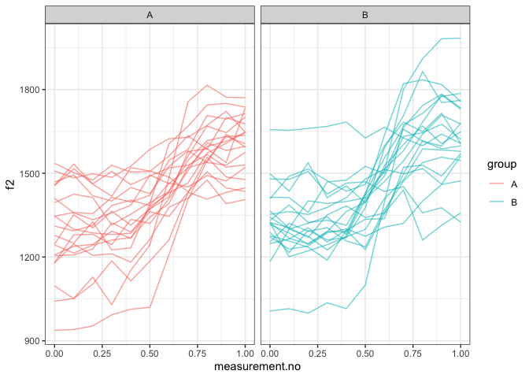

Introduction
------------

This document is a supplement to “Evaluating generalised additive mixed
modelling strategies for dynamic speech analysis,” relating specifically
to the contents of the “simulated formants” columns of Table 1 in
Section 3.1.2. It presents code that illustrates (i) how the simulated
data were generated and (ii) the models whose performance is summarised
in the “simulated formants” columns of Table 1.

Preliminaries
-------------

The code below loads the relevant libraries.

``` r
library(ggplot2)
```

    ## Warning: package 'ggplot2' was built under R version 3.5.2

``` r
library(mgcv)
```

    ## Warning: package 'mgcv' was built under R version 3.5.2

``` r
library(itsadug)
library(stringr)
```

    ## Warning: package 'stringr' was built under R version 3.5.2

Data generation
---------------

The code in this section can be used to create data for either type I or
type II simulations. Set the value of *type* to 1 for type I simulations
and to 2 for type II simulations.

``` r
type = 2
```

The data for this set of simulations consist of simulated f2
trajectories modelled after the diphthong /aI/. 50 trajectories are
generated. For type I simulations, these are randomly assigned to two
groups (A and B). For type II simulations, all group B trajectories are
slightly modified (cf. Section 2.1 in the paper and also the Appendix).

The following code sets the parameters that determine the main
characteristics of the data set.

``` r
# setting time dimension

xs = seq(0,1,0.1)

# expected values & sd for starting and end points
if (type == 1) {
  f2_start_mean = 1300
  f2_end_1_mean = 1650
  f2_end_2_mean = 1650
  f2_start_sd = 150
  f2_end_1_sd = 150
  f2_end_2_sd = 150
} else {
  f2_start_mean = 1300
  f2_end_1_mean = 1600
  f2_end_2_mean = 1700
  f2_start_sd = 150
  f2_end_1_sd = 150
  f2_end_2_sd = 150
}

# expected value & sd for transition point
x0_mean = 0.6
x0_sd = 0.025

# expected value & sd for steepness (higher -> more steep)
k_mean = 15
k_sd = 4
# amount of random noise

noise_sd <- 40

n_trajectories <- 40
```

Generating data.

``` r
# assembling trajectories

ys_m <- matrix(0, nrow=length(xs), ncol=n_trajectories)
for (i in 1:(n_trajectories/2)) {
  f2_start_1 <- rnorm(1, f2_start_mean, f2_start_sd)
  f2_start_2 <- rnorm(1, f2_start_mean, f2_start_sd)
  f2_end_1 <- rnorm(1, f2_end_1_mean, f2_end_1_sd)
  f2_end_2 <- rnorm(1, f2_end_2_mean, f2_end_2_sd)
  x0_1 <- rnorm(1, x0_mean, x0_sd)
  x0_2 <- rnorm(1, x0_mean, x0_sd)
  k_1 <- rnorm(1, k_mean, k_sd)
  k_2 <- rnorm(1, k_mean, k_sd)
  ys_m[,i] <- ((f2_end_1 - f2_start_1) / (1 + exp(-k_1*(xs-x0_1)))) + f2_start_1 + rnorm(length(xs), 0, noise_sd)
  ys_m[,(i+(n_trajectories/2))] <- ((f2_end_2 - f2_start_2) / (1 + exp(-k_2*(xs-x0_2)))) + f2_start_2 + rnorm(length(xs), 0, noise_sd)
}

# assembling data set (randomly assigned catego
dat <- data.frame(traj=paste("traj_", rep(1:n_trajectories, each=length(xs)), sep=""), 
                        group=rep(c("A","B"), each=length(xs)*(n_trajectories / 2)),
                        measurement.no=xs, 
                        f2=c(ys_m),
                        stringsAsFactors = F
)

# setting up different types of grouping factors
dat$group.factor <- as.factor(dat$group)
dat$group.ordered <- as.ordered(dat$group) 
contrasts(dat$group.ordered) <- "contr.treatment"
dat$group.bin <- as.numeric(dat$group.factor) - 1

# ids ought to be factors  
dat$traj <- as.factor(dat$traj)

# add dat$start for AR.start (for autoregressive error models)

dat$start <- dat$measurement.no == 0
```

Here is what the data set looks like.

``` r
ggplot(dat, aes(x=measurement.no, y=f2, group=traj, col=group)) +
  geom_line(alpha=0.6) +
  facet_grid(~group) +
  theme_bw()
```



Models
------

All the models (and sets of models) from Table 1 are shown below in the
same order as in the table. The numbers in the section headers
correspond to the row numbers.

### NO SMOOTHS: 1. No components

``` r
nocomp <- bam(f2 ~ group.ordered + 
                   s(measurement.no, bs = "tp", k = 10) + 
                   s(measurement.no, by = group.ordered, bs = "tp", k = 10), 
              data = dat, method = "fREML", discrete = T, nthreads = 1)
summary(nocomp)
```

    ## 
    ## Family: gaussian 
    ## Link function: identity 
    ## 
    ## Formula:
    ## f2 ~ group.ordered + s(measurement.no, bs = "tp", k = 10) + s(measurement.no, 
    ##     by = group.ordered, bs = "tp", k = 10)
    ## 
    ## Parametric coefficients:
    ##                Estimate Std. Error t value Pr(>|t|)    
    ## (Intercept)    1424.857      8.778  162.32   <2e-16 ***
    ## group.orderedB   28.802     12.414    2.32   0.0208 *  
    ## ---
    ## Signif. codes:  0 '***' 0.001 '**' 0.01 '*' 0.05 '.' 0.1 ' ' 1
    ## 
    ## Approximate significance of smooth terms:
    ##                                    edf Ref.df      F p-value    
    ## s(measurement.no)                4.717  5.777 39.155  <2e-16 ***
    ## s(measurement.no):group.orderedB 1.000  1.000  0.034   0.854    
    ## ---
    ## Signif. codes:  0 '***' 0.001 '**' 0.01 '*' 0.05 '.' 0.1 ' ' 1
    ## 
    ## R-sq.(adj) =  0.489   Deviance explained = 49.7%
    ## fREML =   2757  Scale est. = 16951     n = 440

### NO SMOOTHS: 2. Rand intcpt (= Random Intercept)

``` r
rand_intcpt <- bam(f2 ~ group.ordered + 
                        s(measurement.no, bs = "tp", k = 10) + 
                        s(measurement.no, by = group.ordered, bs = "tp", k = 10) + 
                        s(traj, bs = "re"), 
                    data = dat, method = "fREML", discrete = T, nthreads = 1)
summary(rand_intcpt)
```

    ## 
    ## Family: gaussian 
    ## Link function: identity 
    ## 
    ## Formula:
    ## f2 ~ group.ordered + s(measurement.no, bs = "tp", k = 10) + s(measurement.no, 
    ##     by = group.ordered, bs = "tp", k = 10) + s(traj, bs = "re")
    ## 
    ## Parametric coefficients:
    ##                Estimate Std. Error t value Pr(>|t|)    
    ## (Intercept)     1421.45      20.90  68.005   <2e-16 ***
    ## group.orderedB    28.86      29.42   0.981    0.327    
    ## ---
    ## Signif. codes:  0 '***' 0.001 '**' 0.01 '*' 0.05 '.' 0.1 ' ' 1
    ## 
    ## Approximate significance of smooth terms:
    ##                                     edf Ref.df      F  p-value    
    ## s(measurement.no)                 5.404  6.547 62.850  < 2e-16 ***
    ## s(measurement.no):group.orderedB  1.000  1.000  0.062    0.804    
    ## s(traj)                          34.250 38.000 10.358 7.33e-11 ***
    ## ---
    ## Signif. codes:  0 '***' 0.001 '**' 0.01 '*' 0.05 '.' 0.1 ' ' 1
    ## 
    ## R-sq.(adj) =  0.717   Deviance explained = 74.3%
    ## fREML = 2673.9  Scale est. = 9397.3    n = 440

### NO SMOOTHS: 3. Rand intcpt + slope (= random intercept + slope)

``` r
rand_intcpt_slope <- 
  bam(f2 ~ group.ordered + 
        s(measurement.no, bs = "tp", k = 10) + 
        s(measurement.no, by = group.ordered, bs = "tp", k = 10) + 
        s(traj, bs = "re") + 
        s(traj, measurement.no, bs = "re"), 
      data = dat, method = "fREML", discrete = T, nthreads = 1) 
summary(rand_intcpt_slope)
```

    ## 
    ## Family: gaussian 
    ## Link function: identity 
    ## 
    ## Formula:
    ## f2 ~ group.ordered + s(measurement.no, bs = "tp", k = 10) + s(measurement.no, 
    ##     by = group.ordered, bs = "tp", k = 10) + s(traj, bs = "re") + 
    ##     s(traj, measurement.no, bs = "re")
    ## 
    ## Parametric coefficients:
    ##                Estimate Std. Error t value Pr(>|t|)    
    ## (Intercept)     1420.92      47.44   29.95   <2e-16 ***
    ## group.orderedB    28.86      67.06    0.43    0.667    
    ## ---
    ## Signif. codes:  0 '***' 0.001 '**' 0.01 '*' 0.05 '.' 0.1 ' ' 1
    ## 
    ## Approximate significance of smooth terms:
    ##                                     edf Ref.df        F p-value    
    ## s(measurement.no)                 6.842  7.956   42.716  <2e-16 ***
    ## s(measurement.no):group.orderedB  1.000  1.000    0.008   0.927    
    ## s(traj)                          36.956 38.000 7418.216  <2e-16 ***
    ## s(measurement.no,traj)           36.562 39.000 7119.809  <2e-16 ***
    ## ---
    ## Signif. codes:  0 '***' 0.001 '**' 0.01 '*' 0.05 '.' 0.1 ' ' 1
    ## 
    ## R-sq.(adj) =   0.92   Deviance explained = 93.5%
    ## fREML = 2511.8  Scale est. = 2664.5    n = 440

### TP SMOOTHS: 4. Rand smooth, tp, 3 bs

``` r
rand_smooth_tp_3 <- 
  bam(f2 ~ group.ordered + 
        s(measurement.no, bs = "tp", k = 10) + 
        s(measurement.no, by = group.ordered, bs = "tp", k = 10) + 
        s(measurement.no, traj, bs = "fs", m = 1, xt = "tp", k = 3), 
      data = dat, method = "fREML", discrete = T, nthreads = 1)
```

    ## Warning in gam.side(sm, X, tol = .Machine$double.eps^0.5): model has
    ## repeated 1-d smooths of same variable.

``` r
summary(rand_smooth_tp_3)
```

    ## 
    ## Family: gaussian 
    ## Link function: identity 
    ## 
    ## Formula:
    ## f2 ~ group.ordered + s(measurement.no, bs = "tp", k = 10) + s(measurement.no, 
    ##     by = group.ordered, bs = "tp", k = 10) + s(measurement.no, 
    ##     traj, bs = "fs", m = 1, xt = "tp", k = 3)
    ## 
    ## Parametric coefficients:
    ##                Estimate Std. Error t value Pr(>|t|)    
    ## (Intercept)     1419.80      22.09  64.276   <2e-16 ***
    ## group.orderedB    33.15      28.91   1.147    0.252    
    ## ---
    ## Signif. codes:  0 '***' 0.001 '**' 0.01 '*' 0.05 '.' 0.1 ' ' 1
    ## 
    ## Approximate significance of smooth terms:
    ##                                      edf  Ref.df      F p-value    
    ## s(measurement.no)                  7.192   8.229 29.579  <2e-16 ***
    ## s(measurement.no):group.orderedB   1.000   1.000  0.378   0.539    
    ## s(measurement.no,traj)           106.778 118.000 29.745  <2e-16 ***
    ## ---
    ## Signif. codes:  0 '***' 0.001 '**' 0.01 '*' 0.05 '.' 0.1 ' ' 1
    ## 
    ## R-sq.(adj) =  0.944   Deviance explained = 95.9%
    ## fREML = 2456.7  Scale est. = 1858.1    n = 440

### TP SMOOTHS: 5. Rand smooth, tp, 5 bs

``` r
rand_smooth_tp_5 <- 
  bam(f2 ~ group.ordered + 
        s(measurement.no, bs = "tp", k = 10) + 
        s(measurement.no, by = group.ordered, bs = "tp", k = 10) + 
        s(measurement.no, traj, bs = "fs", m = 1, xt = "tp", k = 5), 
      data = dat, method = "fREML", discrete = T, nthreads = 1)
```

    ## Warning in gam.side(sm, X, tol = .Machine$double.eps^0.5): model has
    ## repeated 1-d smooths of same variable.

``` r
summary(rand_smooth_tp_5)
```

    ## 
    ## Family: gaussian 
    ## Link function: identity 
    ## 
    ## Formula:
    ## f2 ~ group.ordered + s(measurement.no, bs = "tp", k = 10) + s(measurement.no, 
    ##     by = group.ordered, bs = "tp", k = 10) + s(measurement.no, 
    ##     traj, bs = "fs", m = 1, xt = "tp", k = 5)
    ## 
    ## Parametric coefficients:
    ##                Estimate Std. Error t value Pr(>|t|)    
    ## (Intercept)     1419.39      22.04  64.397   <2e-16 ***
    ## group.orderedB    30.90      29.17   1.059     0.29    
    ## ---
    ## Signif. codes:  0 '***' 0.001 '**' 0.01 '*' 0.05 '.' 0.1 ' ' 1
    ## 
    ## Approximate significance of smooth terms:
    ##                                      edf Ref.df      F p-value    
    ## s(measurement.no)                  7.346    8.3 20.909  <2e-16 ***
    ## s(measurement.no):group.orderedB   1.000    1.0  0.051   0.821    
    ## s(measurement.no,traj)           164.327  198.0 26.189  <2e-16 ***
    ## ---
    ## Signif. codes:  0 '***' 0.001 '**' 0.01 '*' 0.05 '.' 0.1 ' ' 1
    ## 
    ## R-sq.(adj) =  0.961   Deviance explained = 97.6%
    ## fREML = 2443.7  Scale est. = 1303.6    n = 440

### TP SMOOTHS: 6. Rand smooth, tp, 10 bs

``` r
rand_smooth_tp_10 <- 
  bam(f2 ~ group.ordered + 
        s(measurement.no, bs = "tp", k = 10) + 
        s(measurement.no, by = group.ordered, bs = "tp", k = 10) + 
        s(measurement.no, traj, bs = "fs", m = 1, xt = "tp", k = 10), 
      data = dat, method = "fREML", discrete = T, nthreads = 1)
```

    ## Warning in gam.side(sm, X, tol = .Machine$double.eps^0.5): model has
    ## repeated 1-d smooths of same variable.

``` r
summary(rand_smooth_tp_10)
```

    ## 
    ## Family: gaussian 
    ## Link function: identity 
    ## 
    ## Formula:
    ## f2 ~ group.ordered + s(measurement.no, bs = "tp", k = 10) + s(measurement.no, 
    ##     by = group.ordered, bs = "tp", k = 10) + s(measurement.no, 
    ##     traj, bs = "fs", m = 1, xt = "tp", k = 10)
    ## 
    ## Parametric coefficients:
    ##                Estimate Std. Error t value Pr(>|t|)    
    ## (Intercept)     1419.21      21.65  65.561   <2e-16 ***
    ## group.orderedB    32.52      28.72   1.132    0.259    
    ## ---
    ## Signif. codes:  0 '***' 0.001 '**' 0.01 '*' 0.05 '.' 0.1 ' ' 1
    ## 
    ## Approximate significance of smooth terms:
    ##                                      edf  Ref.df      F p-value    
    ## s(measurement.no)                  7.163   7.645 27.080  <2e-16 ***
    ## s(measurement.no):group.orderedB   1.000   1.000  0.031    0.86    
    ## s(measurement.no,traj)           282.205 397.000 22.595  <2e-16 ***
    ## ---
    ## Signif. codes:  0 '***' 0.001 '**' 0.01 '*' 0.05 '.' 0.1 ' ' 1
    ## 
    ## R-sq.(adj) =  0.977   Deviance explained = 99.2%
    ## fREML = 2448.5  Scale est. = 777.67    n = 440

### TP SMOOTHS: 7. Rand smooth, tp, 15 bs

This model was not fitted to these data.

### TP SMOOTHS: 8. Rand smooth, tp, 20 bs

This model was not fitted to these data.

### TP SMOOTHS: 9. Rand smooth, tp, gam.check

The model fitted in this section uses random smooths where the number of
basis functions (k) is determined using the gam.check() function: after
fitting an initial model with a relatively low value of k, gam.check()
is used to see whether more wiggliness is necessary (essentially,
whether the smooths use up all the degrees of freedom afforded to them).
If gam.check() suggests that more wiggliness is necessary, this
procedure is repeated again using a model with a higher value of k.

Below is a convenience function for extracting the relevant p-value from
the output of gam.check.

``` r
gam.check.p.value <- function (mod, which.line) {
  str.out <- capture.output(gam.check(mod))
  relevant.line <- str.out[grep(which.line, str.out)]
  p.value <- as.numeric(str_match(relevant.line, "([0-9.]*)[ *.]*$")[[2]])
  return(p.value)
}
```

Fitting the models.

``` r
# what k's should be tried?
k_min = 4
k_max = 10
k_step = 2
```

``` r
for (k in seq(k_min,k_max,k_step)) {
  cat("fitting model with  k =", k, "\n")
  
  # fitting model
  
  rand_smooth_tp_gam.check <- 
    bam(f2 ~ group.ordered + 
          s(measurement.no, bs = "tp", k = 10) + 
          s(measurement.no, by = group.ordered, bs = "tp", k = 10) + 
          s(measurement.no, traj, bs = "fs", m = 1, xt = "tp", k = k), 
        data = dat, method = "fREML", discrete = T, nthreads = 1)
  
  # check whether more complexity is needed using gam.check
  
  if (gam.check.p.value(rand_smooth_tp_gam.check, "traj") >= 0.05 | k == k_max) {
    print(summary(rand_smooth_tp_gam.check))
    break
  }
}
```

    ## fitting model with  k = 4

    ## Warning in gam.side(sm, X, tol = .Machine$double.eps^0.5): model has
    ## repeated 1-d smooths of same variable.

    ## 
    ## Family: gaussian 
    ## Link function: identity 
    ## 
    ## Formula:
    ## f2 ~ group.ordered + s(measurement.no, bs = "tp", k = 10) + s(measurement.no, 
    ##     by = group.ordered, bs = "tp", k = 10) + s(measurement.no, 
    ##     traj, bs = "fs", m = 1, xt = "tp", k = k)
    ## 
    ## Parametric coefficients:
    ##                Estimate Std. Error t value Pr(>|t|)    
    ## (Intercept)     1419.37      21.87  64.889   <2e-16 ***
    ## group.orderedB    33.35      28.91   1.153     0.25    
    ## ---
    ## Signif. codes:  0 '***' 0.001 '**' 0.01 '*' 0.05 '.' 0.1 ' ' 1
    ## 
    ## Approximate significance of smooth terms:
    ##                                      edf  Ref.df      F p-value    
    ## s(measurement.no)                  7.304   8.298 23.295  <2e-16 ***
    ## s(measurement.no):group.orderedB   1.000   1.000  0.038   0.846    
    ## s(measurement.no,traj)           136.335 158.000 26.996  <2e-16 ***
    ## ---
    ## Signif. codes:  0 '***' 0.001 '**' 0.01 '*' 0.05 '.' 0.1 ' ' 1
    ## 
    ## R-sq.(adj) =  0.953   Deviance explained = 96.8%
    ## fREML = 2451.2  Scale est. = 1569.6    n = 440

### CR SMOOTHS: 10. Rand smooth, cr, 3 bs

``` r
rand_smooth_cr_3 <- 
  bam(f2 ~ group.ordered + 
        s(measurement.no, bs = "tp", k = 10) + 
        s(measurement.no, by = group.ordered, bs = "tp", k = 10) + 
        s(measurement.no, traj, bs = "fs", m = 1, xt = "cr", k = 3), 
      data = dat, method = "fREML", discrete = T, nthreads = 1)
```

    ## Warning in gam.side(sm, X, tol = .Machine$double.eps^0.5): model has
    ## repeated 1-d smooths of same variable.

``` r
summary(rand_smooth_cr_3)
```

    ## 
    ## Family: gaussian 
    ## Link function: identity 
    ## 
    ## Formula:
    ## f2 ~ group.ordered + s(measurement.no, bs = "tp", k = 10) + s(measurement.no, 
    ##     by = group.ordered, bs = "tp", k = 10) + s(measurement.no, 
    ##     traj, bs = "fs", m = 1, xt = "cr", k = 3)
    ## 
    ## Parametric coefficients:
    ##                Estimate Std. Error t value Pr(>|t|)    
    ## (Intercept)     1420.28      20.39  69.662   <2e-16 ***
    ## group.orderedB    30.18      28.63   1.054    0.292    
    ## ---
    ## Signif. codes:  0 '***' 0.001 '**' 0.01 '*' 0.05 '.' 0.1 ' ' 1
    ## 
    ## Approximate significance of smooth terms:
    ##                                     edf  Ref.df      F p-value    
    ## s(measurement.no)                 6.988   8.076 38.627  <2e-16 ***
    ## s(measurement.no):group.orderedB  1.000   1.000  0.008   0.929    
    ## s(measurement.no,traj)           95.742 116.000 23.466  <2e-16 ***
    ## ---
    ## Signif. codes:  0 '***' 0.001 '**' 0.01 '*' 0.05 '.' 0.1 ' ' 1
    ## 
    ## R-sq.(adj) =   0.93   Deviance explained = 94.7%
    ## fREML = 2479.6  Scale est. = 2319      n = 440

### CR SMOOTHS: 11. Rand smooth, cr, 5 bs

``` r
rand_smooth_cr_5 <- 
  bam(f2 ~ group.ordered + 
        s(measurement.no, bs = "tp", k = 10) + 
        s(measurement.no, by = group.ordered, bs = "tp", k = 10) + 
        s(measurement.no, traj, bs = "fs", m = 1, xt = "cr", k = 5), 
      data = dat, method = "fREML", discrete = T, nthreads = 1)
```

    ## Warning in gam.side(sm, X, tol = .Machine$double.eps^0.5): model has
    ## repeated 1-d smooths of same variable.

``` r
summary(rand_smooth_cr_5)
```

    ## 
    ## Family: gaussian 
    ## Link function: identity 
    ## 
    ## Formula:
    ## f2 ~ group.ordered + s(measurement.no, bs = "tp", k = 10) + s(measurement.no, 
    ##     by = group.ordered, bs = "tp", k = 10) + s(measurement.no, 
    ##     traj, bs = "fs", m = 1, xt = "cr", k = 5)
    ## 
    ## Parametric coefficients:
    ##                Estimate Std. Error t value Pr(>|t|)    
    ## (Intercept)     1420.64      20.59  68.992   <2e-16 ***
    ## group.orderedB    29.44      28.73   1.024    0.306    
    ## ---
    ## Signif. codes:  0 '***' 0.001 '**' 0.01 '*' 0.05 '.' 0.1 ' ' 1
    ## 
    ## Approximate significance of smooth terms:
    ##                                      edf  Ref.df      F p-value    
    ## s(measurement.no)                  7.301   8.305 26.178  <2e-16 ***
    ## s(measurement.no):group.orderedB   1.000   1.000  0.002   0.966    
    ## s(measurement.no,traj)           141.668 196.000 20.940  <2e-16 ***
    ## ---
    ## Signif. codes:  0 '***' 0.001 '**' 0.01 '*' 0.05 '.' 0.1 ' ' 1
    ## 
    ## R-sq.(adj) =  0.951   Deviance explained = 96.8%
    ## fREML = 2466.6  Scale est. = 1612.1    n = 440

### CR SMOOTHS: 12. Rand smooth, cr, 10 bs

``` r
rand_smooth_cr_10 <- 
  bam(f2 ~ group.ordered + 
        s(measurement.no, bs = "tp", k = 10) + 
        s(measurement.no, by = group.ordered, bs = "tp", k = 10) + 
        s(measurement.no, traj, bs = "fs", m = 1, xt = "cr", k = 10), 
      data = dat, method = "fREML", discrete = T, nthreads = 1)
```

    ## Warning in gam.side(sm, X, tol = .Machine$double.eps^0.5): model has
    ## repeated 1-d smooths of same variable.

``` r
summary(rand_smooth_cr_10)
```

    ## 
    ## Family: gaussian 
    ## Link function: identity 
    ## 
    ## Formula:
    ## f2 ~ group.ordered + s(measurement.no, bs = "tp", k = 10) + s(measurement.no, 
    ##     by = group.ordered, bs = "tp", k = 10) + s(measurement.no, 
    ##     traj, bs = "fs", m = 1, xt = "cr", k = 10)
    ## 
    ## Parametric coefficients:
    ##                Estimate Std. Error t value Pr(>|t|)    
    ## (Intercept)      1420.9       20.6  68.964   <2e-16 ***
    ## group.orderedB     28.9       29.0   0.997     0.32    
    ## ---
    ## Signif. codes:  0 '***' 0.001 '**' 0.01 '*' 0.05 '.' 0.1 ' ' 1
    ## 
    ## Approximate significance of smooth terms:
    ##                                      edf  Ref.df      F p-value    
    ## s(measurement.no)                  7.302   8.285 26.771  <2e-16 ***
    ## s(measurement.no):group.orderedB   1.000   1.000  0.007   0.932    
    ## s(measurement.no,traj)           149.968 396.000 10.653  <2e-16 ***
    ## ---
    ## Signif. codes:  0 '***' 0.001 '**' 0.01 '*' 0.05 '.' 0.1 ' ' 1
    ## 
    ## R-sq.(adj) =  0.953   Deviance explained =   97%
    ## fREML = 2468.2  Scale est. = 1572.5    n = 440

### CR SMOOTHS: 13. Rand smooth, cr, 15 bs

This model was not fitted to these data.

### CR SMOOTHS: 14. Rand smooth, cr, 20 bs

This model was not fitted to these data.

### CR SMOOTHS: 15. Rand smooth, cr, gam.check

The model fitted in this section uses random smooths where the number of
basis functions (k) is determined using the gam.check() function: after
fitting an initial model with a relatively low value of k, gam.check()
is used to see whether more wiggliness is necessary (essentially,
whether the smooths use up all the degrees of freedom afforded to them).
If gam.check() suggests that more wiggliness is necessary, this
procedure is repeated again using a model with a higher value of k.

Below is a convenience function for extracting the relevant p-value from
the output of gam.check.

``` r
gam.check.p.value <- function (mod, which.line) {
  str.out <- capture.output(gam.check(mod))
  relevant.line <- str.out[grep(which.line, str.out)]
  p.value <- as.numeric(str_match(relevant.line, "([0-9.]*)[ *.]*$")[[2]])
  return(p.value)
}
```

Fitting the models.

``` r
# what k's should be tried?
k_min = 4
k_max = 10
k_step = 2
```

``` r
for (k in seq(k_min,k_max,k_step)) {
  cat("fitting model with  k =", k, "\n")
  
  # fitting model
  
  rand_smooth_cr_gam.check <- 
    bam(f2 ~ group.ordered + 
          s(measurement.no, bs = "tp", k = 10) + 
          s(measurement.no, by = group.ordered, bs = "tp", k = 10) + 
          s(measurement.no, traj, bs = "fs", m = 1, xt = "cr", k = k), 
        data = dat, method = "fREML", discrete = T, nthreads = 1)
  
  # check whether more complexity is needed using gam.check
  
  if (gam.check.p.value(rand_smooth_cr_gam.check, "traj") >= 0.05 | k == k_max) {
    print(summary(rand_smooth_cr_gam.check))
    break
  }
}
```

    ## fitting model with  k = 4

    ## Warning in gam.side(sm, X, tol = .Machine$double.eps^0.5): model has
    ## repeated 1-d smooths of same variable.

    ## 
    ## Family: gaussian 
    ## Link function: identity 
    ## 
    ## Formula:
    ## f2 ~ group.ordered + s(measurement.no, bs = "tp", k = 10) + s(measurement.no, 
    ##     by = group.ordered, bs = "tp", k = 10) + s(measurement.no, 
    ##     traj, bs = "fs", m = 1, xt = "cr", k = k)
    ## 
    ## Parametric coefficients:
    ##                Estimate Std. Error t value Pr(>|t|)    
    ## (Intercept)     1420.31      20.52  69.216   <2e-16 ***
    ## group.orderedB    30.00      28.64   1.048    0.296    
    ## ---
    ## Signif. codes:  0 '***' 0.001 '**' 0.01 '*' 0.05 '.' 0.1 ' ' 1
    ## 
    ## Approximate significance of smooth terms:
    ##                                      edf  Ref.df      F p-value    
    ## s(measurement.no)                  7.196   8.235 30.682  <2e-16 ***
    ## s(measurement.no):group.orderedB   1.000   1.000  0.002   0.965    
    ## s(measurement.no,traj)           123.587 156.000 22.434  <2e-16 ***
    ## ---
    ## Signif. codes:  0 '***' 0.001 '**' 0.01 '*' 0.05 '.' 0.1 ' ' 1
    ## 
    ## R-sq.(adj) =  0.944   Deviance explained = 96.1%
    ## fREML = 2470.2  Scale est. = 1860.1    n = 440

### 16. AR1

First fitting model without AR component in order to estimate rho. This
is equivalent to the nocomp model above.

``` r
nocomp <- bam(f2 ~ group.ordered + 
                      s(measurement.no, bs = "tp", k = 10) + 
                      s(measurement.no, by = group.ordered, bs = "tp", k = 10), 
                    data = dat, method = "fREML", discrete = T, nthreads = 1)
```

Extracting rho.

``` r
rho <- start_value_rho(nocomp)
cat("rho =", rho, "\n")
```

    ## rho = 0.810377

Fitting model with AR1

``` r
AR1 <- bam(f2 ~ group.ordered + 
             s(measurement.no, bs = "tp", k = 10) + 
             s(measurement.no, by = group.ordered, bs = "tp", k = 10), 
           data = dat, 
           AR.start = dat$start, rho = rho, 
           method = "fREML", discrete = T, nthreads = 1)
summary(AR1)
```

    ## 
    ## Family: gaussian 
    ## Link function: identity 
    ## 
    ## Formula:
    ## f2 ~ group.ordered + s(measurement.no, bs = "tp", k = 10) + s(measurement.no, 
    ##     by = group.ordered, bs = "tp", k = 10)
    ## 
    ## Parametric coefficients:
    ##                Estimate Std. Error t value Pr(>|t|)    
    ## (Intercept)     1423.90      17.02  83.654   <2e-16 ***
    ## group.orderedB    30.66      23.55   1.302    0.194    
    ## ---
    ## Signif. codes:  0 '***' 0.001 '**' 0.01 '*' 0.05 '.' 0.1 ' ' 1
    ## 
    ## Approximate significance of smooth terms:
    ##                                    edf Ref.df      F p-value    
    ## s(measurement.no)                7.117   8.31 24.637  <2e-16 ***
    ## s(measurement.no):group.orderedB 1.000   1.00  0.063   0.803    
    ## ---
    ## Signif. codes:  0 '***' 0.001 '**' 0.01 '*' 0.05 '.' 0.1 ' ' 1
    ## 
    ## R-sq.(adj) =  0.487   Deviance explained = 49.7%
    ## fREML = 2456.8  Scale est. = 11360     n = 440
