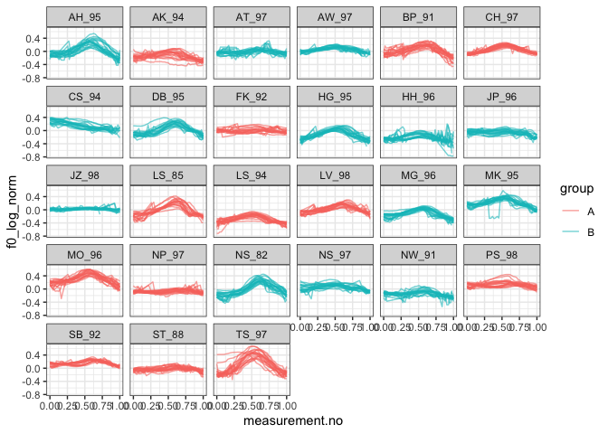

Introduction
------------

This document is a supplement to “Evaluating generalised additive mixed
modelling strategies for dynamic speech analysis,” relating specifically
to the contents of the “real pitch” columns of Table 2 in Section 3.2.2.
It presents code that illustrates (i) how the resampled data were
generated and (ii) the models whose performance is summarised in the
“real pitch” columns of Table 2.

Preliminaries
-------------

The code below loads the relevant libraries.

``` r
library(ggplot2)
```

    ## Warning: package 'ggplot2' was built under R version 3.5.2

``` r
library(mgcv)
```

    ## Warning: package 'mgcv' was built under R version 3.5.2

``` r
library(itsadug)
library(stringr)
```

    ## Warning: package 'stringr' was built under R version 3.5.2

``` r
library(dplyr)
```

    ## Warning: package 'dplyr' was built under R version 3.5.2

Data generation
---------------

The code in this section can be only be used to process the data for
type I simulations. Note that the paths in this file will only work if
the whole GitHub repository is downloaded and this markdown file is kept
in its folder.

The data for this set of simulations consist of real pitch trajectories
representing contrastive focus in Standard German. All contours (max.
20) are used from each of the 27 speakers in the data set. Each speaker
is randomly assigned to one of two groups (A and B). The difference
between males and females has been residualised out of the f0
measurements, which are also logged (but not normalised otherwise).

``` r
dat <- readRDS("../data/final_data/pitch_contr_27_speakers.rds")

# we now add randomly assigned category labels

ids <- unique(dat$speaker)
group.Bs <- sample(ids, round(length(ids)/2))
dat$group <- "A"
dat$group[dat$speaker %in% group.Bs] <- "B"

# setting up different types of grouping factors
dat$group.factor <- as.factor(dat$group)
dat$group.ordered <- as.ordered(dat$group)
contrasts(dat$group.ordered) <- "contr.treatment"
dat$group.bin <- as.numeric(dat$group.factor) - 1

# ids ought to be factors  
dat$traj <- as.factor(dat$traj)
dat$speaker <- as.factor(dat$speaker)

# dat$start has already been added at data prep stage (for AR.start, i.e. for autoregressive error models)
```

Here is what the data set looks like.

``` r
ggplot(dat, aes(x=measurement.no, y=f0_log_norm, group=traj, col=group)) +
  geom_line(alpha=0.6) +
  facet_wrap(~speaker) +
  theme_bw()
```



Models
------

All the models (and sets of models) from Table 2 are shown below in the
same order as in the table. The numbers in the section headers
correspond to the row numbers. Note that all models contain AR1
components to deal with dependencies within trajectories. The rho value
used for these AR1 components is taken from a single model fitted
without any random structures. This model is estimated below.

``` r
rho_mod <- 
  bam(f0_log_norm ~ group.ordered + 
        s(measurement.no, bs = "tp", k = 20) + 
        s(measurement.no, by = group.ordered, bs = "tp", k = 20), 
      data = dat, method = "fREML", discrete = T, nthreads = 1)

rho <- start_value_rho(rho_mod)
```

### NO SMOOTHS: 1. No components

``` r
nocomp <- 
  bam(f0_log_norm ~ group.ordered + 
        s(measurement.no, bs = "tp", k = 20) + 
        s(measurement.no, by = group.ordered, bs = "tp", k = 20), 
      data = dat, 
      AR.start = dat$start, rho = rho, 
      method = "fREML", discrete = T, nthreads = 1)
summary(nocomp)
```

    ## 
    ## Family: gaussian 
    ## Link function: identity 
    ## 
    ## Formula:
    ## f0_log_norm ~ group.ordered + s(measurement.no, bs = "tp", k = 20) + 
    ##     s(measurement.no, by = group.ordered, bs = "tp", k = 20)
    ## 
    ## Parametric coefficients:
    ##                 Estimate Std. Error t value Pr(>|t|)    
    ## (Intercept)     0.021487   0.006729   3.193 0.001409 ** 
    ## group.orderedB -0.033592   0.009426  -3.564 0.000367 ***
    ## ---
    ## Signif. codes:  0 '***' 0.001 '**' 0.01 '*' 0.05 '.' 0.1 ' ' 1
    ## 
    ## Approximate significance of smooth terms:
    ##                                    edf Ref.df      F  p-value    
    ## s(measurement.no)                16.96  18.38 86.026  < 2e-16 ***
    ## s(measurement.no):group.orderedB  9.87  12.77  4.783 3.05e-08 ***
    ## ---
    ## Signif. codes:  0 '***' 0.001 '**' 0.01 '*' 0.05 '.' 0.1 ' ' 1
    ## 
    ## R-sq.(adj) =  0.187   Deviance explained = 18.8%
    ## fREML = -37213  Scale est. = 0.01919   n = 20820

### NO SMOOTHS: 2. Rand intcpt (= Random Intercept)

``` r
rand_intcpt <- 
  bam(f0_log_norm ~ group.ordered + 
        s(measurement.no, bs = "tp", k = 20) + 
        s(measurement.no, by = group.ordered, bs = "tp", k = 20) +
        s(speaker, bs = "re"), 
      data = dat, 
      AR.start = dat$start, rho = rho, 
      method = "fREML", discrete = T, nthreads = 1)
summary(rand_intcpt)
```

    ## 
    ## Family: gaussian 
    ## Link function: identity 
    ## 
    ## Formula:
    ## f0_log_norm ~ group.ordered + s(measurement.no, bs = "tp", k = 20) + 
    ##     s(measurement.no, by = group.ordered, bs = "tp", k = 20) + 
    ##     s(speaker, bs = "re")
    ## 
    ## Parametric coefficients:
    ##                Estimate Std. Error t value Pr(>|t|)
    ## (Intercept)     0.02401    0.03651   0.658    0.511
    ## group.orderedB -0.03312    0.05072  -0.653    0.514
    ## 
    ## Approximate significance of smooth terms:
    ##                                    edf Ref.df      F  p-value    
    ## s(measurement.no)                17.01   18.4 89.207  < 2e-16 ***
    ## s(measurement.no):group.orderedB 10.08   13.0  4.902 1.15e-08 ***
    ## s(speaker)                       24.24   25.0 31.706  < 2e-16 ***
    ## ---
    ## Signif. codes:  0 '***' 0.001 '**' 0.01 '*' 0.05 '.' 0.1 ' ' 1
    ## 
    ## R-sq.(adj) =  0.663   Deviance explained = 66.3%
    ## fREML = -37558  Scale est. = 0.018485  n = 20820

### NO SMOOTHS: 3. Rand intcpt + slope (= random intercept + slope)

``` r
rand_intcpt_slope <- 
  bam(f0_log_norm ~ group.ordered + 
        s(measurement.no, bs = "tp", k = 20) + 
        s(measurement.no, by = group.ordered, bs = "tp", k = 20) +
        s(speaker, bs = "re") +
        s(speaker, measurement.no, bs = "re"), 
      data = dat, 
      AR.start = dat$start, rho = rho, 
      method = "fREML", discrete = T, nthreads = 1)
summary(rand_intcpt_slope)
```

    ## 
    ## Family: gaussian 
    ## Link function: identity 
    ## 
    ## Formula:
    ## f0_log_norm ~ group.ordered + s(measurement.no, bs = "tp", k = 20) + 
    ##     s(measurement.no, by = group.ordered, bs = "tp", k = 20) + 
    ##     s(speaker, bs = "re") + s(speaker, measurement.no, bs = "re")
    ## 
    ## Parametric coefficients:
    ##                Estimate Std. Error t value Pr(>|t|)
    ## (Intercept)     0.02392    0.04117   0.581    0.561
    ## group.orderedB -0.03276    0.05718  -0.573    0.567
    ## 
    ## Approximate significance of smooth terms:
    ##                                    edf Ref.df       F  p-value    
    ## s(measurement.no)                17.00  18.39  88.965  < 2e-16 ***
    ## s(measurement.no):group.orderedB 10.22  13.15   3.554 1.18e-05 ***
    ## s(speaker)                       24.02  25.00 155.439   0.1288    
    ## s(measurement.no,speaker)        21.04  27.00 106.179   0.0281 *  
    ## ---
    ## Signif. codes:  0 '***' 0.001 '**' 0.01 '*' 0.05 '.' 0.1 ' ' 1
    ## 
    ## R-sq.(adj) =  0.673   Deviance explained = 67.4%
    ## fREML = -37603  Scale est. = 0.018361  n = 20820

### TP SMOOTHS: 4. Rand smooth, tp, 3 bs

``` r
rand_smooth_tp_3 <- 
  bam(f0_log_norm ~ group.ordered + 
        s(measurement.no, bs = "tp", k = 20) + 
        s(measurement.no, by = group.ordered, bs = "tp", k = 20) + 
        s(measurement.no, speaker, bs = "fs", m = 1, xt = "tp", k = 3), 
      data = dat, 
      AR.start = dat$start, rho = rho, 
      method = "fREML", discrete = T, nthreads = 1)
```

    ## Warning in gam.side(sm, X, tol = .Machine$double.eps^0.5): model has
    ## repeated 1-d smooths of same variable.

``` r
summary(rand_smooth_tp_3)
```

    ## 
    ## Family: gaussian 
    ## Link function: identity 
    ## 
    ## Formula:
    ## f0_log_norm ~ group.ordered + s(measurement.no, bs = "tp", k = 20) + 
    ##     s(measurement.no, by = group.ordered, bs = "tp", k = 20) + 
    ##     s(measurement.no, speaker, bs = "fs", m = 1, xt = "tp", k = 3)
    ## 
    ## Parametric coefficients:
    ##                Estimate Std. Error t value Pr(>|t|)
    ## (Intercept)     0.01037    0.04164   0.249    0.803
    ## group.orderedB -0.02667    0.05700  -0.468    0.640
    ## 
    ## Approximate significance of smooth terms:
    ##                                     edf Ref.df      F p-value    
    ## s(measurement.no)                16.855  18.27 20.307  <2e-16 ***
    ## s(measurement.no):group.orderedB  9.222  12.02  2.011  0.0193 *  
    ## s(measurement.no,speaker)        74.003  79.00 65.051  <2e-16 ***
    ## ---
    ## Signif. codes:  0 '***' 0.001 '**' 0.01 '*' 0.05 '.' 0.1 ' ' 1
    ## 
    ## R-sq.(adj) =  0.782   Deviance explained = 78.2%
    ## fREML = -38283  Scale est. = 0.017084  n = 20820

### TP SMOOTHS: 5. Rand smooth, tp, 5 bs

``` r
rand_smooth_tp_5 <- 
  bam(f0_log_norm ~ group.ordered + 
        s(measurement.no, bs = "tp", k = 20) + 
        s(measurement.no, by = group.ordered, bs = "tp", k = 20) + 
        s(measurement.no, speaker, bs = "fs", m = 1, xt = "tp", k = 5), 
      data = dat, 
      AR.start = dat$start, rho = rho, 
      method = "fREML", discrete = T, nthreads = 1)
```

    ## Warning in gam.side(sm, X, tol = .Machine$double.eps^0.5): model has
    ## repeated 1-d smooths of same variable.

``` r
summary(rand_smooth_tp_5)
```

    ## 
    ## Family: gaussian 
    ## Link function: identity 
    ## 
    ## Formula:
    ## f0_log_norm ~ group.ordered + s(measurement.no, bs = "tp", k = 20) + 
    ##     s(measurement.no, by = group.ordered, bs = "tp", k = 20) + 
    ##     s(measurement.no, speaker, bs = "fs", m = 1, xt = "tp", k = 5)
    ## 
    ## Parametric coefficients:
    ##                Estimate Std. Error t value Pr(>|t|)
    ## (Intercept)     0.01347    0.04113   0.327    0.743
    ## group.orderedB -0.03268    0.05659  -0.578    0.564
    ## 
    ## Approximate significance of smooth terms:
    ##                                      edf Ref.df      F p-value    
    ## s(measurement.no)                 16.738  18.08 19.909  <2e-16 ***
    ## s(measurement.no):group.orderedB   8.292  10.86  1.746  0.0571 .  
    ## s(measurement.no,speaker)        121.887 133.00 41.015  <2e-16 ***
    ## ---
    ## Signif. codes:  0 '***' 0.001 '**' 0.01 '*' 0.05 '.' 0.1 ' ' 1
    ## 
    ## R-sq.(adj) =  0.799   Deviance explained = 79.9%
    ## fREML = -38391  Scale est. = 0.016805  n = 20820

### TP SMOOTHS: 6. Rand smooth, tp, 10 bs

``` r
rand_smooth_tp_10 <- 
  bam(f0_log_norm ~ group.ordered + 
        s(measurement.no, bs = "tp", k = 20) + 
        s(measurement.no, by = group.ordered, bs = "tp", k = 20) + 
        s(measurement.no, speaker, bs = "fs", m = 1, xt = "tp", k = 10), 
      data = dat, 
      AR.start = dat$start, rho = rho, 
      method = "fREML", discrete = T, nthreads = 1)
```

    ## Warning in gam.side(sm, X, tol = .Machine$double.eps^0.5): model has
    ## repeated 1-d smooths of same variable.

``` r
summary(rand_smooth_tp_10)
```

    ## 
    ## Family: gaussian 
    ## Link function: identity 
    ## 
    ## Formula:
    ## f0_log_norm ~ group.ordered + s(measurement.no, bs = "tp", k = 20) + 
    ##     s(measurement.no, by = group.ordered, bs = "tp", k = 20) + 
    ##     s(measurement.no, speaker, bs = "fs", m = 1, xt = "tp", k = 10)
    ## 
    ## Parametric coefficients:
    ##                Estimate Std. Error t value Pr(>|t|)
    ## (Intercept)     0.01226    0.04013   0.305    0.760
    ## group.orderedB -0.02932    0.05523  -0.531    0.596
    ## 
    ## Approximate significance of smooth terms:
    ##                                      edf  Ref.df      F p-value    
    ## s(measurement.no)                 15.619  17.077 14.800  <2e-16 ***
    ## s(measurement.no):group.orderedB   2.848   3.484  0.936   0.427    
    ## s(measurement.no,speaker)        235.630 268.000 12.698  <2e-16 ***
    ## ---
    ## Signif. codes:  0 '***' 0.001 '**' 0.01 '*' 0.05 '.' 0.1 ' ' 1
    ## 
    ## R-sq.(adj) =  0.804   Deviance explained = 80.6%
    ## fREML = -38467  Scale est. = 0.016509  n = 20820

### TP SMOOTHS: 7. Rand smooth, tp, 15 bs

``` r
rand_smooth_tp_15 <- 
  bam(f0_log_norm ~ group.ordered + 
        s(measurement.no, bs = "tp", k = 20) + 
        s(measurement.no, by = group.ordered, bs = "tp", k = 20) + 
        s(measurement.no, speaker, bs = "fs", m = 1, xt = "tp", k = 15), 
      data = dat, 
      AR.start = dat$start, rho = rho, 
      method = "fREML", discrete = T, nthreads = 1)
```

    ## Warning in gam.side(sm, X, tol = .Machine$double.eps^0.5): model has
    ## repeated 1-d smooths of same variable.

``` r
summary(rand_smooth_tp_15)
```

    ## 
    ## Family: gaussian 
    ## Link function: identity 
    ## 
    ## Formula:
    ## f0_log_norm ~ group.ordered + s(measurement.no, bs = "tp", k = 20) + 
    ##     s(measurement.no, by = group.ordered, bs = "tp", k = 20) + 
    ##     s(measurement.no, speaker, bs = "fs", m = 1, xt = "tp", k = 15)
    ## 
    ## Parametric coefficients:
    ##                Estimate Std. Error t value Pr(>|t|)
    ## (Intercept)     0.01363    0.03998   0.341    0.733
    ## group.orderedB -0.02734    0.05522  -0.495    0.620
    ## 
    ## Approximate significance of smooth terms:
    ##                                      edf  Ref.df      F p-value    
    ## s(measurement.no)                 14.987  16.084 19.812  <2e-16 ***
    ## s(measurement.no):group.orderedB   2.609   3.009  1.023   0.382    
    ## s(measurement.no,speaker)        335.400 403.000 12.670  <2e-16 ***
    ## ---
    ## Signif. codes:  0 '***' 0.001 '**' 0.01 '*' 0.05 '.' 0.1 ' ' 1
    ## 
    ## R-sq.(adj) =  0.805   Deviance explained = 80.7%
    ## fREML = -38421  Scale est. = 0.016458  n = 20820

### TP SMOOTHS: 8. Rand smooth, gam.check

The model fitted in this section uses random smooths where the number of
basis functions (k) is determined using the gam.check() function: after
fitting an initial model with a relatively low value of k, gam.check()
is used to see whether more wiggliness is necessary (essentially,
whether the smooths use up all the degrees of freedom afforded to them).
If gam.check() suggests that more wiggliness is necessary, this
procedure is repeated again using a model with a higher value of k.

Below is a convenience function for extracting the relevant p-value from
the output of gam.check.

``` r
gam.check.p.value <- function (mod, which.line) {
  str.out <- capture.output(gam.check(mod))
  relevant.line <- str.out[grep(which.line, str.out)]
  p.value <- as.numeric(str_match(relevant.line, "([0-9.]*)[ *.]*$")[[2]])
  return(p.value)
}
```

Fitting the models. Dense first.

``` r
# what k's should be tried?
k_min = 4
k_max = 16
k_step = 3
```

``` r
for (k in seq(k_min,k_max,k_step)) {
  cat("fitting model with  k =", k, "\n")
  
  # fitting model
  
  rand_smooth_tp_gam.check <- 
    bam(f0_log_norm ~ group.ordered + 
          s(measurement.no, bs = "tp", k = 20) + 
          s(measurement.no, by = group.ordered, bs = "tp", k = 20) + 
          s(measurement.no, speaker, bs = "fs", m = 1, xt = "tp", k = k), 
        data = dat, 
        AR.start = dat$start, rho = rho, 
        method = "fREML", discrete = T, nthreads = 1)
  
  # check whether more complexity is needed using gam.check
  
  if (gam.check.p.value(rand_smooth_tp_gam.check, "speaker") >= 0.05 | k == k_max) {
    print(summary(rand_smooth_tp_gam.check))
    break
  }
}
```

    ## fitting model with  k = 4

    ## Warning in gam.side(sm, X, tol = .Machine$double.eps^0.5): model has
    ## repeated 1-d smooths of same variable.

    ## 
    ## Family: gaussian 
    ## Link function: identity 
    ## 
    ## Formula:
    ## f0_log_norm ~ group.ordered + s(measurement.no, bs = "tp", k = 20) + 
    ##     s(measurement.no, by = group.ordered, bs = "tp", k = 20) + 
    ##     s(measurement.no, speaker, bs = "fs", m = 1, xt = "tp", k = k)
    ## 
    ## Parametric coefficients:
    ##                Estimate Std. Error t value Pr(>|t|)
    ## (Intercept)     0.01297    0.04133   0.314    0.754
    ## group.orderedB -0.02821    0.05677  -0.497    0.619
    ## 
    ## Approximate significance of smooth terms:
    ##                                    edf Ref.df      F p-value    
    ## s(measurement.no)                16.80  18.18 19.605  <2e-16 ***
    ## s(measurement.no):group.orderedB  8.76  11.47  1.618  0.0857 .  
    ## s(measurement.no,speaker)        98.41 106.00 29.480  <2e-16 ***
    ## ---
    ## Signif. codes:  0 '***' 0.001 '**' 0.01 '*' 0.05 '.' 0.1 ' ' 1
    ## 
    ## R-sq.(adj) =  0.797   Deviance explained = 79.8%
    ## fREML = -38396  Scale est. = 0.016842  n = 20820

### CR SMOOTHS: 9. Rand smooth, tp, 3 bs

``` r
rand_smooth_cr_3 <- 
  bam(f0_log_norm ~ group.ordered + 
        s(measurement.no, bs = "tp", k = 20) + 
        s(measurement.no, by = group.ordered, bs = "tp", k = 20) + 
        s(measurement.no, speaker, bs = "fs", m = 1, xt = "cr", k = 3), 
      data = dat, 
      AR.start = dat$start, rho = rho, 
      method = "fREML", discrete = T, nthreads = 1)
```

    ## Warning in gam.side(sm, X, tol = .Machine$double.eps^0.5): model has
    ## repeated 1-d smooths of same variable.

``` r
summary(rand_smooth_cr_3)
```

    ## 
    ## Family: gaussian 
    ## Link function: identity 
    ## 
    ## Formula:
    ## f0_log_norm ~ group.ordered + s(measurement.no, bs = "tp", k = 20) + 
    ##     s(measurement.no, by = group.ordered, bs = "tp", k = 20) + 
    ##     s(measurement.no, speaker, bs = "fs", m = 1, xt = "cr", k = 3)
    ## 
    ## Parametric coefficients:
    ##                Estimate Std. Error t value Pr(>|t|)
    ## (Intercept)     0.02067    0.03773   0.548    0.584
    ## group.orderedB -0.02564    0.05206  -0.493    0.622
    ## 
    ## Approximate significance of smooth terms:
    ##                                     edf Ref.df      F p-value    
    ## s(measurement.no)                17.033  18.39 21.559  <2e-16 ***
    ## s(measurement.no):group.orderedB  9.535  12.43  1.845  0.0331 *  
    ## s(measurement.no,speaker)        68.067  77.00 37.384  <2e-16 ***
    ## ---
    ## Signif. codes:  0 '***' 0.001 '**' 0.01 '*' 0.05 '.' 0.1 ' ' 1
    ## 
    ## R-sq.(adj) =  0.763   Deviance explained = 76.3%
    ## fREML = -38141  Scale est. = 0.017366  n = 20820

### CR SMOOTHS: 10. Rand smooth, tp, 5 bs

``` r
rand_smooth_cr_5 <- 
  bam(f0_log_norm ~ group.ordered + 
        s(measurement.no, bs = "tp", k = 20) + 
        s(measurement.no, by = group.ordered, bs = "tp", k = 20) + 
        s(measurement.no, speaker, bs = "fs", m = 1, xt = "cr", k = 5), 
      data = dat, 
      AR.start = dat$start, rho = rho, 
      method = "fREML", discrete = T, nthreads = 1)
```

    ## Warning in gam.side(sm, X, tol = .Machine$double.eps^0.5): model has
    ## repeated 1-d smooths of same variable.

``` r
summary(rand_smooth_cr_5)
```

    ## 
    ## Family: gaussian 
    ## Link function: identity 
    ## 
    ## Formula:
    ## f0_log_norm ~ group.ordered + s(measurement.no, bs = "tp", k = 20) + 
    ##     s(measurement.no, by = group.ordered, bs = "tp", k = 20) + 
    ##     s(measurement.no, speaker, bs = "fs", m = 1, xt = "cr", k = 5)
    ## 
    ## Parametric coefficients:
    ##                Estimate Std. Error t value Pr(>|t|)
    ## (Intercept)     0.02247    0.03652   0.615    0.538
    ## group.orderedB -0.02924    0.05051  -0.579    0.563
    ## 
    ## Approximate significance of smooth terms:
    ##                                      edf Ref.df      F p-value    
    ## s(measurement.no)                 16.886  18.23 14.585  <2e-16 ***
    ## s(measurement.no):group.orderedB   9.347  12.20  1.625   0.074 .  
    ## s(measurement.no,speaker)        115.237 131.00 22.677  <2e-16 ***
    ## ---
    ## Signif. codes:  0 '***' 0.001 '**' 0.01 '*' 0.05 '.' 0.1 ' ' 1
    ## 
    ## R-sq.(adj) =  0.798   Deviance explained = 79.9%
    ## fREML = -38355  Scale est. = 0.016896  n = 20820

### CR SMOOTHS: 11. Rand smooth, tp, 10 bs

``` r
rand_smooth_cr_10 <- 
  bam(f0_log_norm ~ group.ordered + 
        s(measurement.no, bs = "tp", k = 20) + 
        s(measurement.no, by = group.ordered, bs = "tp", k = 20) + 
        s(measurement.no, speaker, bs = "fs", m = 1, xt = "cr", k = 10), 
      data = dat, 
      AR.start = dat$start, rho = rho, 
      method = "fREML", discrete = T, nthreads = 1)
```

    ## Warning in gam.side(sm, X, tol = .Machine$double.eps^0.5): model has
    ## repeated 1-d smooths of same variable.

``` r
summary(rand_smooth_cr_10)
```

    ## 
    ## Family: gaussian 
    ## Link function: identity 
    ## 
    ## Formula:
    ## f0_log_norm ~ group.ordered + s(measurement.no, bs = "tp", k = 20) + 
    ##     s(measurement.no, by = group.ordered, bs = "tp", k = 20) + 
    ##     s(measurement.no, speaker, bs = "fs", m = 1, xt = "cr", k = 10)
    ## 
    ## Parametric coefficients:
    ##                Estimate Std. Error t value Pr(>|t|)
    ## (Intercept)     0.02372    0.03586   0.662    0.508
    ## group.orderedB -0.02958    0.04962  -0.596    0.551
    ## 
    ## Approximate significance of smooth terms:
    ##                                      edf  Ref.df      F p-value    
    ## s(measurement.no)                 16.961  18.289 10.579  <2e-16 ***
    ## s(measurement.no):group.orderedB   1.002   1.003  1.991   0.158    
    ## s(measurement.no,speaker)        208.694 266.000 12.829  <2e-16 ***
    ## ---
    ## Signif. codes:  0 '***' 0.001 '**' 0.01 '*' 0.05 '.' 0.1 ' ' 1
    ## 
    ## R-sq.(adj) =  0.803   Deviance explained = 80.4%
    ## fREML = -38496  Scale est. = 0.016522  n = 20820

### CR SMOOTHS: 12. Rand smooth, tp, 15 bs

``` r
rand_smooth_cr_15 <- 
  bam(f0_log_norm ~ group.ordered + 
        s(measurement.no, bs = "tp", k = 20) + 
        s(measurement.no, by = group.ordered, bs = "tp", k = 20) + 
        s(measurement.no, speaker, bs = "fs", m = 1, xt = "cr", k = 10), 
      data = dat, 
      AR.start = dat$start, rho = rho, 
      method = "fREML", discrete = T, nthreads = 1)
```

    ## Warning in gam.side(sm, X, tol = .Machine$double.eps^0.5): model has
    ## repeated 1-d smooths of same variable.

``` r
summary(rand_smooth_cr_15)
```

    ## 
    ## Family: gaussian 
    ## Link function: identity 
    ## 
    ## Formula:
    ## f0_log_norm ~ group.ordered + s(measurement.no, bs = "tp", k = 20) + 
    ##     s(measurement.no, by = group.ordered, bs = "tp", k = 20) + 
    ##     s(measurement.no, speaker, bs = "fs", m = 1, xt = "cr", k = 10)
    ## 
    ## Parametric coefficients:
    ##                Estimate Std. Error t value Pr(>|t|)
    ## (Intercept)     0.02372    0.03586   0.662    0.508
    ## group.orderedB -0.02958    0.04962  -0.596    0.551
    ## 
    ## Approximate significance of smooth terms:
    ##                                      edf  Ref.df      F p-value    
    ## s(measurement.no)                 16.961  18.289 10.579  <2e-16 ***
    ## s(measurement.no):group.orderedB   1.002   1.003  1.991   0.158    
    ## s(measurement.no,speaker)        208.694 266.000 12.829  <2e-16 ***
    ## ---
    ## Signif. codes:  0 '***' 0.001 '**' 0.01 '*' 0.05 '.' 0.1 ' ' 1
    ## 
    ## R-sq.(adj) =  0.803   Deviance explained = 80.4%
    ## fREML = -38496  Scale est. = 0.016522  n = 20820

### CR SMOOTHS: 13. Rand smooth, gam.check

The model fitted in this section uses random smooths where the number of
basis functions (k) is determined using the gam.check() function: after
fitting an initial model with a relatively low value of k, gam.check()
is used to see whether more wiggliness is necessary (essentially,
whether the smooths use up all the degrees of freedom afforded to them).
If gam.check() suggests that more wiggliness is necessary, this
procedure is repeated again using a model with a higher value of k.

Below is a convenience function for extracting the relevant p-value from
the output of gam.check.

``` r
gam.check.p.value <- function (mod, which.line) {
  str.out <- capture.output(gam.check(mod))
  relevant.line <- str.out[grep(which.line, str.out)]
  p.value <- as.numeric(str_match(relevant.line, "([0-9.]*)[ *.]*$")[[2]])
  return(p.value)
}
```

Fitting the models. Dense first.

``` r
# what k's should be tried?
k_min = 4
k_max = 16
k_step = 3
```

``` r
for (k in seq(k_min,k_max,k_step)) {
  cat("fitting model with  k =", k, "\n")
  
  # fitting model
  
  rand_smooth_cr_gam.check <- 
    bam(f0_log_norm ~ group.ordered + 
          s(measurement.no, bs = "tp", k = 20) + 
          s(measurement.no, by = group.ordered, bs = "tp", k = 20) + 
          s(measurement.no, speaker, bs = "fs", m = 1, xt = "cr", k = k), 
        data = dat, 
        AR.start = dat$start, rho = rho, 
        method = "fREML", discrete = T, nthreads = 1)
  
  # check whether more complexity is needed using gam.check
  
  if (gam.check.p.value(rand_smooth_cr_gam.check, "speaker") >= 0.05 | k == k_max) {
    print(summary(rand_smooth_cr_gam.check))
    break
  }
}
```

    ## fitting model with  k = 4

    ## Warning in gam.side(sm, X, tol = .Machine$double.eps^0.5): model has
    ## repeated 1-d smooths of same variable.

    ## 
    ## Family: gaussian 
    ## Link function: identity 
    ## 
    ## Formula:
    ## f0_log_norm ~ group.ordered + s(measurement.no, bs = "tp", k = 20) + 
    ##     s(measurement.no, by = group.ordered, bs = "tp", k = 20) + 
    ##     s(measurement.no, speaker, bs = "fs", m = 1, xt = "cr", k = k)
    ## 
    ## Parametric coefficients:
    ##                Estimate Std. Error t value Pr(>|t|)
    ## (Intercept)     0.02152    0.03685   0.584    0.559
    ## group.orderedB -0.02782    0.05099  -0.546    0.585
    ## 
    ## Approximate significance of smooth terms:
    ##                                     edf Ref.df      F p-value    
    ## s(measurement.no)                16.958  18.32 18.723  <2e-16 ***
    ## s(measurement.no):group.orderedB  9.867  12.79  1.787  0.0391 *  
    ## s(measurement.no,speaker)        91.513 104.00 25.134  <2e-16 ***
    ## ---
    ## Signif. codes:  0 '***' 0.001 '**' 0.01 '*' 0.05 '.' 0.1 ' ' 1
    ## 
    ## R-sq.(adj) =   0.79   Deviance explained = 79.1%
    ## fREML = -38249  Scale est. = 0.01713   n = 20820
