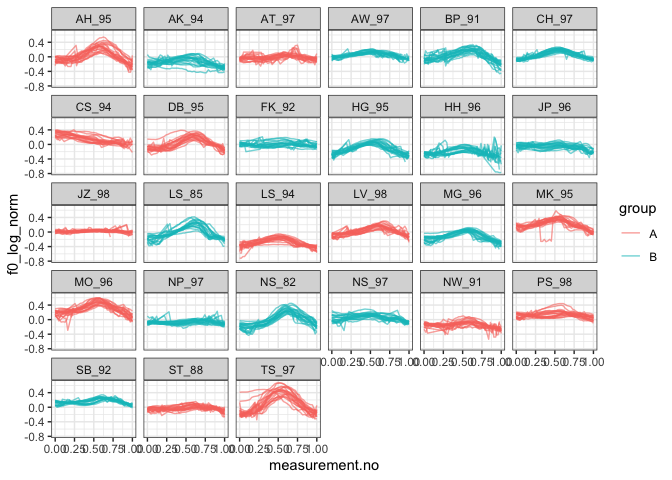

Introduction
------------

This document is a supplement to “Evaluating generalised additive mixed
modelling strategies for dynamic speech analysis,” relating specifically
to the contents of the “real pitch” columns of Table 2 in Section 3.2.2.
It presents code that illustrates (i) how the resampled data were
generated and (ii) the models whose performance is summarised in the
“real pitch” columns of Table 2.

Preliminaries
-------------

The code below loads the relevant libraries.

``` r
library(ggplot2)
```

    ## Warning: package 'ggplot2' was built under R version 3.5.2

``` r
library(mgcv)
```

    ## Warning: package 'mgcv' was built under R version 3.5.2

``` r
library(itsadug)
library(stringr)
```

    ## Warning: package 'stringr' was built under R version 3.5.2

``` r
library(dplyr)
```

    ## Warning: package 'dplyr' was built under R version 3.5.2

Data generation
---------------

The code in this section can be only be used to process the data for
type I simulations. Note that the paths in this file will only work if
the whole GitHub repository is downloaded and this markdown file is kept
in its folder.

The data for this set of simulations consist of real pitch trajectories
representing contrastive focus in Standard German. All contours (max.
20) are used from each of the 27 speakers in the data set. Each speaker
is randomly assigned to one of two groups (A and B). The difference
between males and females has been residualised out of the f0
measurements, which are also logged (but not normalised otherwise).

``` r
dat <- readRDS("../data/final_data/pitch_contr_27_speakers.rds")

# we now add randomly assigned category labels

ids <- unique(dat$speaker)
group.Bs <- sample(ids, round(length(ids)/2))
dat$group <- "A"
dat$group[dat$speaker %in% group.Bs] <- "B"

# setting up different types of grouping factors
dat$group.factor <- as.factor(dat$group)
dat$group.ordered <- as.ordered(dat$group)
contrasts(dat$group.ordered) <- "contr.treatment"
dat$group.bin <- as.numeric(dat$group.factor) - 1

# ids ought to be factors  
dat$traj <- as.factor(dat$traj)
dat$speaker <- as.factor(dat$speaker)

# dat$start has already been added at data prep stage (for AR.start, i.e. for autoregressive error models)
```

Here is what the data set looks like.

``` r
ggplot(dat, aes(x=measurement.no, y=f0_log_norm, group=traj, col=group)) +
  geom_line(alpha=0.6) +
  facet_wrap(~speaker) +
  theme_bw()
```



Models
------

All the models (and sets of models) from Table 2 are shown below in the
same order as in the table. The numbers in the section headers
correspond to the row numbers. Note that all models contain AR1
components to deal with dependencies within trajectories. The rho value
used for these AR1 components is taken from a single model fitted
without any random structures. This model is estimated below.

``` r
rho_mod <- 
  bam(f0_log_norm ~ group.ordered + 
        s(measurement.no, bs = "tp", k = 20) + 
        s(measurement.no, by = group.ordered, bs = "tp", k = 20), 
      data = dat, method = "fREML", discrete = T, nthreads = 1)

rho <- start_value_rho(rho_mod)
```

### NO SMOOTHS: 1. No components

``` r
nocomp <- 
  bam(f0_log_norm ~ group.ordered + 
        s(measurement.no, bs = "tp", k = 20) + 
        s(measurement.no, by = group.ordered, bs = "tp", k = 20), 
      data = dat, 
      AR.start = dat$start, rho = rho, 
      method = "fREML", discrete = T, nthreads = 1)
summary(nocomp)
```

    ## 
    ## Family: gaussian 
    ## Link function: identity 
    ## 
    ## Formula:
    ## f0_log_norm ~ group.ordered + s(measurement.no, bs = "tp", k = 20) + 
    ##     s(measurement.no, by = group.ordered, bs = "tp", k = 20)
    ## 
    ## Parametric coefficients:
    ##                 Estimate Std. Error t value Pr(>|t|)    
    ## (Intercept)     0.038139   0.006508   5.860  4.7e-09 ***
    ## group.orderedB -0.064944   0.008775  -7.401  1.4e-13 ***
    ## ---
    ## Signif. codes:  0 '***' 0.001 '**' 0.01 '*' 0.05 '.' 0.1 ' ' 1
    ## 
    ## Approximate significance of smooth terms:
    ##                                     edf Ref.df      F p-value    
    ## s(measurement.no)                17.267 18.710 146.01  <2e-16 ***
    ## s(measurement.no):group.orderedB  1.001  1.002   2.69   0.101    
    ## ---
    ## Signif. codes:  0 '***' 0.001 '**' 0.01 '*' 0.05 '.' 0.1 ' ' 1
    ## 
    ## R-sq.(adj) =  0.213   Deviance explained = 21.4%
    ## fREML = -37209  Scale est. = 0.018563  n = 20820

### NO SMOOTHS: 2. Rand intcpt (= Random Intercept)

``` r
rand_intcpt <- 
  bam(f0_log_norm ~ group.ordered + 
        s(measurement.no, bs = "tp", k = 20) + 
        s(measurement.no, by = group.ordered, bs = "tp", k = 20) +
        s(speaker, bs = "re"), 
      data = dat, 
      AR.start = dat$start, rho = rho, 
      method = "fREML", discrete = T, nthreads = 1)
summary(rand_intcpt)
```

    ## 
    ## Family: gaussian 
    ## Link function: identity 
    ## 
    ## Formula:
    ## f0_log_norm ~ group.ordered + s(measurement.no, bs = "tp", k = 20) + 
    ##     s(measurement.no, by = group.ordered, bs = "tp", k = 20) + 
    ##     s(speaker, bs = "re")
    ## 
    ## Parametric coefficients:
    ##                Estimate Std. Error t value Pr(>|t|)
    ## (Intercept)     0.04107    0.03533   1.162    0.245
    ## group.orderedB -0.06637    0.04902  -1.354    0.176
    ## 
    ## Approximate significance of smooth terms:
    ##                                     edf Ref.df       F p-value    
    ## s(measurement.no)                17.319 18.727 151.399  <2e-16 ***
    ## s(measurement.no):group.orderedB  1.001  1.002   2.586   0.108    
    ## s(speaker)                       24.226 26.000  30.082  <2e-16 ***
    ## ---
    ## Signif. codes:  0 '***' 0.001 '**' 0.01 '*' 0.05 '.' 0.1 ' ' 1
    ## 
    ## R-sq.(adj) =  0.663   Deviance explained = 66.4%
    ## fREML = -37549  Scale est. = 0.017891  n = 20820

### NO SMOOTHS: 3. Rand intcpt + slope (= random intercept + slope)

``` r
rand_intcpt_slope <- 
  bam(f0_log_norm ~ group.ordered + 
        s(measurement.no, bs = "tp", k = 20) + 
        s(measurement.no, by = group.ordered, bs = "tp", k = 20) +
        s(speaker, bs = "re") +
        s(speaker, measurement.no, bs = "re"), 
      data = dat, 
      AR.start = dat$start, rho = rho, 
      method = "fREML", discrete = T, nthreads = 1)
summary(rand_intcpt_slope)
```

    ## 
    ## Family: gaussian 
    ## Link function: identity 
    ## 
    ## Formula:
    ## f0_log_norm ~ group.ordered + s(measurement.no, bs = "tp", k = 20) + 
    ##     s(measurement.no, by = group.ordered, bs = "tp", k = 20) + 
    ##     s(speaker, bs = "re") + s(speaker, measurement.no, bs = "re")
    ## 
    ## Parametric coefficients:
    ##                Estimate Std. Error t value Pr(>|t|)
    ## (Intercept)     0.04128    0.03994   1.034    0.301
    ## group.orderedB -0.06660    0.05542  -1.202    0.229
    ## 
    ## Approximate significance of smooth terms:
    ##                                     edf Ref.df       F p-value    
    ## s(measurement.no)                17.314 18.725 153.203  <2e-16 ***
    ## s(measurement.no):group.orderedB  1.002  1.003   0.299  0.5847    
    ## s(speaker)                       23.971 25.000 172.254  0.1448    
    ## s(measurement.no,speaker)        21.449 27.000 125.045  0.0131 *  
    ## ---
    ## Signif. codes:  0 '***' 0.001 '**' 0.01 '*' 0.05 '.' 0.1 ' ' 1
    ## 
    ## R-sq.(adj) =  0.674   Deviance explained = 67.5%
    ## fREML = -37602  Scale est. = 0.017755  n = 20820

### TP SMOOTHS: 4. Rand smooth, tp, 3 bs

``` r
rand_smooth_tp_3 <- 
  bam(f0_log_norm ~ group.ordered + 
        s(measurement.no, bs = "tp", k = 20) + 
        s(measurement.no, by = group.ordered, bs = "tp", k = 20) + 
        s(measurement.no, speaker, bs = "fs", m = 1, xt = "tp", k = 3), 
      data = dat, 
      AR.start = dat$start, rho = rho, 
      method = "fREML", discrete = T, nthreads = 1)
```

    ## Warning in gam.side(sm, X, tol = .Machine$double.eps^0.5): model has
    ## repeated 1-d smooths of same variable.

``` r
summary(rand_smooth_tp_3)
```

    ## 
    ## Family: gaussian 
    ## Link function: identity 
    ## 
    ## Formula:
    ## f0_log_norm ~ group.ordered + s(measurement.no, bs = "tp", k = 20) + 
    ##     s(measurement.no, by = group.ordered, bs = "tp", k = 20) + 
    ##     s(measurement.no, speaker, bs = "fs", m = 1, xt = "tp", k = 3)
    ## 
    ## Parametric coefficients:
    ##                Estimate Std. Error t value Pr(>|t|)
    ## (Intercept)     0.03012    0.03996   0.754    0.451
    ## group.orderedB -0.06538    0.05353  -1.221    0.222
    ## 
    ## Approximate significance of smooth terms:
    ##                                     edf Ref.df      F p-value    
    ## s(measurement.no)                17.248 18.646 33.295  <2e-16 ***
    ## s(measurement.no):group.orderedB  1.003  1.007  2.904  0.0884 .  
    ## s(measurement.no,speaker)        75.022 80.000 32.569  <2e-16 ***
    ## ---
    ## Signif. codes:  0 '***' 0.001 '**' 0.01 '*' 0.05 '.' 0.1 ' ' 1
    ## 
    ## R-sq.(adj) =  0.783   Deviance explained = 78.2%
    ## fREML = -38294  Scale est. = 0.016498  n = 20820

### TP SMOOTHS: 5. Rand smooth, tp, 5 bs

``` r
rand_smooth_tp_5 <- 
  bam(f0_log_norm ~ group.ordered + 
        s(measurement.no, bs = "tp", k = 20) + 
        s(measurement.no, by = group.ordered, bs = "tp", k = 20) + 
        s(measurement.no, speaker, bs = "fs", m = 1, xt = "tp", k = 5), 
      data = dat, 
      AR.start = dat$start, rho = rho, 
      method = "fREML", discrete = T, nthreads = 1)
```

    ## Warning in gam.side(sm, X, tol = .Machine$double.eps^0.5): model has
    ## repeated 1-d smooths of same variable.

``` r
summary(rand_smooth_tp_5)
```

    ## 
    ## Family: gaussian 
    ## Link function: identity 
    ## 
    ## Formula:
    ## f0_log_norm ~ group.ordered + s(measurement.no, bs = "tp", k = 20) + 
    ##     s(measurement.no, by = group.ordered, bs = "tp", k = 20) + 
    ##     s(measurement.no, speaker, bs = "fs", m = 1, xt = "tp", k = 5)
    ## 
    ## Parametric coefficients:
    ##                Estimate Std. Error t value Pr(>|t|)
    ## (Intercept)     0.03040    0.03948   0.770    0.441
    ## group.orderedB -0.06592    0.05332  -1.236    0.216
    ## 
    ## Approximate significance of smooth terms:
    ##                                      edf  Ref.df      F p-value    
    ## s(measurement.no)                 17.109  18.467 29.264  <2e-16 ***
    ## s(measurement.no):group.orderedB   1.002   1.003  0.081   0.777    
    ## s(measurement.no,speaker)        123.383 134.000 22.363  <2e-16 ***
    ## ---
    ## Signif. codes:  0 '***' 0.001 '**' 0.01 '*' 0.05 '.' 0.1 ' ' 1
    ## 
    ## R-sq.(adj) =  0.799   Deviance explained =   80%
    ## fREML = -38402  Scale est. = 0.016226  n = 20820

### TP SMOOTHS: 6. Rand smooth, tp, 10 bs

``` r
rand_smooth_tp_10 <- 
  bam(f0_log_norm ~ group.ordered + 
        s(measurement.no, bs = "tp", k = 20) + 
        s(measurement.no, by = group.ordered, bs = "tp", k = 20) + 
        s(measurement.no, speaker, bs = "fs", m = 1, xt = "tp", k = 10), 
      data = dat, 
      AR.start = dat$start, rho = rho, 
      method = "fREML", discrete = T, nthreads = 1)
```

    ## Warning in gam.side(sm, X, tol = .Machine$double.eps^0.5): model has
    ## repeated 1-d smooths of same variable.

``` r
summary(rand_smooth_tp_10)
```

    ## 
    ## Family: gaussian 
    ## Link function: identity 
    ## 
    ## Formula:
    ## f0_log_norm ~ group.ordered + s(measurement.no, bs = "tp", k = 20) + 
    ##     s(measurement.no, by = group.ordered, bs = "tp", k = 20) + 
    ##     s(measurement.no, speaker, bs = "fs", m = 1, xt = "tp", k = 10)
    ## 
    ## Parametric coefficients:
    ##                Estimate Std. Error t value Pr(>|t|)
    ## (Intercept)     0.03096    0.03877   0.799    0.425
    ## group.orderedB -0.06575    0.05289  -1.243    0.214
    ## 
    ## Approximate significance of smooth terms:
    ##                                      edf Ref.df      F p-value    
    ## s(measurement.no)                 15.710  17.19 18.183  <2e-16 ***
    ## s(measurement.no):group.orderedB   1.006   1.01  0.679    0.41    
    ## s(measurement.no,speaker)        236.508 269.00 12.829  <2e-16 ***
    ## ---
    ## Signif. codes:  0 '***' 0.001 '**' 0.01 '*' 0.05 '.' 0.1 ' ' 1
    ## 
    ## R-sq.(adj) =  0.805   Deviance explained = 80.6%
    ## fREML = -38482  Scale est. = 0.015925  n = 20820

### TP SMOOTHS: 7. Rand smooth, tp, 15 bs

``` r
rand_smooth_tp_15 <- 
  bam(f0_log_norm ~ group.ordered + 
        s(measurement.no, bs = "tp", k = 20) + 
        s(measurement.no, by = group.ordered, bs = "tp", k = 20) + 
        s(measurement.no, speaker, bs = "fs", m = 1, xt = "tp", k = 15), 
      data = dat, 
      AR.start = dat$start, rho = rho, 
      method = "fREML", discrete = T, nthreads = 1)
```

    ## Warning in gam.side(sm, X, tol = .Machine$double.eps^0.5): model has
    ## repeated 1-d smooths of same variable.

``` r
summary(rand_smooth_tp_15)
```

    ## 
    ## Family: gaussian 
    ## Link function: identity 
    ## 
    ## Formula:
    ## f0_log_norm ~ group.ordered + s(measurement.no, bs = "tp", k = 20) + 
    ##     s(measurement.no, by = group.ordered, bs = "tp", k = 20) + 
    ##     s(measurement.no, speaker, bs = "fs", m = 1, xt = "tp", k = 15)
    ## 
    ## Parametric coefficients:
    ##                Estimate Std. Error t value Pr(>|t|)
    ## (Intercept)     0.03336    0.03864   0.863    0.388
    ## group.orderedB -0.06570    0.05297  -1.240    0.215
    ## 
    ## Approximate significance of smooth terms:
    ##                                      edf  Ref.df      F p-value    
    ## s(measurement.no)                 15.020  16.130 24.788  <2e-16 ***
    ## s(measurement.no):group.orderedB   1.011   1.016  0.179   0.676    
    ## s(measurement.no,speaker)        336.548 404.000  8.720  <2e-16 ***
    ## ---
    ## Signif. codes:  0 '***' 0.001 '**' 0.01 '*' 0.05 '.' 0.1 ' ' 1
    ## 
    ## R-sq.(adj) =  0.805   Deviance explained = 80.8%
    ## fREML = -38436  Scale est. = 0.015876  n = 20820

### TP SMOOTHS: 8. Rand smooth, gam.check

The model fitted in this section uses random smooths where the number of
basis functions (k) is determined using the gam.check() function: after
fitting an initial model with a relatively low value of k, gam.check()
is used to see whether more wiggliness is necessary (essentially,
whether the smooths use up all the degrees of freedom afforded to them).
If gam.check() suggests that more wiggliness is necessary, this
procedure is repeated again using a model with a higher value of k.

Below is a convenience function for extracting the relevant p-value from
the output of gam.check.

``` r
gam.check.p.value <- function (mod, which.line) {
  str.out <- capture.output(gam.check(mod))
  relevant.line <- str.out[grep(which.line, str.out)]
  p.value <- as.numeric(str_match(relevant.line, "([0-9.]*)[ *.]*$")[[2]])
  return(p.value)
}
```

Fitting the models.

``` r
# what k's should be tried?
k_min = 4
k_max = 16
k_step = 3
```

``` r
for (k in seq(k_min,k_max,k_step)) {
  cat("fitting model with  k =", k, "\n")
  
  # fitting model
  
  rand_smooth_tp_gam.check <- 
    bam(f0_log_norm ~ group.ordered + 
          s(measurement.no, bs = "tp", k = 20) + 
          s(measurement.no, by = group.ordered, bs = "tp", k = 20) + 
          s(measurement.no, speaker, bs = "fs", m = 1, xt = "tp", k = k), 
        data = dat, 
        AR.start = dat$start, rho = rho, 
        method = "fREML", discrete = T, nthreads = 1)
  
  # check whether more complexity is needed using gam.check
  
  if (gam.check.p.value(rand_smooth_tp_gam.check, "speaker") >= 0.05 | k == k_max) {
    print(summary(rand_smooth_tp_gam.check))
    break
  }
}
```

    ## fitting model with  k = 4

    ## Warning in gam.side(sm, X, tol = .Machine$double.eps^0.5): model has
    ## repeated 1-d smooths of same variable.

    ## 
    ## Family: gaussian 
    ## Link function: identity 
    ## 
    ## Formula:
    ## f0_log_norm ~ group.ordered + s(measurement.no, bs = "tp", k = 20) + 
    ##     s(measurement.no, by = group.ordered, bs = "tp", k = 20) + 
    ##     s(measurement.no, speaker, bs = "fs", m = 1, xt = "tp", k = k)
    ## 
    ## Parametric coefficients:
    ##                Estimate Std. Error t value Pr(>|t|)
    ## (Intercept)     0.03162    0.03971   0.796    0.426
    ## group.orderedB -0.06479    0.05352  -1.211    0.226
    ## 
    ## Approximate significance of smooth terms:
    ##                                     edf  Ref.df      F p-value    
    ## s(measurement.no)                17.179  18.558 29.334  <2e-16 ***
    ## s(measurement.no):group.orderedB  1.001   1.003  0.075   0.785    
    ## s(measurement.no,speaker)        99.633 107.000 27.538  <2e-16 ***
    ## ---
    ## Signif. codes:  0 '***' 0.001 '**' 0.01 '*' 0.05 '.' 0.1 ' ' 1
    ## 
    ## R-sq.(adj) =  0.798   Deviance explained = 79.8%
    ## fREML = -38407  Scale est. = 0.016261  n = 20820

### CR SMOOTHS: 9. Rand smooth, tp, 3 bs

``` r
rand_smooth_cr_3 <- 
  bam(f0_log_norm ~ group.ordered + 
        s(measurement.no, bs = "tp", k = 20) + 
        s(measurement.no, by = group.ordered, bs = "tp", k = 20) + 
        s(measurement.no, speaker, bs = "fs", m = 1, xt = "cr", k = 3), 
      data = dat, 
      AR.start = dat$start, rho = rho, 
      method = "fREML", discrete = T, nthreads = 1)
```

    ## Warning in gam.side(sm, X, tol = .Machine$double.eps^0.5): model has
    ## repeated 1-d smooths of same variable.

``` r
summary(rand_smooth_cr_3)
```

    ## 
    ## Family: gaussian 
    ## Link function: identity 
    ## 
    ## Formula:
    ## f0_log_norm ~ group.ordered + s(measurement.no, bs = "tp", k = 20) + 
    ##     s(measurement.no, by = group.ordered, bs = "tp", k = 20) + 
    ##     s(measurement.no, speaker, bs = "fs", m = 1, xt = "cr", k = 3)
    ## 
    ## Parametric coefficients:
    ##                Estimate Std. Error t value Pr(>|t|)
    ## (Intercept)     0.04257    0.03604   1.181    0.237
    ## group.orderedB -0.06807    0.04888  -1.393    0.164
    ## 
    ## Approximate significance of smooth terms:
    ##                                     edf Ref.df      F  p-value    
    ## s(measurement.no)                17.375 18.711 33.827  < 2e-16 ***
    ## s(measurement.no):group.orderedB  2.002  2.752  0.252    0.845    
    ## s(measurement.no,speaker)        69.360 78.000 32.357 5.41e-13 ***
    ## ---
    ## Signif. codes:  0 '***' 0.001 '**' 0.01 '*' 0.05 '.' 0.1 ' ' 1
    ## 
    ## R-sq.(adj) =  0.764   Deviance explained = 76.4%
    ## fREML = -38152  Scale est. = 0.016768  n = 20820

### CR SMOOTHS: 10. Rand smooth, tp, 5 bs

``` r
rand_smooth_cr_5 <- 
  bam(f0_log_norm ~ group.ordered + 
        s(measurement.no, bs = "tp", k = 20) + 
        s(measurement.no, by = group.ordered, bs = "tp", k = 20) + 
        s(measurement.no, speaker, bs = "fs", m = 1, xt = "cr", k = 5), 
      data = dat, 
      AR.start = dat$start, rho = rho, 
      method = "fREML", discrete = T, nthreads = 1)
```

    ## Warning in gam.side(sm, X, tol = .Machine$double.eps^0.5): model has
    ## repeated 1-d smooths of same variable.

``` r
summary(rand_smooth_cr_5)
```

    ## 
    ## Family: gaussian 
    ## Link function: identity 
    ## 
    ## Formula:
    ## f0_log_norm ~ group.ordered + s(measurement.no, bs = "tp", k = 20) + 
    ##     s(measurement.no, by = group.ordered, bs = "tp", k = 20) + 
    ##     s(measurement.no, speaker, bs = "fs", m = 1, xt = "cr", k = 5)
    ## 
    ## Parametric coefficients:
    ##                Estimate Std. Error t value Pr(>|t|)
    ## (Intercept)     0.04321    0.03511   1.231    0.218
    ## group.orderedB -0.06945    0.04812  -1.443    0.149
    ## 
    ## Approximate significance of smooth terms:
    ##                                      edf  Ref.df      F p-value    
    ## s(measurement.no)                 17.323  18.646 22.126  <2e-16 ***
    ## s(measurement.no):group.orderedB   1.001   1.001  0.182    0.67    
    ## s(measurement.no,speaker)        117.246 132.000 22.731  <2e-16 ***
    ## ---
    ## Signif. codes:  0 '***' 0.001 '**' 0.01 '*' 0.05 '.' 0.1 ' ' 1
    ## 
    ## R-sq.(adj) =  0.799   Deviance explained = 79.9%
    ## fREML = -38366  Scale est. = 0.016313  n = 20820

### CR SMOOTHS: 11. Rand smooth, tp, 10 bs

``` r
rand_smooth_cr_10 <- 
  bam(f0_log_norm ~ group.ordered + 
        s(measurement.no, bs = "tp", k = 20) + 
        s(measurement.no, by = group.ordered, bs = "tp", k = 20) + 
        s(measurement.no, speaker, bs = "fs", m = 1, xt = "cr", k = 10), 
      data = dat, 
      AR.start = dat$start, rho = rho, 
      method = "fREML", discrete = T, nthreads = 1)
```

    ## Warning in gam.side(sm, X, tol = .Machine$double.eps^0.5): model has
    ## repeated 1-d smooths of same variable.

``` r
summary(rand_smooth_cr_10)
```

    ## 
    ## Family: gaussian 
    ## Link function: identity 
    ## 
    ## Formula:
    ## f0_log_norm ~ group.ordered + s(measurement.no, bs = "tp", k = 20) + 
    ##     s(measurement.no, by = group.ordered, bs = "tp", k = 20) + 
    ##     s(measurement.no, speaker, bs = "fs", m = 1, xt = "cr", k = 10)
    ## 
    ## Parametric coefficients:
    ##                Estimate Std. Error t value Pr(>|t|)
    ## (Intercept)     0.04457    0.03471   1.284    0.199
    ## group.orderedB -0.06998    0.04799  -1.458    0.145
    ## 
    ## Approximate significance of smooth terms:
    ##                                      edf  Ref.df      F p-value    
    ## s(measurement.no)                 16.961  18.289 10.459  <2e-16 ***
    ## s(measurement.no):group.orderedB   1.001   1.001  0.149     0.7    
    ## s(measurement.no,speaker)        209.061 267.000 13.592  <2e-16 ***
    ## ---
    ## Signif. codes:  0 '***' 0.001 '**' 0.01 '*' 0.05 '.' 0.1 ' ' 1
    ## 
    ## R-sq.(adj) =  0.803   Deviance explained = 80.4%
    ## fREML = -38511  Scale est. = 0.015936  n = 20820

### CR SMOOTHS: 12. Rand smooth, tp, 15 bs

``` r
rand_smooth_cr_15 <- 
  bam(f0_log_norm ~ group.ordered + 
        s(measurement.no, bs = "tp", k = 20) + 
        s(measurement.no, by = group.ordered, bs = "tp", k = 20) + 
        s(measurement.no, speaker, bs = "fs", m = 1, xt = "cr", k = 10), 
      data = dat, 
      AR.start = dat$start, rho = rho, 
      method = "fREML", discrete = T, nthreads = 1)
```

    ## Warning in gam.side(sm, X, tol = .Machine$double.eps^0.5): model has
    ## repeated 1-d smooths of same variable.

``` r
summary(rand_smooth_cr_15)
```

    ## 
    ## Family: gaussian 
    ## Link function: identity 
    ## 
    ## Formula:
    ## f0_log_norm ~ group.ordered + s(measurement.no, bs = "tp", k = 20) + 
    ##     s(measurement.no, by = group.ordered, bs = "tp", k = 20) + 
    ##     s(measurement.no, speaker, bs = "fs", m = 1, xt = "cr", k = 10)
    ## 
    ## Parametric coefficients:
    ##                Estimate Std. Error t value Pr(>|t|)
    ## (Intercept)     0.04457    0.03471   1.284    0.199
    ## group.orderedB -0.06998    0.04799  -1.458    0.145
    ## 
    ## Approximate significance of smooth terms:
    ##                                      edf  Ref.df      F p-value    
    ## s(measurement.no)                 16.961  18.289 10.459  <2e-16 ***
    ## s(measurement.no):group.orderedB   1.001   1.001  0.149     0.7    
    ## s(measurement.no,speaker)        209.061 267.000 13.592  <2e-16 ***
    ## ---
    ## Signif. codes:  0 '***' 0.001 '**' 0.01 '*' 0.05 '.' 0.1 ' ' 1
    ## 
    ## R-sq.(adj) =  0.803   Deviance explained = 80.4%
    ## fREML = -38511  Scale est. = 0.015936  n = 20820

### CR SMOOTHS: 13. Rand smooth, gam.check

The model fitted in this section uses random smooths where the number of
basis functions (k) is determined using the gam.check() function: after
fitting an initial model with a relatively low value of k, gam.check()
is used to see whether more wiggliness is necessary (essentially,
whether the smooths use up all the degrees of freedom afforded to them).
If gam.check() suggests that more wiggliness is necessary, this
procedure is repeated again using a model with a higher value of k.

Below is a convenience function for extracting the relevant p-value from
the output of gam.check.

``` r
gam.check.p.value <- function (mod, which.line) {
  str.out <- capture.output(gam.check(mod))
  relevant.line <- str.out[grep(which.line, str.out)]
  p.value <- as.numeric(str_match(relevant.line, "([0-9.]*)[ *.]*$")[[2]])
  return(p.value)
}
```

Fitting the models.

``` r
# what k's should be tried?
k_min = 4
k_max = 16
k_step = 3
```

``` r
for (k in seq(k_min,k_max,k_step)) {
  cat("fitting model with  k =", k, "\n")
  
  # fitting model
  
  rand_smooth_cr_gam.check <- 
    bam(f0_log_norm ~ group.ordered + 
          s(measurement.no, bs = "tp", k = 20) + 
          s(measurement.no, by = group.ordered, bs = "tp", k = 20) + 
          s(measurement.no, speaker, bs = "fs", m = 1, xt = "cr", k = k), 
        data = dat, 
        AR.start = dat$start, rho = rho, 
        method = "fREML", discrete = T, nthreads = 1)
  
  # check whether more complexity is needed using gam.check
  
  if (gam.check.p.value(rand_smooth_cr_gam.check, "speaker") >= 0.05 | k == k_max) {
    print(summary(rand_smooth_cr_gam.check))
    break
  }
}
```

    ## fitting model with  k = 4

    ## Warning in gam.side(sm, X, tol = .Machine$double.eps^0.5): model has
    ## repeated 1-d smooths of same variable.

    ## 
    ## Family: gaussian 
    ## Link function: identity 
    ## 
    ## Formula:
    ## f0_log_norm ~ group.ordered + s(measurement.no, bs = "tp", k = 20) + 
    ##     s(measurement.no, by = group.ordered, bs = "tp", k = 20) + 
    ##     s(measurement.no, speaker, bs = "fs", m = 1, xt = "cr", k = k)
    ## 
    ## Parametric coefficients:
    ##                Estimate Std. Error t value Pr(>|t|)
    ## (Intercept)     0.04282    0.03536   1.211    0.226
    ## group.orderedB -0.06908    0.04840  -1.427    0.154
    ## 
    ## Approximate significance of smooth terms:
    ##                                     edf Ref.df      F p-value    
    ## s(measurement.no)                17.339  18.67 26.928  <2e-16 ***
    ## s(measurement.no):group.orderedB  2.075   2.85  0.051   0.983    
    ## s(measurement.no,speaker)        93.223 105.00 24.211  <2e-16 ***
    ## ---
    ## Signif. codes:  0 '***' 0.001 '**' 0.01 '*' 0.05 '.' 0.1 ' ' 1
    ## 
    ## R-sq.(adj) =  0.791   Deviance explained = 79.2%
    ## fREML = -38260  Scale est. = 0.01654   n = 20820
