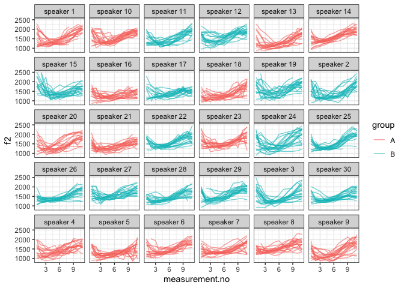

Introduction
------------

This document is a supplement to “Evaluating generalised additive mixed
modelling strategies for dynamic speech analysis,” relating specifically
to the contents of the “real formants” columns of Table 2 in Section
3.2.2. It presents code that illustrates (i) how the resampled data were
generated and (ii) the models whose performance is summarised in the
“real formants” columns of Table 2.

Preliminaries
-------------

The code below loads the relevant libraries.

``` r
library(ggplot2)
```

    ## Warning: package 'ggplot2' was built under R version 3.5.2

``` r
library(mgcv)
```

    ## Warning: package 'mgcv' was built under R version 3.5.2

``` r
library(itsadug)
library(stringr)
```

    ## Warning: package 'stringr' was built under R version 3.5.2

``` r
library(dplyr)
```

    ## Warning: package 'dplyr' was built under R version 3.5.2

Data generation
---------------

The code in this section can be only be used to process the data for
type I simulations. Note that the paths in this file will only work if
the whole GitHub repository is downloaded and this markdown file is kept
in its folder.

The data for this set of simulations consist of real f2 trajectories
representing the vowel /aI/ in New Zealand English. A sample of 20
contours is taken from each of the 30 speakers in the data set. Each
speaker is then randomly assigned to one of two groups (A and B).

``` r
dat_full <- readRDS("../data/final_data/price_vd_30_speakers.rds")

# limit to speakers with >= 30 trajectories

dat_full <- subset(dat_full, n >= 30)

# we sample 20 trajectories from each speaker

dat <- dat_full %>%
  group_by(speaker) %>%
  filter(traj %in% sample(unique(traj), 20, replace=F)) %>%
  ungroup()
  
# we now add randomly assigned category labels

ids <- unique(dat$speaker)
group.Bs <- sample(ids, round(length(ids)/2))
dat$group <- "A"
dat$group[dat$speaker %in% group.Bs] <- "B"

# setting up different types of grouping factors
dat$group.factor <- as.factor(dat$group)
dat$group.ordered <- as.ordered(dat$group)
contrasts(dat$group.ordered) <- "contr.treatment"
dat$group.bin <- as.numeric(dat$group.factor) - 1

# ids ought to be factors  
dat$traj <- as.factor(dat$traj)
dat$speaker <- as.factor(dat$speaker)

# dat$start has already been added at data prep stage (for AR.start, i.e. for autoregressive error models)
```

Here is what the data set looks like.

``` r
ggplot(dat, aes(x=measurement.no, y=f2, group=traj, col=group)) +
  geom_line(alpha=0.6) +
  facet_wrap(~speaker) +
  theme_bw()
```



Models
------

All the models (and sets of models) from Table 2 are shown below in the
same order as in the table. The numbers in the section headers
correspond to the row numbers. Note that all models contain AR1
components to deal with dependencies within trajectories. The rho value
used for these AR1 components is taken from a single model fitted
without any random structures. This model is estimated below.

``` r
rho_mod <- 
  bam(f2 ~ group.ordered + 
        s(measurement.no, bs = "tp", k = 10) + 
        s(measurement.no, by = group.ordered, bs = "tp", k = 10), 
      data = dat, method = "fREML", discrete = T, nthreads = 1)

rho <- start_value_rho(rho_mod)
```

### NO SMOOTHS: 1. No components

``` r
nocomp <- 
  bam(f2 ~ group.ordered + 
        s(measurement.no, bs = "tp", k = 10) + 
        s(measurement.no, by = group.ordered, bs = "tp", k = 10), 
      data = dat, 
      AR.start = dat$start, rho = rho, 
      method = "fREML", discrete = T, nthreads = 1)
summary(nocomp)
```

    ## 
    ## Family: gaussian 
    ## Link function: identity 
    ## 
    ## Formula:
    ## f2 ~ group.ordered + s(measurement.no, bs = "tp", k = 10) + s(measurement.no, 
    ##     by = group.ordered, bs = "tp", k = 10)
    ## 
    ## Parametric coefficients:
    ##                Estimate Std. Error t value Pr(>|t|)    
    ## (Intercept)    1471.925      6.244 235.748   <2e-16 ***
    ## group.orderedB   15.470      8.826   1.753   0.0797 .  
    ## ---
    ## Signif. codes:  0 '***' 0.001 '**' 0.01 '*' 0.05 '.' 0.1 ' ' 1
    ## 
    ## Approximate significance of smooth terms:
    ##                                    edf Ref.df       F p-value    
    ## s(measurement.no)                8.521   8.93 169.460  <2e-16 ***
    ## s(measurement.no):group.orderedB 2.801   3.64   2.598  0.0401 *  
    ## ---
    ## Signif. codes:  0 '***' 0.001 '**' 0.01 '*' 0.05 '.' 0.1 ' ' 1
    ## 
    ## R-sq.(adj) =  0.374   Deviance explained = 37.5%
    ## fREML =  39802  Scale est. = 36041     n = 6172

### NO SMOOTHS: 2. Rand intcpt (= Random Intercept)

``` r
rand_intcpt <- 
  bam(f2 ~ group.ordered + 
        s(measurement.no, bs = "tp", k = 10) + 
        s(measurement.no, by = group.ordered, bs = "tp", k = 10) +
        s(speaker, bs = "re"), 
      data = dat, 
      AR.start = dat$start, rho = rho, 
      method = "fREML", discrete = T, nthreads = 1)
summary(rand_intcpt)
```

    ## 
    ## Family: gaussian 
    ## Link function: identity 
    ## 
    ## Formula:
    ## f2 ~ group.ordered + s(measurement.no, bs = "tp", k = 10) + s(measurement.no, 
    ##     by = group.ordered, bs = "tp", k = 10) + s(speaker, bs = "re")
    ## 
    ## Parametric coefficients:
    ##                Estimate Std. Error t value Pr(>|t|)    
    ## (Intercept)     1470.73      25.44  57.814   <2e-16 ***
    ## group.orderedB    13.03      35.97   0.362    0.717    
    ## ---
    ## Signif. codes:  0 '***' 0.001 '**' 0.01 '*' 0.05 '.' 0.1 ' ' 1
    ## 
    ## Approximate significance of smooth terms:
    ##                                     edf Ref.df       F p-value    
    ## s(measurement.no)                 8.555  8.937 181.149  <2e-16 ***
    ## s(measurement.no):group.orderedB  2.877  3.740   2.804   0.028 *  
    ## s(speaker)                       26.483 29.000  16.804  <2e-16 ***
    ## ---
    ## Signif. codes:  0 '***' 0.001 '**' 0.01 '*' 0.05 '.' 0.1 ' ' 1
    ## 
    ## R-sq.(adj) =  0.482   Deviance explained = 48.5%
    ## fREML =  39609  Scale est. = 33398     n = 6172

### NO SMOOTHS: 3. Rand intcpt + slope (= random intercept + slope)

``` r
rand_intcpt_slope <- 
  bam(f2 ~ group.ordered + 
        s(measurement.no, bs = "tp", k = 10) + 
        s(measurement.no, by = group.ordered, bs = "tp", k = 10) +
        s(speaker, bs = "re") +
        s(speaker, measurement.no, bs = "re"), 
      data = dat, 
      AR.start = dat$start, rho = rho, 
      method = "fREML", discrete = T, nthreads = 1)
summary(rand_intcpt_slope)
```

    ## 
    ## Family: gaussian 
    ## Link function: identity 
    ## 
    ## Formula:
    ## f2 ~ group.ordered + s(measurement.no, bs = "tp", k = 10) + s(measurement.no, 
    ##     by = group.ordered, bs = "tp", k = 10) + s(speaker, bs = "re") + 
    ##     s(speaker, measurement.no, bs = "re")
    ## 
    ## Parametric coefficients:
    ##                Estimate Std. Error t value Pr(>|t|)    
    ## (Intercept)     1470.88      38.71   38.00   <2e-16 ***
    ## group.orderedB    13.13      54.73    0.24     0.81    
    ## ---
    ## Signif. codes:  0 '***' 0.001 '**' 0.01 '*' 0.05 '.' 0.1 ' ' 1
    ## 
    ## Approximate significance of smooth terms:
    ##                                     edf Ref.df       F p-value    
    ## s(measurement.no)                 8.566  8.939 136.623 < 2e-16 ***
    ## s(measurement.no):group.orderedB  2.892  3.759   2.796 0.02801 *  
    ## s(speaker)                       24.938 30.000 380.637 0.00199 ** 
    ## s(measurement.no,speaker)        24.993 28.000 400.991 0.83970    
    ## ---
    ## Signif. codes:  0 '***' 0.001 '**' 0.01 '*' 0.05 '.' 0.1 ' ' 1
    ## 
    ## R-sq.(adj) =  0.509   Deviance explained = 51.4%
    ## fREML =  39528  Scale est. = 32157     n = 6172

### TP SMOOTHS: 4. Rand smooth, tp, 3 bs

``` r
rand_smooth_tp_3 <- 
  bam(f2 ~ group.ordered + 
        s(measurement.no, bs = "tp", k = 10) + 
        s(measurement.no, by = group.ordered, bs = "tp", k = 10) + 
        s(measurement.no, speaker, bs = "fs", m = 1, xt = "tp", k = 3), 
      data = dat, 
      AR.start = dat$start, rho = rho, 
      method = "fREML", discrete = T, nthreads = 1)
```

    ## Warning in gam.side(sm, X, tol = .Machine$double.eps^0.5): model has
    ## repeated 1-d smooths of same variable.

``` r
summary(rand_smooth_tp_3)
```

    ## 
    ## Family: gaussian 
    ## Link function: identity 
    ## 
    ## Formula:
    ## f2 ~ group.ordered + s(measurement.no, bs = "tp", k = 10) + s(measurement.no, 
    ##     by = group.ordered, bs = "tp", k = 10) + s(measurement.no, 
    ##     speaker, bs = "fs", m = 1, xt = "tp", k = 3)
    ## 
    ## Parametric coefficients:
    ##                Estimate Std. Error t value Pr(>|t|)    
    ## (Intercept)     1458.31      30.05  48.536   <2e-16 ***
    ## group.orderedB    38.47      40.88   0.941    0.347    
    ## ---
    ## Signif. codes:  0 '***' 0.001 '**' 0.01 '*' 0.05 '.' 0.1 ' ' 1
    ## 
    ## Approximate significance of smooth terms:
    ##                                     edf Ref.df       F p-value    
    ## s(measurement.no)                 8.593  8.954 100.817  <2e-16 ***
    ## s(measurement.no):group.orderedB  1.037  1.061   0.102   0.741    
    ## s(measurement.no,speaker)        75.502 88.000  30.025  <2e-16 ***
    ## ---
    ## Signif. codes:  0 '***' 0.001 '**' 0.01 '*' 0.05 '.' 0.1 ' ' 1
    ## 
    ## R-sq.(adj) =  0.525   Deviance explained = 53.1%
    ## fREML =  39487  Scale est. = 31477     n = 6172

### TP SMOOTHS: 5. Rand smooth, tp, 5 bs

``` r
rand_smooth_tp_5 <- 
  bam(f2 ~ group.ordered + 
        s(measurement.no, bs = "tp", k = 10) + 
        s(measurement.no, by = group.ordered, bs = "tp", k = 10) + 
        s(measurement.no, speaker, bs = "fs", m = 1, xt = "tp", k = 5), 
      data = dat, 
      AR.start = dat$start, rho = rho, 
      method = "fREML", discrete = T, nthreads = 1)
```

    ## Warning in gam.side(sm, X, tol = .Machine$double.eps^0.5): model has
    ## repeated 1-d smooths of same variable.

``` r
summary(rand_smooth_tp_5)
```

    ## 
    ## Family: gaussian 
    ## Link function: identity 
    ## 
    ## Formula:
    ## f2 ~ group.ordered + s(measurement.no, bs = "tp", k = 10) + s(measurement.no, 
    ##     by = group.ordered, bs = "tp", k = 10) + s(measurement.no, 
    ##     speaker, bs = "fs", m = 1, xt = "tp", k = 5)
    ## 
    ## Parametric coefficients:
    ##                Estimate Std. Error t value Pr(>|t|)    
    ## (Intercept)     1461.51      30.24  48.325   <2e-16 ***
    ## group.orderedB    32.26      41.74   0.773     0.44    
    ## ---
    ## Signif. codes:  0 '***' 0.001 '**' 0.01 '*' 0.05 '.' 0.1 ' ' 1
    ## 
    ## Approximate significance of smooth terms:
    ##                                      edf  Ref.df      F p-value    
    ## s(measurement.no)                  8.550   8.905 72.431  <2e-16 ***
    ## s(measurement.no):group.orderedB   1.495   1.689  0.221   0.693    
    ## s(measurement.no,speaker)        113.125 148.000 15.978  <2e-16 ***
    ## ---
    ## Signif. codes:  0 '***' 0.001 '**' 0.01 '*' 0.05 '.' 0.1 ' ' 1
    ## 
    ## R-sq.(adj) =  0.529   Deviance explained = 53.9%
    ## fREML =  39468  Scale est. = 30992     n = 6172

### TP SMOOTHS: 6. Rand smooth, tp, 10 bs

``` r
rand_smooth_tp_10 <- 
  bam(f2 ~ group.ordered + 
        s(measurement.no, bs = "tp", k = 10) + 
        s(measurement.no, by = group.ordered, bs = "tp", k = 10) + 
        s(measurement.no, speaker, bs = "fs", m = 1, xt = "tp", k = 10), 
      data = dat, 
      AR.start = dat$start, rho = rho, 
      method = "fREML", discrete = T, nthreads = 1)
```

    ## Warning in gam.side(sm, X, tol = .Machine$double.eps^0.5): model has
    ## repeated 1-d smooths of same variable.

``` r
summary(rand_smooth_tp_10)
```

    ## 
    ## Family: gaussian 
    ## Link function: identity 
    ## 
    ## Formula:
    ## f2 ~ group.ordered + s(measurement.no, bs = "tp", k = 10) + s(measurement.no, 
    ##     by = group.ordered, bs = "tp", k = 10) + s(measurement.no, 
    ##     speaker, bs = "fs", m = 1, xt = "tp", k = 10)
    ## 
    ## Parametric coefficients:
    ##                Estimate Std. Error t value Pr(>|t|)    
    ## (Intercept)     1467.17      29.38  49.946   <2e-16 ***
    ## group.orderedB    21.05      41.21   0.511     0.61    
    ## ---
    ## Signif. codes:  0 '***' 0.001 '**' 0.01 '*' 0.05 '.' 0.1 ' ' 1
    ## 
    ## Approximate significance of smooth terms:
    ##                                      edf  Ref.df      F p-value    
    ## s(measurement.no)                  8.273   8.582 73.681  <2e-16 ***
    ## s(measurement.no):group.orderedB   2.067   2.344  1.082   0.344    
    ## s(measurement.no,speaker)        169.306 296.000  9.832  <2e-16 ***
    ## ---
    ## Signif. codes:  0 '***' 0.001 '**' 0.01 '*' 0.05 '.' 0.1 ' ' 1
    ## 
    ## R-sq.(adj) =  0.525   Deviance explained = 53.9%
    ## fREML =  39492  Scale est. = 30991     n = 6172

### TP SMOOTHS: 7. Rand smooth, tp, 15 bs

This model was not fitted to these data.

### TP SMOOTHS: 8. Rand smooth, gam.check

The model fitted in this section uses random smooths where the number of
basis functions (k) is determined using the gam.check() function: after
fitting an initial model with a relatively low value of k, gam.check()
is used to see whether more wiggliness is necessary (essentially,
whether the smooths use up all the degrees of freedom afforded to them).
If gam.check() suggests that more wiggliness is necessary, this
procedure is repeated again using a model with a higher value of k.

Below is a convenience function for extracting the relevant p-value from
the output of gam.check.

``` r
gam.check.p.value <- function (mod, which.line) {
  str.out <- capture.output(gam.check(mod))
  relevant.line <- str.out[grep(which.line, str.out)]
  p.value <- as.numeric(str_match(relevant.line, "([0-9.]*)[ *.]*$")[[2]])
  return(p.value)
}
```

Fitting the models.

``` r
# what k's should be tried?
k_min = 4
k_max = 10
k_step = 3
```

``` r
for (k in seq(k_min,k_max,k_step)) {
  cat("fitting model with  k =", k, "\n")
  
  # fitting model
  
  rand_smooth_tp_gam.check <- 
    bam(f2 ~ group.ordered + 
          s(measurement.no, bs = "tp", k = 10) + 
          s(measurement.no, by = group.ordered, bs = "tp", k = 10) + 
          s(measurement.no, speaker, bs = "fs", m = 1, xt = "tp", k = k), 
        data = dat, 
        AR.start = dat$start, rho = rho, 
        method = "fREML", discrete = T, nthreads = 1)
  
  # check whether more complexity is needed using gam.check
  
  if (gam.check.p.value(rand_smooth_tp_gam.check, "speaker") >= 0.05 | k == k_max) {
    print(summary(rand_smooth_tp_gam.check))
    break
  }
}
```

    ## fitting model with  k = 4

    ## Warning in gam.side(sm, X, tol = .Machine$double.eps^0.5): model has
    ## repeated 1-d smooths of same variable.

    ## 
    ## Family: gaussian 
    ## Link function: identity 
    ## 
    ## Formula:
    ## f2 ~ group.ordered + s(measurement.no, bs = "tp", k = 10) + s(measurement.no, 
    ##     by = group.ordered, bs = "tp", k = 10) + s(measurement.no, 
    ##     speaker, bs = "fs", m = 1, xt = "tp", k = k)
    ## 
    ## Parametric coefficients:
    ##                Estimate Std. Error t value Pr(>|t|)    
    ## (Intercept)     1459.98      30.15  48.419   <2e-16 ***
    ## group.orderedB    35.32      41.28   0.856    0.392    
    ## ---
    ## Signif. codes:  0 '***' 0.001 '**' 0.01 '*' 0.05 '.' 0.1 ' ' 1
    ## 
    ## Approximate significance of smooth terms:
    ##                                     edf  Ref.df      F p-value    
    ## s(measurement.no)                 8.574   8.933 79.537  <2e-16 ***
    ## s(measurement.no):group.orderedB  1.268   1.409  0.071   0.789    
    ## s(measurement.no,speaker)        96.139 118.000 12.390  <2e-16 ***
    ## ---
    ## Signif. codes:  0 '***' 0.001 '**' 0.01 '*' 0.05 '.' 0.1 ' ' 1
    ## 
    ## R-sq.(adj) =  0.529   Deviance explained = 53.7%
    ## fREML =  39469  Scale est. = 31104     n = 6172

### CR SMOOTHS: 9. Rand smooth, tp, 3 bs

``` r
rand_smooth_cr_3 <- 
  bam(f2 ~ group.ordered + 
        s(measurement.no, bs = "tp", k = 10) + 
        s(measurement.no, by = group.ordered, bs = "tp", k = 10) + 
        s(measurement.no, speaker, bs = "fs", m = 1, xt = "cr", k = 3), 
      data = dat, 
      AR.start = dat$start, rho = rho, 
      method = "fREML", discrete = T, nthreads = 1)
```

    ## Warning in gam.side(sm, X, tol = .Machine$double.eps^0.5): model has
    ## repeated 1-d smooths of same variable.

``` r
summary(rand_smooth_cr_3)
```

    ## 
    ## Family: gaussian 
    ## Link function: identity 
    ## 
    ## Formula:
    ## f2 ~ group.ordered + s(measurement.no, bs = "tp", k = 10) + s(measurement.no, 
    ##     by = group.ordered, bs = "tp", k = 10) + s(measurement.no, 
    ##     speaker, bs = "fs", m = 1, xt = "cr", k = 3)
    ## 
    ## Parametric coefficients:
    ##                Estimate Std. Error t value Pr(>|t|)    
    ## (Intercept)     1464.70      27.37  53.517   <2e-16 ***
    ## group.orderedB    26.25      37.95   0.692    0.489    
    ## ---
    ## Signif. codes:  0 '***' 0.001 '**' 0.01 '*' 0.05 '.' 0.1 ' ' 1
    ## 
    ## Approximate significance of smooth terms:
    ##                                    edf Ref.df       F  p-value    
    ## s(measurement.no)                 8.60  8.959 102.480  < 2e-16 ***
    ## s(measurement.no):group.orderedB  1.00  1.000   0.019    0.892    
    ## s(measurement.no,speaker)        76.63 86.000  21.932 7.25e-08 ***
    ## ---
    ## Signif. codes:  0 '***' 0.001 '**' 0.01 '*' 0.05 '.' 0.1 ' ' 1
    ## 
    ## R-sq.(adj) =  0.525   Deviance explained = 53.1%
    ## fREML =  39471  Scale est. = 31310     n = 6172

### CR SMOOTHS: 10. Rand smooth, tp, 5 bs

``` r
rand_smooth_cr_5 <- 
  bam(f2 ~ group.ordered + 
        s(measurement.no, bs = "tp", k = 10) + 
        s(measurement.no, by = group.ordered, bs = "tp", k = 10) + 
        s(measurement.no, speaker, bs = "fs", m = 1, xt = "cr", k = 5), 
      data = dat, 
      AR.start = dat$start, rho = rho, 
      method = "fREML", discrete = T, nthreads = 1)
```

    ## Warning in gam.side(sm, X, tol = .Machine$double.eps^0.5): model has
    ## repeated 1-d smooths of same variable.

``` r
summary(rand_smooth_cr_5)
```

    ## 
    ## Family: gaussian 
    ## Link function: identity 
    ## 
    ## Formula:
    ## f2 ~ group.ordered + s(measurement.no, bs = "tp", k = 10) + s(measurement.no, 
    ##     by = group.ordered, bs = "tp", k = 10) + s(measurement.no, 
    ##     speaker, bs = "fs", m = 1, xt = "cr", k = 5)
    ## 
    ## Parametric coefficients:
    ##                Estimate Std. Error t value Pr(>|t|)    
    ## (Intercept)     1467.90      25.99  56.482   <2e-16 ***
    ## group.orderedB    19.70      36.41   0.541    0.588    
    ## ---
    ## Signif. codes:  0 '***' 0.001 '**' 0.01 '*' 0.05 '.' 0.1 ' ' 1
    ## 
    ## Approximate significance of smooth terms:
    ##                                      edf  Ref.df      F p-value    
    ## s(measurement.no)                  8.587   8.943 58.403  <2e-16 ***
    ## s(measurement.no):group.orderedB   1.000   1.000  0.022   0.882    
    ## s(measurement.no,speaker)        105.688 146.000  7.281  <2e-16 ***
    ## ---
    ## Signif. codes:  0 '***' 0.001 '**' 0.01 '*' 0.05 '.' 0.1 ' ' 1
    ## 
    ## R-sq.(adj) =   0.53   Deviance explained = 53.9%
    ## fREML =  39450  Scale est. = 30848     n = 6172

### CR SMOOTHS: 11. Rand smooth, tp, 10 bs

``` r
rand_smooth_cr_10 <- 
  bam(f2 ~ group.ordered + 
        s(measurement.no, bs = "tp", k = 10) + 
        s(measurement.no, by = group.ordered, bs = "tp", k = 10) + 
        s(measurement.no, speaker, bs = "fs", m = 1, xt = "cr", k = 10), 
      data = dat, 
      AR.start = dat$start, rho = rho, 
      method = "fREML", discrete = T, nthreads = 1)
```

    ## Warning in gam.side(sm, X, tol = .Machine$double.eps^0.5): model has
    ## repeated 1-d smooths of same variable.

``` r
summary(rand_smooth_cr_10)
```

    ## 
    ## Family: gaussian 
    ## Link function: identity 
    ## 
    ## Formula:
    ## f2 ~ group.ordered + s(measurement.no, bs = "tp", k = 10) + s(measurement.no, 
    ##     by = group.ordered, bs = "tp", k = 10) + s(measurement.no, 
    ##     speaker, bs = "fs", m = 1, xt = "cr", k = 10)
    ## 
    ## Parametric coefficients:
    ##                Estimate Std. Error t value Pr(>|t|)    
    ## (Intercept)     1469.53      25.29   58.10   <2e-16 ***
    ## group.orderedB    16.07      35.68    0.45    0.652    
    ## ---
    ## Signif. codes:  0 '***' 0.001 '**' 0.01 '*' 0.05 '.' 0.1 ' ' 1
    ## 
    ## Approximate significance of smooth terms:
    ##                                      edf  Ref.df      F p-value    
    ## s(measurement.no)                  8.565   8.918 62.013  <2e-16 ***
    ## s(measurement.no):group.orderedB   1.000   1.000  0.017   0.897    
    ## s(measurement.no,speaker)        117.216 298.000  3.536  <2e-16 ***
    ## ---
    ## Signif. codes:  0 '***' 0.001 '**' 0.01 '*' 0.05 '.' 0.1 ' ' 1
    ## 
    ## R-sq.(adj) =   0.53   Deviance explained = 53.9%
    ## fREML =  39451  Scale est. = 30824     n = 6172

### CR SMOOTHS: 12. Rand smooth, tp, 15 bs

This model was not fitted to these data.

### CR SMOOTHS: 13. Rand smooth, gam.check

The model fitted in this section uses random smooths where the number of
basis functions (k) is determined using the gam.check() function: after
fitting an initial model with a relatively low value of k, gam.check()
is used to see whether more wiggliness is necessary (essentially,
whether the smooths use up all the degrees of freedom afforded to them).
If gam.check() suggests that more wiggliness is necessary, this
procedure is repeated again using a model with a higher value of k.

Below is a convenience function for extracting the relevant p-value from
the output of gam.check.

``` r
gam.check.p.value <- function (mod, which.line) {
  str.out <- capture.output(gam.check(mod))
  relevant.line <- str.out[grep(which.line, str.out)]
  p.value <- as.numeric(str_match(relevant.line, "([0-9.]*)[ *.]*$")[[2]])
  return(p.value)
}
```

Fitting the models.

``` r
# what k's should be tried?
k_min = 4
k_max = 10
k_step = 3
```

``` r
for (k in seq(k_min,k_max,k_step)) {
  cat("fitting model with  k =", k, "\n")
  
  # fitting model
  
  rand_smooth_cr_gam.check <- 
    bam(f2 ~ group.ordered + 
          s(measurement.no, bs = "tp", k = 10) + 
          s(measurement.no, by = group.ordered, bs = "tp", k = 10) + 
          s(measurement.no, speaker, bs = "fs", m = 1, xt = "cr", k = k), 
        data = dat, 
        AR.start = dat$start, rho = rho, 
        method = "fREML", discrete = T, nthreads = 1)
  
  # check whether more complexity is needed using gam.check
  
  if (gam.check.p.value(rand_smooth_cr_gam.check, "speaker") >= 0.05 | k == k_max) {
    print(summary(rand_smooth_cr_gam.check))
    break
  }
}
```

    ## fitting model with  k = 4

    ## Warning in gam.side(sm, X, tol = .Machine$double.eps^0.5): model has
    ## repeated 1-d smooths of same variable.

    ## 
    ## Family: gaussian 
    ## Link function: identity 
    ## 
    ## Formula:
    ## f2 ~ group.ordered + s(measurement.no, bs = "tp", k = 10) + s(measurement.no, 
    ##     by = group.ordered, bs = "tp", k = 10) + s(measurement.no, 
    ##     speaker, bs = "fs", m = 1, xt = "cr", k = k)
    ## 
    ## Parametric coefficients:
    ##                Estimate Std. Error t value Pr(>|t|)    
    ## (Intercept)     1466.86      26.53  55.288   <2e-16 ***
    ## group.orderedB    22.01      36.96   0.595    0.552    
    ## ---
    ## Signif. codes:  0 '***' 0.001 '**' 0.01 '*' 0.05 '.' 0.1 ' ' 1
    ## 
    ## Approximate significance of smooth terms:
    ##                                     edf Ref.df      F p-value    
    ## s(measurement.no)                 8.593   8.95 60.626  <2e-16 ***
    ## s(measurement.no):group.orderedB  1.000   1.00  0.022   0.881    
    ## s(measurement.no,speaker)        95.610 116.00  9.556  <2e-16 ***
    ## ---
    ## Signif. codes:  0 '***' 0.001 '**' 0.01 '*' 0.05 '.' 0.1 ' ' 1
    ## 
    ## R-sq.(adj) =   0.53   Deviance explained = 53.8%
    ## fREML =  39452  Scale est. = 30931     n = 6172
