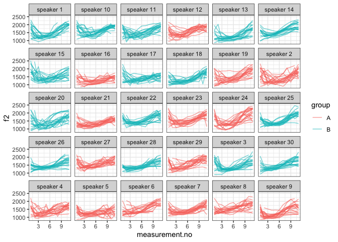

Introduction
------------

This document is a supplement to “Evaluating generalised additive mixed
modelling strategies for dynamic speech analysis,” relating specifically
to the contents of the “real formants” columns of Table 2 in Section
3.2.2. It presents code that illustrates (i) how the resampled data were
generated and (ii) the models whose performance is summarised in the
“real formants” columns of Table 2.

Preliminaries
-------------

The code below loads the relevant libraries.

``` r
library(ggplot2)
```

    ## Warning: package 'ggplot2' was built under R version 3.5.2

``` r
library(mgcv)
```

    ## Warning: package 'mgcv' was built under R version 3.5.2

``` r
library(itsadug)
library(stringr)
```

    ## Warning: package 'stringr' was built under R version 3.5.2

``` r
library(dplyr)
```

    ## Warning: package 'dplyr' was built under R version 3.5.2

Data generation
---------------

The code in this section can be only be used to process the data for
type I simulations. Note that the paths in this file will only work if
the whole GitHub repository is downloaded and this markdown file is kept
in its folder.

The data for this set of simulations consist of real f2 trajectories
representing the vowel /aI/ in New Zealand English. A sample of 20
contours is taken from each of the 30 speakers in the data set. Each
speaker is then randomly assigned to one of two groups (A and B).

``` r
dat_full <- readRDS("../data/final_data/price_vd_30_speakers.rds")

# limit to speakers with >= 30 trajectories

dat_full <- subset(dat_full, n >= 30)

# we sample 20 trajectories from each speaker

dat <- dat_full %>%
  group_by(speaker) %>%
  filter(traj %in% sample(unique(traj), 20, replace=F)) %>%
  ungroup()
  
# we now add randomly assigned category labels

ids <- unique(dat$speaker)
group.Bs <- sample(ids, round(length(ids)/2))
dat$group <- "A"
dat$group[dat$speaker %in% group.Bs] <- "B"

# setting up different types of grouping factors
dat$group.factor <- as.factor(dat$group)
dat$group.ordered <- as.ordered(dat$group)
contrasts(dat$group.ordered) <- "contr.treatment"
dat$group.bin <- as.numeric(dat$group.factor) - 1

# ids ought to be factors  
dat$traj <- as.factor(dat$traj)
dat$speaker <- as.factor(dat$speaker)

# dat$start has already been added at data prep stage (for AR.start, i.e. for autoregressive error models)
```

Here is what the data set looks like.

``` r
ggplot(dat, aes(x=measurement.no, y=f2, group=traj, col=group)) +
  geom_line(alpha=0.6) +
  facet_wrap(~speaker) +
  theme_bw()
```



Models
------

All the models (and sets of models) from Table 2 are shown below in the
same order as in the table. The numbers in the section headers
correspond to the row numbers. Note that all models contain AR1
components to deal with dependencies within trajectories. The rho value
used for these AR1 components is taken from a single model fitted
without any random structures. This model is estimated below.

``` r
rho_mod <- 
  bam(f2 ~ group.ordered + 
        s(measurement.no, bs = "tp", k = 10) + 
        s(measurement.no, by = group.ordered, bs = "tp", k = 10), 
      data = dat, method = "fREML", discrete = T, nthreads = 1)

rho <- start_value_rho(rho_mod)
```

### NO SMOOTHS: 1. No components

``` r
nocomp <- 
  bam(f2 ~ group.ordered + 
        s(measurement.no, bs = "tp", k = 10) + 
        s(measurement.no, by = group.ordered, bs = "tp", k = 10), 
      data = dat, 
      AR.start = dat$start, rho = rho, 
      method = "fREML", discrete = T, nthreads = 1)
summary(nocomp)
```

    ## 
    ## Family: gaussian 
    ## Link function: identity 
    ## 
    ## Formula:
    ## f2 ~ group.ordered + s(measurement.no, bs = "tp", k = 10) + s(measurement.no, 
    ##     by = group.ordered, bs = "tp", k = 10)
    ## 
    ## Parametric coefficients:
    ##                Estimate Std. Error t value Pr(>|t|)    
    ## (Intercept)    1449.741      6.313 229.626  < 2e-16 ***
    ## group.orderedB   66.328      8.928   7.429 1.25e-13 ***
    ## ---
    ## Signif. codes:  0 '***' 0.001 '**' 0.01 '*' 0.05 '.' 0.1 ' ' 1
    ## 
    ## Approximate significance of smooth terms:
    ##                                    edf Ref.df       F  p-value    
    ## s(measurement.no)                8.481  8.907 168.752  < 2e-16 ***
    ## s(measurement.no):group.orderedB 3.523  4.559   4.943 0.000326 ***
    ## ---
    ## Signif. codes:  0 '***' 0.001 '**' 0.01 '*' 0.05 '.' 0.1 ' ' 1
    ## 
    ## R-sq.(adj) =  0.387   Deviance explained = 38.8%
    ## fREML =  39636  Scale est. = 36436     n = 6143

### NO SMOOTHS: 2. Rand intcpt (= Random Intercept)

``` r
rand_intcpt <- 
  bam(f2 ~ group.ordered + 
        s(measurement.no, bs = "tp", k = 10) + 
        s(measurement.no, by = group.ordered, bs = "tp", k = 10) +
        s(speaker, bs = "re"), 
      data = dat, 
      AR.start = dat$start, rho = rho, 
      method = "fREML", discrete = T, nthreads = 1)
summary(rand_intcpt)
```

    ## 
    ## Family: gaussian 
    ## Link function: identity 
    ## 
    ## Formula:
    ## f2 ~ group.ordered + s(measurement.no, bs = "tp", k = 10) + s(measurement.no, 
    ##     by = group.ordered, bs = "tp", k = 10) + s(speaker, bs = "re")
    ## 
    ## Parametric coefficients:
    ##                Estimate Std. Error t value Pr(>|t|)    
    ## (Intercept)     1447.70      22.69   63.79   <2e-16 ***
    ## group.orderedB    61.30      32.09    1.91   0.0561 .  
    ## ---
    ## Signif. codes:  0 '***' 0.001 '**' 0.01 '*' 0.05 '.' 0.1 ' ' 1
    ## 
    ## Approximate significance of smooth terms:
    ##                                     edf Ref.df       F  p-value    
    ## s(measurement.no)                 8.505  8.912 178.780  < 2e-16 ***
    ## s(measurement.no):group.orderedB  3.574  4.623   5.136 0.000203 ***
    ## s(speaker)                       26.017 28.000  69.712 3.18e-10 ***
    ## ---
    ## Signif. codes:  0 '***' 0.001 '**' 0.01 '*' 0.05 '.' 0.1 ' ' 1
    ## 
    ## R-sq.(adj) =  0.476   Deviance explained = 47.9%
    ## fREML =  39494  Scale est. = 34372     n = 6143

### NO SMOOTHS: 3. Rand intcpt + slope (= random intercept + slope)

``` r
rand_intcpt_slope <- 
  bam(f2 ~ group.ordered + 
        s(measurement.no, bs = "tp", k = 10) + 
        s(measurement.no, by = group.ordered, bs = "tp", k = 10) +
        s(speaker, bs = "re") +
        s(speaker, measurement.no, bs = "re"), 
      data = dat, 
      AR.start = dat$start, rho = rho, 
      method = "fREML", discrete = T, nthreads = 1)
summary(rand_intcpt_slope)
```

    ## 
    ## Family: gaussian 
    ## Link function: identity 
    ## 
    ## Formula:
    ## f2 ~ group.ordered + s(measurement.no, bs = "tp", k = 10) + s(measurement.no, 
    ##     by = group.ordered, bs = "tp", k = 10) + s(speaker, bs = "re") + 
    ##     s(speaker, measurement.no, bs = "re")
    ## 
    ## Parametric coefficients:
    ##                Estimate Std. Error t value Pr(>|t|)    
    ## (Intercept)     1447.56      36.77  39.370   <2e-16 ***
    ## group.orderedB    62.54      51.99   1.203    0.229    
    ## ---
    ## Signif. codes:  0 '***' 0.001 '**' 0.01 '*' 0.05 '.' 0.1 ' ' 1
    ## 
    ## Approximate significance of smooth terms:
    ##                                     edf Ref.df      F p-value    
    ## s(measurement.no)                 8.520  8.916 129.03 < 2e-16 ***
    ## s(measurement.no):group.orderedB  3.622  4.685   3.95 0.00201 ** 
    ## s(speaker)                       24.373 30.000 290.12 0.00453 ** 
    ## s(measurement.no,speaker)        24.815 28.000 306.32 0.80956    
    ## ---
    ## Signif. codes:  0 '***' 0.001 '**' 0.01 '*' 0.05 '.' 0.1 ' ' 1
    ## 
    ## R-sq.(adj) =  0.504   Deviance explained = 50.9%
    ## fREML =  39419  Scale est. = 33144     n = 6143

### TP SMOOTHS: 4. Rand smooth, tp, 3 bs

``` r
rand_smooth_tp_3 <- 
  bam(f2 ~ group.ordered + 
        s(measurement.no, bs = "tp", k = 10) + 
        s(measurement.no, by = group.ordered, bs = "tp", k = 10) + 
        s(measurement.no, speaker, bs = "fs", m = 1, xt = "tp", k = 3), 
      data = dat, 
      AR.start = dat$start, rho = rho, 
      method = "fREML", discrete = T, nthreads = 1)
```

    ## Warning in gam.side(sm, X, tol = .Machine$double.eps^0.5): model has
    ## repeated 1-d smooths of same variable.

``` r
summary(rand_smooth_tp_3)
```

    ## 
    ## Family: gaussian 
    ## Link function: identity 
    ## 
    ## Formula:
    ## f2 ~ group.ordered + s(measurement.no, bs = "tp", k = 10) + s(measurement.no, 
    ##     by = group.ordered, bs = "tp", k = 10) + s(measurement.no, 
    ##     speaker, bs = "fs", m = 1, xt = "tp", k = 3)
    ## 
    ## Parametric coefficients:
    ##                Estimate Std. Error t value Pr(>|t|)    
    ## (Intercept)     1438.91      27.24  52.819   <2e-16 ***
    ## group.orderedB    80.44      37.36   2.153   0.0313 *  
    ## ---
    ## Signif. codes:  0 '***' 0.001 '**' 0.01 '*' 0.05 '.' 0.1 ' ' 1
    ## 
    ## Approximate significance of smooth terms:
    ##                                     edf Ref.df      F  p-value    
    ## s(measurement.no)                 8.553  8.929 69.457  < 2e-16 ***
    ## s(measurement.no):group.orderedB  2.290  2.920  1.564    0.158    
    ## s(measurement.no,speaker)        74.838 88.000 17.877 2.55e-08 ***
    ## ---
    ## Signif. codes:  0 '***' 0.001 '**' 0.01 '*' 0.05 '.' 0.1 ' ' 1
    ## 
    ## R-sq.(adj) =  0.519   Deviance explained = 52.6%
    ## fREML =  39368  Scale est. = 32334     n = 6143

### TP SMOOTHS: 5. Rand smooth, tp, 5 bs

``` r
rand_smooth_tp_5 <- 
  bam(f2 ~ group.ordered + 
        s(measurement.no, bs = "tp", k = 10) + 
        s(measurement.no, by = group.ordered, bs = "tp", k = 10) + 
        s(measurement.no, speaker, bs = "fs", m = 1, xt = "tp", k = 5), 
      data = dat, 
      AR.start = dat$start, rho = rho, 
      method = "fREML", discrete = T, nthreads = 1)
```

    ## Warning in gam.side(sm, X, tol = .Machine$double.eps^0.5): model has
    ## repeated 1-d smooths of same variable.

``` r
summary(rand_smooth_tp_5)
```

    ## 
    ## Family: gaussian 
    ## Link function: identity 
    ## 
    ## Formula:
    ## f2 ~ group.ordered + s(measurement.no, bs = "tp", k = 10) + s(measurement.no, 
    ##     by = group.ordered, bs = "tp", k = 10) + s(measurement.no, 
    ##     speaker, bs = "fs", m = 1, xt = "tp", k = 5)
    ## 
    ## Parametric coefficients:
    ##                Estimate Std. Error t value Pr(>|t|)    
    ## (Intercept)     1440.65      26.89  53.570   <2e-16 ***
    ## group.orderedB    76.84      37.29   2.061   0.0394 *  
    ## ---
    ## Signif. codes:  0 '***' 0.001 '**' 0.01 '*' 0.05 '.' 0.1 ' ' 1
    ## 
    ## Approximate significance of smooth terms:
    ##                                      edf Ref.df      F p-value    
    ## s(measurement.no)                  8.521   8.89 64.948  <2e-16 ***
    ## s(measurement.no):group.orderedB   2.102   2.51  1.049   0.291    
    ## s(measurement.no,speaker)        110.724 148.00 12.535  <2e-16 ***
    ## ---
    ## Signif. codes:  0 '***' 0.001 '**' 0.01 '*' 0.05 '.' 0.1 ' ' 1
    ## 
    ## R-sq.(adj) =  0.522   Deviance explained = 53.1%
    ## fREML =  39359  Scale est. = 31983     n = 6143

### TP SMOOTHS: 6. Rand smooth, tp, 10 bs

``` r
rand_smooth_tp_10 <- 
  bam(f2 ~ group.ordered + 
        s(measurement.no, bs = "tp", k = 10) + 
        s(measurement.no, by = group.ordered, bs = "tp", k = 10) + 
        s(measurement.no, speaker, bs = "fs", m = 1, xt = "tp", k = 10), 
      data = dat, 
      AR.start = dat$start, rho = rho, 
      method = "fREML", discrete = T, nthreads = 1)
```

    ## Warning in gam.side(sm, X, tol = .Machine$double.eps^0.5): model has
    ## repeated 1-d smooths of same variable.

``` r
summary(rand_smooth_tp_10)
```

    ## 
    ## Family: gaussian 
    ## Link function: identity 
    ## 
    ## Formula:
    ## f2 ~ group.ordered + s(measurement.no, bs = "tp", k = 10) + s(measurement.no, 
    ##     by = group.ordered, bs = "tp", k = 10) + s(measurement.no, 
    ##     speaker, bs = "fs", m = 1, xt = "tp", k = 10)
    ## 
    ## Parametric coefficients:
    ##                Estimate Std. Error t value Pr(>|t|)    
    ## (Intercept)     1445.42      25.55   56.58   <2e-16 ***
    ## group.orderedB    67.48      35.89    1.88   0.0601 .  
    ## ---
    ## Signif. codes:  0 '***' 0.001 '**' 0.01 '*' 0.05 '.' 0.1 ' ' 1
    ## 
    ## Approximate significance of smooth terms:
    ##                                      edf  Ref.df      F p-value    
    ## s(measurement.no)                  8.229   8.553 70.016  <2e-16 ***
    ## s(measurement.no):group.orderedB   2.591   2.966  2.010  0.0925 .  
    ## s(measurement.no,speaker)        166.554 296.000  5.724  <2e-16 ***
    ## ---
    ## Signif. codes:  0 '***' 0.001 '**' 0.01 '*' 0.05 '.' 0.1 ' ' 1
    ## 
    ## R-sq.(adj) =  0.517   Deviance explained = 53.1%
    ## fREML =  39379  Scale est. = 31936     n = 6143

### TP SMOOTHS: 7. Rand smooth, tp, 15 bs

This model was not fitted to these data.

### TP SMOOTHS: 8. Rand smooth, gam.check

The model fitted in this section uses random smooths where the number of
basis functions (k) is determined using the gam.check() function: after
fitting an initial model with a relatively low value of k, gam.check()
is used to see whether more wiggliness is necessary (essentially,
whether the smooths use up all the degrees of freedom afforded to them).
If gam.check() suggests that more wiggliness is necessary, this
procedure is repeated again using a model with a higher value of k.

Below is a convenience function for extracting the relevant p-value from
the output of gam.check.

``` r
gam.check.p.value <- function (mod, which.line) {
  str.out <- capture.output(gam.check(mod))
  relevant.line <- str.out[grep(which.line, str.out)]
  p.value <- as.numeric(str_match(relevant.line, "([0-9.]*)[ *.]*$")[[2]])
  return(p.value)
}
```

Fitting the models. Dense first.

``` r
# what k's should be tried?
k_min = 4
k_max = 10
k_step = 3
```

``` r
for (k in seq(k_min,k_max,k_step)) {
  cat("fitting model with  k =", k, "\n")
  
  # fitting model
  
  rand_smooth_tp_gam.check <- 
    bam(f2 ~ group.ordered + 
          s(measurement.no, bs = "tp", k = 10) + 
          s(measurement.no, by = group.ordered, bs = "tp", k = 10) + 
          s(measurement.no, speaker, bs = "fs", m = 1, xt = "tp", k = k), 
        data = dat, 
        AR.start = dat$start, rho = rho, 
        method = "fREML", discrete = T, nthreads = 1)
  
  # check whether more complexity is needed using gam.check
  
  if (gam.check.p.value(rand_smooth_tp_gam.check, "speaker") >= 0.05 | k == k_max) {
    print(summary(rand_smooth_tp_gam.check))
    break
  }
}
```

    ## fitting model with  k = 4

    ## Warning in gam.side(sm, X, tol = .Machine$double.eps^0.5): model has
    ## repeated 1-d smooths of same variable.

    ## 
    ## Family: gaussian 
    ## Link function: identity 
    ## 
    ## Formula:
    ## f2 ~ group.ordered + s(measurement.no, bs = "tp", k = 10) + s(measurement.no, 
    ##     by = group.ordered, bs = "tp", k = 10) + s(measurement.no, 
    ##     speaker, bs = "fs", m = 1, xt = "tp", k = k)
    ## 
    ## Parametric coefficients:
    ##                Estimate Std. Error t value Pr(>|t|)    
    ## (Intercept)     1437.89      26.80  53.660   <2e-16 ***
    ## group.orderedB    82.58      36.78   2.245   0.0248 *  
    ## ---
    ## Signif. codes:  0 '***' 0.001 '**' 0.01 '*' 0.05 '.' 0.1 ' ' 1
    ## 
    ## Approximate significance of smooth terms:
    ##                                     edf  Ref.df      F p-value    
    ## s(measurement.no)                 8.552   8.922 70.009  <2e-16 ***
    ## s(measurement.no):group.orderedB  1.808   2.185  0.894   0.365    
    ## s(measurement.no,speaker)        94.400 118.000 11.259  <2e-16 ***
    ## ---
    ## Signif. codes:  0 '***' 0.001 '**' 0.01 '*' 0.05 '.' 0.1 ' ' 1
    ## 
    ## R-sq.(adj) =  0.521   Deviance explained =   53%
    ## fREML =  39360  Scale est. = 32099     n = 6143

### CR SMOOTHS: 9. Rand smooth, tp, 3 bs

``` r
rand_smooth_cr_3 <- 
  bam(f2 ~ group.ordered + 
        s(measurement.no, bs = "tp", k = 10) + 
        s(measurement.no, by = group.ordered, bs = "tp", k = 10) + 
        s(measurement.no, speaker, bs = "fs", m = 1, xt = "cr", k = 3), 
      data = dat, 
      AR.start = dat$start, rho = rho, 
      method = "fREML", discrete = T, nthreads = 1)
```

    ## Warning in gam.side(sm, X, tol = .Machine$double.eps^0.5): model has
    ## repeated 1-d smooths of same variable.

``` r
summary(rand_smooth_cr_3)
```

    ## 
    ## Family: gaussian 
    ## Link function: identity 
    ## 
    ## Formula:
    ## f2 ~ group.ordered + s(measurement.no, bs = "tp", k = 10) + s(measurement.no, 
    ##     by = group.ordered, bs = "tp", k = 10) + s(measurement.no, 
    ##     speaker, bs = "fs", m = 1, xt = "cr", k = 3)
    ## 
    ## Parametric coefficients:
    ##                Estimate Std. Error t value Pr(>|t|)    
    ## (Intercept)     1444.84      24.74  58.396   <2e-16 ***
    ## group.orderedB    69.27      34.54   2.006   0.0449 *  
    ## ---
    ## Signif. codes:  0 '***' 0.001 '**' 0.01 '*' 0.05 '.' 0.1 ' ' 1
    ## 
    ## Approximate significance of smooth terms:
    ##                                     edf Ref.df     F  p-value    
    ## s(measurement.no)                 8.543  8.922 65.82  < 2e-16 ***
    ## s(measurement.no):group.orderedB  2.849  3.737  1.03     0.32    
    ## s(measurement.no,speaker)        75.869 86.000 22.06 2.19e-08 ***
    ## ---
    ## Signif. codes:  0 '***' 0.001 '**' 0.01 '*' 0.05 '.' 0.1 ' ' 1
    ## 
    ## R-sq.(adj) =  0.519   Deviance explained = 52.6%
    ## fREML =  39352  Scale est. = 32165     n = 6143

### CR SMOOTHS: 10. Rand smooth, tp, 5 bs

``` r
rand_smooth_cr_5 <- 
  bam(f2 ~ group.ordered + 
        s(measurement.no, bs = "tp", k = 10) + 
        s(measurement.no, by = group.ordered, bs = "tp", k = 10) + 
        s(measurement.no, speaker, bs = "fs", m = 1, xt = "cr", k = 5), 
      data = dat, 
      AR.start = dat$start, rho = rho, 
      method = "fREML", discrete = T, nthreads = 1)
```

    ## Warning in gam.side(sm, X, tol = .Machine$double.eps^0.5): model has
    ## repeated 1-d smooths of same variable.

``` r
summary(rand_smooth_cr_5)
```

    ## 
    ## Family: gaussian 
    ## Link function: identity 
    ## 
    ## Formula:
    ## f2 ~ group.ordered + s(measurement.no, bs = "tp", k = 10) + s(measurement.no, 
    ##     by = group.ordered, bs = "tp", k = 10) + s(measurement.no, 
    ##     speaker, bs = "fs", m = 1, xt = "cr", k = 5)
    ## 
    ## Parametric coefficients:
    ##                Estimate Std. Error t value Pr(>|t|)    
    ## (Intercept)     1445.92      23.54  61.412   <2e-16 ***
    ## group.orderedB    66.61      33.11   2.012   0.0443 *  
    ## ---
    ## Signif. codes:  0 '***' 0.001 '**' 0.01 '*' 0.05 '.' 0.1 ' ' 1
    ## 
    ## Approximate significance of smooth terms:
    ##                                     edf  Ref.df      F p-value    
    ## s(measurement.no)                 8.551   8.920 53.455  <2e-16 ***
    ## s(measurement.no):group.orderedB  2.138   2.637  0.646   0.495    
    ## s(measurement.no,speaker)        99.518 146.000  9.548  <2e-16 ***
    ## ---
    ## Signif. codes:  0 '***' 0.001 '**' 0.01 '*' 0.05 '.' 0.1 ' ' 1
    ## 
    ## R-sq.(adj) =  0.522   Deviance explained = 53.1%
    ## fREML =  39344  Scale est. = 31917     n = 6143

### CR SMOOTHS: 11. Rand smooth, tp, 10 bs

``` r
rand_smooth_cr_10 <- 
  bam(f2 ~ group.ordered + 
        s(measurement.no, bs = "tp", k = 10) + 
        s(measurement.no, by = group.ordered, bs = "tp", k = 10) + 
        s(measurement.no, speaker, bs = "fs", m = 1, xt = "cr", k = 10), 
      data = dat, 
      AR.start = dat$start, rho = rho, 
      method = "fREML", discrete = T, nthreads = 1)
```

    ## Warning in gam.side(sm, X, tol = .Machine$double.eps^0.5): model has
    ## repeated 1-d smooths of same variable.

``` r
summary(rand_smooth_cr_10)
```

    ## 
    ## Family: gaussian 
    ## Link function: identity 
    ## 
    ## Formula:
    ## f2 ~ group.ordered + s(measurement.no, bs = "tp", k = 10) + s(measurement.no, 
    ##     by = group.ordered, bs = "tp", k = 10) + s(measurement.no, 
    ##     speaker, bs = "fs", m = 1, xt = "cr", k = 10)
    ## 
    ## Parametric coefficients:
    ##                Estimate Std. Error t value Pr(>|t|)    
    ## (Intercept)     1446.92      23.24   62.25   <2e-16 ***
    ## group.orderedB    64.34      32.82    1.96     0.05 *  
    ## ---
    ## Signif. codes:  0 '***' 0.001 '**' 0.01 '*' 0.05 '.' 0.1 ' ' 1
    ## 
    ## Approximate significance of smooth terms:
    ##                                     edf  Ref.df      F p-value    
    ## s(measurement.no)                  8.53   8.897 54.578  <2e-16 ***
    ## s(measurement.no):group.orderedB   2.15   2.614  0.630   0.473    
    ## s(measurement.no,speaker)        109.83 297.000  2.967  <2e-16 ***
    ## ---
    ## Signif. codes:  0 '***' 0.001 '**' 0.01 '*' 0.05 '.' 0.1 ' ' 1
    ## 
    ## R-sq.(adj) =  0.522   Deviance explained = 53.1%
    ## fREML =  39344  Scale est. = 31867     n = 6143

### CR SMOOTHS: 12. Rand smooth, tp, 15 bs

This model was not fitted to these data.

### CR SMOOTHS: 13. Rand smooth, gam.check

The model fitted in this section uses random smooths where the number of
basis functions (k) is determined using the gam.check() function: after
fitting an initial model with a relatively low value of k, gam.check()
is used to see whether more wiggliness is necessary (essentially,
whether the smooths use up all the degrees of freedom afforded to them).
If gam.check() suggests that more wiggliness is necessary, this
procedure is repeated again using a model with a higher value of k.

Below is a convenience function for extracting the relevant p-value from
the output of gam.check.

``` r
gam.check.p.value <- function (mod, which.line) {
  str.out <- capture.output(gam.check(mod))
  relevant.line <- str.out[grep(which.line, str.out)]
  p.value <- as.numeric(str_match(relevant.line, "([0-9.]*)[ *.]*$")[[2]])
  return(p.value)
}
```

Fitting the models. Dense first.

``` r
# what k's should be tried?
k_min = 4
k_max = 10
k_step = 3
```

``` r
for (k in seq(k_min,k_max,k_step)) {
  cat("fitting model with  k =", k, "\n")
  
  # fitting model
  
  rand_smooth_cr_gam.check <- 
    bam(f2 ~ group.ordered + 
          s(measurement.no, bs = "tp", k = 10) + 
          s(measurement.no, by = group.ordered, bs = "tp", k = 10) + 
          s(measurement.no, speaker, bs = "fs", m = 1, xt = "cr", k = k), 
        data = dat, 
        AR.start = dat$start, rho = rho, 
        method = "fREML", discrete = T, nthreads = 1)
  
  # check whether more complexity is needed using gam.check
  
  if (gam.check.p.value(rand_smooth_cr_gam.check, "speaker") >= 0.05 | k == k_max) {
    print(summary(rand_smooth_cr_gam.check))
    break
  }
}
```

    ## fitting model with  k = 4

    ## Warning in gam.side(sm, X, tol = .Machine$double.eps^0.5): model has
    ## repeated 1-d smooths of same variable.

    ## 
    ## Family: gaussian 
    ## Link function: identity 
    ## 
    ## Formula:
    ## f2 ~ group.ordered + s(measurement.no, bs = "tp", k = 10) + s(measurement.no, 
    ##     by = group.ordered, bs = "tp", k = 10) + s(measurement.no, 
    ##     speaker, bs = "fs", m = 1, xt = "cr", k = k)
    ## 
    ## Parametric coefficients:
    ##                Estimate Std. Error t value Pr(>|t|)    
    ## (Intercept)     1445.40      23.90  60.479   <2e-16 ***
    ## group.orderedB    67.83      33.50   2.025    0.043 *  
    ## ---
    ## Signif. codes:  0 '***' 0.001 '**' 0.01 '*' 0.05 '.' 0.1 ' ' 1
    ## 
    ## Approximate significance of smooth terms:
    ##                                     edf  Ref.df      F p-value    
    ## s(measurement.no)                 8.552   8.923 53.091  <2e-16 ***
    ## s(measurement.no):group.orderedB  2.291   2.904  0.740   0.471    
    ## s(measurement.no,speaker)        91.641 116.000  7.519  <2e-16 ***
    ## ---
    ## Signif. codes:  0 '***' 0.001 '**' 0.01 '*' 0.05 '.' 0.1 ' ' 1
    ## 
    ## R-sq.(adj) =  0.522   Deviance explained =   53%
    ## fREML =  39345  Scale est. = 31964     n = 6143
