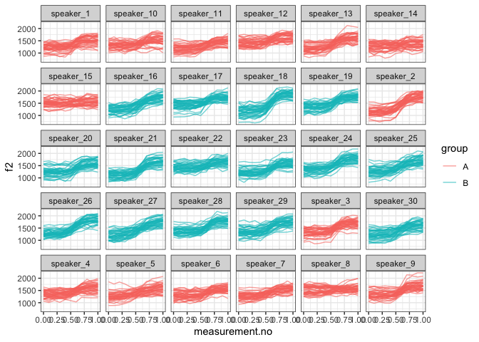

Introduction
------------

This document is a supplement to “Evaluating generalised additive mixed
modelling strategies for dynamic speech analysis,” relating specifically
to the contents of the “simulated formants” columns of Table 2 in
Section 3.2.2. It presents code that illustrates (i) how the simulated
data were generated and (ii) the models whose performance is summarised
in the “simulate formants” columns of Table 2.

Preliminaries
-------------

The code below loads the relevant libraries.

``` r
library(ggplot2)
```

    ## Warning: package 'ggplot2' was built under R version 3.5.2

``` r
library(mgcv)
```

    ## Warning: package 'mgcv' was built under R version 3.5.2

``` r
library(itsadug)
library(stringr)
```

    ## Warning: package 'stringr' was built under R version 3.5.2

``` r
library(dplyr)
```

    ## Warning: package 'dplyr' was built under R version 3.5.2

Data generation
---------------

The code in this section can be used to create data for either type I or
type II simulations. Set the value of *type* to 1 for type I simulations
and to 2 for type II simulations.

``` r
type = 2
```

The data for this set of simulations consist of simulated f2
trajectories modelled after the diphthong /aI/. 30 speakers are
simulated with 40 trajectories each. For type I simulations, each
speaker is randomly assigned to one of two groups (A or B). For type II
simulations, all underlying trajectories for group B speakers are
slightly modified (cf. Section 2.1 in the paper and also the Appendix).

Parameters for the simulations.

``` r
# setting time dimension
xs = seq(0,1,0.1)

# population parameters: individual speakers come from this dist
f2_start_mean = 1300

if (type==1) {
  f2_end_1_mean = 1650
  f2_end_2_mean = 1650
} else {
  f2_end_1_mean = 1600
  f2_end_2_mean = 1690
}

f2_start_sd.speaker = 90
f2_end_1_sd.speaker = 90
f2_end_2_sd.speaker = 90
# expected value & sd for transition point
x0_mean = 0.6
x0_sd.speaker = 0.020
# expected value & sd for steepness (higher -> more steep)
k_mean = 15
k_sd.speaker = 4

# how much variation within speakers?
f2_start_sd.traj = 150
f2_end_1_sd.traj = 150
f2_end_2_sd.traj = 150
x0_sd.traj = 0.015
k_sd.traj = 3

# amount of random noise

noise_sd <- 40

n_speakers <- 30
n_trajectories_per_speaker <- 40
```

Generating simulated data.

``` r
# assembling trajectories

ys_m <- matrix(0, nrow=length(xs), ncol=n_speakers*n_trajectories_per_speaker)
for (i in 1:n_speakers) {
  f2_start.speaker <- rnorm(1, f2_start_mean, f2_start_sd.speaker)
  f2_end_1.speaker <- rnorm(1, f2_end_1_mean, f2_end_1_sd.speaker)
  f2_end_2.speaker <- rnorm(1, f2_end_2_mean, f2_end_2_sd.speaker)
  x0.speaker <- rnorm(1, x0_mean, x0_sd.speaker)
  k.speaker <- rnorm(1, k_mean, k_sd.speaker)
  for (j in 1:n_trajectories_per_speaker) {
    f2_start <- rnorm(1, f2_start.speaker, f2_start_sd.traj)
    f2_end_1 <- rnorm(1, f2_end_1.speaker, f2_end_1_sd.traj)
    f2_end_2 <- rnorm(1, f2_end_2.speaker, f2_end_2_sd.traj)
    x0 <- rnorm(1, x0.speaker, x0_sd.traj)
    k <- rnorm(1, k.speaker, k_sd.traj)
    if (i <= (n_speakers / 2)) {
      ys_m[,(i-1)*n_trajectories_per_speaker + j] <- ((f2_end_1 - f2_start) / (1 + exp(-k*(xs-x0)))) + f2_start + rnorm(length(xs), 0, noise_sd)
    } else {
      ys_m[,(i-1)*n_trajectories_per_speaker + j] <- ((f2_end_2 - f2_start) / (1 + exp(-k*(xs-x0)))) + f2_start + rnorm(length(xs), 0, noise_sd)
    }
  }
}

# assembling data set (randomly assigned to categories)
dat <- data.frame(traj=paste("traj_", rep(1:(n_speakers*n_trajectories_per_speaker), each=length(xs)), sep=""),
                        speaker=paste("speaker_", rep(1:n_speakers, each=length(xs)*n_trajectories_per_speaker), sep=""),
                        group=rep(c("A","B"), each=length(xs)*(n_speakers*n_trajectories_per_speaker / 2)),
                        measurement.no=xs, 
                        f2=c(ys_m),
                        stringsAsFactors = F
)

# setting up different types of grouping factors
dat$group.factor <- as.factor(dat$group)
dat$group.ordered <- as.ordered(dat$group)
contrasts(dat$group.ordered) <- "contr.treatment"
dat$group.bin <- as.numeric(dat$group.factor) - 1

# ids ought to be factors  
dat$traj <- as.factor(dat$traj)
dat$speaker <- as.factor(dat$speaker)

# add dat$start for AR.start (for autoregressive error models)

dat$start <- dat$measurement.no == 0

# dat$start has already been added at data prep stage (for AR.start, i.e. for autoregressive error models)
```

Here is what the data set looks like.

``` r
ggplot(dat, aes(x=measurement.no, y=f2, group=traj, col=group)) +
  geom_line(alpha=0.6) +
  facet_wrap(~speaker) +
  theme_bw()
```



Models
------

All the models (and sets of models) from Table 2 are shown below in the
same order as in the table. The numbers in the section headers
correspond to the row numbers.

### NO SMOOTHS: 1. No components

``` r
nocomp <- 
  bam(f2 ~ group.ordered + 
        s(measurement.no, bs = "tp", k = 10) + 
        s(measurement.no, by = group.ordered, bs = "tp", k = 10), 
      data = dat, 
      method = "fREML", discrete = T, nthreads = 1)
summary(nocomp)
```

    ## 
    ## Family: gaussian 
    ## Link function: identity 
    ## 
    ## Formula:
    ## f2 ~ group.ordered + s(measurement.no, bs = "tp", k = 10) + s(measurement.no, 
    ##     by = group.ordered, bs = "tp", k = 10)
    ## 
    ## Parametric coefficients:
    ##                Estimate Std. Error t value Pr(>|t|)    
    ## (Intercept)    1423.971      2.110  674.95   <2e-16 ***
    ## group.orderedB   30.551      2.984   10.24   <2e-16 ***
    ## ---
    ## Signif. codes:  0 '***' 0.001 '**' 0.01 '*' 0.05 '.' 0.1 ' ' 1
    ## 
    ## Approximate significance of smooth terms:
    ##                                    edf Ref.df      F p-value    
    ## s(measurement.no)                8.043  8.725 512.29  <2e-16 ***
    ## s(measurement.no):group.orderedB 4.010  4.929  33.57  <2e-16 ***
    ## ---
    ## Signif. codes:  0 '***' 0.001 '**' 0.01 '*' 0.05 '.' 0.1 ' ' 1
    ## 
    ## R-sq.(adj) =  0.468   Deviance explained = 46.9%
    ## fREML =  86639  Scale est. = 29377     n = 13200

### NO SMOOTHS: 2. Rand intcpt (= Random Intercept)

``` r
rand_intcpt <- 
  bam(f2 ~ group.ordered + 
        s(measurement.no, bs = "tp", k = 10) + 
        s(measurement.no, by = group.ordered, bs = "tp", k = 10) +
        s(speaker, bs = "re"), 
      data = dat, 
      method = "fREML", discrete = T, nthreads = 1)
summary(rand_intcpt)
```

    ## 
    ## Family: gaussian 
    ## Link function: identity 
    ## 
    ## Formula:
    ## f2 ~ group.ordered + s(measurement.no, bs = "tp", k = 10) + s(measurement.no, 
    ##     by = group.ordered, bs = "tp", k = 10) + s(speaker, bs = "re")
    ## 
    ## Parametric coefficients:
    ##                Estimate Std. Error t value Pr(>|t|)    
    ## (Intercept)     1430.41      16.72  85.559   <2e-16 ***
    ## group.orderedB    32.50      23.64   1.375    0.169    
    ## ---
    ## Signif. codes:  0 '***' 0.001 '**' 0.01 '*' 0.05 '.' 0.1 ' ' 1
    ## 
    ## Approximate significance of smooth terms:
    ##                                     edf Ref.df      F p-value    
    ## s(measurement.no)                 8.127  8.761 586.03  <2e-16 ***
    ## s(measurement.no):group.orderedB  4.176  5.124  37.30  <2e-16 ***
    ## s(speaker)                       27.612 28.000  77.62  0.0206 *  
    ## ---
    ## Signif. codes:  0 '***' 0.001 '**' 0.01 '*' 0.05 '.' 0.1 ' ' 1
    ## 
    ## R-sq.(adj) =  0.538   Deviance explained =   54%
    ## fREML =  85771  Scale est. = 25518     n = 13200

### NO SMOOTHS: 3. Rand intcpt + slope (= random intercept + slope)

``` r
rand_intcpt_slope <- 
  bam(f2 ~ group.ordered + 
        s(measurement.no, bs = "tp", k = 10) + 
        s(measurement.no, by = group.ordered, bs = "tp", k = 10) +
        s(speaker, bs = "re") +
        s(speaker, measurement.no, bs = "re"), 
      data = dat, 
      method = "fREML", discrete = T, nthreads = 1)
summary(rand_intcpt_slope)
```

    ## 
    ## Family: gaussian 
    ## Link function: identity 
    ## 
    ## Formula:
    ## f2 ~ group.ordered + s(measurement.no, bs = "tp", k = 10) + s(measurement.no, 
    ##     by = group.ordered, bs = "tp", k = 10) + s(speaker, bs = "re") + 
    ##     s(speaker, measurement.no, bs = "re")
    ## 
    ## Parametric coefficients:
    ##                Estimate Std. Error t value Pr(>|t|)    
    ## (Intercept)     1430.41      35.52  40.274   <2e-16 ***
    ## group.orderedB    32.47      50.23   0.646    0.518    
    ## ---
    ## Signif. codes:  0 '***' 0.001 '**' 0.01 '*' 0.05 '.' 0.1 ' ' 1
    ## 
    ## Approximate significance of smooth terms:
    ##                                     edf Ref.df         F  p-value    
    ## s(measurement.no)                 8.194  8.787    95.565  < 2e-16 ***
    ## s(measurement.no):group.orderedB  4.315  5.287     5.651 2.52e-05 ***
    ## s(speaker)                       27.527 28.000 28916.773     0.83    
    ## s(measurement.no,speaker)        27.532 29.000 27935.655 2.03e-06 ***
    ## ---
    ## Signif. codes:  0 '***' 0.001 '**' 0.01 '*' 0.05 '.' 0.1 ' ' 1
    ## 
    ## R-sq.(adj) =   0.59   Deviance explained = 59.2%
    ## fREML =  85058  Scale est. = 22656     n = 13200

### TP SMOOTHS: 4. Rand smooth, tp, 3 bs

``` r
rand_smooth_tp_3 <- 
  bam(f2 ~ group.ordered + 
        s(measurement.no, bs = "tp", k = 10) + 
        s(measurement.no, by = group.ordered, bs = "tp", k = 10) + 
        s(measurement.no, speaker, bs = "fs", m = 1, xt = "tp", k = 3), 
      data = dat, 
      method = "fREML", discrete = T, nthreads = 1)
```

    ## Warning in gam.side(sm, X, tol = .Machine$double.eps^0.5): model has
    ## repeated 1-d smooths of same variable.

``` r
summary(rand_smooth_tp_3)
```

    ## 
    ## Family: gaussian 
    ## Link function: identity 
    ## 
    ## Formula:
    ## f2 ~ group.ordered + s(measurement.no, bs = "tp", k = 10) + s(measurement.no, 
    ##     by = group.ordered, bs = "tp", k = 10) + s(measurement.no, 
    ##     speaker, bs = "fs", m = 1, xt = "tp", k = 3)
    ## 
    ## Parametric coefficients:
    ##                Estimate Std. Error t value Pr(>|t|)    
    ## (Intercept)     1428.39      19.37  73.759   <2e-16 ***
    ## group.orderedB    37.58      26.96   1.394    0.163    
    ## ---
    ## Signif. codes:  0 '***' 0.001 '**' 0.01 '*' 0.05 '.' 0.1 ' ' 1
    ## 
    ## Approximate significance of smooth terms:
    ##                                     edf Ref.df       F  p-value    
    ## s(measurement.no)                 8.204  8.784  46.444  < 2e-16 ***
    ## s(measurement.no):group.orderedB  3.945  4.844   2.137   0.0696 .  
    ## s(measurement.no,speaker)        80.507 88.000 163.591 2.53e-15 ***
    ## ---
    ## Signif. codes:  0 '***' 0.001 '**' 0.01 '*' 0.05 '.' 0.1 ' ' 1
    ## 
    ## R-sq.(adj) =  0.597   Deviance explained =   60%
    ## fREML =  84969  Scale est. = 22288     n = 13200

### TP SMOOTHS: 5. Rand smooth, tp, 5 bs

``` r
rand_smooth_tp_5 <- 
  bam(f2 ~ group.ordered + 
        s(measurement.no, bs = "tp", k = 10) + 
        s(measurement.no, by = group.ordered, bs = "tp", k = 10) + 
        s(measurement.no, speaker, bs = "fs", m = 1, xt = "tp", k = 5), 
      data = dat,
      method = "fREML", discrete = T, nthreads = 1)
```

    ## Warning in gam.side(sm, X, tol = .Machine$double.eps^0.5): model has
    ## repeated 1-d smooths of same variable.

``` r
summary(rand_smooth_tp_5)
```

    ## 
    ## Family: gaussian 
    ## Link function: identity 
    ## 
    ## Formula:
    ## f2 ~ group.ordered + s(measurement.no, bs = "tp", k = 10) + s(measurement.no, 
    ##     by = group.ordered, bs = "tp", k = 10) + s(measurement.no, 
    ##     speaker, bs = "fs", m = 1, xt = "tp", k = 5)
    ## 
    ## Parametric coefficients:
    ##                Estimate Std. Error t value Pr(>|t|)    
    ## (Intercept)     1427.38      18.07  78.986   <2e-16 ***
    ## group.orderedB    38.11      24.69   1.544    0.123    
    ## ---
    ## Signif. codes:  0 '***' 0.001 '**' 0.01 '*' 0.05 '.' 0.1 ' ' 1
    ## 
    ## Approximate significance of smooth terms:
    ##                                      edf  Ref.df      F p-value    
    ## s(measurement.no)                  8.279   8.820 43.315  <2e-16 ***
    ## s(measurement.no):group.orderedB   1.649   1.826  2.582  0.0783 .  
    ## s(measurement.no,speaker)        122.852 148.000 33.796  <2e-16 ***
    ## ---
    ## Signif. codes:  0 '***' 0.001 '**' 0.01 '*' 0.05 '.' 0.1 ' ' 1
    ## 
    ## R-sq.(adj) =  0.599   Deviance explained = 60.3%
    ## fREML =  84954  Scale est. = 22138     n = 13200

### TP SMOOTHS: 6. Rand smooth, tp, 10 bs

``` r
rand_smooth_tp_10 <- 
  bam(f2 ~ group.ordered + 
        s(measurement.no, bs = "tp", k = 10) + 
        s(measurement.no, by = group.ordered, bs = "tp", k = 10) + 
        s(measurement.no, speaker, bs = "fs", m = 1, xt = "tp", k = 10), 
      data = dat, 
      method = "fREML", discrete = T, nthreads = 1)
```

    ## Warning in gam.side(sm, X, tol = .Machine$double.eps^0.5): model has
    ## repeated 1-d smooths of same variable.

``` r
summary(rand_smooth_tp_10)
```

    ## 
    ## Family: gaussian 
    ## Link function: identity 
    ## 
    ## Formula:
    ## f2 ~ group.ordered + s(measurement.no, bs = "tp", k = 10) + s(measurement.no, 
    ##     by = group.ordered, bs = "tp", k = 10) + s(measurement.no, 
    ##     speaker, bs = "fs", m = 1, xt = "tp", k = 10)
    ## 
    ## Parametric coefficients:
    ##                Estimate Std. Error t value Pr(>|t|)    
    ## (Intercept)     1429.65      17.86  80.057   <2e-16 ***
    ## group.orderedB    34.06      25.09   1.358    0.175    
    ## ---
    ## Signif. codes:  0 '***' 0.001 '**' 0.01 '*' 0.05 '.' 0.1 ' ' 1
    ## 
    ## Approximate significance of smooth terms:
    ##                                      edf  Ref.df      F p-value    
    ## s(measurement.no)                  7.973   8.443 54.646  <2e-16 ***
    ## s(measurement.no):group.orderedB   2.787   3.099  3.484   0.016 *  
    ## s(measurement.no,speaker)        169.942 296.000 14.398  <2e-16 ***
    ## ---
    ## Signif. codes:  0 '***' 0.001 '**' 0.01 '*' 0.05 '.' 0.1 ' ' 1
    ## 
    ## R-sq.(adj) =  0.598   Deviance explained = 60.4%
    ## fREML =  84989  Scale est. = 22206     n = 13200

### TP SMOOTHS: 7. Rand smooth, tp, 15 bs

This model was not fitted to these data.

### TP SMOOTHS: 8. Rand smooth, gam.check

The model fitted in this section uses random smooths where the number of
basis functions (k) is determined using the gam.check() function: after
fitting an initial model with a relatively low value of k, gam.check()
is used to see whether more wiggliness is necessary (essentially,
whether the smooths use up all the degrees of freedom afforded to them).
If gam.check() suggests that more wiggliness is necessary, this
procedure is repeated again using a model with a higher value of k.

Below is a convenience function for extracting the relevant p-value from
the output of gam.check.

``` r
gam.check.p.value <- function (mod, which.line) {
  str.out <- capture.output(gam.check(mod))
  relevant.line <- str.out[grep(which.line, str.out)]
  p.value <- as.numeric(str_match(relevant.line, "([0-9.]*)[ *.]*$")[[2]])
  return(p.value)
}
```

Fitting the models. Dense first.

``` r
# what k's should be tried?
k_min = 4
k_max = 10
k_step = 3
```

``` r
for (k in seq(k_min,k_max,k_step)) {
  cat("fitting model with  k =", k, "\n")
  
  # fitting model
  
  rand_smooth_tp_gam.check <- 
    bam(f2 ~ group.ordered + 
          s(measurement.no, bs = "tp", k = 10) + 
          s(measurement.no, by = group.ordered, bs = "tp", k = 10) + 
          s(measurement.no, speaker, bs = "fs", m = 1, xt = "tp", k = k), 
        data = dat, 
        method = "fREML", discrete = T, nthreads = 1)
  
  # check whether more complexity is needed using gam.check
  
  if (gam.check.p.value(rand_smooth_tp_gam.check, "speaker") >= 0.05 | k == k_max) {
    print(summary(rand_smooth_tp_gam.check))
    break
  }
}
```

    ## fitting model with  k = 4

    ## Warning in gam.side(sm, X, tol = .Machine$double.eps^0.5): model has
    ## repeated 1-d smooths of same variable.

    ## 
    ## Family: gaussian 
    ## Link function: identity 
    ## 
    ## Formula:
    ## f2 ~ group.ordered + s(measurement.no, bs = "tp", k = 10) + s(measurement.no, 
    ##     by = group.ordered, bs = "tp", k = 10) + s(measurement.no, 
    ##     speaker, bs = "fs", m = 1, xt = "tp", k = k)
    ## 
    ## Parametric coefficients:
    ##                Estimate Std. Error t value Pr(>|t|)    
    ## (Intercept)     1427.22      18.93  75.388   <2e-16 ***
    ## group.orderedB    39.67      26.26   1.511    0.131    
    ## ---
    ## Signif. codes:  0 '***' 0.001 '**' 0.01 '*' 0.05 '.' 0.1 ' ' 1
    ## 
    ## Approximate significance of smooth terms:
    ##                                      edf  Ref.df      F p-value    
    ## s(measurement.no)                  8.254   8.809 44.220  <2e-16 ***
    ## s(measurement.no):group.orderedB   2.867   3.496  1.864   0.142    
    ## s(measurement.no,speaker)        103.228 118.000 36.726  <2e-16 ***
    ## ---
    ## Signif. codes:  0 '***' 0.001 '**' 0.01 '*' 0.05 '.' 0.1 ' ' 1
    ## 
    ## R-sq.(adj) =  0.598   Deviance explained = 60.2%
    ## fREML =  84959  Scale est. = 22195     n = 13200

### CR SMOOTHS: 9. Rand smooth, tp, 3 bs

``` r
rand_smooth_cr_3 <- 
  bam(f2 ~ group.ordered + 
        s(measurement.no, bs = "tp", k = 10) + 
        s(measurement.no, by = group.ordered, bs = "tp", k = 10) + 
        s(measurement.no, speaker, bs = "fs", m = 1, xt = "cr", k = 3), 
      data = dat, 
      method = "fREML", discrete = T, nthreads = 1)
```

    ## Warning in gam.side(sm, X, tol = .Machine$double.eps^0.5): model has
    ## repeated 1-d smooths of same variable.

``` r
summary(rand_smooth_cr_3)
```

    ## 
    ## Family: gaussian 
    ## Link function: identity 
    ## 
    ## Formula:
    ## f2 ~ group.ordered + s(measurement.no, bs = "tp", k = 10) + s(measurement.no, 
    ##     by = group.ordered, bs = "tp", k = 10) + s(measurement.no, 
    ##     speaker, bs = "fs", m = 1, xt = "cr", k = 3)
    ## 
    ## Parametric coefficients:
    ##                Estimate Std. Error t value Pr(>|t|)    
    ## (Intercept)     1430.21      17.85  80.127   <2e-16 ***
    ## group.orderedB    32.97      25.23   1.307    0.191    
    ## ---
    ## Signif. codes:  0 '***' 0.001 '**' 0.01 '*' 0.05 '.' 0.1 ' ' 1
    ## 
    ## Approximate significance of smooth terms:
    ##                                     edf Ref.df      F  p-value    
    ## s(measurement.no)                 8.195  8.785 73.358  < 2e-16 ***
    ## s(measurement.no):group.orderedB  4.270  5.243  3.842  0.00158 ** 
    ## s(measurement.no,speaker)        77.458 86.000 96.318 1.03e-12 ***
    ## ---
    ## Signif. codes:  0 '***' 0.001 '**' 0.01 '*' 0.05 '.' 0.1 ' ' 1
    ## 
    ## R-sq.(adj) =  0.593   Deviance explained = 59.6%
    ## fREML =  85014  Scale est. = 22466     n = 13200

### CR SMOOTHS: 10. Rand smooth, tp, 5 bs

``` r
rand_smooth_cr_5 <- 
  bam(f2 ~ group.ordered + 
        s(measurement.no, bs = "tp", k = 10) + 
        s(measurement.no, by = group.ordered, bs = "tp", k = 10) + 
        s(measurement.no, speaker, bs = "fs", m = 1, xt = "cr", k = 5), 
      data = dat, 
      method = "fREML", discrete = T, nthreads = 1)
```

    ## Warning in gam.side(sm, X, tol = .Machine$double.eps^0.5): model has
    ## repeated 1-d smooths of same variable.

``` r
summary(rand_smooth_cr_5)
```

    ## 
    ## Family: gaussian 
    ## Link function: identity 
    ## 
    ## Formula:
    ## f2 ~ group.ordered + s(measurement.no, bs = "tp", k = 10) + s(measurement.no, 
    ##     by = group.ordered, bs = "tp", k = 10) + s(measurement.no, 
    ##     speaker, bs = "fs", m = 1, xt = "cr", k = 5)
    ## 
    ## Parametric coefficients:
    ##                Estimate Std. Error t value Pr(>|t|)    
    ## (Intercept)     1429.98      17.38  82.260   <2e-16 ***
    ## group.orderedB    33.50      24.49   1.368    0.171    
    ## ---
    ## Signif. codes:  0 '***' 0.001 '**' 0.01 '*' 0.05 '.' 0.1 ' ' 1
    ## 
    ## Approximate significance of smooth terms:
    ##                                      edf  Ref.df     F p-value    
    ## s(measurement.no)                  8.217   8.783 39.97  <2e-16 ***
    ## s(measurement.no):group.orderedB   3.226   3.940  1.92   0.133    
    ## s(measurement.no,speaker)        113.960 146.000 29.73  <2e-16 ***
    ## ---
    ## Signif. codes:  0 '***' 0.001 '**' 0.01 '*' 0.05 '.' 0.1 ' ' 1
    ## 
    ## R-sq.(adj) =  0.599   Deviance explained = 60.2%
    ## fREML =  84975  Scale est. = 22187     n = 13200

### CR SMOOTHS: 11. Rand smooth, tp, 10 bs

``` r
rand_smooth_cr_10 <- 
  bam(f2 ~ group.ordered + 
        s(measurement.no, bs = "tp", k = 10) + 
        s(measurement.no, by = group.ordered, bs = "tp", k = 10) + 
        s(measurement.no, speaker, bs = "fs", m = 1, xt = "cr", k = 10), 
      data = dat,
      method = "fREML", discrete = T, nthreads = 1)
```

    ## Warning in gam.side(sm, X, tol = .Machine$double.eps^0.5): model has
    ## repeated 1-d smooths of same variable.

``` r
summary(rand_smooth_cr_10)
```

    ## 
    ## Family: gaussian 
    ## Link function: identity 
    ## 
    ## Formula:
    ## f2 ~ group.ordered + s(measurement.no, bs = "tp", k = 10) + s(measurement.no, 
    ##     by = group.ordered, bs = "tp", k = 10) + s(measurement.no, 
    ##     speaker, bs = "fs", m = 1, xt = "cr", k = 10)
    ## 
    ## Parametric coefficients:
    ##                Estimate Std. Error t value Pr(>|t|)    
    ## (Intercept)     1430.21      17.02   84.03   <2e-16 ***
    ## group.orderedB    32.96      24.06    1.37    0.171    
    ## ---
    ## Signif. codes:  0 '***' 0.001 '**' 0.01 '*' 0.05 '.' 0.1 ' ' 1
    ## 
    ## Approximate significance of smooth terms:
    ##                                      edf  Ref.df      F p-value    
    ## s(measurement.no)                  8.192   8.758 42.671  <2e-16 ***
    ## s(measurement.no):group.orderedB   3.454   4.164  1.974  0.0857 .  
    ## s(measurement.no,speaker)        118.958 296.000 14.385  <2e-16 ***
    ## ---
    ## Signif. codes:  0 '***' 0.001 '**' 0.01 '*' 0.05 '.' 0.1 ' ' 1
    ## 
    ## R-sq.(adj) =  0.598   Deviance explained = 60.2%
    ## fREML =  84979  Scale est. = 22207     n = 13200

### CR SMOOTHS: 12. Rand smooth, tp, 15 bs

This model was not fitted to these data.

### CR SMOOTHS: 13. Rand smooth, gam.check

The model fitted in this section uses random smooths where the number of
basis functions (k) is determined using the gam.check() function: after
fitting an initial model with a relatively low value of k, gam.check()
is used to see whether more wiggliness is necessary (essentially,
whether the smooths use up all the degrees of freedom afforded to them).
If gam.check() suggests that more wiggliness is necessary, this
procedure is repeated again using a model with a higher value of k.

Below is a convenience function for extracting the relevant p-value from
the output of gam.check.

``` r
gam.check.p.value <- function (mod, which.line) {
  str.out <- capture.output(gam.check(mod))
  relevant.line <- str.out[grep(which.line, str.out)]
  p.value <- as.numeric(str_match(relevant.line, "([0-9.]*)[ *.]*$")[[2]])
  return(p.value)
}
```

Fitting the models. Dense first.

``` r
# what k's should be tried?
k_min = 4
k_max = 10
k_step = 3
```

``` r
for (k in seq(k_min,k_max,k_step)) {
  cat("fitting model with  k =", k, "\n")
  
  # fitting model
  
  rand_smooth_cr_gam.check <- 
    bam(f2 ~ group.ordered + 
          s(measurement.no, bs = "tp", k = 10) + 
          s(measurement.no, by = group.ordered, bs = "tp", k = 10) + 
          s(measurement.no, speaker, bs = "fs", m = 1, xt = "cr", k = k), 
        data = dat, 
        method = "fREML", discrete = T, nthreads = 1)
  
  # check whether more complexity is needed using gam.check
  
  if (gam.check.p.value(rand_smooth_cr_gam.check, "speaker") >= 0.05 | k == k_max) {
    print(summary(rand_smooth_cr_gam.check))
    break
  }
}
```

    ## fitting model with  k = 4

    ## Warning in gam.side(sm, X, tol = .Machine$double.eps^0.5): model has
    ## repeated 1-d smooths of same variable.

    ## 
    ## Family: gaussian 
    ## Link function: identity 
    ## 
    ## Formula:
    ## f2 ~ group.ordered + s(measurement.no, bs = "tp", k = 10) + s(measurement.no, 
    ##     by = group.ordered, bs = "tp", k = 10) + s(measurement.no, 
    ##     speaker, bs = "fs", m = 1, xt = "cr", k = k)
    ## 
    ## Parametric coefficients:
    ##                Estimate Std. Error t value Pr(>|t|)    
    ## (Intercept)     1430.07      17.67  80.916   <2e-16 ***
    ## group.orderedB    33.23      24.91   1.334    0.182    
    ## ---
    ## Signif. codes:  0 '***' 0.001 '**' 0.01 '*' 0.05 '.' 0.1 ' ' 1
    ## 
    ## Approximate significance of smooth terms:
    ##                                      edf  Ref.df      F p-value    
    ## s(measurement.no)                  8.200   8.779 46.944  <2e-16 ***
    ## s(measurement.no):group.orderedB   3.815   4.716  2.296  0.0538 .  
    ## s(measurement.no,speaker)        100.270 116.000 36.577  <2e-16 ***
    ## ---
    ## Signif. codes:  0 '***' 0.001 '**' 0.01 '*' 0.05 '.' 0.1 ' ' 1
    ## 
    ## R-sq.(adj) =  0.597   Deviance explained = 60.1%
    ## fREML =  84983  Scale est. = 22263     n = 13200
