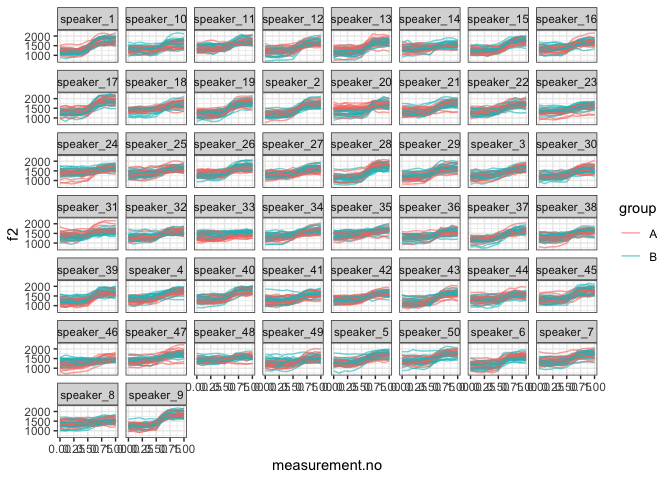

Introduction
------------

This document is a supplement to “Evaluating generalised additive mixed
modelling strategies for dynamic speech analysis,” relating specifically
to the contents of Table 3 in Section 3.3.2. It presents code that
illustrates (i) how the simulated data were generated and (ii) the
models whose performance is summarised Table 3.

Preliminaries
-------------

The code below loads the relevant libraries.

``` r
library(ggplot2)
```

    ## Warning: package 'ggplot2' was built under R version 3.5.2

``` r
library(mgcv)
```

    ## Warning: package 'mgcv' was built under R version 3.5.2

``` r
library(itsadug)
library(MASS)
```

    ## Warning: package 'MASS' was built under R version 3.5.2

Data generation
---------------

The code in this section can be used to create data for either type I or
type II simulations. Set the value of *type* to 1 for type I simulations
and to 2 for type II simulations.

``` r
type = 2
```

The data for this set of simulations consist of simulated f2
trajectories modelled after the diphthong /aI/. In this simulation,
there are 50 different speakers, each represented by 40 trajectories. 20
of these trajectories are assigned to group A and 20 to group B - in
other speakers, these simulations exemplify a within-item design. For
type I simulations, there is no underlying difference between the two
groups. For type II simulations, the underlying trajectories are
slightly different (cf. Section 2.1 in the paper and also the Appendix).

The following code sets the parameters that determine the main
characteristics of the data set.

``` r
# setting time dimension
xs = seq(0,1,0.1)

# population parameters: individual speakers come from this dist
f2_start_mean = 1300
if (type==1) {
  f2_end_1_mean = 1630
  f2_end_2_mean = 1660
} else {
  f2_end_1_mean = 1650
  f2_end_2_mean = 1650
}
f2_start_sd.speaker = 90
f2_end_sd.speaker = 90
# correlation between pairs of parameter values sampled for two groups within same speaker;
# rho = 7/8 means that the sd of the difference between the two groups within
#   the same speaker is 0.5 * the sd of the target values
# in mixed model lingo: the sd of the random slope is half of the sd of the intercept
f2_start_rho.speaker = 7/8
f2_end_rho.speaker = 7/8

# expected value & sd for transition point
x0_mean = 0.6
x0_sd.speaker = 0.020
x0_rho.speaker = 7/8 # same as above
# expected value & sd for steepness (higher -> more steep)
k_mean = 15
k_sd.speaker = 4
k_rho.speaker = 7/8 # same as above

# how much variation within speaker-group pairs? (unchanged from before)
f2_start_sd.traj = 150
f2_end_sd.traj = 150
x0_sd.traj = 0.015
k_sd.traj = 3

# amount of random noise

noise_sd <- 40

n_speakers <- 50
n_trajectories_per_speaker <- 40
```

The code below assembles the data set.

``` r
# assembling trajectories

make_cov_matrix <- function (a.sd, b.sd, rho) {
  matrix(c(a.sd**2, rho*a.sd*b.sd, rho*a.sd*b.sd, b.sd**2), nrow=2)
}

ys_m <- matrix(0, nrow=length(xs), ncol=n_speakers*n_trajectories_per_speaker)
for (i in 1:n_speakers) {
  f2_start.speaker <- mvrnorm(1, rep(f2_start_mean, 2), 
                           make_cov_matrix(f2_start_sd.speaker, f2_start_sd.speaker, f2_start_rho.speaker))
  f2_end.speaker <- mvrnorm(1, c(f2_end_1_mean, f2_end_2_mean), 
                         make_cov_matrix(f2_end_sd.speaker, f2_end_sd.speaker, f2_end_rho.speaker))
  x0.speaker <- mvrnorm(1, rep(x0_mean, 2), 
                     make_cov_matrix(x0_sd.speaker, x0_sd.speaker, x0_rho.speaker))
  k.speaker <- mvrnorm(1, rep(k_mean, 2), 
                     make_cov_matrix(k_sd.speaker, k_sd.speaker, k_rho.speaker))
  for (j in 1:(n_trajectories_per_speaker/2)) {
    # group A
    f2_start <- rnorm(1, f2_start.speaker[1], f2_start_sd.traj)
    f2_end <- rnorm(1, f2_end.speaker[1], f2_end_sd.traj)
    x0 <- rnorm(1, x0.speaker[1], x0_sd.traj)
    k <- rnorm(1, k.speaker[1], k_sd.traj)
    ys_m[,(i-1)*n_trajectories_per_speaker + j*2 - 1] <- ((f2_end - f2_start) / (1 + exp(-k*(xs-x0)))) + f2_start + rnorm(length(xs), 0, noise_sd)
    # group B
    f2_start <- rnorm(1, f2_start.speaker[2], f2_start_sd.traj)
    f2_end <- rnorm(1, f2_end.speaker[2], f2_end_sd.traj)
    x0 <- rnorm(1, x0.speaker[2], x0_sd.traj)
    k <- rnorm(1, k.speaker[2], k_sd.traj)
    ys_m[,(i-1)*n_trajectories_per_speaker + j*2] <- ((f2_end - f2_start) / (1 + exp(-k*(xs-x0)))) + f2_start + rnorm(length(xs), 0, noise_sd)
  }
}

# assembling data set (randomly assigned to categories)
dat <- data.frame(traj=paste("traj_", rep(1:(n_speakers*n_trajectories_per_speaker), each=length(xs)), sep=""),
                  speaker=paste("speaker_", rep(1:n_speakers, each=length(xs)*n_trajectories_per_speaker), sep=""),
                  group=rep(c("A","B"), each=length(xs), times=n_speakers*n_trajectories_per_speaker / 2),
                  measurement.no=xs, 
                  f2=c(ys_m),
                  stringsAsFactors = F
                 )

# setting up different types of grouping factors
dat$group.factor <- as.factor(dat$group)
dat$group.ordered <- as.ordered(dat$group)
contrasts(dat$group.ordered) <- "contr.treatment"
dat$group.bin <- as.numeric(dat$group.factor) - 1

# ids ought to be factors  
dat$traj <- as.factor(dat$traj)
dat$speaker <- as.factor(dat$speaker)
dat$speakerGroup <- interaction(dat$speaker, dat$group)

# add dat$start for AR.start (for autoregressive error models)

dat$start <- dat$measurement.no == 0
```

Here is what the data set looks like. (Note that the difference is very
subtle for type II simulations, and hard to make out in this graph. This
is because otherwise power would be far too high for the simulations.)

``` r
ggplot(dat, aes(x=measurement.no, y=f2, group=traj, col=group)) +
  geom_line(alpha=0.6) +
  facet_wrap(~speaker) +
  theme_bw()
```



Models
------

All the models (and sets of models) from Table 3 are shown below in the
same order as in the table. The numbers in the section headers
correspond to the row numbers.

### SIMPLE RANDOM SMOOTHS: 1. Random smooth by speaker, 3 bs

``` r
rand_smooth_3 <- 
  bam(f2 ~ group.ordered + 
        s(measurement.no, bs = "tp", k = 10) + 
        s(measurement.no, by = group.ordered, bs = "tp", k = 10) + 
        s(measurement.no, speaker, bs = "fs", m = 1, xt = "cr", k = 3), 
      data = dat, 
      method = "fREML", discrete = T, nthreads = 1)
```

    ## Warning in gam.side(sm, X, tol = .Machine$double.eps^0.5): model has
    ## repeated 1-d smooths of same variable.

``` r
summary(rand_smooth_3)
```

    ## 
    ## Family: gaussian 
    ## Link function: identity 
    ## 
    ## Formula:
    ## f2 ~ group.ordered + s(measurement.no, bs = "tp", k = 10) + s(measurement.no, 
    ##     by = group.ordered, bs = "tp", k = 10) + s(measurement.no, 
    ##     speaker, bs = "fs", m = 1, xt = "cr", k = 3)
    ## 
    ## Parametric coefficients:
    ##                Estimate Std. Error t value Pr(>|t|)    
    ## (Intercept)    1427.996      7.837 182.209   <2e-16 ***
    ## group.orderedB    2.776      2.037   1.363    0.173    
    ## ---
    ## Signif. codes:  0 '***' 0.001 '**' 0.01 '*' 0.05 '.' 0.1 ' ' 1
    ## 
    ## Approximate significance of smooth terms:
    ##                                      edf  Ref.df       F  p-value    
    ## s(measurement.no)                  8.588   8.953 307.009  < 2e-16 ***
    ## s(measurement.no):group.orderedB   1.000   1.000   0.218    0.641    
    ## s(measurement.no,speaker)        125.869 148.000  38.883 9.39e-10 ***
    ## ---
    ## Signif. codes:  0 '***' 0.001 '**' 0.01 '*' 0.05 '.' 0.1 ' ' 1
    ## 
    ## R-sq.(adj) =   0.58   Deviance explained = 58.2%
    ## fREML = 1.4183e+05  Scale est. = 22812     n = 22000

### SIMPLE RANDOM SMOOTHS: 2. Random smooth by speaker, 5 bs

``` r
rand_smooth_5 <- 
  bam(f2 ~ group.ordered + 
        s(measurement.no, bs = "tp", k = 10) + 
        s(measurement.no, by = group.ordered, bs = "tp", k = 10) + 
        s(measurement.no, speaker, bs = "fs", m = 1, xt = "cr", k = 5), 
      data = dat, 
      method = "fREML", discrete = T, nthreads = 1)
```

    ## Warning in gam.side(sm, X, tol = .Machine$double.eps^0.5): model has
    ## repeated 1-d smooths of same variable.

``` r
summary(rand_smooth_5)
```

    ## 
    ## Family: gaussian 
    ## Link function: identity 
    ## 
    ## Formula:
    ## f2 ~ group.ordered + s(measurement.no, bs = "tp", k = 10) + s(measurement.no, 
    ##     by = group.ordered, bs = "tp", k = 10) + s(measurement.no, 
    ##     speaker, bs = "fs", m = 1, xt = "cr", k = 5)
    ## 
    ## Parametric coefficients:
    ##                Estimate Std. Error t value Pr(>|t|)    
    ## (Intercept)    1428.030      7.885 181.110   <2e-16 ***
    ## group.orderedB    2.775      2.024   1.371     0.17    
    ## ---
    ## Signif. codes:  0 '***' 0.001 '**' 0.01 '*' 0.05 '.' 0.1 ' ' 1
    ## 
    ## Approximate significance of smooth terms:
    ##                                      edf  Ref.df      F p-value    
    ## s(measurement.no)                  8.581   8.944 147.70  <2e-16 ***
    ## s(measurement.no):group.orderedB   1.002   1.004   0.22    0.64    
    ## s(measurement.no,speaker)        192.025 248.000  21.58  <2e-16 ***
    ## ---
    ## Signif. codes:  0 '***' 0.001 '**' 0.01 '*' 0.05 '.' 0.1 ' ' 1
    ## 
    ## R-sq.(adj) =  0.585   Deviance explained = 58.9%
    ## fREML = 1.4177e+05  Scale est. = 22526     n = 22000

### SIMPLE RANDOM SMOOTHS: 3. Random smooth by speaker, 10 bs

``` r
rand_smooth_10 <- 
  bam(f2 ~ group.ordered + 
        s(measurement.no, bs = "tp", k = 10) + 
        s(measurement.no, by = group.ordered, bs = "tp", k = 10) + 
        s(measurement.no, speaker, bs = "fs", m = 1, xt = "cr", k = 10), 
      data = dat, 
      method = "fREML", discrete = T, nthreads = 1)
```

    ## Warning in gam.side(sm, X, tol = .Machine$double.eps^0.5): model has
    ## repeated 1-d smooths of same variable.

``` r
summary(rand_smooth_10)
```

    ## 
    ## Family: gaussian 
    ## Link function: identity 
    ## 
    ## Formula:
    ## f2 ~ group.ordered + s(measurement.no, bs = "tp", k = 10) + s(measurement.no, 
    ##     by = group.ordered, bs = "tp", k = 10) + s(measurement.no, 
    ##     speaker, bs = "fs", m = 1, xt = "cr", k = 10)
    ## 
    ## Parametric coefficients:
    ##                Estimate Std. Error t value Pr(>|t|)    
    ## (Intercept)    1428.010      7.657 186.490   <2e-16 ***
    ## group.orderedB    2.775      2.025   1.371     0.17    
    ## ---
    ## Signif. codes:  0 '***' 0.001 '**' 0.01 '*' 0.05 '.' 0.1 ' ' 1
    ## 
    ## Approximate significance of smooth terms:
    ##                                      edf  Ref.df      F p-value    
    ## s(measurement.no)                  8.574   8.935 158.10  <2e-16 ***
    ## s(measurement.no):group.orderedB   1.003   1.006   0.22   0.641    
    ## s(measurement.no,speaker)        199.345 498.000  10.71  <2e-16 ***
    ## ---
    ## Signif. codes:  0 '***' 0.001 '**' 0.01 '*' 0.05 '.' 0.1 ' ' 1
    ## 
    ## R-sq.(adj) =  0.585   Deviance explained = 58.9%
    ## fREML = 1.4178e+05  Scale est. = 22541     n = 22000

### RANDOM SMOOTHS + SLOPES: 4. 3 bs

``` r
rand_slope_smooth_3 <- 
  bam(f2 ~ group.ordered + 
        s(measurement.no, bs = "tp", k = 10) + 
        s(measurement.no, by = group.ordered, bs = "tp", k = 10) + 
        s(measurement.no, speaker, bs = "fs", m = 1, xt = "cr", k = 3) +
        s(speaker, group.ordered, bs="re"), 
      data = dat, 
      method = "fREML", discrete = T, nthreads = 1)
summary(rand_slope_smooth_3)
```

    ## 
    ## Family: gaussian 
    ## Link function: identity 
    ## 
    ## Formula:
    ## f2 ~ group.ordered + s(measurement.no, bs = "tp", k = 10) + s(measurement.no, 
    ##     by = group.ordered, bs = "tp", k = 10) + s(measurement.no, 
    ##     speaker, bs = "fs", m = 1, xt = "cr", k = 3) + s(speaker, 
    ##     group.ordered, bs = "re")
    ## 
    ## Parametric coefficients:
    ##                Estimate Std. Error t value Pr(>|t|)    
    ## (Intercept)    1427.993      8.506 167.887   <2e-16 ***
    ## group.orderedB    2.776      6.904   0.402    0.688    
    ## ---
    ## Signif. codes:  0 '***' 0.001 '**' 0.01 '*' 0.05 '.' 0.1 ' ' 1
    ## 
    ## Approximate significance of smooth terms:
    ##                                      edf  Ref.df       F p-value    
    ## s(measurement.no)                  8.596   8.955 312.121  <2e-16 ***
    ## s(measurement.no):group.orderedB   1.000   1.001   0.223   0.637    
    ## s(measurement.no,speaker)        117.311 147.000 155.254   1.000    
    ## s(group.ordered,speaker)          53.897  98.000  77.665  <2e-16 ***
    ## ---
    ## Signif. codes:  0 '***' 0.001 '**' 0.01 '*' 0.05 '.' 0.1 ' ' 1
    ## 
    ## R-sq.(adj) =   0.59   Deviance explained = 59.3%
    ## fREML = 1.4163e+05  Scale est. = 22274     n = 22000

### RANDOM SMOOTHS + SLOPES: 5. 5 bs

``` r
rand_slope_smooth_5 <- 
  bam(f2 ~ group.ordered + 
        s(measurement.no, bs = "tp", k = 10) + 
        s(measurement.no, by = group.ordered, bs = "tp", k = 10) + 
        s(measurement.no, speaker, bs = "fs", m = 1, xt = "cr", k = 5) +
        s(speaker, group.ordered, bs="re"), 
      data = dat, 
      method = "fREML", discrete = T, nthreads = 1)
summary(rand_slope_smooth_5)
```

    ## 
    ## Family: gaussian 
    ## Link function: identity 
    ## 
    ## Formula:
    ## f2 ~ group.ordered + s(measurement.no, bs = "tp", k = 10) + s(measurement.no, 
    ##     by = group.ordered, bs = "tp", k = 10) + s(measurement.no, 
    ##     speaker, bs = "fs", m = 1, xt = "cr", k = 5) + s(speaker, 
    ##     group.ordered, bs = "re")
    ## 
    ## Parametric coefficients:
    ##                Estimate Std. Error t value Pr(>|t|)    
    ## (Intercept)    1428.028      8.551 166.993   <2e-16 ***
    ## group.orderedB    2.776      6.904   0.402    0.688    
    ## ---
    ## Signif. codes:  0 '***' 0.001 '**' 0.01 '*' 0.05 '.' 0.1 ' ' 1
    ## 
    ## Approximate significance of smooth terms:
    ##                                      edf  Ref.df       F  p-value    
    ## s(measurement.no)                  8.589   8.945 147.617  < 2e-16 ***
    ## s(measurement.no):group.orderedB   1.000   1.000   0.226    0.635    
    ## s(measurement.no,speaker)        183.894 248.000  94.502    1.000    
    ## s(group.ordered,speaker)          54.212  98.000  21.999 7.91e-14 ***
    ## ---
    ## Signif. codes:  0 '***' 0.001 '**' 0.01 '*' 0.05 '.' 0.1 ' ' 1
    ## 
    ## R-sq.(adj) =  0.595   Deviance explained =   60%
    ## fREML = 1.4157e+05  Scale est. = 21984     n = 22000

### RANDOM SMOOTHS + SLOPES: 6. 10 bs

``` r
rand_slope_smooth_10 <- 
  bam(f2 ~ group.ordered + 
        s(measurement.no, bs = "tp", k = 10) + 
        s(measurement.no, by = group.ordered, bs = "tp", k = 10) + 
        s(measurement.no, speaker, bs = "fs", m = 1, xt = "cr", k = 10) +
        s(speaker, group.ordered, bs="re"), 
      data = dat, 
      method = "fREML", discrete = T, nthreads = 1)
summary(rand_slope_smooth_10)
```

    ## 
    ## Family: gaussian 
    ## Link function: identity 
    ## 
    ## Formula:
    ## f2 ~ group.ordered + s(measurement.no, bs = "tp", k = 10) + s(measurement.no, 
    ##     by = group.ordered, bs = "tp", k = 10) + s(measurement.no, 
    ##     speaker, bs = "fs", m = 1, xt = "cr", k = 10) + s(speaker, 
    ##     group.ordered, bs = "re")
    ## 
    ## Parametric coefficients:
    ##                Estimate Std. Error t value Pr(>|t|)    
    ## (Intercept)    1428.008      8.339 171.249   <2e-16 ***
    ## group.orderedB    2.775      6.904   0.402    0.688    
    ## ---
    ## Signif. codes:  0 '***' 0.001 '**' 0.01 '*' 0.05 '.' 0.1 ' ' 1
    ## 
    ## Approximate significance of smooth terms:
    ##                                      edf  Ref.df       F p-value    
    ## s(measurement.no)                  8.582   8.936 157.945  <2e-16 ***
    ## s(measurement.no):group.orderedB   1.002   1.005   0.225   0.636    
    ## s(measurement.no,speaker)        191.763 498.000  46.750  <2e-16 ***
    ## s(group.ordered,speaker)          54.319  98.000   5.577  <2e-16 ***
    ## ---
    ## Signif. codes:  0 '***' 0.001 '**' 0.01 '*' 0.05 '.' 0.1 ' ' 1
    ## 
    ## R-sq.(adj) =  0.595   Deviance explained =   60%
    ## fREML = 1.4157e+05  Scale est. = 21999     n = 22000

### ITEM X EFFECT: 7. Item x effect random smooths, 3 bs

``` r
item_x_effect_rand_smooth_3 <- 
  bam(f2 ~ group.ordered + 
        s(measurement.no, bs = "tp", k = 10) + 
        s(measurement.no, by = group.ordered, bs = "tp", k = 10) + 
        s(measurement.no, speakerGroup, bs = "fs", m = 1, xt = "cr", k = 3), 
      data = dat, 
      method = "fREML", discrete = T, nthreads = 1)
```

    ## Warning in gam.side(sm, X, tol = .Machine$double.eps^0.5): model has
    ## repeated 1-d smooths of same variable.

``` r
summary(item_x_effect_rand_smooth_3)
```

    ## 
    ## Family: gaussian 
    ## Link function: identity 
    ## 
    ## Formula:
    ## f2 ~ group.ordered + s(measurement.no, bs = "tp", k = 10) + s(measurement.no, 
    ##     by = group.ordered, bs = "tp", k = 10) + s(measurement.no, 
    ##     speakerGroup, bs = "fs", m = 1, xt = "cr", k = 3)
    ## 
    ## Parametric coefficients:
    ##                Estimate Std. Error t value Pr(>|t|)    
    ## (Intercept)    1426.962      8.275 172.443   <2e-16 ***
    ## group.orderedB    2.796     11.683   0.239    0.811    
    ## ---
    ## Signif. codes:  0 '***' 0.001 '**' 0.01 '*' 0.05 '.' 0.1 ' ' 1
    ## 
    ## Approximate significance of smooth terms:
    ##                                    edf  Ref.df       F p-value    
    ## s(measurement.no)                  8.6   8.956 337.822  <2e-16 ***
    ## s(measurement.no):group.orderedB   1.0   1.001   0.008   0.929    
    ## s(measurement.no,speakerGroup)   226.8 296.000  55.889  <2e-16 ***
    ## ---
    ## Signif. codes:  0 '***' 0.001 '**' 0.01 '*' 0.05 '.' 0.1 ' ' 1
    ## 
    ## R-sq.(adj) =  0.594   Deviance explained = 59.8%
    ## fREML = 1.416e+05  Scale est. = 22049     n = 22000

### ITEM X EFFECT: 8. Item x effect random smooths, 5 bs

``` r
item_x_effect_rand_smooth_5 <- 
  bam(f2 ~ group.ordered + 
        s(measurement.no, bs = "tp", k = 10) + 
        s(measurement.no, by = group.ordered, bs = "tp", k = 10) + 
        s(measurement.no, speakerGroup, bs = "fs", m = 1, xt = "cr", k = 5), 
      data = dat, 
      method = "fREML", discrete = T, nthreads = 1)
```

    ## Warning in gam.side(sm, X, tol = .Machine$double.eps^0.5): model has
    ## repeated 1-d smooths of same variable.

``` r
summary(item_x_effect_rand_smooth_5)
```

    ## 
    ## Family: gaussian 
    ## Link function: identity 
    ## 
    ## Formula:
    ## f2 ~ group.ordered + s(measurement.no, bs = "tp", k = 10) + s(measurement.no, 
    ##     by = group.ordered, bs = "tp", k = 10) + s(measurement.no, 
    ##     speakerGroup, bs = "fs", m = 1, xt = "cr", k = 5)
    ## 
    ## Parametric coefficients:
    ##                Estimate Std. Error t value Pr(>|t|)    
    ## (Intercept)    1426.980      8.278 172.390   <2e-16 ***
    ## group.orderedB    2.759     11.675   0.236    0.813    
    ## ---
    ## Signif. codes:  0 '***' 0.001 '**' 0.01 '*' 0.05 '.' 0.1 ' ' 1
    ## 
    ## Approximate significance of smooth terms:
    ##                                      edf  Ref.df       F p-value    
    ## s(measurement.no)                  8.601   8.954 245.854  <2e-16 ***
    ## s(measurement.no):group.orderedB   1.001   1.002   0.008   0.928    
    ## s(measurement.no,speakerGroup)   300.612 496.000  12.410  <2e-16 ***
    ## ---
    ## Signif. codes:  0 '***' 0.001 '**' 0.01 '*' 0.05 '.' 0.1 ' ' 1
    ## 
    ## R-sq.(adj) =  0.597   Deviance explained = 60.3%
    ## fREML = 1.4158e+05  Scale est. = 21884     n = 22000

### ITEM X EFFECT: 9. Item x effect random smooths, 10 bs

``` r
item_x_effect_rand_smooth_10 <- 
  bam(f2 ~ group.ordered + 
        s(measurement.no, bs = "tp", k = 10) + 
        s(measurement.no, by = group.ordered, bs = "tp", k = 10) + 
        s(measurement.no, speakerGroup, bs = "fs", m = 1, xt = "cr", k = 10), 
      data = dat, 
      method = "fREML", discrete = T, nthreads = 1)
```

    ## Warning in gam.side(sm, X, tol = .Machine$double.eps^0.5): model has
    ## repeated 1-d smooths of same variable.

``` r
summary(item_x_effect_rand_smooth_10)
```

    ## 
    ## Family: gaussian 
    ## Link function: identity 
    ## 
    ## Formula:
    ## f2 ~ group.ordered + s(measurement.no, bs = "tp", k = 10) + s(measurement.no, 
    ##     by = group.ordered, bs = "tp", k = 10) + s(measurement.no, 
    ##     speakerGroup, bs = "fs", m = 1, xt = "cr", k = 10)
    ## 
    ## Parametric coefficients:
    ##                Estimate Std. Error t value Pr(>|t|)    
    ## (Intercept)    1427.004      8.273 172.492   <2e-16 ***
    ## group.orderedB    2.704     11.692   0.231    0.817    
    ## ---
    ## Signif. codes:  0 '***' 0.001 '**' 0.01 '*' 0.05 '.' 0.1 ' ' 1
    ## 
    ## Approximate significance of smooth terms:
    ##                                      edf  Ref.df       F p-value    
    ## s(measurement.no)                  8.599   8.953 263.836  <2e-16 ***
    ## s(measurement.no):group.orderedB   1.002   1.003   0.008   0.929    
    ## s(measurement.no,speakerGroup)   290.761 996.000   6.139  <2e-16 ***
    ## ---
    ## Signif. codes:  0 '***' 0.001 '**' 0.01 '*' 0.05 '.' 0.1 ' ' 1
    ## 
    ## R-sq.(adj) =  0.596   Deviance explained = 60.2%
    ## fREML = 1.4158e+05  Scale est. = 21915     n = 22000

### ITEM BY EFFECT: 10. Item by effect random smooths, 3 bs

``` r
item_by_effect_rand_smooth_3 <- 
  bam(f2 ~ group.ordered + 
        s(measurement.no, bs = "tp", k = 10) + 
        s(measurement.no, by = group.ordered, bs = "tp", k = 10) + 
        s(measurement.no, speaker, by=group.factor, bs = "fs", m = 1, xt = "cr", k = 3), 
      data = dat, 
      method = "fREML", discrete = T, nthreads = 1)
summary(item_by_effect_rand_smooth_3)
```

    ## 
    ## Family: gaussian 
    ## Link function: identity 
    ## 
    ## Formula:
    ## f2 ~ group.ordered + s(measurement.no, bs = "tp", k = 10) + s(measurement.no, 
    ##     by = group.ordered, bs = "tp", k = 10) + s(measurement.no, 
    ##     speaker, by = group.factor, bs = "fs", m = 1, xt = "cr", 
    ##     k = 3)
    ## 
    ## Parametric coefficients:
    ##                Estimate Std. Error t value Pr(>|t|)    
    ## (Intercept)    1431.577      8.410 170.229   <2e-16 ***
    ## group.orderedB    2.889     11.784   0.245    0.806    
    ## ---
    ## Signif. codes:  0 '***' 0.001 '**' 0.01 '*' 0.05 '.' 0.1 ' ' 1
    ## 
    ## Approximate significance of smooth terms:
    ##                                           edf  Ref.df       F p-value    
    ## s(measurement.no)                         8.6   8.956 346.299 < 2e-16 ***
    ## s(measurement.no):group.orderedB          1.0   1.000   0.008   0.929    
    ## s(measurement.no,speaker):group.factorA 106.6 148.000  22.122 2.9e-11 ***
    ## s(measurement.no,speaker):group.factorB 117.5 148.000  36.319 < 2e-16 ***
    ## ---
    ## Signif. codes:  0 '***' 0.001 '**' 0.01 '*' 0.05 '.' 0.1 ' ' 1
    ## 
    ## R-sq.(adj) =  0.594   Deviance explained = 59.8%
    ## fREML = 1.416e+05  Scale est. = 22050     n = 22000

### ITEM BY EFFECT: 11. Item by effect random smooths, 5 bs

``` r
item_by_effect_rand_smooth_5 <- 
  bam(f2 ~ group.ordered + 
        s(measurement.no, bs = "tp", k = 10) + 
        s(measurement.no, by = group.ordered, bs = "tp", k = 10) + 
        s(measurement.no, speaker, by=group.factor, bs = "fs", m = 1, xt = "cr", k = 5), 
      data = dat, 
      method = "fREML", discrete = T, nthreads = 1)
summary(item_by_effect_rand_smooth_5)
```

    ## 
    ## Family: gaussian 
    ## Link function: identity 
    ## 
    ## Formula:
    ## f2 ~ group.ordered + s(measurement.no, bs = "tp", k = 10) + s(measurement.no, 
    ##     by = group.ordered, bs = "tp", k = 10) + s(measurement.no, 
    ##     speaker, by = group.factor, bs = "fs", m = 1, xt = "cr", 
    ##     k = 5)
    ## 
    ## Parametric coefficients:
    ##                Estimate Std. Error t value Pr(>|t|)    
    ## (Intercept)    1431.594      8.381 170.821   <2e-16 ***
    ## group.orderedB    2.849     11.737   0.243    0.808    
    ## ---
    ## Signif. codes:  0 '***' 0.001 '**' 0.01 '*' 0.05 '.' 0.1 ' ' 1
    ## 
    ## Approximate significance of smooth terms:
    ##                                           edf  Ref.df       F p-value    
    ## s(measurement.no)                         8.6   8.955 255.043  <2e-16 ***
    ## s(measurement.no):group.orderedB          1.0   1.000   0.008   0.928    
    ## s(measurement.no,speaker):group.factorA 139.2 248.000  11.646  <2e-16 ***
    ## s(measurement.no,speaker):group.factorB 158.3 248.000  13.158  <2e-16 ***
    ## ---
    ## Signif. codes:  0 '***' 0.001 '**' 0.01 '*' 0.05 '.' 0.1 ' ' 1
    ## 
    ## R-sq.(adj) =  0.597   Deviance explained = 60.3%
    ## fREML = 1.4158e+05  Scale est. = 21887     n = 22000

### ITEM BY EFFECT: 12. Item by effect random smooths, 10 bs

``` r
item_by_effect_rand_smooth_10 <- 
  bam(f2 ~ group.ordered + 
        s(measurement.no, bs = "tp", k = 10) + 
        s(measurement.no, by = group.ordered, bs = "tp", k = 10) + 
        s(measurement.no, speaker, by=group.factor, bs = "fs", m = 1, xt = "cr", k = 10), 
      data = dat, 
      method = "fREML", discrete = T, nthreads = 1)
summary(item_by_effect_rand_smooth_10)
```

    ## 
    ## Family: gaussian 
    ## Link function: identity 
    ## 
    ## Formula:
    ## f2 ~ group.ordered + s(measurement.no, bs = "tp", k = 10) + s(measurement.no, 
    ##     by = group.ordered, bs = "tp", k = 10) + s(measurement.no, 
    ##     speaker, by = group.factor, bs = "fs", m = 1, xt = "cr", 
    ##     k = 10)
    ## 
    ## Parametric coefficients:
    ##                Estimate Std. Error t value Pr(>|t|)    
    ## (Intercept)    1431.605      8.291 172.664   <2e-16 ***
    ## group.orderedB    2.797     11.695   0.239    0.811    
    ## ---
    ## Signif. codes:  0 '***' 0.001 '**' 0.01 '*' 0.05 '.' 0.1 ' ' 1
    ## 
    ## Approximate significance of smooth terms:
    ##                                             edf  Ref.df       F p-value
    ## s(measurement.no)                         8.599   8.953 271.803  <2e-16
    ## s(measurement.no):group.orderedB          1.002   1.003   0.008   0.929
    ## s(measurement.no,speaker):group.factorA 134.692 498.000   5.769  <2e-16
    ## s(measurement.no,speaker):group.factorB 153.974 498.000   6.507  <2e-16
    ##                                            
    ## s(measurement.no)                       ***
    ## s(measurement.no):group.orderedB           
    ## s(measurement.no,speaker):group.factorA ***
    ## s(measurement.no,speaker):group.factorB ***
    ## ---
    ## Signif. codes:  0 '***' 0.001 '**' 0.01 '*' 0.05 '.' 0.1 ' ' 1
    ## 
    ## R-sq.(adj) =  0.596   Deviance explained = 60.2%
    ## fREML = 1.4158e+05  Scale est. = 21916     n = 22000

### REFERENCE/DIFFERENCE: 13. random reference/difference smooths, 3 bs

``` r
reference_difference_rand_smooth_3 <- 
  bam(f2 ~ group.ordered + 
        s(measurement.no, bs = "tp", k = 10) + 
        s(measurement.no, by = group.ordered, bs = "tp", k = 10) + 
        s(measurement.no, speaker, bs = "fs", m = 1, xt = "cr", k = 3) +
        s(measurement.no, speaker, by=group.ordered, bs = "fs", m = 1, xt = "cr", k = 3),
      data = dat, 
      method = "fREML", discrete = T, nthreads = 1)
```

    ## Warning in gam.side(sm, X, tol = .Machine$double.eps^0.5): model has
    ## repeated 1-d smooths of same variable.

``` r
summary(reference_difference_rand_smooth_3)
```

    ## 
    ## Family: gaussian 
    ## Link function: identity 
    ## 
    ## Formula:
    ## f2 ~ group.ordered + s(measurement.no, bs = "tp", k = 10) + s(measurement.no, 
    ##     by = group.ordered, bs = "tp", k = 10) + s(measurement.no, 
    ##     speaker, bs = "fs", m = 1, xt = "cr", k = 3) + s(measurement.no, 
    ##     speaker, by = group.ordered, bs = "fs", m = 1, xt = "cr", 
    ##     k = 3)
    ## 
    ## Parametric coefficients:
    ##                Estimate Std. Error t value Pr(>|t|)    
    ## (Intercept)    1427.992      8.462 168.751   <2e-16 ***
    ## group.orderedB    2.776      6.652   0.417    0.676    
    ## ---
    ## Signif. codes:  0 '***' 0.001 '**' 0.01 '*' 0.05 '.' 0.1 ' ' 1
    ## 
    ## Approximate significance of smooth terms:
    ##                                             edf  Ref.df       F  p-value
    ## s(measurement.no)                          8.60   8.956 316.566  < 2e-16
    ## s(measurement.no):group.orderedB           1.00   1.000   0.038    0.846
    ## s(measurement.no,speaker)                125.12 148.000  20.739  < 2e-16
    ## s(measurement.no,speaker):group.orderedB  85.55 148.000   6.137 1.99e-05
    ##                                             
    ## s(measurement.no)                        ***
    ## s(measurement.no):group.orderedB            
    ## s(measurement.no,speaker)                ***
    ## s(measurement.no,speaker):group.orderedB ***
    ## ---
    ## Signif. codes:  0 '***' 0.001 '**' 0.01 '*' 0.05 '.' 0.1 ' ' 1
    ## 
    ## R-sq.(adj) =  0.594   Deviance explained = 59.8%
    ## fREML = 1.4155e+05  Scale est. = 22028     n = 22000

### REFERENCE/DIFFERENCE: 14. random reference/difference smooths, 5 bs

``` r
reference_difference_rand_smooth_5 <- 
  bam(f2 ~ group.ordered + 
        s(measurement.no, bs = "tp", k = 10) + 
        s(measurement.no, by = group.ordered, bs = "tp", k = 10) + 
        s(measurement.no, speaker, bs = "fs", m = 1, xt = "cr", k = 5) +
        s(measurement.no, speaker, by=group.ordered, bs = "fs", m = 1, xt = "cr", k = 5),
      data = dat, 
      method = "fREML", discrete = T, nthreads = 1)
```

    ## Warning in gam.side(sm, X, tol = .Machine$double.eps^0.5): model has
    ## repeated 1-d smooths of same variable.

``` r
summary(reference_difference_rand_smooth_5)
```

    ## 
    ## Family: gaussian 
    ## Link function: identity 
    ## 
    ## Formula:
    ## f2 ~ group.ordered + s(measurement.no, bs = "tp", k = 10) + s(measurement.no, 
    ##     by = group.ordered, bs = "tp", k = 10) + s(measurement.no, 
    ##     speaker, bs = "fs", m = 1, xt = "cr", k = 5) + s(measurement.no, 
    ##     speaker, by = group.ordered, bs = "fs", m = 1, xt = "cr", 
    ##     k = 5)
    ## 
    ## Parametric coefficients:
    ##                Estimate Std. Error t value Pr(>|t|)    
    ## (Intercept)    1428.027      8.456 168.874   <2e-16 ***
    ## group.orderedB    2.776      6.679   0.416    0.678    
    ## ---
    ## Signif. codes:  0 '***' 0.001 '**' 0.01 '*' 0.05 '.' 0.1 ' ' 1
    ## 
    ## Approximate significance of smooth terms:
    ##                                              edf  Ref.df       F p-value
    ## s(measurement.no)                          8.593   8.946 149.064  <2e-16
    ## s(measurement.no):group.orderedB           1.000   1.000   0.038   0.846
    ## s(measurement.no,speaker)                192.256 248.000  13.405  <2e-16
    ## s(measurement.no,speaker):group.orderedB  85.734 248.000   3.160  <2e-16
    ##                                             
    ## s(measurement.no)                        ***
    ## s(measurement.no):group.orderedB            
    ## s(measurement.no,speaker)                ***
    ## s(measurement.no,speaker):group.orderedB ***
    ## ---
    ## Signif. codes:  0 '***' 0.001 '**' 0.01 '*' 0.05 '.' 0.1 ' ' 1
    ## 
    ## R-sq.(adj) =    0.6   Deviance explained = 60.5%
    ## fREML = 1.4149e+05  Scale est. = 21736     n = 22000

### REFERENCE/DIFFERENCE: 15. random reference/difference smooths, 10 bs

``` r
reference_difference_rand_smooth_10 <- 
  bam(f2 ~ group.ordered + 
        s(measurement.no, bs = "tp", k = 10) + 
        s(measurement.no, by = group.ordered, bs = "tp", k = 10) + 
        s(measurement.no, speaker, bs = "fs", m = 1, xt = "cr", k = 10) +
        s(measurement.no, speaker, by=group.ordered, bs = "fs", m = 1, xt = "cr", k = 10),
      data = dat, 
      method = "fREML", discrete = T, nthreads = 1)
```

    ## Warning in gam.side(sm, X, tol = .Machine$double.eps^0.5): model has
    ## repeated 1-d smooths of same variable.

``` r
summary(reference_difference_rand_smooth_10)
```

    ## 
    ## Family: gaussian 
    ## Link function: identity 
    ## 
    ## Formula:
    ## f2 ~ group.ordered + s(measurement.no, bs = "tp", k = 10) + s(measurement.no, 
    ##     by = group.ordered, bs = "tp", k = 10) + s(measurement.no, 
    ##     speaker, bs = "fs", m = 1, xt = "cr", k = 10) + s(measurement.no, 
    ##     speaker, by = group.ordered, bs = "fs", m = 1, xt = "cr", 
    ##     k = 10)
    ## 
    ## Parametric coefficients:
    ##                Estimate Std. Error t value Pr(>|t|)    
    ## (Intercept)    1428.007      8.214 173.854   <2e-16 ***
    ## group.orderedB    2.776      6.735   0.412     0.68    
    ## ---
    ## Signif. codes:  0 '***' 0.001 '**' 0.01 '*' 0.05 '.' 0.1 ' ' 1
    ## 
    ## Approximate significance of smooth terms:
    ##                                              edf  Ref.df       F p-value
    ## s(measurement.no)                          8.586   8.937 159.505  <2e-16
    ## s(measurement.no):group.orderedB           1.000   1.000   0.038   0.846
    ## s(measurement.no,speaker)                200.664 498.000   6.640  <2e-16
    ## s(measurement.no,speaker):group.orderedB  85.789 498.000   1.574  <2e-16
    ##                                             
    ## s(measurement.no)                        ***
    ## s(measurement.no):group.orderedB            
    ## s(measurement.no,speaker)                ***
    ## s(measurement.no,speaker):group.orderedB ***
    ## ---
    ## Signif. codes:  0 '***' 0.001 '**' 0.01 '*' 0.05 '.' 0.1 ' ' 1
    ## 
    ## R-sq.(adj) =  0.599   Deviance explained = 60.5%
    ## fREML = 1.415e+05  Scale est. = 21750     n = 22000
