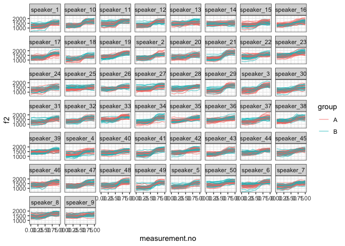

Introduction
------------

This document is a supplement to “Evaluating generalised additive mixed
modelling strategies for dynamic speech analysis,” relating specifically
to the contents of Table 3 in Section 3.3.2. It presents code that
illustrates (i) how the simulated data were generated and (ii) the
models whose performance is summarised Table 3.

Preliminaries
-------------

The code below loads the relevant libraries.

``` r
library(ggplot2)
```

    ## Warning: package 'ggplot2' was built under R version 3.5.2

``` r
library(mgcv)
```

    ## Warning: package 'mgcv' was built under R version 3.5.2

``` r
library(itsadug)
library(MASS)
```

    ## Warning: package 'MASS' was built under R version 3.5.2

``` r
library(lme4)
```

    ## Warning: package 'lme4' was built under R version 3.5.2

Data generation
---------------

The code in this section can be used to create data for either type I or
type II simulations. Set the value of *type* to 1 for type I simulations
and to 2 for type II simulations.

``` r
type = 2
```

The data for this set of simulations consist of simulated f2
trajectories modelled after the diphthong /aI/. In this simulation,
there are 50 different speakers, each represented by 40 trajectories. 20
of these trajectories are assigned to group A and 20 to group B - in
other speakers, these simulations exemplify a within-item design. For
type I simulations, there is no underlying difference between the two
groups. For type II simulations, the underlying trajectories are
slightly different (cf. Section 2.1 in the paper and also the Appendix).

The following code sets the parameters that determine the main
characteristics of the data set.

``` r
# setting time dimension
xs = seq(0,1,0.1)

# population parameters: individual speakers come from this dist
f2_start_mean = 1300
if (type==1) {
  f2_end_1_mean = 1630
  f2_end_2_mean = 1660
} else {
  f2_end_1_mean = 1650
  f2_end_2_mean = 1650
}
f2_start_sd.speaker = 90
f2_end_sd.speaker = 90
# correlation between pairs of parameter values sampled for two groups within same speaker;
# rho = 7/8 means that the sd of the difference between the two groups within
#   the same speaker is 0.5 * the sd of the target values
# in mixed model lingo: the sd of the random slope is half of the sd of the intercept
f2_start_rho.speaker = 7/8
f2_end_rho.speaker = 7/8

# expected value & sd for transition point
x0_mean = 0.6
x0_sd.speaker = 0.020
x0_rho.speaker = 7/8 # same as above
# expected value & sd for steepness (higher -> more steep)
k_mean = 15
k_sd.speaker = 4
k_rho.speaker = 7/8 # same as above

# how much variation within speaker-group pairs? (unchanged from before)
f2_start_sd.traj = 150
f2_end_sd.traj = 150
x0_sd.traj = 0.015
k_sd.traj = 3

# amount of random noise

noise_sd <- 40

n_speakers <- 50
n_trajectories_per_speaker <- 40
```

The code below assembles the data set.

``` r
# assembling trajectories

make_cov_matrix <- function (a.sd, b.sd, rho) {
  matrix(c(a.sd**2, rho*a.sd*b.sd, rho*a.sd*b.sd, b.sd**2), nrow=2)
}

ys_m <- matrix(0, nrow=length(xs), ncol=n_speakers*n_trajectories_per_speaker)
for (i in 1:n_speakers) {
  f2_start.speaker <- mvrnorm(1, rep(f2_start_mean, 2), 
                           make_cov_matrix(f2_start_sd.speaker, f2_start_sd.speaker, f2_start_rho.speaker))
  f2_end.speaker <- mvrnorm(1, c(f2_end_1_mean, f2_end_2_mean), 
                         make_cov_matrix(f2_end_sd.speaker, f2_end_sd.speaker, f2_end_rho.speaker))
  x0.speaker <- mvrnorm(1, rep(x0_mean, 2), 
                     make_cov_matrix(x0_sd.speaker, x0_sd.speaker, x0_rho.speaker))
  k.speaker <- mvrnorm(1, rep(k_mean, 2), 
                     make_cov_matrix(k_sd.speaker, k_sd.speaker, k_rho.speaker))
  for (j in 1:(n_trajectories_per_speaker/2)) {
    # group A
    f2_start <- rnorm(1, f2_start.speaker[1], f2_start_sd.traj)
    f2_end <- rnorm(1, f2_end.speaker[1], f2_end_sd.traj)
    x0 <- rnorm(1, x0.speaker[1], x0_sd.traj)
    k <- rnorm(1, k.speaker[1], k_sd.traj)
    ys_m[,(i-1)*n_trajectories_per_speaker + j*2 - 1] <- ((f2_end - f2_start) / (1 + exp(-k*(xs-x0)))) + f2_start + rnorm(length(xs), 0, noise_sd)
    # group B
    f2_start <- rnorm(1, f2_start.speaker[2], f2_start_sd.traj)
    f2_end <- rnorm(1, f2_end.speaker[2], f2_end_sd.traj)
    x0 <- rnorm(1, x0.speaker[2], x0_sd.traj)
    k <- rnorm(1, k.speaker[2], k_sd.traj)
    ys_m[,(i-1)*n_trajectories_per_speaker + j*2] <- ((f2_end - f2_start) / (1 + exp(-k*(xs-x0)))) + f2_start + rnorm(length(xs), 0, noise_sd)
  }
}

# assembling data set (randomly assigned to categories)
dat <- data.frame(traj=paste("traj_", rep(1:(n_speakers*n_trajectories_per_speaker), each=length(xs)), sep=""),
                  speaker=paste("speaker_", rep(1:n_speakers, each=length(xs)*n_trajectories_per_speaker), sep=""),
                  group=rep(c("A","B"), each=length(xs), times=n_speakers*n_trajectories_per_speaker / 2),
                  measurement.no=xs, 
                  f2=c(ys_m),
                  stringsAsFactors = F
                 )

# setting up different types of grouping factors
dat$group.factor <- as.factor(dat$group)
dat$group.ordered <- as.ordered(dat$group)
contrasts(dat$group.ordered) <- "contr.treatment"
dat$group.bin <- as.numeric(dat$group.factor) - 1

# ids ought to be factors  
dat$traj <- as.factor(dat$traj)
dat$speaker <- as.factor(dat$speaker)
dat$speakerGroup <- interaction(dat$speaker, dat$group)

# add dat$start for AR.start (for autoregressive error models)

dat$start <- dat$measurement.no == 0
```

Here is what the data set looks like. (Note that the difference is very
subtle for type II simulations, and hard to make out in this graph. This
is because otherwise power would be far too high for the simulations.)

``` r
ggplot(dat, aes(x=measurement.no, y=f2, group=traj, col=group)) +
  geom_line(alpha=0.6) +
  facet_wrap(~speaker) +
  theme_bw()
```



Models
------

All the models (and sets of models) from Table 3 are shown below in the
same order as in the table. The numbers in the section headers
correspond to the row numbers.

### SIMPLE RANDOM SMOOTHS: 1. Random smooth by speaker, 3 bs

``` r
rand_smooth_3 <- 
  bam(f2 ~ group.ordered + 
        s(measurement.no, bs = "tp", k = 10) + 
        s(measurement.no, by = group.ordered, bs = "tp", k = 10) + 
        s(measurement.no, speaker, bs = "fs", m = 1, xt = "cr", k = 3), 
      data = dat, 
      method = "fREML", discrete = T, nthreads = 1)
```

    ## Warning in gam.side(sm, X, tol = .Machine$double.eps^0.5): model has
    ## repeated 1-d smooths of same variable.

``` r
summary(rand_smooth_3)
```

    ## 
    ## Family: gaussian 
    ## Link function: identity 
    ## 
    ## Formula:
    ## f2 ~ group.ordered + s(measurement.no, bs = "tp", k = 10) + s(measurement.no, 
    ##     by = group.ordered, bs = "tp", k = 10) + s(measurement.no, 
    ##     speaker, bs = "fs", m = 1, xt = "cr", k = 3)
    ## 
    ## Parametric coefficients:
    ##                Estimate Std. Error t value Pr(>|t|)    
    ## (Intercept)    1428.450     10.125 141.080   <2e-16 ***
    ## group.orderedB   19.470      2.031   9.588   <2e-16 ***
    ## ---
    ## Signif. codes:  0 '***' 0.001 '**' 0.01 '*' 0.05 '.' 0.1 ' ' 1
    ## 
    ## Approximate significance of smooth terms:
    ##                                     edf  Ref.df       F p-value    
    ## s(measurement.no)                  8.53   8.939 268.137  <2e-16 ***
    ## s(measurement.no):group.orderedB   1.00   1.001   0.809   0.368    
    ## s(measurement.no,speaker)        126.72 148.000 367.487  <2e-16 ***
    ## ---
    ## Signif. codes:  0 '***' 0.001 '**' 0.01 '*' 0.05 '.' 0.1 ' ' 1
    ## 
    ## R-sq.(adj) =  0.565   Deviance explained = 56.8%
    ## fREML = 1.4177e+05  Scale est. = 22682     n = 22000

### SIMPLE RANDOM SMOOTHS: 2. Random smooth by speaker, 5 bs

``` r
rand_smooth_5 <- 
  bam(f2 ~ group.ordered + 
        s(measurement.no, bs = "tp", k = 10) + 
        s(measurement.no, by = group.ordered, bs = "tp", k = 10) + 
        s(measurement.no, speaker, bs = "fs", m = 1, xt = "cr", k = 5), 
      data = dat, 
      method = "fREML", discrete = T, nthreads = 1)
```

    ## Warning in gam.side(sm, X, tol = .Machine$double.eps^0.5): model has
    ## repeated 1-d smooths of same variable.

``` r
summary(rand_smooth_5)
```

    ## 
    ## Family: gaussian 
    ## Link function: identity 
    ## 
    ## Formula:
    ## f2 ~ group.ordered + s(measurement.no, bs = "tp", k = 10) + s(measurement.no, 
    ##     by = group.ordered, bs = "tp", k = 10) + s(measurement.no, 
    ##     speaker, bs = "fs", m = 1, xt = "cr", k = 5)
    ## 
    ## Parametric coefficients:
    ##                Estimate Std. Error t value Pr(>|t|)    
    ## (Intercept)    1428.463     10.255 139.298   <2e-16 ***
    ## group.orderedB   19.470      2.023   9.622   <2e-16 ***
    ## ---
    ## Signif. codes:  0 '***' 0.001 '**' 0.01 '*' 0.05 '.' 0.1 ' ' 1
    ## 
    ## Approximate significance of smooth terms:
    ##                                      edf  Ref.df       F p-value    
    ## s(measurement.no)                  8.526   8.934 163.621  <2e-16 ***
    ## s(measurement.no):group.orderedB   1.003   1.006   0.811   0.368    
    ## s(measurement.no,speaker)        176.297 248.000  28.826  <2e-16 ***
    ## ---
    ## Signif. codes:  0 '***' 0.001 '**' 0.01 '*' 0.05 '.' 0.1 ' ' 1
    ## 
    ## R-sq.(adj) =  0.569   Deviance explained = 57.2%
    ## fREML = 1.4175e+05  Scale est. = 22516     n = 22000

### SIMPLE RANDOM SMOOTHS: 3. Random smooth by speaker, 10 bs

``` r
rand_smooth_10 <- 
  bam(f2 ~ group.ordered + 
        s(measurement.no, bs = "tp", k = 10) + 
        s(measurement.no, by = group.ordered, bs = "tp", k = 10) + 
        s(measurement.no, speaker, bs = "fs", m = 1, xt = "cr", k = 10), 
      data = dat, 
      method = "fREML", discrete = T, nthreads = 1)
```

    ## Warning in gam.side(sm, X, tol = .Machine$double.eps^0.5): model has
    ## repeated 1-d smooths of same variable.

``` r
summary(rand_smooth_10)
```

    ## 
    ## Family: gaussian 
    ## Link function: identity 
    ## 
    ## Formula:
    ## f2 ~ group.ordered + s(measurement.no, bs = "tp", k = 10) + s(measurement.no, 
    ##     by = group.ordered, bs = "tp", k = 10) + s(measurement.no, 
    ##     speaker, bs = "fs", m = 1, xt = "cr", k = 10)
    ## 
    ## Parametric coefficients:
    ##                Estimate Std. Error t value Pr(>|t|)    
    ## (Intercept)    1428.451     10.286 138.870   <2e-16 ***
    ## group.orderedB   19.470      2.024   9.619   <2e-16 ***
    ## ---
    ## Signif. codes:  0 '***' 0.001 '**' 0.01 '*' 0.05 '.' 0.1 ' ' 1
    ## 
    ## Approximate significance of smooth terms:
    ##                                      edf  Ref.df       F p-value    
    ## s(measurement.no)                  8.522   8.929 176.166  <2e-16 ***
    ## s(measurement.no):group.orderedB   1.000   1.001   0.814   0.367    
    ## s(measurement.no,speaker)        176.706 498.000  14.307  <2e-16 ***
    ## ---
    ## Signif. codes:  0 '***' 0.001 '**' 0.01 '*' 0.05 '.' 0.1 ' ' 1
    ## 
    ## R-sq.(adj) =  0.568   Deviance explained = 57.2%
    ## fREML = 1.4175e+05  Scale est. = 22535     n = 22000

### RANDOM SMOOTHS + SLOPES: 4. 3 bs

``` r
rand_slope_smooth_3 <- 
  bam(f2 ~ group.ordered + 
        s(measurement.no, bs = "tp", k = 10) + 
        s(measurement.no, by = group.ordered, bs = "tp", k = 10) + 
        s(measurement.no, speaker, bs = "fs", m = 1, xt = "cr", k = 3) +
        s(speaker, group.ordered, bs="re"), 
      data = dat, 
      method = "fREML", discrete = T, nthreads = 1)
summary(rand_slope_smooth_3)
```

    ## 
    ## Family: gaussian 
    ## Link function: identity 
    ## 
    ## Formula:
    ## f2 ~ group.ordered + s(measurement.no, bs = "tp", k = 10) + s(measurement.no, 
    ##     by = group.ordered, bs = "tp", k = 10) + s(measurement.no, 
    ##     speaker, bs = "fs", m = 1, xt = "cr", k = 3) + s(speaker, 
    ##     group.ordered, bs = "re")
    ## 
    ## Parametric coefficients:
    ##                Estimate Std. Error t value Pr(>|t|)    
    ## (Intercept)    1428.448     10.543  135.49  < 2e-16 ***
    ## group.orderedB   19.470      6.221    3.13  0.00175 ** 
    ## ---
    ## Signif. codes:  0 '***' 0.001 '**' 0.01 '*' 0.05 '.' 0.1 ' ' 1
    ## 
    ## Approximate significance of smooth terms:
    ##                                      edf  Ref.df       F p-value    
    ## s(measurement.no)                  8.538   8.941 271.595  <2e-16 ***
    ## s(measurement.no):group.orderedB   1.000   1.001   0.825   0.364    
    ## s(measurement.no,speaker)        122.854 147.000 287.639   1.000    
    ## s(group.ordered,speaker)          48.121  98.000  74.500  <2e-16 ***
    ## ---
    ## Signif. codes:  0 '***' 0.001 '**' 0.01 '*' 0.05 '.' 0.1 ' ' 1
    ## 
    ## R-sq.(adj) =  0.574   Deviance explained = 57.7%
    ## fREML = 1.4162e+05  Scale est. = 22254     n = 22000

### RANDOM SMOOTHS + SLOPES: 5. 5 bs

``` r
rand_slope_smooth_5 <- 
  bam(f2 ~ group.ordered + 
        s(measurement.no, bs = "tp", k = 10) + 
        s(measurement.no, by = group.ordered, bs = "tp", k = 10) + 
        s(measurement.no, speaker, bs = "fs", m = 1, xt = "cr", k = 5) +
        s(speaker, group.ordered, bs="re"), 
      data = dat, 
      method = "fREML", discrete = T, nthreads = 1)
summary(rand_slope_smooth_5)
```

    ## 
    ## Family: gaussian 
    ## Link function: identity 
    ## 
    ## Formula:
    ## f2 ~ group.ordered + s(measurement.no, bs = "tp", k = 10) + s(measurement.no, 
    ##     by = group.ordered, bs = "tp", k = 10) + s(measurement.no, 
    ##     speaker, bs = "fs", m = 1, xt = "cr", k = 5) + s(speaker, 
    ##     group.ordered, bs = "re")
    ## 
    ## Parametric coefficients:
    ##                Estimate Std. Error t value Pr(>|t|)    
    ## (Intercept)    1428.461     10.671  133.86  < 2e-16 ***
    ## group.orderedB   19.470      6.221    3.13  0.00175 ** 
    ## ---
    ## Signif. codes:  0 '***' 0.001 '**' 0.01 '*' 0.05 '.' 0.1 ' ' 1
    ## 
    ## Approximate significance of smooth terms:
    ##                                      edf  Ref.df       F p-value    
    ## s(measurement.no)                  8.534   8.935 163.218  <2e-16 ***
    ## s(measurement.no):group.orderedB   1.000   1.000   0.831   0.362    
    ## s(measurement.no,speaker)        173.454 248.000 174.083   1.000    
    ## s(group.ordered,speaker)          48.080  98.000  31.803  <2e-16 ***
    ## ---
    ## Signif. codes:  0 '***' 0.001 '**' 0.01 '*' 0.05 '.' 0.1 ' ' 1
    ## 
    ## R-sq.(adj) =  0.577   Deviance explained = 58.1%
    ## fREML = 1.4159e+05  Scale est. = 22085     n = 22000

### RANDOM SMOOTHS + SLOPES: 6. 10 bs

``` r
rand_slope_smooth_10 <- 
  bam(f2 ~ group.ordered + 
        s(measurement.no, bs = "tp", k = 10) + 
        s(measurement.no, by = group.ordered, bs = "tp", k = 10) + 
        s(measurement.no, speaker, bs = "fs", m = 1, xt = "cr", k = 10) +
        s(speaker, group.ordered, bs="re"), 
      data = dat, 
      method = "fREML", discrete = T, nthreads = 1)
summary(rand_slope_smooth_10)
```

    ## 
    ## Family: gaussian 
    ## Link function: identity 
    ## 
    ## Formula:
    ## f2 ~ group.ordered + s(measurement.no, bs = "tp", k = 10) + s(measurement.no, 
    ##     by = group.ordered, bs = "tp", k = 10) + s(measurement.no, 
    ##     speaker, bs = "fs", m = 1, xt = "cr", k = 10) + s(speaker, 
    ##     group.ordered, bs = "re")
    ## 
    ## Parametric coefficients:
    ##                Estimate Std. Error t value Pr(>|t|)    
    ## (Intercept)    1428.449     10.699  133.51  < 2e-16 ***
    ## group.orderedB   19.470      6.221    3.13  0.00175 ** 
    ## ---
    ## Signif. codes:  0 '***' 0.001 '**' 0.01 '*' 0.05 '.' 0.1 ' ' 1
    ## 
    ## Approximate significance of smooth terms:
    ##                                      edf  Ref.df      F p-value    
    ## s(measurement.no)                  8.529   8.930 175.76  <2e-16 ***
    ## s(measurement.no):group.orderedB   1.001   1.001   0.83   0.362    
    ## s(measurement.no,speaker)        174.367 498.000  86.58  <2e-16 ***
    ## s(group.ordered,speaker)          47.989  98.000   4.36  <2e-16 ***
    ## ---
    ## Signif. codes:  0 '***' 0.001 '**' 0.01 '*' 0.05 '.' 0.1 ' ' 1
    ## 
    ## R-sq.(adj) =  0.577   Deviance explained = 58.1%
    ## fREML = 1.416e+05  Scale est. = 22103     n = 22000

### ITEM X EFFECT: 7. Item x effect random smooths, 3 bs

``` r
item_x_effect_rand_smooth_3 <- 
  bam(f2 ~ group.ordered + 
        s(measurement.no, bs = "tp", k = 10) + 
        s(measurement.no, by = group.ordered, bs = "tp", k = 10) + 
        s(measurement.no, speakerGroup, bs = "fs", m = 1, xt = "cr", k = 3), 
      data = dat, 
      method = "fREML", discrete = T, nthreads = 1)
```

    ## Warning in gam.side(sm, X, tol = .Machine$double.eps^0.5): model has
    ## repeated 1-d smooths of same variable.

``` r
summary(item_x_effect_rand_smooth_3)
```

    ## 
    ## Family: gaussian 
    ## Link function: identity 
    ## 
    ## Formula:
    ## f2 ~ group.ordered + s(measurement.no, bs = "tp", k = 10) + s(measurement.no, 
    ##     by = group.ordered, bs = "tp", k = 10) + s(measurement.no, 
    ##     speakerGroup, bs = "fs", m = 1, xt = "cr", k = 3)
    ## 
    ## Parametric coefficients:
    ##                Estimate Std. Error t value Pr(>|t|)    
    ## (Intercept)     1427.47      10.69 133.518   <2e-16 ***
    ## group.orderedB    19.29      15.10   1.277    0.201    
    ## ---
    ## Signif. codes:  0 '***' 0.001 '**' 0.01 '*' 0.05 '.' 0.1 ' ' 1
    ## 
    ## Approximate significance of smooth terms:
    ##                                      edf  Ref.df       F p-value    
    ## s(measurement.no)                  8.543   8.942 291.232  <2e-16 ***
    ## s(measurement.no):group.orderedB   1.000   1.000   0.035   0.851    
    ## s(measurement.no,speakerGroup)   228.622 296.000  33.868  <2e-16 ***
    ## ---
    ## Signif. codes:  0 '***' 0.001 '**' 0.01 '*' 0.05 '.' 0.1 ' ' 1
    ## 
    ## R-sq.(adj) =  0.579   Deviance explained = 58.3%
    ## fREML = 1.4159e+05  Scale est. = 21989     n = 22000

### ITEM X EFFECT: 8. Item x effect random smooths, 5 bs

``` r
item_x_effect_rand_smooth_5 <- 
  bam(f2 ~ group.ordered + 
        s(measurement.no, bs = "tp", k = 10) + 
        s(measurement.no, by = group.ordered, bs = "tp", k = 10) + 
        s(measurement.no, speakerGroup, bs = "fs", m = 1, xt = "cr", k = 5), 
      data = dat, 
      method = "fREML", discrete = T, nthreads = 1)
```

    ## Warning in gam.side(sm, X, tol = .Machine$double.eps^0.5): model has
    ## repeated 1-d smooths of same variable.

``` r
summary(item_x_effect_rand_smooth_5)
```

    ## 
    ## Family: gaussian 
    ## Link function: identity 
    ## 
    ## Formula:
    ## f2 ~ group.ordered + s(measurement.no, bs = "tp", k = 10) + s(measurement.no, 
    ##     by = group.ordered, bs = "tp", k = 10) + s(measurement.no, 
    ##     speakerGroup, bs = "fs", m = 1, xt = "cr", k = 5)
    ## 
    ## Parametric coefficients:
    ##                Estimate Std. Error t value Pr(>|t|)    
    ## (Intercept)     1427.45      10.74 132.853   <2e-16 ***
    ## group.orderedB    19.32      15.18   1.272    0.203    
    ## ---
    ## Signif. codes:  0 '***' 0.001 '**' 0.01 '*' 0.05 '.' 0.1 ' ' 1
    ## 
    ## Approximate significance of smooth terms:
    ##                                      edf  Ref.df       F p-value    
    ## s(measurement.no)                  8.543   8.942 252.934  <2e-16 ***
    ## s(measurement.no):group.orderedB   1.000   1.000   0.038   0.846    
    ## s(measurement.no,speakerGroup)   264.550 496.000  16.004  <2e-16 ***
    ## ---
    ## Signif. codes:  0 '***' 0.001 '**' 0.01 '*' 0.05 '.' 0.1 ' ' 1
    ## 
    ## R-sq.(adj) =   0.58   Deviance explained = 58.5%
    ## fREML = 1.4158e+05  Scale est. = 21923     n = 22000

### ITEM X EFFECT: 9. Item x effect random smooths, 10 bs

``` r
item_x_effect_rand_smooth_10 <- 
  bam(f2 ~ group.ordered + 
        s(measurement.no, bs = "tp", k = 10) + 
        s(measurement.no, by = group.ordered, bs = "tp", k = 10) + 
        s(measurement.no, speakerGroup, bs = "fs", m = 1, xt = "cr", k = 10), 
      data = dat, 
      method = "fREML", discrete = T, nthreads = 1)
```

    ## Warning in gam.side(sm, X, tol = .Machine$double.eps^0.5): model has
    ## repeated 1-d smooths of same variable.

``` r
summary(item_x_effect_rand_smooth_10)
```

    ## 
    ## Family: gaussian 
    ## Link function: identity 
    ## 
    ## Formula:
    ## f2 ~ group.ordered + s(measurement.no, bs = "tp", k = 10) + s(measurement.no, 
    ##     by = group.ordered, bs = "tp", k = 10) + s(measurement.no, 
    ##     speakerGroup, bs = "fs", m = 1, xt = "cr", k = 10)
    ## 
    ## Parametric coefficients:
    ##                Estimate Std. Error t value Pr(>|t|)    
    ## (Intercept)     1427.45      10.84 131.679   <2e-16 ***
    ## group.orderedB    19.32      15.33   1.261    0.207    
    ## ---
    ## Signif. codes:  0 '***' 0.001 '**' 0.01 '*' 0.05 '.' 0.1 ' ' 1
    ## 
    ## Approximate significance of smooth terms:
    ##                                      edf  Ref.df       F p-value    
    ## s(measurement.no)                  8.542   8.941 261.435  <2e-16 ***
    ## s(measurement.no):group.orderedB   1.001   1.002   0.035   0.851    
    ## s(measurement.no,speakerGroup)   258.647 996.000   7.951  <2e-16 ***
    ## ---
    ## Signif. codes:  0 '***' 0.001 '**' 0.01 '*' 0.05 '.' 0.1 ' ' 1
    ## 
    ## R-sq.(adj) =   0.58   Deviance explained = 58.5%
    ## fREML = 1.4158e+05  Scale est. = 21937     n = 22000

### ITEM BY EFFECT: 10. Item by effect random smooths, 3 bs

``` r
item_by_effect_rand_smooth_3 <- 
  bam(f2 ~ group.ordered + 
        s(measurement.no, bs = "tp", k = 10) + 
        s(measurement.no, by = group.ordered, bs = "tp", k = 10) + 
        s(measurement.no, speaker, by=group.factor, bs = "fs", m = 1, xt = "cr", k = 3), 
      data = dat, 
      method = "fREML", discrete = T, nthreads = 1)
summary(item_by_effect_rand_smooth_3)
```

    ## 
    ## Family: gaussian 
    ## Link function: identity 
    ## 
    ## Formula:
    ## f2 ~ group.ordered + s(measurement.no, bs = "tp", k = 10) + s(measurement.no, 
    ##     by = group.ordered, bs = "tp", k = 10) + s(measurement.no, 
    ##     speaker, by = group.factor, bs = "fs", m = 1, xt = "cr", 
    ##     k = 3)
    ## 
    ## Parametric coefficients:
    ##                Estimate Std. Error t value Pr(>|t|)    
    ## (Intercept)     1431.78      10.43 137.269   <2e-16 ***
    ## group.orderedB    19.47      14.84   1.312     0.19    
    ## ---
    ## Signif. codes:  0 '***' 0.001 '**' 0.01 '*' 0.05 '.' 0.1 ' ' 1
    ## 
    ## Approximate significance of smooth terms:
    ##                                             edf  Ref.df       F p-value
    ## s(measurement.no)                         8.543   8.942 287.796  <2e-16
    ## s(measurement.no):group.orderedB          1.000   1.000   0.035   0.851
    ## s(measurement.no,speaker):group.factorA 118.426 148.000  45.076  <2e-16
    ## s(measurement.no,speaker):group.factorB 108.016 148.000  36.631  <2e-16
    ##                                            
    ## s(measurement.no)                       ***
    ## s(measurement.no):group.orderedB           
    ## s(measurement.no,speaker):group.factorA ***
    ## s(measurement.no,speaker):group.factorB ***
    ## ---
    ## Signif. codes:  0 '***' 0.001 '**' 0.01 '*' 0.05 '.' 0.1 ' ' 1
    ## 
    ## R-sq.(adj) =  0.579   Deviance explained = 58.3%
    ## fREML = 1.4158e+05  Scale est. = 21990     n = 22000

### ITEM BY EFFECT: 11. Item by effect random smooths, 5 bs

``` r
item_by_effect_rand_smooth_5 <- 
  bam(f2 ~ group.ordered + 
        s(measurement.no, bs = "tp", k = 10) + 
        s(measurement.no, by = group.ordered, bs = "tp", k = 10) + 
        s(measurement.no, speaker, by=group.factor, bs = "fs", m = 1, xt = "cr", k = 5), 
      data = dat, 
      method = "fREML", discrete = T, nthreads = 1)
summary(item_by_effect_rand_smooth_5)
```

    ## 
    ## Family: gaussian 
    ## Link function: identity 
    ## 
    ## Formula:
    ## f2 ~ group.ordered + s(measurement.no, bs = "tp", k = 10) + s(measurement.no, 
    ##     by = group.ordered, bs = "tp", k = 10) + s(measurement.no, 
    ##     speaker, by = group.factor, bs = "fs", m = 1, xt = "cr", 
    ##     k = 5)
    ## 
    ## Parametric coefficients:
    ##                Estimate Std. Error t value Pr(>|t|)    
    ## (Intercept)     1431.76      10.54 135.893   <2e-16 ***
    ## group.orderedB    19.50      14.94   1.305    0.192    
    ## ---
    ## Signif. codes:  0 '***' 0.001 '**' 0.01 '*' 0.05 '.' 0.1 ' ' 1
    ## 
    ## Approximate significance of smooth terms:
    ##                                             edf  Ref.df       F p-value
    ## s(measurement.no)                         8.543   8.942 249.267  <2e-16
    ## s(measurement.no):group.orderedB          1.000   1.000   0.038   0.846
    ## s(measurement.no,speaker):group.factorA 138.755 248.000  16.798  <2e-16
    ## s(measurement.no,speaker):group.factorB 123.761 248.000  15.206  <2e-16
    ##                                            
    ## s(measurement.no)                       ***
    ## s(measurement.no):group.orderedB           
    ## s(measurement.no,speaker):group.factorA ***
    ## s(measurement.no,speaker):group.factorB ***
    ## ---
    ## Signif. codes:  0 '***' 0.001 '**' 0.01 '*' 0.05 '.' 0.1 ' ' 1
    ## 
    ## R-sq.(adj) =   0.58   Deviance explained = 58.5%
    ## fREML = 1.4158e+05  Scale est. = 21923     n = 22000

### ITEM BY EFFECT: 12. Item by effect random smooths, 10 bs

``` r
item_by_effect_rand_smooth_10 <- 
  bam(f2 ~ group.ordered + 
        s(measurement.no, bs = "tp", k = 10) + 
        s(measurement.no, by = group.ordered, bs = "tp", k = 10) + 
        s(measurement.no, speaker, by=group.factor, bs = "fs", m = 1, xt = "cr", k = 10), 
      data = dat, 
      method = "fREML", discrete = T, nthreads = 1)
summary(item_by_effect_rand_smooth_10)
```

    ## 
    ## Family: gaussian 
    ## Link function: identity 
    ## 
    ## Formula:
    ## f2 ~ group.ordered + s(measurement.no, bs = "tp", k = 10) + s(measurement.no, 
    ##     by = group.ordered, bs = "tp", k = 10) + s(measurement.no, 
    ##     speaker, by = group.factor, bs = "fs", m = 1, xt = "cr", 
    ##     k = 10)
    ## 
    ## Parametric coefficients:
    ##                Estimate Std. Error t value Pr(>|t|)    
    ## (Intercept)     1431.76      10.67 134.156   <2e-16 ***
    ## group.orderedB    19.50      15.07   1.294    0.196    
    ## ---
    ## Signif. codes:  0 '***' 0.001 '**' 0.01 '*' 0.05 '.' 0.1 ' ' 1
    ## 
    ## Approximate significance of smooth terms:
    ##                                             edf  Ref.df       F p-value
    ## s(measurement.no)                         8.542   8.941 257.503  <2e-16
    ## s(measurement.no):group.orderedB          1.000   1.000   0.035   0.851
    ## s(measurement.no,speaker):group.factorA 136.040 498.000   8.344  <2e-16
    ## s(measurement.no,speaker):group.factorB 120.925 498.000   7.557  <2e-16
    ##                                            
    ## s(measurement.no)                       ***
    ## s(measurement.no):group.orderedB           
    ## s(measurement.no,speaker):group.factorA ***
    ## s(measurement.no,speaker):group.factorB ***
    ## ---
    ## Signif. codes:  0 '***' 0.001 '**' 0.01 '*' 0.05 '.' 0.1 ' ' 1
    ## 
    ## R-sq.(adj) =   0.58   Deviance explained = 58.5%
    ## fREML = 1.4158e+05  Scale est. = 21937     n = 22000

### REFERENCE/DIFFERENCE: 13. random reference/difference smooths, 3 bs

``` r
reference_difference_rand_smooth_3 <- 
  bam(f2 ~ group.ordered + 
        s(measurement.no, bs = "tp", k = 10) + 
        s(measurement.no, by = group.ordered, bs = "tp", k = 10) + 
        s(measurement.no, speaker, bs = "fs", m = 1, xt = "cr", k = 3) +
        s(measurement.no, speaker, by=group.ordered, bs = "fs", m = 1, xt = "cr", k = 3),
      data = dat, 
      method = "fREML", discrete = T, nthreads = 1)
```

    ## Warning in gam.side(sm, X, tol = .Machine$double.eps^0.5): model has
    ## repeated 1-d smooths of same variable.

``` r
summary(reference_difference_rand_smooth_3)
```

    ## 
    ## Family: gaussian 
    ## Link function: identity 
    ## 
    ## Formula:
    ## f2 ~ group.ordered + s(measurement.no, bs = "tp", k = 10) + s(measurement.no, 
    ##     by = group.ordered, bs = "tp", k = 10) + s(measurement.no, 
    ##     speaker, bs = "fs", m = 1, xt = "cr", k = 3) + s(measurement.no, 
    ##     speaker, by = group.ordered, bs = "fs", m = 1, xt = "cr", 
    ##     k = 3)
    ## 
    ## Parametric coefficients:
    ##                Estimate Std. Error t value Pr(>|t|)    
    ## (Intercept)    1428.446     10.423 137.054  < 2e-16 ***
    ## group.orderedB   19.470      6.144   3.169  0.00153 ** 
    ## ---
    ## Signif. codes:  0 '***' 0.001 '**' 0.01 '*' 0.05 '.' 0.1 ' ' 1
    ## 
    ## Approximate significance of smooth terms:
    ##                                              edf  Ref.df       F  p-value
    ## s(measurement.no)                          8.543   8.942 264.191  < 2e-16
    ## s(measurement.no):group.orderedB           1.000   1.001   0.128     0.72
    ## s(measurement.no,speaker)                126.446 148.000  29.394  < 2e-16
    ## s(measurement.no,speaker):group.orderedB  85.414 148.000   5.816 4.84e-05
    ##                                             
    ## s(measurement.no)                        ***
    ## s(measurement.no):group.orderedB            
    ## s(measurement.no,speaker)                ***
    ## s(measurement.no,speaker):group.orderedB ***
    ## ---
    ## Signif. codes:  0 '***' 0.001 '**' 0.01 '*' 0.05 '.' 0.1 ' ' 1
    ## 
    ## R-sq.(adj) =  0.579   Deviance explained = 58.3%
    ## fREML = 1.4153e+05  Scale est. = 21969     n = 22000

### REFERENCE/DIFFERENCE: 14. random reference/difference smooths, 5 bs

``` r
reference_difference_rand_smooth_5 <- 
  bam(f2 ~ group.ordered + 
        s(measurement.no, bs = "tp", k = 10) + 
        s(measurement.no, by = group.ordered, bs = "tp", k = 10) + 
        s(measurement.no, speaker, bs = "fs", m = 1, xt = "cr", k = 5) +
        s(measurement.no, speaker, by=group.ordered, bs = "fs", m = 1, xt = "cr", k = 5),
      data = dat, 
      method = "fREML", discrete = T, nthreads = 1)
```

    ## Warning in gam.side(sm, X, tol = .Machine$double.eps^0.5): model has
    ## repeated 1-d smooths of same variable.

``` r
summary(reference_difference_rand_smooth_5)
```

    ## 
    ## Family: gaussian 
    ## Link function: identity 
    ## 
    ## Formula:
    ## f2 ~ group.ordered + s(measurement.no, bs = "tp", k = 10) + s(measurement.no, 
    ##     by = group.ordered, bs = "tp", k = 10) + s(measurement.no, 
    ##     speaker, bs = "fs", m = 1, xt = "cr", k = 5) + s(measurement.no, 
    ##     speaker, by = group.ordered, bs = "fs", m = 1, xt = "cr", 
    ##     k = 5)
    ## 
    ## Parametric coefficients:
    ##                Estimate Std. Error t value Pr(>|t|)    
    ## (Intercept)    1428.460     10.572 135.114  < 2e-16 ***
    ## group.orderedB   19.470      6.146   3.168  0.00154 ** 
    ## ---
    ## Signif. codes:  0 '***' 0.001 '**' 0.01 '*' 0.05 '.' 0.1 ' ' 1
    ## 
    ## Approximate significance of smooth terms:
    ##                                              edf  Ref.df       F p-value
    ## s(measurement.no)                          8.539   8.937 153.089  <2e-16
    ## s(measurement.no):group.orderedB           1.000   1.001   0.129    0.72
    ## s(measurement.no,speaker)                177.200 248.000  18.144  <2e-16
    ## s(measurement.no,speaker):group.orderedB  85.507 248.000   2.830  <2e-16
    ##                                             
    ## s(measurement.no)                        ***
    ## s(measurement.no):group.orderedB            
    ## s(measurement.no,speaker)                ***
    ## s(measurement.no,speaker):group.orderedB ***
    ## ---
    ## Signif. codes:  0 '***' 0.001 '**' 0.01 '*' 0.05 '.' 0.1 ' ' 1
    ## 
    ## R-sq.(adj) =  0.582   Deviance explained = 58.8%
    ## fREML = 1.4151e+05  Scale est. = 21799     n = 22000

### REFERENCE/DIFFERENCE: 15. random reference/difference smooths, 10 bs

``` r
reference_difference_rand_smooth_10 <- 
  bam(f2 ~ group.ordered + 
        s(measurement.no, bs = "tp", k = 10) + 
        s(measurement.no, by = group.ordered, bs = "tp", k = 10) + 
        s(measurement.no, speaker, bs = "fs", m = 1, xt = "cr", k = 10) +
        s(measurement.no, speaker, by=group.ordered, bs = "fs", m = 1, xt = "cr", k = 10),
      data = dat, 
      method = "fREML", discrete = T, nthreads = 1)
```

    ## Warning in gam.side(sm, X, tol = .Machine$double.eps^0.5): model has
    ## repeated 1-d smooths of same variable.

``` r
summary(reference_difference_rand_smooth_10)
```

    ## 
    ## Family: gaussian 
    ## Link function: identity 
    ## 
    ## Formula:
    ## f2 ~ group.ordered + s(measurement.no, bs = "tp", k = 10) + s(measurement.no, 
    ##     by = group.ordered, bs = "tp", k = 10) + s(measurement.no, 
    ##     speaker, bs = "fs", m = 1, xt = "cr", k = 10) + s(measurement.no, 
    ##     speaker, by = group.ordered, bs = "fs", m = 1, xt = "cr", 
    ##     k = 10)
    ## 
    ## Parametric coefficients:
    ##                Estimate Std. Error t value Pr(>|t|)    
    ## (Intercept)    1428.448     10.628 134.407  < 2e-16 ***
    ## group.orderedB   19.470      6.153   3.164  0.00156 ** 
    ## ---
    ## Signif. codes:  0 '***' 0.001 '**' 0.01 '*' 0.05 '.' 0.1 ' ' 1
    ## 
    ## Approximate significance of smooth terms:
    ##                                              edf  Ref.df       F p-value
    ## s(measurement.no)                          8.534   8.931 165.764  <2e-16
    ## s(measurement.no):group.orderedB           1.000   1.000   0.129    0.72
    ## s(measurement.no,speaker)                178.658 498.000   8.995  <2e-16
    ## s(measurement.no,speaker):group.orderedB  85.540 498.000   1.409  <2e-16
    ##                                             
    ## s(measurement.no)                        ***
    ## s(measurement.no):group.orderedB            
    ## s(measurement.no,speaker)                ***
    ## s(measurement.no,speaker):group.orderedB ***
    ## ---
    ## Signif. codes:  0 '***' 0.001 '**' 0.01 '*' 0.05 '.' 0.1 ' ' 1
    ## 
    ## R-sq.(adj) =  0.582   Deviance explained = 58.7%
    ## fREML = 1.4151e+05  Scale est. = 21815     n = 22000

### An additional mini-type II error simulation for item x effect random effects with lme4

This mini-simulation demonstrates that item x effect random effects lead
to decreased power for conventional mixed effects models in the same way
that they do for GAMMs.

We first set the parameters for this type II error simulation. We
simulate 20 “speakers” who each produce tokens from two groups with
slightly different mean values for some phonetic parameter. Tokens from
the same speaker are not independent of each other.

``` r
# population means for tokens a / b
mean.a <- 0
mean.b <- 10

# sd of speaker means around population mean
sd.a <- 40
sd.b <- 40
# correlation within speakers
rho.sim <- 7/8

n.speakers <- 20
resid.sd <- 30 # residual standard deviation
n <- 20

# how many simulation runs?
iterations <- 1000
```

We now run the simulation. The two numbers at the end represent power
for (i) a model with appropriately specified random intercepts and
slopes and (ii) a model with item x effect random effects. The regular
method has much higher power than item x effect random effects.

``` r
# function for making covariance matrices
make_cov_matrix <- function (a.sd, b.sd, rho) {
  matrix(c(a.sd**2, rho*a.sd*b.sd, rho*a.sd*b.sd, b.sd**2), nrow=2)
}

# vectors for storing results
ts.regular <- c()
ts.itemxeffect <- c()

# running the actual simulation
for (i in 1:iterations) {
  # generating by-speaker means
  means <- mvrnorm(n.speakers, c(mean.a, mean.b), 
                   make_cov_matrix(sd.a, sd.b, rho.sim))
  # generating individual tokens
  d.a <- unlist(lapply(means[,1], function (x) rnorm(n, x, resid.sd)))
  d.b <- unlist(lapply(means[,2], function (x) rnorm(n, x, resid.sd)))
  # assembling data frame
  d <- data.frame(y=c(d.a, d.b),
                group=as.factor(rep(c("a","b"), each=length(d.a))),
                speaker=as.factor(paste("speaker", rep(1:n.speakers, each=n)))
                )
  # adding combined predictor
  d$speakerGroup <- interaction(d$speaker, d$group)
  # fitting regular model
  mod.reg <- suppressWarnings(lmer(y ~ group + (1 + group | speaker),
                  data=d))
  # fitting item x effect model
  mod.ixe <- suppressWarnings(lmer(y ~ group + (1 | speakerGroup),
                  data=d))
  ts.regular <- c(ts.regular, summary(mod.reg)$coefficients[2,3])
  ts.itemxeffect <- c(ts.itemxeffect, summary(mod.ixe)$coefficients[2,3])
  # cat("\r                 \r", i)
}
mean(abs(ts.regular) > 1.96)
```

    ## [1] 0.55

``` r
mean(abs(ts.itemxeffect) > 1.96)
```

    ## [1] 0.009
