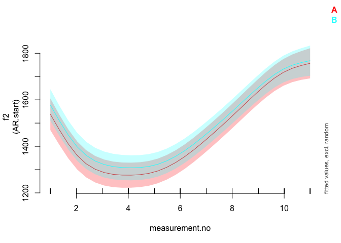

Introduction
------------

This document is a supplement to “Evaluating generalised additive mixed
modelling strategies for dynamic speech analysis,” relating specifically
to the contents of the “real formants” columns of Table 4 in Section
3.4.2. It presents code that illustrates (i) how the resampled data were
generated and (ii) the models whose performance is summarised in the
“real formants” columns of Table 4.

Preliminaries
-------------

The code below loads the relevant libraries.

``` r
library(ggplot2)
```

    ## Warning: package 'ggplot2' was built under R version 3.5.2

``` r
library(mgcv)
```

    ## Warning: package 'mgcv' was built under R version 3.5.2

``` r
library(itsadug)
library(stringr)
```

    ## Warning: package 'stringr' was built under R version 3.5.2

``` r
library(dplyr)
```

    ## Warning: package 'dplyr' was built under R version 3.5.2

Data generation
---------------

The code in this section can be only be used to process the data for
type I simulations. Note that the paths in this file will only work if
the whole GitHub repository is downloaded and this markdown file is kept
in its folder.

The data for this set of simulations consist of real f2 trajectories
representing the vowel /aI/ in New Zealand English. A sample of 20
contours is taken from each of the 30 speakers in the data set. Each
speaker is then randomly assigned to one of two groups (A and B).

``` r
dat_full <- readRDS("../data/final_data/price_vd_30_speakers.rds")

# limit to speakers with >= 30 trajectories

dat_full <- subset(dat_full, n >= 30)

# we sample 20 trajectories from each speaker

dat <- dat_full %>%
  group_by(speaker) %>%
  filter(traj %in% sample(unique(traj), 20, replace=F)) %>%
  ungroup()
  
# we now add randomly assigned category labels

ids <- unique(dat$speaker)
group.Bs <- sample(ids, round(length(ids)/2))
dat$group <- "A"
dat$group[dat$speaker %in% group.Bs] <- "B"

# setting up different types of grouping factors
dat$group.factor <- as.factor(dat$group)
dat$group.ordered <- as.ordered(dat$group)
contrasts(dat$group.ordered) <- "contr.treatment"
dat$group.bin <- as.numeric(dat$group.factor) - 1

# ids ought to be factors  
dat$traj <- as.factor(dat$traj)
dat$speaker <- as.factor(dat$speaker)

# dat$start has already been added at data prep stage (for AR.start, i.e. for autoregressive error models)
```

Here is what the data set looks like.

``` r
ggplot(dat, aes(x=measurement.no, y=f2, group=traj, col=group)) +
  geom_line(alpha=0.6) +
  facet_wrap(~speaker) +
  theme_bw()
```


Methods of significance testing
-------------------------------

All the models (and sets of models) from Table 4 are shown below in the
same order as in the table. The numbers in the section headers
correspond to the row numbers. Note that all models contain AR1
components to deal with dependencies within trajectories. The rho value
used for these AR1 components is taken from a single model fitted
without any random structures. This model is estimated below.

``` r
# thin
rho_mod <- bam(f2 ~ group.ordered + 
                     s(measurement.no, bs = "tp", k = 10) + 
                     s(measurement.no, by = group.ordered, bs = "tp", k = 10), 
                   data = dat, method = "fREML", discrete = T, nthreads = 1)

rho <- start_value_rho(rho_mod)
```

### MODEL SUMMARY: 1. Looking at model summary

``` r
modsum <- bam(f2 ~ group.ordered + 
                      s(measurement.no, bs = "tp", k = 10) + 
                      s(measurement.no, by = group.ordered, bs = "tp", k = 10) +
                      s(measurement.no, speaker, bs = "fs", m = 1, xt = "cr", k = 10), 
                    data = dat, 
                    AR.start = dat$start, rho = rho, 
                    method = "fREML", discrete = T, nthreads = 1)
```

    ## Warning in gam.side(sm, X, tol = .Machine$double.eps^0.5): model has
    ## repeated 1-d smooths of same variable.

``` r
summary(modsum)
```

    ## 
    ## Family: gaussian 
    ## Link function: identity 
    ## 
    ## Formula:
    ## f2 ~ group.ordered + s(measurement.no, bs = "tp", k = 10) + s(measurement.no, 
    ##     by = group.ordered, bs = "tp", k = 10) + s(measurement.no, 
    ##     speaker, bs = "fs", m = 1, xt = "cr", k = 10)
    ## 
    ## Parametric coefficients:
    ##                Estimate Std. Error t value Pr(>|t|)    
    ## (Intercept)     1466.73      24.74  59.297   <2e-16 ***
    ## group.orderedB    24.95      34.89   0.715    0.475    
    ## ---
    ## Signif. codes:  0 '***' 0.001 '**' 0.01 '*' 0.05 '.' 0.1 ' ' 1
    ## 
    ## Approximate significance of smooth terms:
    ##                                      edf  Ref.df      F p-value    
    ## s(measurement.no)                  8.561   8.921 67.552  <2e-16 ***
    ## s(measurement.no):group.orderedB   1.056   1.081  0.226   0.644    
    ## s(measurement.no,speaker)        112.082 297.000  2.960  <2e-16 ***
    ## ---
    ## Signif. codes:  0 '***' 0.001 '**' 0.01 '*' 0.05 '.' 0.1 ' ' 1
    ## 
    ## R-sq.(adj) =  0.509   Deviance explained = 51.9%
    ## fREML =  39099  Scale est. = 32614     n = 6107

### MODEL SUMMARY: 2. Looking at model summary + Bonferroni correction

For the Bonferroni correction, the alpha-level of the parametric and
smooth terms is lowered to 0.025. This does not require fitting a
separate model.

### MODEL SUMMARY: 3. Binary smooth

``` r
binsmooth <- bam(f2 ~ s(measurement.no, bs = "tp", k = 10) + 
                      s(measurement.no, by = group.bin, bs = "tp", k = 10) +
                      s(measurement.no, speaker, bs = "fs", m = 1, xt = "cr", k = 10), 
                    data = dat, 
                    AR.start = dat$start, rho = rho, 
                    method = "fREML", discrete=T, nthreads=1)
```

    ## Warning in gam.side(sm, X, tol = .Machine$double.eps^0.5): model has
    ## repeated 1-d smooths of same variable.

``` r
summary(binsmooth)
```

    ## 
    ## Family: gaussian 
    ## Link function: identity 
    ## 
    ## Formula:
    ## f2 ~ s(measurement.no, bs = "tp", k = 10) + s(measurement.no, 
    ##     by = group.bin, bs = "tp", k = 10) + s(measurement.no, speaker, 
    ##     bs = "fs", m = 1, xt = "cr", k = 10)
    ## 
    ## Parametric coefficients:
    ##             Estimate Std. Error t value Pr(>|t|)    
    ## (Intercept)  1466.74      24.73    59.3   <2e-16 ***
    ## ---
    ## Signif. codes:  0 '***' 0.001 '**' 0.01 '*' 0.05 '.' 0.1 ' ' 1
    ## 
    ## Approximate significance of smooth terms:
    ##                                 edf  Ref.df      F p-value    
    ## s(measurement.no)             8.562   8.922 68.330  <2e-16 ***
    ## s(measurement.no):group.bin   2.000   2.001  0.385   0.681    
    ## s(measurement.no,speaker)   112.122 297.000  2.962  <2e-16 ***
    ## ---
    ## Signif. codes:  0 '***' 0.001 '**' 0.01 '*' 0.05 '.' 0.1 ' ' 1
    ## 
    ## R-sq.(adj) =  0.509   Deviance explained = 51.9%
    ## fREML =  39099  Scale est. = 32614     n = 6107

### LIKELIHOOD RATIO TESTS: 4. Likelihood Ratio Test using models fitted with ML

Please note that these models may take quite a while to fit (5-10
minutes).

``` r
lrt_ML_full <- bam(f2 ~ group.ordered + 
                      s(measurement.no, bs = "tp", k = 10) + 
                      s(measurement.no, by = group.ordered, bs = "tp", k = 10) +
                      s(measurement.no, speaker, bs = "fs", m = 1, xt = "cr", k = 10), 
                    data = dat, 
                    AR.start = dat$start, rho = rho, 
                    method = "ML")
```

    ## Warning in gam.side(sm, X, tol = .Machine$double.eps^0.5): model has
    ## repeated 1-d smooths of same variable.

``` r
lrt_ML_nested <- bam(f2 ~ # group.ordered + 
                      s(measurement.no, bs = "tp", k = 10) + 
                      # s(measurement.no, by = group.ordered, bs = "tp", k = 10) +
                      s(measurement.no, speaker, bs = "fs", m = 1, xt = "cr", k = 10), 
                    data = dat, 
                    AR.start = dat$start, rho = rho, 
                    method = "ML")
```

    ## Warning in gam.side(sm, X, tol = .Machine$double.eps^0.5): model has
    ## repeated 1-d smooths of same variable.

``` r
compareML(lrt_ML_full, lrt_ML_nested)
```

    ## lrt_ML_full: f2 ~ group.ordered + s(measurement.no, bs = "tp", k = 10) + s(measurement.no, 
    ##     by = group.ordered, bs = "tp", k = 10) + s(measurement.no, 
    ##     speaker, bs = "fs", m = 1, xt = "cr", k = 10)
    ## 
    ## lrt_ML_nested: f2 ~ s(measurement.no, bs = "tp", k = 10) + s(measurement.no, 
    ##     speaker, bs = "fs", m = 1, xt = "cr", k = 10)
    ## 
    ## Chi-square test of ML scores
    ## -----
    ##           Model    Score Edf Difference    Df p.value Sig.
    ## 1 lrt_ML_nested 39114.66   6                              
    ## 2   lrt_ML_full 39114.24   9      0.423 3.000   0.838     
    ## 
    ## AIC difference: 0.34, model lrt_ML_nested has lower AIC.

    ## Warning in compareML(lrt_ML_full, lrt_ML_nested): AIC might not be
    ## reliable, as an AR1 model is included (rho1 = 0.635406, rho2 = 0.635406).

    ## Warning in compareML(lrt_ML_full, lrt_ML_nested): Only small difference in ML...

### LIKELIHOOD RATIO TESTS: 5. Likelihood Ratio Test using models fitted with fREML

As noted in the main text of the paper, the results of this model
comparison are meaningless.

``` r
lrt_fREML_full <- bam(f2 ~ group.ordered + 
                      s(measurement.no, bs = "tp", k = 10) + 
                      s(measurement.no, by = group.ordered, bs = "tp", k = 10) +
                      s(measurement.no, speaker, bs = "fs", m = 1, xt = "cr", k = 10), 
                    data = dat, 
                    AR.start = dat$start, rho = rho, 
                    method = "fREML", discrete=T, nthreads=1)
```

    ## Warning in gam.side(sm, X, tol = .Machine$double.eps^0.5): model has
    ## repeated 1-d smooths of same variable.

``` r
lrt_fREML_nested <- bam(f2 ~ # group.ordered + 
                      s(measurement.no, bs = "tp", k = 10) + 
                      # s(measurement.no, by = group.ordered, bs = "tp", k = 10) +
                      s(measurement.no, speaker, bs = "fs", m = 1, xt = "cr", k = 10), 
                    data = dat, 
                    AR.start = dat$start, rho = rho, 
                    method = "fREML", discrete=T, nthreads=1)
```

    ## Warning in gam.side(sm, X, tol = .Machine$double.eps^0.5): model has
    ## repeated 1-d smooths of same variable.

``` r
compareML(lrt_fREML_full, lrt_fREML_nested)
```

    ## lrt_fREML_full: f2 ~ group.ordered + s(measurement.no, bs = "tp", k = 10) + s(measurement.no, 
    ##     by = group.ordered, bs = "tp", k = 10) + s(measurement.no, 
    ##     speaker, bs = "fs", m = 1, xt = "cr", k = 10)
    ## 
    ## lrt_fREML_nested: f2 ~ s(measurement.no, bs = "tp", k = 10) + s(measurement.no, 
    ##     speaker, bs = "fs", m = 1, xt = "cr", k = 10)
    ## 
    ## Chi-square test of fREML scores
    ## -----
    ##              Model    Score Edf Difference    Df   p.value Sig.
    ## 1 lrt_fREML_nested 39107.10   6                                
    ## 2   lrt_fREML_full 39098.56   9      8.541 3.000 6.795e-04  ***
    ## 
    ## AIC difference: 0.39, model lrt_fREML_nested has lower AIC.

    ## Warning in compareML(lrt_fREML_full, lrt_fREML_nested): AIC might not be
    ## reliable, as an AR1 model is included (rho1 = 0.635406, rho2 = 0.635406).

### LIKELIHOOD RATIO TESTS: 6. Likelihood Ratio Test with fREML trick

For this model, fixed effects are estimated as random effects, which
makes model comparison based on models fitted with (f)REML valid in
principle.

``` r
lrt_fREML_trick_full <- bam(f2 ~ s(group.ordered, bs="re") + 
                      s(measurement.no, bs = "tp", k = 10) + 
                      s(measurement.no, by = group.ordered, bs = "tp", k = 10) +
                      s(measurement.no, speaker, bs = "fs", m = 1, xt = "cr", k = 10), 
                    data = dat, 
                    AR.start = dat$start, rho = rho, 
                    method = "fREML", discrete=T, nthreads=1,
                    select=T)
```

    ## Warning in gam.side(sm, X, tol = .Machine$double.eps^0.5): model has
    ## repeated 1-d smooths of same variable.

``` r
lrt_fREML_trick_nested <- bam(f2 ~ # s(group.ordered, bs="re") + 
                      s(measurement.no, bs = "tp", k = 10) + 
                      # s(measurement.no, by = group.ordered, bs = "tp", k = 10) +
                      s(measurement.no, speaker, bs = "fs", m = 1, xt = "cr", k = 10), 
                    data = dat, 
                    AR.start = dat$start, rho = rho, 
                    method = "fREML", discrete=T, nthreads=1,
                    select=T)
```

    ## Warning in gam.side(sm, X, tol = .Machine$double.eps^0.5): model has
    ## repeated 1-d smooths of same variable.

``` r
compareML(lrt_fREML_trick_full, lrt_fREML_trick_nested)
```

    ## lrt_fREML_trick_full: f2 ~ s(group.ordered, bs = "re") + s(measurement.no, bs = "tp", 
    ##     k = 10) + s(measurement.no, by = group.ordered, bs = "tp", 
    ##     k = 10) + s(measurement.no, speaker, bs = "fs", m = 1, xt = "cr", 
    ##     k = 10)
    ## 
    ## lrt_fREML_trick_nested: f2 ~ s(measurement.no, bs = "tp", k = 10) + s(measurement.no, 
    ##     speaker, bs = "fs", m = 1, xt = "cr", k = 10)
    ## 
    ## Chi-square test of fREML scores
    ## -----
    ##                    Model    Score Edf Difference    Df p.value Sig.
    ## 1 lrt_fREML_trick_nested 39114.02   6                              
    ## 2   lrt_fREML_trick_full 39113.66   9      0.363 3.000   0.867     
    ## 
    ## AIC difference: -0.15, model lrt_fREML_trick_full has lower AIC.

    ## Warning in compareML(lrt_fREML_trick_full, lrt_fREML_trick_nested): AIC
    ## might not be reliable, as an AR1 model is included (rho1 = 0.635406, rho2 =
    ## 0.635406).

    ## Warning in compareML(lrt_fREML_trick_full, lrt_fREML_trick_nested): Only small difference in fREML...

### Model comparison with AIC (models fitted with fREML)

``` r
aic_fREML_full <- bam(f2 ~ group.ordered + 
                      s(measurement.no, bs = "tp", k = 10) + 
                      s(measurement.no, by = group.ordered, bs = "tp", k = 10) +
                      s(measurement.no, speaker, bs = "fs", m = 1, xt = "cr", k = 10), 
                    data = dat, 
                    AR.start = dat$start, rho = rho, 
                    method = "fREML", discrete=T, nthreads=1)
```

    ## Warning in gam.side(sm, X, tol = .Machine$double.eps^0.5): model has
    ## repeated 1-d smooths of same variable.

``` r
aic_fREML_nested <- bam(f2 ~ # group.ordered + 
                      s(measurement.no, bs = "tp", k = 10) + 
                      # s(measurement.no, by = group.ordered, bs = "tp", k = 10) +
                      s(measurement.no, speaker, bs = "fs", m = 1, xt = "cr", k = 10), 
                    data = dat, 
                    AR.start = dat$start, rho = rho, 
                    method = "fREML", discrete=T, nthreads=1)
```

    ## Warning in gam.side(sm, X, tol = .Machine$double.eps^0.5): model has
    ## repeated 1-d smooths of same variable.

``` r
AIC(aic_fREML_full, aic_fREML_nested)
```

    ##                        df      AIC
    ## aic_fREML_full   125.8279 78076.93
    ## aic_fREML_nested 125.3393 78076.54

### VISUAL TESTS

This is not a detailed implementation of the percentage-cut-off-based
reasoning examined in the paper, simply some example code that can be
used to generate (i) prediction plots with confidence intervals for the
two groups and (ii) plots of the estimated difference between the
groups. Note also that these pred

``` r
plot_smooth(modsum, view="measurement.no", plot_all="group.ordered", rm.ranef=T)
```

    ## Summary:
    ##  * group.ordered : factor; set to the value(s): A, B. 
    ##  * measurement.no : numeric predictor; with 30 values ranging from 1.000000 to 11.000000. 
    ##  * speaker : factor; set to the value(s): speaker 8. (Might be canceled as random effect, check below.) 
    ##  * NOTE : The following random effects columns are canceled: s(measurement.no,speaker)
    ## 



``` r
plot_diff(modsum, view="measurement.no", comp=list(group.ordered=c("A","B")), rm.ranef=T)
```

    ## Summary:
    ##  * measurement.no : numeric predictor; with 100 values ranging from 1.000000 to 11.000000. 
    ##  * speaker : factor; set to the value(s): speaker 8. (Might be canceled as random effect, check below.) 
    ##  * NOTE : The following random effects columns are canceled: s(measurement.no,speaker)
    ## 


    ## 
    ## Difference is not significant.
