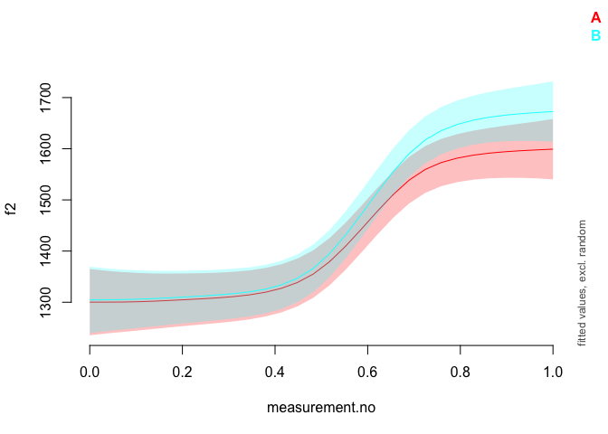

Introduction
------------

This document is a supplement to “Evaluating generalised additive mixed
modelling strategies for dynamic speech analysis,” relating specifically
to the contents of the “simulated formants” columns of Table 4 in
Section 3.4.2. It presents code that illustrates (i) how the simulated
data were generated and (ii) the models whose performance is summarised
in the “simulated formants” columns of Table 4.

Preliminaries
-------------

The code below loads the relevant libraries.

``` r
library(ggplot2)
```

    ## Warning: package 'ggplot2' was built under R version 3.5.2

``` r
library(mgcv)
```

    ## Warning: package 'mgcv' was built under R version 3.5.2

``` r
library(itsadug)
library(stringr)
```

    ## Warning: package 'stringr' was built under R version 3.5.2

``` r
library(dplyr)
```

    ## Warning: package 'dplyr' was built under R version 3.5.2

Data generation
---------------

The code in this section can be used to create data for either type I or
type II simulations. Set the value of *type* to 1 for type I simulations
and to 2 for type II simulations.

``` r
type = 2
```

The data for this set of simulations consist of simulated f2
trajectories modelled after the diphthong /aI/. 30 speakers are
simulated with 40 trajectories each. For type I simulations, each
speaker is randomly assigned to one of two groups (A or B). For type II
simulations, all underlying trajectories for group B speakers are
slightly modified (cf. Section 2.1 in the paper and also the Appendix).

Parameters for the simulations.

``` r
# setting time dimension
xs = seq(0,1,0.1)

# population parameters: individual speakers come from this dist
f2_start_mean = 1300

if (type==1) {
  f2_end_1_mean = 1650
  f2_end_2_mean = 1650
} else {
  f2_end_1_mean = 1600
  f2_end_2_mean = 1690
}

f2_start_sd.speaker = 90
f2_end_1_sd.speaker = 90
f2_end_2_sd.speaker = 90
# expected value & sd for transition point
x0_mean = 0.6
x0_sd.speaker = 0.020
# expected value & sd for steepness (higher -> more steep)
k_mean = 15
k_sd.speaker = 4

# how much variation within speakers?
f2_start_sd.traj = 150
f2_end_1_sd.traj = 150
f2_end_2_sd.traj = 150
x0_sd.traj = 0.015
k_sd.traj = 3

# amount of random noise

noise_sd <- 40

n_speakers <- 30
n_trajectories_per_speaker <- 40
```

Generating simulated data.

``` r
# assembling trajectories

ys_m <- matrix(0, nrow=length(xs), ncol=n_speakers*n_trajectories_per_speaker)
for (i in 1:n_speakers) {
  f2_start.speaker <- rnorm(1, f2_start_mean, f2_start_sd.speaker)
  f2_end_1.speaker <- rnorm(1, f2_end_1_mean, f2_end_1_sd.speaker)
  f2_end_2.speaker <- rnorm(1, f2_end_2_mean, f2_end_2_sd.speaker)
  x0.speaker <- rnorm(1, x0_mean, x0_sd.speaker)
  k.speaker <- rnorm(1, k_mean, k_sd.speaker)
  for (j in 1:n_trajectories_per_speaker) {
    f2_start <- rnorm(1, f2_start.speaker, f2_start_sd.traj)
    f2_end_1 <- rnorm(1, f2_end_1.speaker, f2_end_1_sd.traj)
    f2_end_2 <- rnorm(1, f2_end_2.speaker, f2_end_2_sd.traj)
    x0 <- rnorm(1, x0.speaker, x0_sd.traj)
    k <- rnorm(1, k.speaker, k_sd.traj)
    if (i <= (n_speakers / 2)) {
      ys_m[,(i-1)*n_trajectories_per_speaker + j] <- ((f2_end_1 - f2_start) / (1 + exp(-k*(xs-x0)))) + f2_start + rnorm(length(xs), 0, noise_sd)
    } else {
      ys_m[,(i-1)*n_trajectories_per_speaker + j] <- ((f2_end_2 - f2_start) / (1 + exp(-k*(xs-x0)))) + f2_start + rnorm(length(xs), 0, noise_sd)
    }
  }
}

# assembling data set (randomly assigned to categories)
dat <- data.frame(traj=paste("traj_", rep(1:(n_speakers*n_trajectories_per_speaker), each=length(xs)), sep=""),
                        speaker=paste("speaker_", rep(1:n_speakers, each=length(xs)*n_trajectories_per_speaker), sep=""),
                        group=rep(c("A","B"), each=length(xs)*(n_speakers*n_trajectories_per_speaker / 2)),
                        measurement.no=xs, 
                        f2=c(ys_m),
                        stringsAsFactors = F
)

# setting up different types of grouping factors
dat$group.factor <- as.factor(dat$group)
dat$group.ordered <- as.ordered(dat$group)
contrasts(dat$group.ordered) <- "contr.treatment"
dat$group.bin <- as.numeric(dat$group.factor) - 1

# ids ought to be factors  
dat$traj <- as.factor(dat$traj)
dat$speaker <- as.factor(dat$speaker)

# add dat$start for AR.start (for autoregressive error models)

dat$start <- dat$measurement.no == 0

# dat$start has already been added at data prep stage (for AR.start, i.e. for autoregressive error models)
```

Here is what the data set looks like.

``` r
ggplot(dat, aes(x=measurement.no, y=f2, group=traj, col=group)) +
  geom_line(alpha=0.6) +
  facet_wrap(~speaker) +
  theme_bw()
```


Methods of significance testing
-------------------------------

All the models (and sets of models) from Table 4 are shown below in the
same order as in the table. The numbers in the section headers
correspond to the row numbers.

### MODEL SUMMARY: 1. Looking at model summary

``` r
modsum <- bam(f2 ~ group.ordered + 
                      s(measurement.no, bs = "tp", k = 10) + 
                      s(measurement.no, by = group.ordered, bs = "tp", k = 10) +
                      s(measurement.no, speaker, bs = "fs", m = 1, xt = "cr", k = 5), 
                    data = dat, 
                    method = "fREML", discrete = T, nthreads = 1)
```

    ## Warning in gam.side(sm, X, tol = .Machine$double.eps^0.5): model has
    ## repeated 1-d smooths of same variable.

``` r
summary(modsum)
```

    ## 
    ## Family: gaussian 
    ## Link function: identity 
    ## 
    ## Formula:
    ## f2 ~ group.ordered + s(measurement.no, bs = "tp", k = 10) + s(measurement.no, 
    ##     by = group.ordered, bs = "tp", k = 10) + s(measurement.no, 
    ##     speaker, bs = "fs", m = 1, xt = "cr", k = 5)
    ## 
    ## Parametric coefficients:
    ##                Estimate Std. Error t value Pr(>|t|)    
    ## (Intercept)     1432.61      21.08  67.963   <2e-16 ***
    ## group.orderedB    31.46      29.77   1.057    0.291    
    ## ---
    ## Signif. codes:  0 '***' 0.001 '**' 0.01 '*' 0.05 '.' 0.1 ' ' 1
    ## 
    ## Approximate significance of smooth terms:
    ##                                      edf  Ref.df      F p-value    
    ## s(measurement.no)                  7.991   8.662 30.861  <2e-16 ***
    ## s(measurement.no):group.orderedB   4.017   4.906  1.626   0.154    
    ## s(measurement.no,speaker)        111.162 146.000 39.406  <2e-16 ***
    ## ---
    ## Signif. codes:  0 '***' 0.001 '**' 0.01 '*' 0.05 '.' 0.1 ' ' 1
    ## 
    ## R-sq.(adj) =  0.582   Deviance explained = 58.5%
    ## fREML =  84557  Scale est. = 20821     n = 13200

### MODEL SUMMARY: 2. Looking at model summary + Bonferroni correction

For the Bonferroni correction, the alpha-level of the parametric and
smooth terms is lowered to 0.025. This does not require fitting a
separate model.

### MODEL SUMMARY: 3. Binary smooth

``` r
binsmooth <- bam(f2 ~ s(measurement.no, bs = "tp", k = 10) + 
                      s(measurement.no, by = group.bin, bs = "tp", k = 10) +
                      s(measurement.no, speaker, bs = "fs", m = 1, xt = "cr", k = 5), 
                    data = dat, 
                    method = "fREML", discrete=T, nthreads=1)
```

    ## Warning in gam.side(sm, X, tol = .Machine$double.eps^0.5): model has
    ## repeated 1-d smooths of same variable.

``` r
summary(binsmooth)
```

    ## 
    ## Family: gaussian 
    ## Link function: identity 
    ## 
    ## Formula:
    ## f2 ~ s(measurement.no, bs = "tp", k = 10) + s(measurement.no, 
    ##     by = group.bin, bs = "tp", k = 10) + s(measurement.no, speaker, 
    ##     bs = "fs", m = 1, xt = "cr", k = 5)
    ## 
    ## Parametric coefficients:
    ##             Estimate Std. Error t value Pr(>|t|)    
    ## (Intercept)  1432.61      21.08   67.96   <2e-16 ***
    ## ---
    ## Signif. codes:  0 '***' 0.001 '**' 0.01 '*' 0.05 '.' 0.1 ' ' 1
    ## 
    ## Approximate significance of smooth terms:
    ##                                 edf  Ref.df      F p-value    
    ## s(measurement.no)             7.991   8.662 30.897  <2e-16 ***
    ## s(measurement.no):group.bin   5.017   5.906  1.272   0.289    
    ## s(measurement.no,speaker)   111.162 146.000 39.639  <2e-16 ***
    ## ---
    ## Signif. codes:  0 '***' 0.001 '**' 0.01 '*' 0.05 '.' 0.1 ' ' 1
    ## 
    ## R-sq.(adj) =  0.582   Deviance explained = 58.5%
    ## fREML =  84557  Scale est. = 20821     n = 13200

### LIKELIHOOD RATIO TESTS: 4. Likelihood Ratio Test using models fitted with ML

Please note that these models may take quite a while to fit (5-10
minutes).

``` r
lrt_ML_full <- bam(f2 ~ group.ordered + 
                      s(measurement.no, bs = "tp", k = 10) + 
                      s(measurement.no, by = group.ordered, bs = "tp", k = 10) +
                      s(measurement.no, speaker, bs = "fs", m = 1, xt = "cr", k = 5), 
                    data = dat, 
                    method = "ML")
```

    ## Warning in gam.side(sm, X, tol = .Machine$double.eps^0.5): model has
    ## repeated 1-d smooths of same variable.

``` r
lrt_ML_nested <- bam(f2 ~ # group.ordered + 
                      s(measurement.no, bs = "tp", k = 10) + 
                      # s(measurement.no, by = group.ordered, bs = "tp", k = 10) +
                      s(measurement.no, speaker, bs = "fs", m = 1, xt = "cr", k = 5), 
                    data = dat, 
                    method = "ML")
```

    ## Warning in gam.side(sm, X, tol = .Machine$double.eps^0.5): model has
    ## repeated 1-d smooths of same variable.

``` r
compareML(lrt_ML_full, lrt_ML_nested)
```

    ## lrt_ML_full: f2 ~ group.ordered + s(measurement.no, bs = "tp", k = 10) + s(measurement.no, 
    ##     by = group.ordered, bs = "tp", k = 10) + s(measurement.no, 
    ##     speaker, bs = "fs", m = 1, xt = "cr", k = 5)
    ## 
    ## lrt_ML_nested: f2 ~ s(measurement.no, bs = "tp", k = 10) + s(measurement.no, 
    ##     speaker, bs = "fs", m = 1, xt = "cr", k = 5)
    ## 
    ## Chi-square test of ML scores
    ## -----
    ##           Model    Score Edf Difference    Df p.value Sig.
    ## 1 lrt_ML_nested 84575.10   6                              
    ## 2   lrt_ML_full 84572.86   9      2.235 3.000   0.215     
    ## 
    ## AIC difference: 2.00, model lrt_ML_nested has lower AIC.

    ## Warning in compareML(lrt_ML_full, lrt_ML_nested): Only small difference in ML...

### LIKELIHOOD RATIO TESTS: 5. Likelihood Ratio Test using models fitted with fREML

As noted in the main text of the paper, the results of this model
comparison are meaningless.

``` r
lrt_fREML_full <- bam(f2 ~ group.ordered + 
                      s(measurement.no, bs = "tp", k = 10) + 
                      s(measurement.no, by = group.ordered, bs = "tp", k = 10) +
                      s(measurement.no, speaker, bs = "fs", m = 1, xt = "cr", k = 5), 
                    data = dat, 
                    method = "fREML", discrete=T, nthreads=1)
```

    ## Warning in gam.side(sm, X, tol = .Machine$double.eps^0.5): model has
    ## repeated 1-d smooths of same variable.

``` r
lrt_fREML_nested <- bam(f2 ~ # group.ordered + 
                      s(measurement.no, bs = "tp", k = 10) + 
                      # s(measurement.no, by = group.ordered, bs = "tp", k = 10) +
                      s(measurement.no, speaker, bs = "fs", m = 1, xt = "cr", k = 5), 
                    data = dat, 
                    method = "fREML", discrete=T, nthreads=1)
```

    ## Warning in gam.side(sm, X, tol = .Machine$double.eps^0.5): model has
    ## repeated 1-d smooths of same variable.

``` r
compareML(lrt_fREML_full, lrt_fREML_nested)
```

    ## lrt_fREML_full: f2 ~ group.ordered + s(measurement.no, bs = "tp", k = 10) + s(measurement.no, 
    ##     by = group.ordered, bs = "tp", k = 10) + s(measurement.no, 
    ##     speaker, bs = "fs", m = 1, xt = "cr", k = 5)
    ## 
    ## lrt_fREML_nested: f2 ~ s(measurement.no, bs = "tp", k = 10) + s(measurement.no, 
    ##     speaker, bs = "fs", m = 1, xt = "cr", k = 5)
    ## 
    ## Chi-square test of fREML scores
    ## -----
    ##              Model    Score Edf Difference    Df   p.value Sig.
    ## 1 lrt_fREML_nested 84568.01   6                                
    ## 2   lrt_fREML_full 84557.24   9     10.768 3.000 8.150e-05  ***
    ## 
    ## AIC difference: 1.09, model lrt_fREML_nested has lower AIC.

### LIKELIHOOD RATIO TESTS: 6. Likelihood Ratio Test with fREML trick

For this model, fixed effects are estimated as random effects, which
makes model comparison based on models fitted with (f)REML valid in
principle.

``` r
lrt_fREML_trick_full <- bam(f2 ~ s(group.ordered, bs="re") + 
                      s(measurement.no, bs = "tp", k = 10) + 
                      s(measurement.no, by = group.ordered, bs = "tp", k = 10) +
                      s(measurement.no, speaker, bs = "fs", m = 1, xt = "cr", k = 5), 
                    data = dat, 
                    method = "fREML", discrete=T, nthreads=1,
                    select=T)
```

    ## Warning in gam.side(sm, X, tol = .Machine$double.eps^0.5): model has
    ## repeated 1-d smooths of same variable.

``` r
lrt_fREML_trick_nested <- bam(f2 ~ # s(group.ordered, bs="re") + 
                      s(measurement.no, bs = "tp", k = 10) + 
                      # s(measurement.no, by = group.ordered, bs = "tp", k = 10) +
                      s(measurement.no, speaker, bs = "fs", m = 1, xt = "cr", k = 5), 
                    data = dat, 
                    method = "fREML", discrete=T, nthreads=1,
                    select=T)
```

    ## Warning in gam.side(sm, X, tol = .Machine$double.eps^0.5): model has
    ## repeated 1-d smooths of same variable.

``` r
compareML(lrt_fREML_trick_full, lrt_fREML_trick_nested)
```

    ## lrt_fREML_trick_full: f2 ~ s(group.ordered, bs = "re") + s(measurement.no, bs = "tp", 
    ##     k = 10) + s(measurement.no, by = group.ordered, bs = "tp", 
    ##     k = 10) + s(measurement.no, speaker, bs = "fs", m = 1, xt = "cr", 
    ##     k = 5)
    ## 
    ## lrt_fREML_trick_nested: f2 ~ s(measurement.no, bs = "tp", k = 10) + s(measurement.no, 
    ##     speaker, bs = "fs", m = 1, xt = "cr", k = 5)
    ## 
    ## Chi-square test of fREML scores
    ## -----
    ##                    Model    Score Edf Difference    Df p.value Sig.
    ## 1 lrt_fREML_trick_nested 84571.98   6                              
    ## 2   lrt_fREML_trick_full 84569.87   9      2.115 3.000   0.238     
    ## 
    ## AIC difference: 0.76, model lrt_fREML_trick_nested has lower AIC.

    ## Warning in compareML(lrt_fREML_trick_full, lrt_fREML_trick_nested): Only small difference in fREML...

### Model comparison with AIC (models fitted with fREML)

``` r
aic_fREML_full <- bam(f2 ~ group.ordered + 
                      s(measurement.no, bs = "tp", k = 10) + 
                      s(measurement.no, by = group.ordered, bs = "tp", k = 10) +
                      s(measurement.no, speaker, bs = "fs", m = 1, xt = "cr", k = 5), 
                    data = dat, 
                    method = "fREML", discrete=T, nthreads=1)
```

    ## Warning in gam.side(sm, X, tol = .Machine$double.eps^0.5): model has
    ## repeated 1-d smooths of same variable.

``` r
aic_fREML_nested <- bam(f2 ~ # group.ordered + 
                      s(measurement.no, bs = "tp", k = 10) + 
                      # s(measurement.no, by = group.ordered, bs = "tp", k = 10) +
                      s(measurement.no, speaker, bs = "fs", m = 1, xt = "cr", k = 5), 
                    data = dat, 
                    method = "fREML", discrete=T, nthreads=1)
```

    ## Warning in gam.side(sm, X, tol = .Machine$double.eps^0.5): model has
    ## repeated 1-d smooths of same variable.

``` r
AIC(aic_fREML_full, aic_fREML_nested)
```

    ##                        df      AIC
    ## aic_fREML_full   127.7108 168846.7
    ## aic_fREML_nested 127.0263 168845.7

### VISUAL TESTS

This is not a detailed implementation of the percentage-cut-off-based
reasoning examined in the paper, simply some example code that can be
used to generate (i) prediction plots with confidence intervals for the
two groups and (ii) plots of the estimated difference between the
groups. Note also that these pred

``` r
plot_smooth(modsum, view="measurement.no", plot_all="group.ordered", rm.ranef=T)
```

    ## Summary:
    ##  * group.ordered : factor; set to the value(s): A, B. 
    ##  * measurement.no : numeric predictor; with 30 values ranging from 0.000000 to 1.000000. 
    ##  * speaker : factor; set to the value(s): speaker_1. (Might be canceled as random effect, check below.) 
    ##  * NOTE : The following random effects columns are canceled: s(measurement.no,speaker)
    ## 



``` r
plot_diff(modsum, view="measurement.no", comp=list(group.ordered=c("A","B")), rm.ranef=T)
```

    ## Summary:
    ##  * measurement.no : numeric predictor; with 100 values ranging from 0.000000 to 1.000000. 
    ##  * speaker : factor; set to the value(s): speaker_1. (Might be canceled as random effect, check below.) 
    ##  * NOTE : The following random effects columns are canceled: s(measurement.no,speaker)
    ## 


    ## 
    ## measurement.no window(s) of significant difference(s):
    ##  0.797980 - 0.888889
