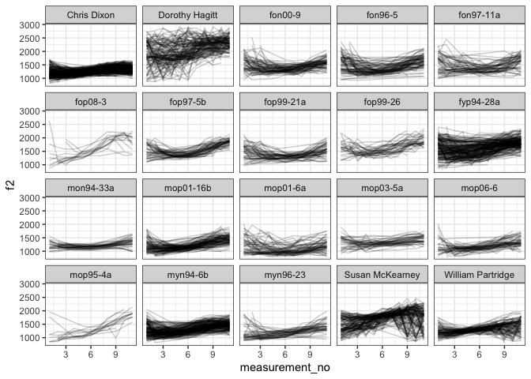
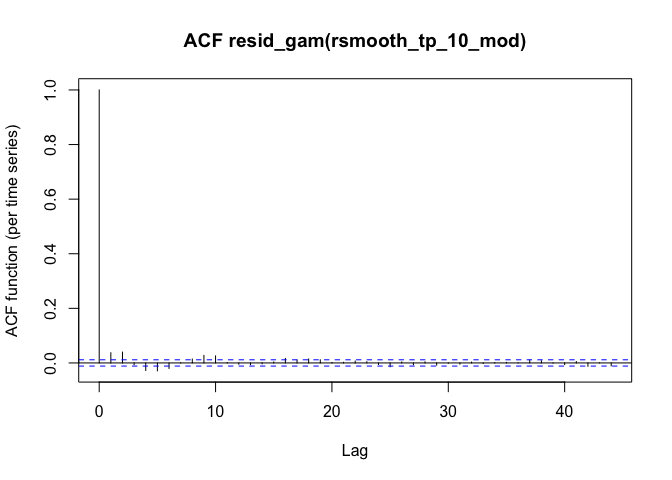
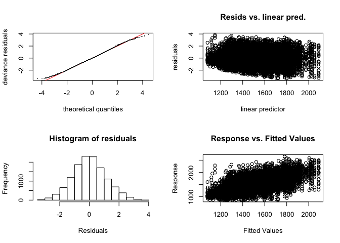

Libraries
---------

``` r
suppressWarnings({
  library(tidyverse)
  library(kableExtra)
  library(DT)
  library(mgcv)
  library(itsadug)
})
```

    ## ── Attaching packages ─────────────────────────────────────────────────────────────────────── tidyverse 1.3.0 ──

    ## ✓ ggplot2 3.2.1     ✓ purrr   0.3.3
    ## ✓ tibble  2.1.3     ✓ dplyr   0.8.4
    ## ✓ tidyr   1.0.2     ✓ stringr 1.4.0
    ## ✓ readr   1.3.1     ✓ forcats 0.4.0

    ## ── Conflicts ────────────────────────────────────────────────────────────────────────── tidyverse_conflicts() ──
    ## x dplyr::filter() masks stats::filter()
    ## x dplyr::lag()    masks stats::lag()

    ## 
    ## Attaching package: 'kableExtra'

    ## The following object is masked from 'package:dplyr':
    ## 
    ##     group_rows

    ## Loading required package: nlme

    ## 
    ## Attaching package: 'nlme'

    ## The following object is masked from 'package:dplyr':
    ## 
    ##     collapse

    ## This is mgcv 1.8-31. For overview type 'help("mgcv-package")'.

    ## Loading required package: plotfunctions

    ## 
    ## Attaching package: 'plotfunctions'

    ## The following object is masked from 'package:ggplot2':
    ## 
    ##     alpha

    ## Loaded package itsadug 2.3 (see 'help("itsadug")' ).

Goals
-----

This is a brief and practically oriented tutorial that accompanies my
paper titled “Evaluating generalised additive mixed modelling strategies
for dynamic speech analysis.” The paper uses type I / II error
simulations to evaluate a range of modelling strategies for phonetic
data that consist of temporally or spatially organised data such as
formant / pitch contours or ultrasound tongue contours. This tutorial
illustrates how such a type I error simulation can be set up.

Model criticism and careful consideration of the structure of the data
are essential for setting up statistically well-calibrated generalised
additive mixed models. Existing tutorials and introductions such as
Wieling (2018) and Chuang et al. (2020) provide detailed advice on how
to do this. This tutorial introduces a supplementary tool that does not
replace other conventional methods, but can be helpful in determining
the optimal model specification for a given data set. Note also that
this tutorial is not an introduction to GAMMs; it assumes familiarity
with the basics of fitting GAMMs. Readers looking for approachable
introductory texts are referred to Sóskuthy (2017), Wieling (2018) and
Chuang et al. (2020).

The logic of running type I error simulations for real data sets is
simple: we take a reasonably homogeneous subset of the data, randomly
assign a predictor variable to relevant units (e.g. individual contours
or speakers), and then test this random predictor using a given model
structure (or comparing several different model structures at once).
Since the predictor is randomly assigned to our observations (i.e. the
ground truth is that there is no underlying effect), a significant
result from our test is a false positive. If we repeat this procedure
many times (i.e. the random reassignment of the predictor plus model
fitting), the rate of significant results is expected to be 5%, assuming
an alpha-level of 0.05. If the rate is higher than this, our model is
anticonservative and is producing more false positives than it should.
If the rate is substantially lower than 5%, that’s usually an indication
that our test is heavily underpowered – but this should be confirmed
through power simulations, which, unfortunately, are quite tricky to run
for dynamic phonetic data (and are not discussed any further here).

General guidelines on using type I error simulations
----------------------------------------------------

As noted above, type I error simulations can be used as a supplement to
conventional model criticism (e.g. inspection of model residuals), but
cannot replace it.

Type I error simulations should ideally be run before “real” models have
been fitted to the data. This is to avoid adding unnecessary researcher
degrees of freedom to the analysis. Type I error simulations do not say
anything about the significance of real variables, only about the
validity of certain modelling decisions. Therefore, running them in
advance of the actual analysis shields the researcher from making
analytic decisions based on whether the main predictors of interest are
significant.

Type I error simulations are not infallible, and can produce misleading
results if the sample being analysed is not representative of the full
data set, or if the sampling method does not capture key dependencies in
the data. Unfortunately, reliable type *II* error simulations are hard
to run for real dynamic data sets, as they require strong assumptions
not only about effect sizes but also about how exactly differences
between contours are realised.

Data
----

The data used here are taken from Sóskuthy, Hay and Brand (2019). A
small subset of this data is used for the type I error simulations
presented in the main paper. Here we work with the full data set.

The data set contains formant contours for instances of the PRICE vowel
in New Zealand English. For each vowel, 11 formant measurements were
taken automatically at equal intervals, yielding measurements at 0%,
10%, 20%, etc. into the vowel. While some initial filtering has been
done on this data, the contours still contain a substantial amount of
noise due to formant tracking errors. The data come from 500+ speakers
of NZE born over a period of 130 years.

Here we load the data and remove columns that are not needed for the
current analysis.

``` r
price <- readRDS("../data/raw_data/price_full.rds") %>%
  dplyr::select(speaker, sex, yob, wordform, dur, measurement_no, f1, f2, id, following_voiceless) %>%
  mutate()
```

A summary of the different variables left in the data set.

<table class="table" style="width: auto !important; margin-left: auto; margin-right: auto;">
<thead>
<tr>
<th style="text-align:left;">
Variable
</th>
<th style="text-align:left;">
Description
</th>
<th style="text-align:left;">
Class
</th>
</tr>
</thead>
<tbody>
<tr>
<td style="text-align:left;">
<span
style="     color: #273746 !important;border-radius: 4px; padding-right: 4px; padding-left: 4px; background-color: #F2F3F4 !important;">speaker</span>
</td>
<td style="text-align:left;width: 30em; ">
The speaker ID
</td>
<td style="text-align:left;font-style: italic;">
string with 539 unique values
</td>
</tr>
<tr>
<td style="text-align:left;">
<span
style="     color: #273746 !important;border-radius: 4px; padding-right: 4px; padding-left: 4px; background-color: #F2F3F4 !important;">sex</span>
</td>
<td style="text-align:left;width: 30em; ">
The sex of the speaker, i.e. either F for female or M for male
</td>
<td style="text-align:left;font-style: italic;">
string with 2 unique values
</td>
</tr>
<tr>
<td style="text-align:left;">
<span
style="     color: #273746 !important;border-radius: 4px; padding-right: 4px; padding-left: 4px; background-color: #F2F3F4 !important;">yob</span>
</td>
<td style="text-align:left;width: 30em; ">
The year the participant was born in
</td>
<td style="text-align:left;font-style: italic;">
numeric ranging from 1857 to 1987
</td>
</tr>
<tr>
<td style="text-align:left;">
<span
style="     color: #273746 !important;border-radius: 4px; padding-right: 4px; padding-left: 4px; background-color: #F2F3F4 !important;">wordform</span>
</td>
<td style="text-align:left;width: 30em; ">
An orthographic transcription of the wordform the token is from
</td>
<td style="text-align:left;font-style: italic;">
string with 2486 unique values
</td>
</tr>
<tr>
<td style="text-align:left;">
<span
style="     color: #273746 !important;border-radius: 4px; padding-right: 4px; padding-left: 4px; background-color: #F2F3F4 !important;">dur</span>
</td>
<td style="text-align:left;width: 30em; ">
The duration of the vowel
</td>
<td style="text-align:left;font-style: italic;">
numeric ranging from 0.009 to 1.96
</td>
</tr>
<tr>
<td style="text-align:left;">
<span
style="     color: #273746 !important;border-radius: 4px; padding-right: 4px; padding-left: 4px; background-color: #F2F3F4 !important;">measurement\_no</span>
</td>
<td style="text-align:left;width: 30em; ">
The point at which the measurement was taken; 1 is the beginning of the
vowel, while 11 is the end
</td>
<td style="text-align:left;font-style: italic;">
numeric ranging from 1 to 11
</td>
</tr>
<tr>
<td style="text-align:left;">
<span
style="     color: #273746 !important;border-radius: 4px; padding-right: 4px; padding-left: 4px; background-color: #F2F3F4 !important;">f1</span>
</td>
<td style="text-align:left;width: 30em; ">
The raw F1 at the measurement point in Hz
</td>
<td style="text-align:left;font-style: italic;">
numeric ranging from 313 to 1027
</td>
</tr>
<tr>
<td style="text-align:left;">
<span
style="     color: #273746 !important;border-radius: 4px; padding-right: 4px; padding-left: 4px; background-color: #F2F3F4 !important;">f2</span>
</td>
<td style="text-align:left;width: 30em; ">
The raw F2 at the measurement point in Hz
</td>
<td style="text-align:left;font-style: italic;">
numeric ranging from 803 to 2934
</td>
</tr>
<tr>
<td style="text-align:left;">
<span
style="     color: #273746 !important;border-radius: 4px; padding-right: 4px; padding-left: 4px; background-color: #F2F3F4 !important;">id</span>
</td>
<td style="text-align:left;width: 30em; ">
A unique ID for the token
</td>
<td style="text-align:left;font-style: italic;">
string with 53121 unique values
</td>
</tr>
<tr>
<td style="text-align:left;">
<span
style="     color: #273746 !important;border-radius: 4px; padding-right: 4px; padding-left: 4px; background-color: #F2F3F4 !important;">following\_voiceless</span>
</td>
<td style="text-align:left;width: 30em; ">
Whether the following consonant is voiceless or not
</td>
<td style="text-align:left;font-style: italic;">
logical
</td>
</tr>
</tbody>
</table>

Zooming in on the speakers, we can see that there is a wide range of
token numbers across speakers.

``` r
price %>%
  group_by(speaker, following_voiceless) %>%
  summarise(n=n_distinct(id)) %>%
  ungroup() %>%
  ggplot(aes(x=n)) +
  geom_histogram() +
  facet_grid(.~following_voiceless) +
  scale_x_log10() +
  xlab("number of tokens") +
  ylab("number of speakers in bin") +
  theme_bw()
```

    ## `stat_bin()` using `bins = 30`. Pick better value with `binwidth`.


Here’s a plot of a random selection of speakers to show what the f2
formant trajectories look like (f2 will be the focus of the
simulations).

``` r
price_sub <- filter(price, speaker %in% sample(unique(price$speaker), 20, replace=F))
ggplot(price_sub, aes(x=measurement_no, y=f2, group=id)) + 
  geom_line(alpha=0.2) +
  facet_wrap(~speaker) +
  theme_bw()
```



Simulations
-----------

### Preliminary considerations

Our goal is to find out whether a given model specification (especially
in terms of random structures) works well with this data. To do this, we
need to know what kind of effect we’ll be focusing on in our full model.
Let’s say we’re interested in the effect of sex on f2, i.e. how f2
trajectory shapes differ between females and males.

Crucially, sex is an across-speaker variable in this data set: it varies
across speakers but not within speakers. It is safe to hypothesise that
trajectory shapes may vary (i) systematically as a function of sex and
(ii) randomly across speakers due to e.g. different production
strategies or sociolinguistic variables that are not represented in this
data set. We want to capture this random variation across speakers in
our model using some kind of random structure. If we fail to do so, our
model may yield anticonservative results by assuming that all data
points are completely independent of each other, where, in reality, data
points from the same speaker are not at all independent.

The question that our simulation will aim to answer is: what kind of
random structure can best capture the fact that data points from the
same speaker are not independent of each other? We’ll try a few
different solutions: only random intercepts by speakers (i.e. assuming
that speakers don’t vary in terms of trajectory shapes) and random
smooths with different numbers of basis functions / different types of
basis functions.

Our simulations will be set up in such a way as to retain random
variation across speakers, and will use a binary treatment variable
similar to sex. In each iteration of the simulation, speakers will be
assigned randomly to the two levels of this binary variable. As
explained above, a well-specified model should detect a significant
effect of this binary variable (i.e. a false positive) around 5% of the
time.

To ensure that the simulations are computationally feasible, each
iteration will only consider a smaller (random) subset of the speakers.
In principle, it might be possible to use the whole speaker set, but
since (at least in the current case) we’re only interested in finding
the right random effects structure for our model, we can make do with a
smaller set.

### Data preparation

Before we can move on with the simulations, we need to prepare our data.
We know that our data set contains both random and systematic sources of
variation in trajectory shapes. Notably, year of birth, sex, duration
and the following environment are all likely to affect f2 trajectories
for the PRICE vowel. In a full analysis, we would bring these sources of
variation into the model by including the corresponding variables as
predictors. For our simulations, however, including all these variables
is not practically feasible as (i) only subsets of the speakers will be
used, so their effects may not be possible to estimate reliably; and
(ii) it’s better to keep the models as simple as possible to avoid
adding too much computational overhead. What we will do instead is
choose a reasonably homogeneous subset of the data, thus removing these
systematic sources of variation. In the current case, this can be
achieved by…

-   using speakers of only a single sex (female in this case)
-   choosing speakers from a limited year of birth range (1960–1987)
-   using only a single phonological environment (following voiced
    segments)
-   excluding very short tokens of PRICE (shorter than 0.1 s, which is
    close to the lower quartile)

``` r
price <- price %>%
  filter(yob >= 1960,
         sex=="F",
         following_voiceless==F,
         dur > 0.1) %>%
  # we also add a variable indicating how much data is left per speaker
  group_by(speaker) %>% 
  mutate(n=length(unique(id))) %>%
  ungroup()
```

Speakers that are represented by too few trajectories should probably
also be excluded (both for the simulations and the full analysis).

``` r
price <- price %>%
  filter(n >= 15)
```

This leaves `n_distinct(price$speaker)` speakers. Here’s what their data
look like:

``` r
ggplot(price, aes(x=measurement_no, y=f2, group=id)) + 
  geom_line(alpha=0.2) +
  facet_wrap(~speaker) +
  theme_bw()
```


In order to make this data set amenable to GAMM analysis, we need
transform the “speaker” predictor into a factor. We also need to set up
a variable that marks the first measurement in each trajectory (this is
necessary for including AR1 error models).

``` r
price <- price %>%
  mutate(speaker=as.factor(speaker)) %>%
  group_by(id) %>%
  # not all trajectories start at 1, as some measurements have been excluded
  # (see Sóskuthy, Hay and Brand 2019)
  mutate(start_traj=(measurement_no==min(measurement_no))) %>%
  ungroup()
```

### Preparing for modelling

Our primary objective here is to fit models that control for
dependencies within speakers, but it would also be good to capture
dependencies within trajectories. This can be done using AR1 models
(autoregressive error models that control for autocorrelation at a lag
of no more than 1). While our models will only use subsets of the data
above, we can use the whole data set to figure out what parameters to
choose for our AR1 models. To be on the safe side, we will also assume
that the ideal parameters for AR1 may differ across our candidate models
depending on other features of the models (in this case, the random
structure specification).

We start by fitting versions of our candidate models with no AR1 error
model. We test 5 different models:

-   only random intercepts
-   tp random smooth with 3 basis functions
-   tp random smooth with 10 basis functions
-   cr random smooth with 3 basis functions
-   cr random smooth with 10 basis functions

Right now, we’re only interested in choosing the right parameters for
the AR1 model, so we’re only including a single fixed smooth in the
model (over measurement number).

``` r
# random intercept only
rint_mod_noAR <- bam(f2 ~ s(measurement_no) + s(speaker, bs="re"), data=price, discrete=T)

# random smooth: tp 3
rsmooth_tp_3_mod_noAR <- bam(f2 ~ s(measurement_no) + s(measurement_no, speaker, bs="fs", m=1, k=3, xt="tp"), data=price, discrete=T)

# random smooth: tp 10
rsmooth_tp_10_mod_noAR  <- bam(f2 ~ s(measurement_no) + s(measurement_no, speaker, bs="fs", m=1, k=10, xt="tp"), data=price, discrete=T)

# random smooth: cr 3
rsmooth_cr_3_mod_noAR  <- bam(f2 ~ s(measurement_no) + s(measurement_no, speaker, bs="fs", m=1, k=3, xt="cr"), data=price, discrete=T)

# random smooth: cr 10
rsmooth_cr_10_mod_noAR  <- bam(f2 ~ s(measurement_no) + s(measurement_no, speaker, bs="fs", m=1, k=10, xt="cr"), data=price, discrete=T)
```

We now inspect the residuals of these models looking for
autocorrelation, and save the residual autocorrelation values at lag 1.

``` r
acf_resid(rint_mod_noAR)
```


``` r
acf_resid(rsmooth_tp_3_mod_noAR)
```


``` r
acf_resid(rsmooth_tp_10_mod_noAR)
```


``` r
acf_resid(rsmooth_cr_3_mod_noAR)
```


``` r
acf_resid(rsmooth_cr_10_mod_noAR)
```


``` r
start_value_rho(rint_mod_noAR)
```

    ## [1] 0.555622

``` r
start_value_rho(rsmooth_tp_3_mod_noAR)
```

    ## [1] 0.5481267

``` r
start_value_rho(rsmooth_tp_10_mod_noAR)
```

    ## [1] 0.5526579

``` r
start_value_rho(rsmooth_cr_3_mod_noAR)
```

    ## [1] 0.5487681

``` r
start_value_rho(rsmooth_cr_10_mod_noAR)
```

    ## [1] 0.5510001

All the autocorrelation values at lag 1 are very similar, so we’ll use
the same rho setting for all of our models. Let’s start with the
estimated value: 0.55. Here are the revised models and the corresponding
acf plots.

``` r
rint_mod <- bam(f2 ~ s(measurement_no) + s(speaker, bs="re"), data=price, discrete=T, AR.start=start_traj, rho=0.55)
rsmooth_tp_3_mod <- bam(f2 ~ s(measurement_no) + s(measurement_no, speaker, bs="fs", m=1, k=3, xt="tp"), data=price, discrete=T, AR.start=start_traj, rho=0.55)
rsmooth_tp_10_mod  <- bam(f2 ~ s(measurement_no) + s(measurement_no, speaker, bs="fs", m=1, k=10, xt="tp"), data=price, discrete=T, AR.start=start_traj, rho=0.55)
rsmooth_cr_3_mod  <- bam(f2 ~ s(measurement_no) + s(measurement_no, speaker, bs="fs", m=1, k=3, xt="cr"), data=price, discrete=T, AR.start=start_traj, rho=0.55)
rsmooth_cr_10_mod  <- bam(f2 ~ s(measurement_no) + s(measurement_no, speaker, bs="fs", m=1, k=10, xt="cr"), data=price, discrete=T, AR.start=start_traj, rho=0.55)

acf_resid(rint_mod)
```


``` r
acf_resid(rsmooth_tp_3_mod)
```


``` r
acf_resid(rsmooth_tp_10_mod)
```



``` r
acf_resid(rsmooth_cr_3_mod)
```


``` r
acf_resid(rsmooth_cr_10_mod)
```


Based on these plots, our AR1 model does a great job of reducing
autocorrelation in the residuals. We’ll use this same value for rho in
the models that we fit below.

### Running the simulation

Running the simulation is relatively easy: at each iteration, (i) we
need to take a subset of the data and add a randomly distributed
across-speaker predictor variable; (ii) fit our models; (iii) extract
p-values for relevant fixed effects.

A few decisions before we start the simulations.

-   We’ll use random subsets of the speakers instead of the whole
    speaker set. The simulation can also be run with the whole speaker
    set, but it is a bit slower.
-   We’ll run the simulation 200 times. This gives rather poor estimates
    of false positive rates, e.g. the 95% confidence interval for a
    well-calibrated test with a false positive rate of 0.05 is
    \[0.02,0.08\]. Therefore, the results below are only ballpark
    estimates. For comparison, 500 iterations yield a 95% CI of
    \[0.032,0.070\]; 1000 iterations \[0.037,0.064\]; 10000 iterations
    \[0.0458,0.0543\]. For real applications, 500-1000 runs might be
    more appropriate. For users who have access to a powerful multicore
    computer or a cluster, 10000 runs are recommended.
-   The main fixed effect in our model will be coded using (i) a
    parametric difference term and (ii) a difference smooth. We will
    extract p-values for both.

To keep things nice and compartmentalised, here are two functions, one
for creating the sample of the data set to be analysed and another one
for extracting p-values for a given fixed effect.

``` r
### function for creating random sample of the data
create_random_sample <- function (dat, n_speakers, speaker_col) {
  # randomly picking N speakers to keep in our sample
  speakers_to_keep <- sample(unique(pull(dat, speaker_col)), n_speakers, replace=F)
  # creating subset
  out <- filter(dat, speaker %in% speakers_to_keep) %>%
    droplevels()
  
  ###############################
  ## creating randomly assigned
  ## binary fixed predictor
  ###############################
  
  # half of the speakers assigned to "category A"
  cat_A_spkrs <- sample(speakers_to_keep, round(n_speakers/2), replace=F)
  # adding predictor variable to data set
  out$cat <- ifelse(out$speaker %in% cat_A_spkrs, "A", "B")
  # setting up ordered version of cat for difference smooth
  out$cat.ord <- as.ordered(out$cat)
  contrasts(out$cat.ord) <- "contr.treatment"
  return(out)
}

### function for extracting p-values for parametric term and smooth difference term corresponding
### to an ordered predictor called pred (only works with GAMMs!)
extract_p_values <- function (mod, pred, time_pred) {
  # generate a summary of the model
  summ <- summary(mod)
  # summ$p.table contains the estimates, standard errors, etc. for parametric
  # terms; we need to extract the p-value, which is in the fourth column
  # the bit below is just summ$p.table[..., 4], where the ... part simply finds
  # the row of the table with the estimates for the predictor we're looking at
  parametric_p <- summ$p.table[startsWith(rownames(summ$p.table), pred), 4]
  # same logic here, but for summ$s.table, which contains the smooth estimates
  smooth_p <- summ$s.table[grepl(paste0("^s[(]", time_pred, "[)]:", pred), rownames(summ$s.table)), 4]
  # return results as a list
  return(list(parametric_p=parametric_p,
              smooth_p=smooth_p))
}
```

Note that the above is not absolutely necessary for the simulations:
instead of defining functions, you could perform all this stuff inside
the main loop below; and p-values can be extracted more simply (e.g. by
simply using numeric indices on the p.table / s.table parts of the
summary).

We are now in a position to run the simulations! We first set up lists
to store the results of each type of model, and then create the data +
run the models inside a loop, extracting the p-values for each model.
Note that this loop takes a long time to run when “iterations” is set to
200: on my computer, it took around an hour to complete.

``` r
# how many iterations?
iterations <- 10

# lists for storing p-values
rint_out <- list()
rsmooth_tp_3_out <- list()
rsmooth_tp_10_out <- list()
rsmooth_cr_3_out <- list()
rsmooth_cr_10_out <- list()

### main loop
for (i in 1:iterations) {
  # generating sample of data
  price_sample <- create_random_sample(price, 40, "speaker")
  
  # fitting models (with warning messages disabled to make progress monitoring possible)
  suppressWarnings({
  rint_mod <- bam(f2 ~ cat.ord + s(measurement_no) + s(measurement_no, by=cat.ord) +
                    s(speaker, bs="re"), 
                  data=price_sample, discrete=T, AR.start=start_traj, rho=0.55)
  rsmooth_tp_3_mod <- bam(f2 ~ cat.ord + s(measurement_no) + s(measurement_no, by=cat.ord) +
                            s(measurement_no, speaker, bs="fs", m=1, k=3, xt="tp"), 
                          data=price_sample, discrete=T, AR.start=start_traj, rho=0.55)
  rsmooth_tp_10_mod  <- bam(f2 ~ cat.ord + s(measurement_no) + s(measurement_no, by=cat.ord) + 
                              s(measurement_no, speaker, bs="fs", m=1, k=10, xt="tp"),
                            data=price_sample, discrete=T, AR.start=start_traj, rho=0.55)
  rsmooth_cr_3_mod  <- bam(f2 ~ cat.ord + s(measurement_no) + s(measurement_no, by=cat.ord) + 
                             s(measurement_no, speaker, bs="fs", m=1, k=3, xt="cr"), 
                           data=price_sample, discrete=T, AR.start=start_traj, rho=0.55)
  rsmooth_cr_10_mod  <- bam(f2 ~ cat.ord + s(measurement_no) + s(measurement_no, by=cat.ord) + 
                              s(measurement_no, speaker, bs="fs", m=1, k=10, xt="cr"),
                            data=price_sample, discrete=T, AR.start=start_traj, rho=0.55)
  })
  
  # extracting & saving p-values
  rint_out[[i]] <- extract_p_values(rint_mod, "cat.ord", "measurement_no")
  rsmooth_tp_3_out[[i]] <- extract_p_values(rsmooth_tp_3_mod, "cat.ord", "measurement_no")
  rsmooth_tp_10_out[[i]] <- extract_p_values(rsmooth_tp_10_mod, "cat.ord", "measurement_no")
  rsmooth_cr_3_out[[i]] <- extract_p_values(rsmooth_cr_3_mod, "cat.ord", "measurement_no")
  rsmooth_cr_10_out[[i]] <- extract_p_values(rsmooth_cr_10_mod, "cat.ord", "measurement_no")
  
  # progress monitoring
  # cat("\r                 \r", i)
}
```

### Analysing the output

Now that we have run the simulations, let’s interpret the results. The
code chunk below calculates false positive rates based on parametric /
smooth p-values for each of the five models. Again, this is fairly easy
to do manually, so there’s no need to necessarily implement something
quite as complicated as below.

    ##  type I error:   param.  smooth

    ## random intercept-only    0.2 0.9

    ## rand. smooth, tp 3   0   0.5

    ## rand. smooth, tp 10  0   0.5

    ## rand. smooth, cr 3   0   0.3

    ## rand. smooth, cr 10  0   0.2

Although these results have to be treated with caution due to the small
number of iterations, it seems pretty clear that the ideal solution here
is to use a cr smooth with 10 basis functions, as it’s the only one that
produces nominal false positive rates for both the parametric and the
smooth term.

Note that a quick check of the model summary (for the last set of
models) shows that a “cr” random smooth with 3 basis functions uses up
almost all the wiggliness it is afforded, while a “cr” random smooth
with 10 basis functions uses significantly fewer degrees of freedom than
the maximum it is allowed (this can be established by comparing the
figures in the “edf” column to those in the “Ref.df” column).

    ## model with cr-3 basis functions:

    ##                                   edf     Ref.df         F       p-value
    ## s(measurement_no)            8.665847   8.928294 83.829478 2.129930e-151
    ## s(measurement_no):cat.ordB   3.808906   4.867224  3.346811  6.083019e-03
    ## s(measurement_no,speaker)  102.895673 119.000000 16.075393  0.000000e+00

    ## 
    ## model with cr-10 basis functions:

    ##                                   edf     Ref.df         F       p-value
    ## s(measurement_no)            8.279496   8.555608 80.271118 3.713714e-137
    ## s(measurement_no):cat.ordB   2.920443   3.295032  2.855750  3.050480e-02
    ## s(measurement_no,speaker)  237.020834 396.000000  5.882632  1.746324e-56

This suggests that a simpler random smooth might do equally well, and
this could be checked through further simulations (e.g. by focusing on
“cr” only and trying out a few different values for k).

### Model criticism

Now that we have fitted a few models, further model criticism using
e.g. “gam.check()” is helpful. In this case, the plots below show that
there is a relatively minor deviation from normality in the residuals,
but they don’t reveal any obvious heteroscedascity.

``` r
gam.check(rsmooth_cr_10_mod)
```


    ## 
    ## Method: fREML   Optimizer: perf chol
    ## $grad
    ## [1] -1.426685e-10 -2.011993e-08 -1.497590e-09  7.968382e-10 -3.364065e-11
    ## [6]  1.398894e-08
    ## 
    ## $hess
    ##            [,1]          [,2]         [,3]          [,4]          [,5]
    ##    3.7647850218  0.0171853902   0.14898409 -7.146188e-04 -2.638758e-03
    ##    0.0171853902  0.1467293540   0.34911115 -8.168458e-04  9.867398e-04
    ##    0.1489840943  0.3491111511  25.90948210 -9.416673e-02 -1.462922e-01
    ##   -0.0007146188 -0.0008168458  -0.09416673  1.756260e+01  1.322410e-02
    ##   -0.0026387584  0.0009867398  -0.14629217  1.322410e-02  1.581645e+01
    ## d -3.8227599091 -0.4220029500 -45.43248987 -1.819432e+01 -1.741807e+01
    ##           [,6]
    ##     -3.8227599
    ##     -0.4220029
    ##    -45.4324899
    ##    -18.1943167
    ##    -17.4180656
    ## d 7036.0000000
    ## 
    ## Model rank =  420 / 420 
    ## 
    ## Basis dimension (k) checking results. Low p-value (k-index<1) may
    ## indicate that k is too low, especially if edf is close to k'.
    ## 
    ##                                k'    edf k-index p-value
    ## s(measurement_no)            9.00   8.65    1.01    0.67
    ## s(measurement_no):cat.ordB   9.00   1.84    1.01    0.66
    ## s(measurement_no,speaker)  400.00 162.09    1.01    0.62

The QQ-plot suggests that the residuals may follow a T-distribution.
Following advice in Wieling (2018), we should refit our top-ranked model
using the scaled-T family:

``` r
rsmooth_cr_10_mod_sc  <- bam(f2 ~ cat.ord + s(measurement_no) + s(measurement_no, by=cat.ord) + 
                              s(measurement_no, speaker, bs="fs", m=1, k=10, xt="cr"),
                            data=price_sample, discrete=T, AR.start=start_traj, rho=0.55,
                          family="scat")
```

    ## original model:

    ## 
    ## Family: gaussian 
    ## Link function: identity 
    ## 
    ## Formula:
    ## f2 ~ cat.ord + s(measurement_no) + s(measurement_no, by = cat.ord) + 
    ##     s(measurement_no, speaker, bs = "fs", m = 1, k = 10, xt = "cr")
    ## 
    ## Parametric coefficients:
    ##             Estimate Std. Error t value Pr(>|t|)    
    ## (Intercept)  1502.59      21.23  70.770   <2e-16 ***
    ## cat.ordB      -57.24      29.84  -1.918   0.0551 .  
    ## ---
    ## Signif. codes:  0 '***' 0.001 '**' 0.01 '*' 0.05 '.' 0.1 ' ' 1
    ## 
    ## Approximate significance of smooth terms:
    ##                                edf  Ref.df      F p-value    
    ## s(measurement_no)            8.646   8.915 66.082  <2e-16 ***
    ## s(measurement_no):cat.ordB   1.844   2.167  0.611   0.589    
    ## s(measurement_no,speaker)  162.090 398.000  5.294  <2e-16 ***
    ## ---
    ## Signif. codes:  0 '***' 0.001 '**' 0.01 '*' 0.05 '.' 0.1 ' ' 1
    ## 
    ## R-sq.(adj) =  0.486   Deviance explained = 49.2%
    ## fREML =  91947  Scale est. = 37154     n = 14076

    ## 
    ## model with family="scat":

    ## 
    ## Family: Scaled t(5.739,172.619) 
    ## Link function: identity 
    ## 
    ## Formula:
    ## f2 ~ cat.ord + s(measurement_no) + s(measurement_no, by = cat.ord) + 
    ##     s(measurement_no, speaker, bs = "fs", m = 1, k = 10, xt = "cr")
    ## 
    ## Parametric coefficients:
    ##             Estimate Std. Error t value Pr(>|t|)    
    ## (Intercept)  1498.98      22.12  67.781   <2e-16 ***
    ## cat.ordB      -58.34      31.02  -1.881     0.06 .  
    ## ---
    ## Signif. codes:  0 '***' 0.001 '**' 0.01 '*' 0.05 '.' 0.1 ' ' 1
    ## 
    ## Approximate significance of smooth terms:
    ##                                edf  Ref.df      F p-value    
    ## s(measurement_no)            8.735   8.946 80.131  <2e-16 ***
    ## s(measurement_no):cat.ordB   1.002   1.002  0.186   0.666    
    ## s(measurement_no,speaker)  170.120 396.000  5.729  <2e-16 ***
    ## ---
    ## Signif. codes:  0 '***' 0.001 '**' 0.01 '*' 0.05 '.' 0.1 ' ' 1
    ## 
    ## R-sq.(adj) =  0.483   Deviance explained =   45%
    ## fREML =  19926  Scale est. = 1         n = 14076

The model summaries are reassuringly similar. Running gam.check()
reveals that the scaled-T family no longer violates distributional
assumptions.

``` r
gam.check(rsmooth_cr_10_mod_sc)
```



    ## 
    ## Method: fREML   Optimizer: perf chol
    ## $grad
    ## [1] -1.782596e-06 -1.159281e-04 -4.216331e-05  4.167894e-06  2.337218e-05
    ## 
    ## $hess
    ##               [,1]          [,2]         [,3]          [,4]          [,5]
    ## [1,]  3.798948e+00 -2.954875e-05  0.148885465 -8.335132e-04 -1.671070e-03
    ## [2,] -2.954875e-05  1.163364e-04  0.000776732 -4.478320e-07 -3.355864e-07
    ## [3,]  1.488855e-01  7.767320e-04 30.123164677 -7.856268e-02 -6.827077e-02
    ## [4,] -8.335132e-04 -4.478320e-07 -0.078562681  1.761207e+01  1.212159e-02
    ## [5,] -1.671070e-03 -3.355864e-07 -0.068270772  1.212159e-02  1.585241e+01
    ## 
    ## Model rank =  420 / 420 
    ## 
    ## Basis dimension (k) checking results. Low p-value (k-index<1) may
    ## indicate that k is too low, especially if edf is close to k'.
    ## 
    ##                                k'    edf k-index p-value
    ## s(measurement_no)            9.00   8.74    0.98    0.14
    ## s(measurement_no):cat.ordB   9.00   1.00    0.98    0.15
    ## s(measurement_no,speaker)  400.00 170.12    0.98    0.17

It is also instructive to look at the model diagnostics for some of the
problematic models:

``` r
gam.check(rsmooth_cr_3_mod)
```


    ## 
    ## Method: fREML   Optimizer: perf chol
    ## $grad
    ## [1]  2.380096e-07 -1.768319e-05  1.152397e-05  2.886595e-08 -1.233216e-07
    ## [6] -2.416101e-05
    ## 
    ## $hess
    ##           [,1]         [,2]         [,3]          [,4]          [,5]
    ##    3.800049844 -0.052345233  -0.03543924  -0.002154025  -0.004934087
    ##   -0.052345233  1.226488117   0.15844542  -0.001052509  -0.003458249
    ##   -0.035439242  0.158445419  14.28277079   0.071498116  -0.094605187
    ##   -0.002154025 -0.001052509   0.07149812  17.378866125   0.009098924
    ##   -0.004934087 -0.003458249  -0.09460519   0.009098924  15.765539971
    ## d -3.841144200 -1.424116398 -16.90259442 -18.076243200 -17.419456354
    ##          [,6]
    ##     -3.841144
    ##     -1.424116
    ##    -16.902594
    ##    -18.076243
    ##    -17.419456
    ## d 7036.000024
    ## 
    ## Model rank =  140 / 140 
    ## 
    ## Basis dimension (k) checking results. Low p-value (k-index<1) may
    ## indicate that k is too low, especially if edf is close to k'.
    ## 
    ##                                k'    edf k-index p-value
    ## s(measurement_no)            9.00   8.68    1.01    0.82
    ## s(measurement_no):cat.ordB   9.00   3.85    1.01    0.83
    ## s(measurement_no,speaker)  120.00 104.80    1.01    0.85

``` r
gam.check(rsmooth_tp_10_mod)
```


    ## 
    ## Method: fREML   Optimizer: perf chol
    ## $grad
    ## [1] -6.266099e-13 -1.192935e-12  1.890044e-12  3.552714e-15 -5.547918e-11
    ## 
    ## $hess
    ##           [,1]         [,2]          [,3]          [,4]         [,5]
    ##    3.607685383  0.008500182    0.15879191  -0.006465846   -3.6397481
    ##    0.008500182  0.989415439    0.02831979  -0.004826711   -0.9602215
    ##    0.158791909  0.028319794   73.03163236  -0.878123586 -100.8574801
    ##   -0.006465846 -0.004826711   -0.87812359  16.615665930  -17.6529368
    ## d -3.639748080 -0.960221531 -100.85748007 -17.652936779 7036.0000000
    ## 
    ## Model rank =  420 / 420 
    ## 
    ## Basis dimension (k) checking results. Low p-value (k-index<1) may
    ## indicate that k is too low, especially if edf is close to k'.
    ## 
    ##                                k'    edf k-index p-value
    ## s(measurement_no)            9.00   8.28       1    0.39
    ## s(measurement_no):cat.ordB   9.00   2.92       1    0.41
    ## s(measurement_no,speaker)  400.00 237.02       1    0.40

Since the data are randomly generated, you might see results that are
different from what I was shown originally. However, after having run
the code for this tutorial several times, it seems that in most cases,
nothing really screams “wrong” about these models: the residual
distribution is very similar to that seen above (again, suggesting that
a scaled-T model might work better); and the k’ figures at the end don’t
indicate a need for additional complexity in the random effects, not
even for the model with only 3 basis functions. This confirms that type
I error simulations can indeed provide useful and novel insights into
the performance of our models.

Concluding remarks
------------------

What could we conclude from these simulation results?

1.  It seems that our data require random smooths / speaker; random
    intercepts are not sufficient!
2.  For this specific data set, random smooths with “cr” basis functions
    seem to do much better than random smooths with “tp” basis
    functions.
3.  Random smooths with three basis functions (k = 3) are not sufficient
    for modelling this data and lead to anticonservative estimates. The
    specific simulation results here suggest that setting k = 10
    provides reliable results; but it is possible that a slightly
    simpler value for k might be satisfactory. This could be checked
    through further simulations.

Some of these conclusions would have been difficult to make without
simulations: there is nothing obvious in the model residuals that
suggests that “cr” smooths are the ideal choice; and – at least in this
case – using gam.check() to establish the required number of basis
functions seems somewhat unreliable.

Running these simulations was also useful in that (i) we obtained a
reasonable estimate for rho that can be used to account for
autocorrelation in the full data set; and (ii) we found out that this
data set produces residuals that are non-normally distributed, which can
be captured by using the scaled-T family instead of the default
Gaussian.

References
----------

Chuang, Y.-Y., Fon, J., Baayen, R. H., 2020. Analyzing phonetic data
with generalized additive mixed models. PsyArXiv. URL
<a href="https://doi.org/10.31234/osf.io/bd3r4" class="uri">https://doi.org/10.31234/osf.io/bd3r4</a>

Sóskuthy, M., 2017. Generalised Additive Mixed Models for dynamic
analysis in linguistics: a practical introduction. arXiv:1703.05339
\[stat:AP\].

Wieling, M., 2018. Analyzing dynamic phonetic data using gener- alized
additive mixed modeling: A tutorial focusing on articulatory differences
between L1 and L2 speakers of English. Journal of Phonetics 70, 86–116.
